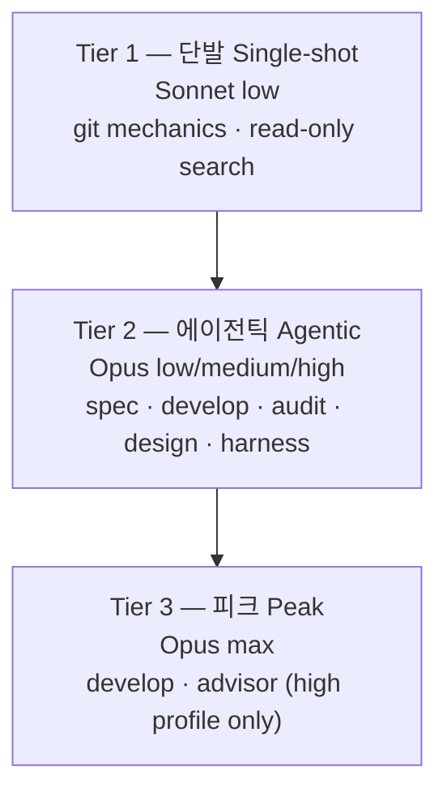

MoAI-ADK v3.0은 Haiku를 라우팅 모델 세트에서 배제하고, 작업 성격에 맞춘 3-티어 구조로 작업을 분산합니다. 이 설계는 DeepSWE 리더보드의 실측 데이터에 근거합니다. 이 페이지는 왜 Haiku를 배제했는지, 3-티어가 어떻게 구성되는지, 그리고 설계 의도와 구현된 동작을 구분해서 설명합니다.

## 왜 Haiku를 배제했는가

DeepSWE 리더보드의 핵심 발견은 "**약한 모델 + 높은 effort = 가용성의 적**"이라는 점입니다. 약한 모델이 장기 호라이즌 과제를 더 싸게 끝내지는 못합니다 — 수렴에 실패하면서 스텝과 출력 토큰만 더 태울 뿐입니다. `max` effort에서 Sonnet 5는 268스텝, 214k 출력 토큰을 소모하는데, 같은 과제 세트를 Opus 5는 99스텝에 끝냅니다.

아래 수치는 리더보드의 **"All effort levels"** 뷰(113 tasks / 91 repos / 5 languages, mini-swe-agent 하네스)에서 가져왔습니다. effort가 단계별로 보고되므로, 단일 운용점이 아니라 각 모델의 비용/점수 곡선 형태에서 티어를 도출할 수 있습니다.

| 모델 | effort | 점수 | $/과제 | 출력 토큰 | 스텝 |
|---|---|---|---|---|---|
| Opus 5 | low | 58% | $1.66 | 20k | 36 |
| Opus 5 | medium | 69% | $3.29 | 37k | 52 |
| Opus 5 | high | 73% | $6.08 | 64k | 73 |
| Opus 5 | xhigh | 73% | $9.07 | 92k | 89 |
| Opus 5 | max | 74% | $11.84 | 118k | 99 |
| Sonnet 5 | low | 31% | $2.19 | 36k | 77 |
| Sonnet 5 | medium | 40% | $4.08 | 57k | 108 |
| Sonnet 5 | high | 48% | $7.43 | 87k | 147 |
| Sonnet 5 | xhigh | 50% | $11.89 | 121k | 186 |
| Sonnet 5 | max | 54% | $26.40 | 214k | 268 |
| Fable 5 | high | 69% | $9.18 | 57k | 59 |
| Fable 5 | max | 70% | $21.63 | 119k | 88 |

MTok당 정가(입력/출력): Opus 5 $5/$25 · Sonnet 5 $2/$10 (도입 가격, 2026-08-31까지, 이후 $3/$15) · Fable 5 $10/$50.

 **단가 역전**: Sonnet의 토큰당 단가는 Opus보다 *낮지만*, 비교 가능한 모든 지점에서 과제당 비용은 오히려 높습니다 — Opus 5 `low`는 $1.66에 58%인 반면, Sonnet 5 `max`는 $26.40에 54%입니다. "싼 모델로 돌리면 쿼터가 절약된다"는 통념은 장기 호라이즌 에이전틱 작업에서 성립하지 않습니다. 청구서를 정하는 것은 단가가 아니라 완주 효율이기 때문입니다.

이 데이터를 볼 때 Haiku를 라우팅에 포함하면 역량은 늘지 않고 스텝 낭비만 더해집니다. 대신 Sonnet은 멀티스텝 완주 실패가 적용되지 않는 단발·입력 지배 작업에 한정합니다.

## 3-티어 정의

작업 성격에 따라 3개 티어로 모델과 effort를 배정합니다.

### Tier 1 — 단발 (Single-shot)

 한 번에 끝나고, 반복이 아니라 입력이 지배하는 작업입니다. 약한 모델을 비싸게 만드는 효과인 멀티스텝 완주 실패가 여기에는 적용되지 않으므로, Sonnet의 낮은 입력 단가가 실질 변수가 됩니다. Sonnet `low` effort로 스텝 수를 최소화합니다. 담당 에이전트: `manager-git`, `Explore`. 이 두 행은 세 프로필 모두에서 고정입니다.

### Tier 2 — 에이전틱 (Agentic)

 계획, 구현, 감사, 설계, 하네스 생성, 문서화, E2E — 멀티턴 행 전부입니다. Opus `low`가 이미 어떤 effort의 Sonnet보다 점수가 높으면서 과제당 비용은 낮기 때문에, 이 행 전부를 Opus가 담당합니다. 프로필은 각 행이 Opus effort 사다리의 어디에 앉을지를 고릅니다: 경제 열에서는 `low`, 기본 열에서는 `medium`, 품질 열에서는 `high`. 담당 에이전트: `manager-spec`, `manager-develop`, `plan-auditor`, `sync-auditor`, `manager-design`, `builder-harness`, `manager-docs`, `e2e-tester`.

### Tier 3 — 피크 (Peak)

 `max` effort는 `high` 프로필에서, 호출 빈도가 가장 낮은 두 행 — `manager-develop`과 `super-advisor` — 에만 한정됩니다. `medium` 위로는 점수 1점당 한계 비용이 가파르게 오르므로(`low`→`medium`은 점당 $0.15, `medium`→`high`는 점당 $0.70), 한 번의 결정이 하류 비용을 불균형하게 좌우하는 곳에만 피크 effort를 씁니다. `xhigh`는 어디에도 쓰지 않습니다 — Opus에서 `high`와 점수가 같으면서 비용은 49% 더 듭니다.

## DeepSWE 리더보드 근거

effort 단계별 실측에서 도출된 4가지 결론:

1. **Opus 5는 모든 effort에서 Sonnet 5를 파레토 지배합니다.** Opus `low`(58%, $1.66)가 Sonnet의 다섯 지점 전부를 두 축 모두에서 이기며, 여기에는 Sonnet `max`(54%, $26.40)도 포함됩니다. "바쁜 에이전트는 싼 모델로 보낸다"는 라우팅 명제는 장기 호라이즌 에이전틱 작업에서 반증됩니다.
2. **원인은 단가가 아니라 완주 효율입니다.** Sonnet은 같은 과제 세트를 끝내는 데 대략 2.7배의 스텝을 씁니다. 과제를 비싸게 만드는 것은 토큰당 요율이 아니라 추가로 든 스텝과 출력 토큰입니다.
3. **`xhigh`는 Opus에서 순손실입니다.** `high`와 `xhigh` 모두 73%지만, `xhigh`는 비용이 49% 더 들고 스텝도 22% 더 씁니다. Fable에서도 같은 평평한 천장이 나타납니다. 무릎을 넘긴 effort는 점수가 아니라 토큰을 삽니다.
4. **`medium`이 무릎입니다.** 점수 1점당 한계 비용: `low`→`medium` $0.15, `medium`→`high` $0.70(4.7배), `xhigh`→`max` $2.77(18.6배). 기본 프로필이 `manager-develop`을 `medium`에 고정하는 이유입니다.

 **한계 고지**: 이 벤치마크가 측정하는 것은 **코딩** 에이전트입니다. 문서 저작, 감사 판단, SPEC 저작 품질은 직접 측정되지 않았으므로, 해당 행 배치는 관측이 아니라 멀티턴 에이전틱 작업과의 유사성 추론에 기댑니다. 신뢰구간도 중요합니다: `medium`(69%±1)과 `high`(73%±2)는 겹치지 않지만, `max`(74%±4)는 `high`와 겹칩니다 — `max`를 거의 호출되지 않는 두 셀에 한정한 이유입니다. 모든 기본값은 `llm.agent_overrides`로 에이전트별 되돌리기가 가능합니다.

 **Fable 5에 대하여**: Fable은 코딩 축에서 모든 effort에 걸쳐 열등합니다 — Fable `high`(69%, $9.18)는 Opus `medium`(69%, $3.29)과 같은 점수를 거의 3배 비용에 냅니다 — 그래서 어떤 매트릭스 셀에도 없습니다. 모델 enum에서는 여전히 유효한 값이며 GLM 백엔드의 Fable 슬롯으로도 그대로 배선돼 있습니다. 바뀐 것은 기본값뿐입니다.

## 설계 보고서 vs 구현

 **REQ-DA-061 정직성 구분**: 이 페이지의 내용 중 설계 단계와 구현된 동작을 명확히 구분해야 합니다.

**설계 단계** (`.moai/reports/agent-architecture-redesign-v2-20260709.html`) — v2 아키텍처 설계 의도. 3-티어 모델 정책의 원칙과 DeepSWE 근거를 제시합니다.

**구현된 동작** — 단일 프로필 매트릭스가 실제 라우팅을 수행합니다. 활성 프로필(`high`/`medium`/`low`)이 매트릭스의 한 열을 선택하고, 리졸버가 각 에이전트의 `{model, effort}`를 결정하여 spawn 시점에 model을 런타임 인자로 주입합니다. 상세한 매트릭스는 [프로필 매트릭스](/ko/advanced/profile-matrix/) 페이지를 참조하세요.

독자는 설계 의도(이 페이지의 DeepSWE 근거)와 구현된 동작(단일 프로필 매트릭스)을 구분할 수 있어야 합니다.

## 하네스 자가 진화와의 연결

3-티어 아키텍처는 하네스 자가 진화의 기반입니다. 진화 루프(관찰 → 반추 → 승격)가 효과를 발휘하려면 관찰 단계의 라우팅 결정이 올바른 모델에 올바른 effort로 이루어져야 합니다. 자세한 내용은 [하네스 자가 진화](/ko/advanced/self-evolving/) 페이지를 참조하세요.

## 다음 단계

- [프로필 매트릭스](/ko/advanced/profile-matrix/) — 단일 3-열 per-agent 프로필 매트릭스 (11 에이전트 × 3 프로필 = 33 셀)
- [토크노믹스 개요](/ko/advanced/tokenomics-overview/) — 4-층 토크노믹스 구조의 B층 라우팅
