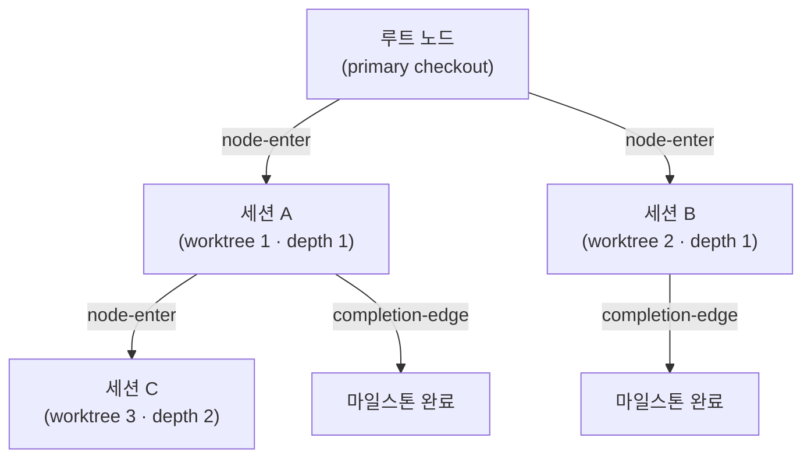

# 세션 계보 체인 (Origin-Trail Chain)


 <strong>소속 가치</strong>: 에이전틱 루프 엔지니어링 · 세션 연속성


Origin-Trail Chain은 worktree 세션이 어디서 갈라져 나왔는지를 기록하는 append-only 계보 장부입니다. worktree 안에서 세션을 시작하면 노드 하나가 생기고, 부모-자식 간선이 "이 세션은 저 세션에서 갈라졌다"를 남깁니다. `/clear` 뒤에 깊이 중첩된 worktree로 다시 들어와도, 어느 마일스톤까지 끝났고 다음에 무엇을 해야 하는지를 grep이나 스크롤백을 뒤지지 않고 되찾을 수 있습니다.

체인은 팩토리 모드와 독립적입니다. 팩토리 리더도, 레인도 필요 없습니다. `moai cc -w <이름>`처럼 worktree를 지정해 띄운 모든 세션이 체인에 오릅니다. 이 페이지는 체인이 무엇을 언제 기록하는지, 저장 구조가 어떤지, 그리고 조회용 `moai chain` 명령을 다룹니다.

## 이 체인이 푸는 문제

**깊이 망각** (depth amnesia): worktree 안에서 또 다른 worktree 세션을 띄우는 일이 겹치면, `/clear` 뒤 재진입한 세션은 "내 조상이 누구였는가"를 잃어버립니다. 예전에는 grep과 스크롤백 고고학으로 복구해야 했습니다. 체인은 `origin_chain` 필드에 루트에서 이 노드까지의 ID 경로를 통째로 비정규화해 두므로, 탐색 없이 한 번의 조회로 계보를 복원합니다.

**끊긴 인수인계**: 자식 세션이 끝났는데 부모가 그 사실을 모르면, 부모는 이미 끝난 일을 기다립니다. 체인은 세션이 끝날 때 `completion-edge` 이벤트를 남기고, 마지막으로 완료한 마일스톤과 다음에 재개할 일(`resume_target`)을 함께 적습니다. 장부는 부모 세션이 죽었거나 비워졌어도 최신 상태로 남습니다.

## 언제 기록되는가

세 곳에서 장부에 쓰며, 모두 실패해도 세션을 막지 않습니다(fail-open). 체인은 부가 텔레메트리이지 게이트가 아닙니다.

| 시점 | 기록하는 곳 | 하는 일 |
|------|-------------|---------|
| worktree를 지정한 세션 시작 | 런처 (`moai cc -w <이름>`) | `node-enter` 이벤트를 덧붙이고, 새 노드 ID를 자식 환경변수 `MOAI_CHAIN_NODE_ID`로 넘김 |
| 자식 세션의 SessionStart | SessionStart 훅 | 세션 ID를 `node-update`로 채워 넣음. `/clear`로 환경변수가 사라졌다면 장부에서 노드를 찾아 되살리고 계보 안내를 출력 |
| 서브에이전트·세션 종료 | `chain-event` 훅 (SubagentStop) | 부모-자식 `completion-edge`를 덧붙임 |

런처는 `-w`에 이름이 붙은 경우에만 노드를 만듭니다. 이름 없는 `-w`는 Claude Code가 이름을 자동으로 짓기 때문에 런처가 경로를 알 수 없고, `-c`(이어하기) 실행은 새 세션을 낳는 것이 아니라 기존 세션을 다시 여는 것이므로 기록하지 않습니다.

## append-only 이벤트 스트림

체인은 `.moai/state/chain/events.jsonl`에 저장됩니다. 모든 쓰기는 `O_APPEND`로 한 줄씩 덧붙입니다. 덮어쓰기도 잘라내기도 없고, 커널이 동시 append를 직렬화하므로 여러 세션이 동시에 써도 한 줄이 다른 줄을 깨뜨리지 않습니다.



스트림에는 세 가지 이벤트가 쌓입니다.

| 이벤트 | 기록 시점 | 내용 |
|--------|-----------|------|
| `node-enter` | worktree 세션 시작 | 노드 ID, 부모 노드, 깊이, 계보 경로, worktree 경로, SPEC ID, 진입 시각 |
| `node-update` | 자식 SessionStart 또는 마일스톤 갱신 | 세션 ID 채우기, 마일스톤·재개 목표 갱신 |
| `completion-edge` | 서브에이전트·세션 종료 | 부모-자식 노드, 완료한 마일스톤, 다음 재개 목표 |

파일은 평평한(flat) 이벤트 목록일 뿐이고, 현재 노드 상태는 읽는 시점에 이벤트를 처음부터 재생해 도출합니다. 고쳐 쓰는 트리 파일은 어디에도 없습니다. 깨진 줄은 건너뛰고 경고만 남깁니다.

## 노드의 13개 필드

노드는 읽을 때 13개 필드를 가진 상태 뷰로 재구성됩니다.

| 필드 | 의미 |
|------|------|
| `node_id` | 시간순으로 정렬되는 고유 ID. 밀리초 타임스탬프(16진수)와 난수 4바이트를 이어 붙인 형태 |
| `parent_node_id` | 이 노드를 낳은 부모 노드. 루트면 빈 값 |
| `depth` | 중첩 깊이. primary checkout이 0, 첫 worktree가 1 |
| `origin_chain` | 루트에서 이 노드까지의 ID 경로 |
| `worktree_path` | worktree 절대 경로 |
| `session_id` | 런타임이 배정한 Claude Code 세션 ID. 두 단계로 채워짐 |
| `spec_id` | 이 노드가 작업하는 SPEC 식별자 |
| `milestone` | 현재 마일스톤 라벨 |
| `entered_at` | 노드가 생긴 시각(RFC 3339) |
| `exited_at` | 세션이 끝난 시각. 종료 이벤트가 아니라 하트비트가 오래된 정도에서 도출 |
| `last_completed_milestone` | 가장 최근에 완료로 표시된 마일스톤 |
| `resume_target` | 재개할 때 해야 할 일을 한 줄로 적은 것 |
| `resume_command` | 재개할 때 실행할 명령 하나 |

## 같은 경로를 재사용할 때

worktree를 지웠다가 같은 경로에 다시 만들면 서로 다른 세션이 같은 `worktree_path`를 갖게 됩니다. 체인은 `(worktree_path, session_id)` 쌍으로 이를 가립니다.

1. **일차 키**: 두 값이 모두 일치하는 노드를 찾습니다. 같은 경로에서 여러 개가 걸리면 가장 나중 것을 씁니다.
2. **대체 키**: 세션 ID가 비었거나 일치하는 노드가 없으면, 그 경로에서 가장 최근에 진입한 노드를 씁니다. 세션 ID가 있는데 맞는 노드가 없을 때는 경고를 남깁니다.

`/clear` 뒤에 "이 경로의 현재 노드가 무엇인가"를 되살릴 때 이 규칙이 쓰입니다.

## 세션 ID는 두 단계로 채웁니다

worktree 세션을 띄우는 순간에는 세션 ID를 알 수 없습니다. Claude Code 런타임이 자식 프로세스를 시작한 뒤에야 ID를 배정하기 때문입니다. 그래서 두 단계로 나눕니다.

1. **세션 시작 시점**: 런처가 `node-enter`를 덧붙이되 `session_id`는 빈 값으로 둡니다. 새 노드 ID는 환경변수 `MOAI_CHAIN_NODE_ID`로 자식에게 넘깁니다.
2. **자식의 SessionStart**: 런타임이 세션 ID를 배정하고 나면 `node-update`로 `session_id`를 채웁니다.

## moai chain 명령

조회 전용 명령 다섯 개가 장부를 읽습니다. 모두 팩토리 기능과 무관하게 동작하며 사용자에게 되묻지 않습니다.

| 명령 | 출력 |
|------|------|
| `moai chain status` | 현재 노드 요약: 깊이, 노드 ID, 부모, SPEC, 마일스톤, 완료한 마일스톤, 재개 목표, 세션, worktree |
| `moai chain lineage` | 루트에서 현재 노드까지의 계보. 노드마다 경로·SPEC·마일스톤·진입 시각 |
| `moai chain back` | 부모 노드의 재개 목표(`resume target`)와 재개 명령(`resume cmd`), worktree 경로 |
| `moai chain list` | 모든 노드의 깊이·세션·상태(`active` / `stale` / `exited`)·worktree |
| `moai chain prune` | 오래된 종료 노드를 아카이브로 접음. 기본은 미리보기이고 실제 실행은 `--no-dry-run` |

```bash
$ moai chain status
depth:     2
node:      0199a3f1c2b7e-9f3a21c4
parent:    0199a3f0d81a2-51be07aa
spec:      SPEC-AUTH-001
milestone: M2
resume:    M3부터 이어서 구현
worktree:  /path/to/.claude/worktrees/auth-m2
```

`list`의 상태는 세션 레지스트리를 겹쳐 판정합니다. 세션 ID가 없거나 레지스트리에서 사라진 노드는 `exited`, 마지막 하트비트가 15분을 넘긴 노드는 `stale`, 그 이내면 `active`입니다. `prune`은 30일이 지났거나 파일이 10MB를 넘은 장부에서 종료된 오래된 노드를 접습니다.


 장부가 없거나 현재 경로와 맞는 노드가 없으면 명령은 오류 대신 `no chain context` 계열의 한 줄을 출력하고 정상 종료합니다.


## 한계와 경계

- **단일 호스트 v1입니다.** 원격 경로(예: `ssh://`)에서는 계보를 지원하지 않는다는 안내만 출력합니다. 기기를 가로지르는 계보는 다루지 않습니다.
- **부가 텔레메트리입니다.** 장부를 쓰지 못해도 세션은 그대로 시작합니다. 체인 기록은 어떤 승인 게이트도 대신하지 않습니다.
- **조회 전용 CLI입니다.** 세션을 새로 띄우거나 옮기는 명령은 없습니다. 체인이 알려 주는 것은 어디로 돌아가야 하는지이고, 돌아가는 일은 `moai cc -w <경로>` 또는 세션 안의 worktree 진입이 맡습니다.

## 관련 문서

- [팩토리 모드](/ko/advanced/factory-mode) — 리더 하나와 레인 여럿이 카드를 나르는 다중 세션 실행
- [moai web 콘솔](/ko/advanced/moai-web-console) — 세션과 카드 상태를 브라우저로 보는 화면
- [`moai worktree`](/ko/cli-reference/worktree) — worktree 생성과 정리
