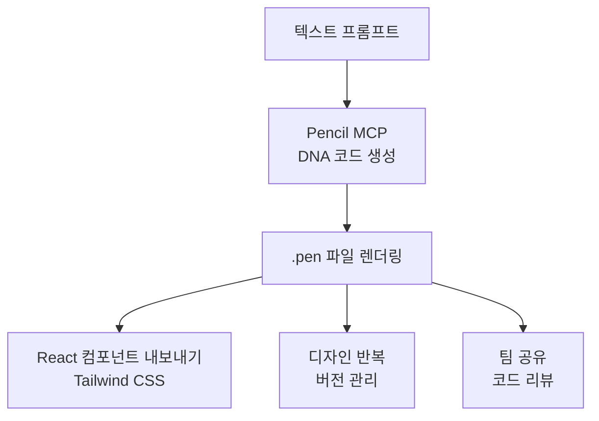
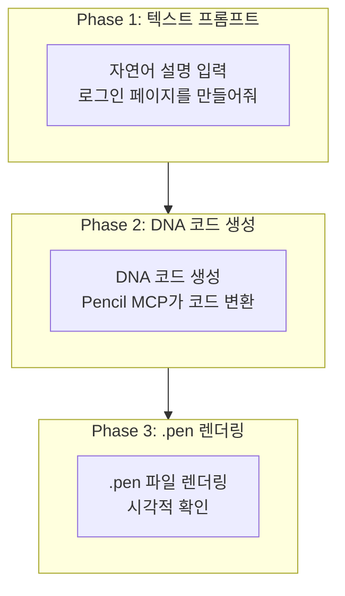
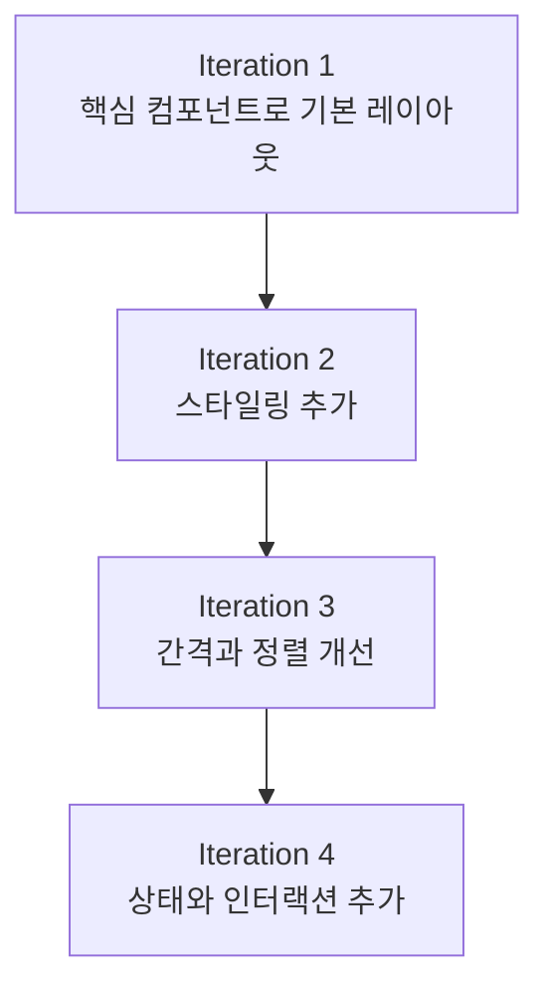
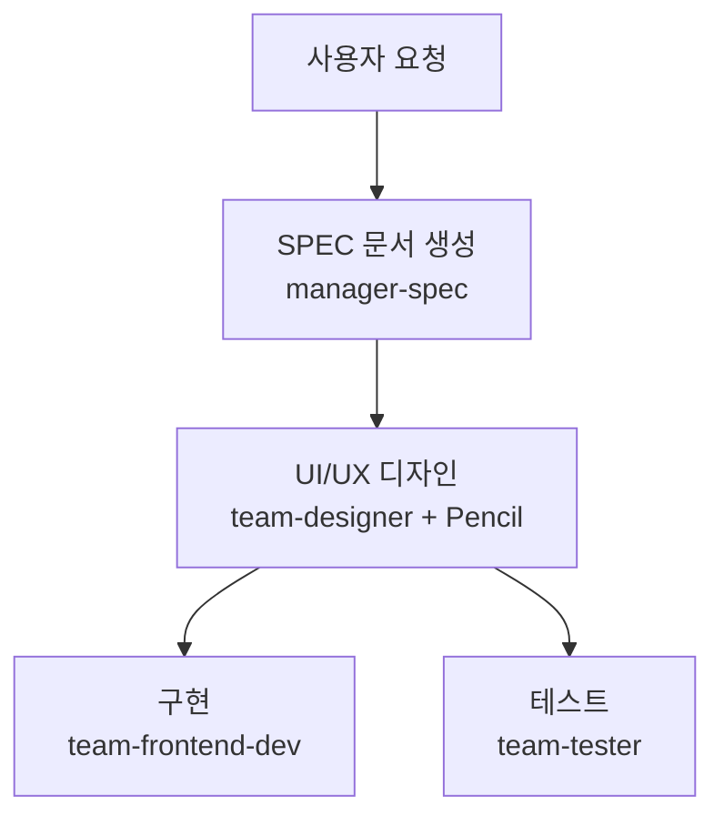

# Pencil 가이드

Pencil MCP 서버를 활용하여 AI 기반 UI/UX 디자인을 생성하는 방법을 상세히 안내합니다.


**한 줄 요약**: Pencil은 **코드 기반 디자인 툴**입니다. MCP 서버를 통해 Claude Code에서 직접 UI를 생성하고, .pen 파일로 관리하며, 프로덕션 코드로 내보낼 수 있습니다.


## Pencil이란?

Pencil은 개발 환경에서 직접 작업할 수 있는 **AI 기반 디자인 툴**입니다. 디자인과 코드의 간극을 해소하여 개발자가 Figma와 같은 별도의 디자인 툴 없이도 일관된 UI를 생성할 수 있습니다.



### 주요 기능

| 기능 | 설명 |
|------|------|
| **DNA 코드** | UI를 선언적 코드로 표현 (버전 관리 가능) |
| **텍스트-투-디자인** | 자연어 설명으로 UI 화면 생성 |
| **.pen 파일** | 암호화된 디자인 파일 형식 |
| **React 내보내기** | Tailwind CSS가 적용된 프로덕션 코드 생성 |
| **무한 캔버스** | 대규모 디자인 프로젝트 지원 |
| **팀 협업** | 코드 기반 디자인 리뷰 |


Pencil은 **오픈 소스 디자인 포맷**을 사용하며, .pen 파일은 코드베이스에서 직접 관리할 수 있습니다. https://pencil.dev에서 자세한 정보를 확인하세요.


## 사전 준비

Pencil MCP를 사용하려면 다음 설정이 필요합니다.

### 지원되는 AI 어시스턴트

Pencil은 MCP(Model Context Protocol)를 통해 다양한 AI 도구와 통합됩니다.

| AI 도구 | 지원 형태 | 비고 |
|---------|----------|------|
| **Claude Code** | CLI 및 IDE | 가장 권장되는 방식 |
| **Claude Desktop** | 데스크톱 앱 | 개인 사용에 적합 |
| **Cursor** | AI-powered IDE | 코드베이스 인식 기능 |
| **Windsurf IDE** | Codeium | 최신 IDE 옵션 |
| **Codex CLI** | OpenAI | 터미널 기반 워크플로우 |
| **Antigravity IDE** | 전용 IDE | Pencil 전용 확장 |
| **OpenCode CLI** | CLI 환경 | 스크립트 가능 |

### Step 1: Pencil 설치

Pencil 앱 또는 IDE 확장을 설치하세요.

- **macOS/Windows/Linux**: Pencil 데스크톱 앱 다운로드
- **VS Code/VSCode-insiders**: Pencil 확장 설치
- **Cursor**: Pencil 확장 설치

### Step 2: Pencil 실행

Pencil을 실행하면 MCP 서버가 자동으로 시작됩니다. 별도의 설치나 설정이 필요하지 않습니다.

```bash
# Pencil 앱이 실행 중인지 확인
# Pencil이 실행 중이면 MCP 서버가 자동으로 시작됩니다
```

### 보안 및 개인정보


**로컬 전용 보안**: Pencil MCP 서버는 **완전히 로컬에서 실행**됩니다. 디자인 파일은 원격 서버로 전송되지 않으며, 모든 디자인 데이터가 로컬 머신에 보관됩니다.


| 보안 특성 | 설명 |
|----------|------|
| **로컬 전용** | MCP 서버가 사용자 머신에서만 실행 |
| **원격 액세스 없음** | 디자인 파일이 로컬에 유지 |
| **프라이빗 저장소** | 소스 코드가 공개되지 않음 |
| **도구 검사** | IDE 설정에서 사용 가능한 도구 확인 가능 |

## MCP 설정

### Claude Code 설정

Pencil이 실행 중이면 Claude Code가 자동으로 MCP 서버를 감지합니다.

```json
{
  "permissions": {
    "allow": [
      "mcp__pencil__*"
    ]
  }
}
```

### 연결 확인

설정이 완료되면 Claude Code에서 Pencil 도구를 사용할 수 있습니다.

```bash
# Claude Code에서 실행
> Pencil로 로그인 버튼을 생성해줘
```

## MCP 도구 목록

Pencil MCP는 다양한 도구를 제공합니다.

### 주요 도구

| 도구 | 용도 |
|------|------|
| `open_document` | 새 .pen 파일 생성 또는 기존 파일 열기 |
| `get_editor_state` | 현재 편집기 상태, 선택 정보, 활성 파일 확인 |
| `batch_design` | 여러 디자인 요소를 한 번에 생성/수정 |
| `batch_get` | 여러 노드 정보를 한 번에 조회 |
| `get_screenshot` | .pen 파일의 스크린샷 캡처 |
| `snapshot_layout` | 레이아웃 구조 분석 |
| `get_guidelines` | 디자인 가이드라인 조회 |
| `get_style_guide` | 스타일 가이드 조회 |
| `get_style_guide_tags` | 스타일 가이드 태그 검색 |
| `get_variables` | 디자인 변수/테마 읽기 |
| `set_variables` | 디자인 변수/테마 설정 |
| `find_empty_space_on_canvas` | 캔버스에서 빈 공간 찾기 |
| `search_all_unique_properties` | 모든 고유 속성 검색 |
| `replace_all_matching_properties` | 일치하는 모든 속성 변경 |

### 도구 선택 가이드

| 목적 | 사용할 도구 |
|------|-------------|
| 새 디자인 시작 | `open_document` |
| 컴포넌트 생성 | `batch_design` |
| 디자인 미리보기 | `get_screenshot` |
| 디자인 내보내기 | Pencil Editor에서 Export |
| 스타일 참조 | `get_style_guide` |
| 레이아웃 분석 | `snapshot_layout` |
| 변수 관리 | `get_variables`, `set_variables` |
| 공간 찾기 | `find_empty_space_on_canvas` |
| 속성 검색 | `search_all_unique_properties` |
| 일괄 변경 | `replace_all_matching_properties` |

## MCP 도구 목록

Pencil MCP는 다양한 도구를 제공합니다.

### 주요 도구

| 도구 | 용도 |
|------|------|
| `open_document` | 새 .pen 파일 생성 또는 기존 파일 열기 |
| `batch_design` | 여러 디자인 요소를 한 번에 생성/수정 |
| `batch_get` | 여러 노드 정보를 한 번에 조회 |
| `get_screenshot` | .pen 파일의 스크린샷 캡처 |
| `snapshot_layout` | 레이아웃 구조 분석 |
| `get_guidelines` | 디자인 가이드라인 조회 |
| `get_style_guide` | 스타일 가이드 조회 |
| `set_variables` | 디자인 변수 설정 |
| `generate_image` | AI로 이미지 생성 |

### 도구 선택 가이드

| 목적 | 사용할 도구 |
|------|-------------|
| 새 디자인 시작 | `open_document` |
| 컴포넌트 생성 | `batch_design` |
| 디자인 미리보기 | `get_screenshot` |
| 디자인 내보내기 | Pencil Editor에서 Export |
| 스타일 참조 | `get_style_guide` |

## DNA 코드 포맷

Pencil은 DNA 코드라는 선언적 포맷을 사용하여 UI를 표현합니다.

### 기본 구조

```dna
// 버튼 컴포넌트 DNA 코드
component Button {
  variant: primary
  size: medium
  content: "클릭하세요"
  onClick: handleSubmit
}
```

### 레이아웃 구조

```dna
// 로그인 폼 레이아웃
layout LoginForm {
  direction: column
  spacing: 16
  children: [
    Input {
      placeholder: "이메일"
      type: email
    }
    Input {
      placeholder: "비밀번호"
      type: password
    }
    Button {
      variant: primary
      content: "로그인"
    }
  ]
}
```

### 디자인 토큰

```dna
// 토큰 참조
color: primary.500
spacing: md
radius: lg

// 토큰 정의
tokens {
  primary.500 = #3B82F6
  md = 16px
  lg = 8px
}
```

## 디자인 생성 워크플로우

Pencil으로 디자인을 생성하는 3단계 패턴입니다.



### 실전 예시: E-Commerce 카드

```bash
# Phase 1: 텍스트 프롬프트로 디자인 요청
> 제품 카드를 만들어줘. 상단에 제품 이미지, 중간에 제목과 가격,
# 하단에 장바구니 버튼. 깔끔한 미니멀 스타일로

# Phase 2: Pencil이 DNA 코드 생성
# → component ProductCard { ... }

# Phase 3: .pen 파일로 렌더링
# → open_document 후 batch_design으로 생성
```


**핵심**: Pencil은 **디자인을 코드로 관리**합니다. .pen 파일은 Git으로 버전 관리할 수 있으며, 코드 리뷰 프로세스에 통합할 수 있습니다.


## React 컴포넌트 내보내기

Pencil Editor에서 .pen 파일을 React 컴포넌트로 내보낼 수 있습니다.

### 내보내기 설정

```typescript
// pencil.config.js
module.exports = {
  framework: 'react',
  styling: 'tailwind',
  output: './src/components/generated',
  options: {
    typescript: true,
    responsive: true,
    accessibility: true
  }
};
```

### 생성된 컴포넌트 예시

```typescript
export interface ButtonProps {
  variant?: 'primary' | 'secondary' | 'tertiary';
  size?: 'small' | 'medium' | 'large';
  isLoading?: boolean;
}

export const Button = ({ variant = 'primary', size = 'medium', isLoading, children, ...props }: ButtonProps) => {
  const baseStyles = 'inline-flex items-center justify-center font-medium rounded-md transition-colors';

  const variantStyles = {
    primary: 'bg-blue-600 text-white hover:bg-blue-700',
    secondary: 'bg-gray-200 text-gray-900 hover:bg-gray-300',
    tertiary: 'bg-transparent text-gray-700 hover:bg-gray-100'
  };

  const sizeStyles = {
    small: 'px-3 py-1.5 text-sm',
    medium: 'px-4 py-2 text-base',
    large: 'px-6 py-3 text-lg'
  };

  return (
    <button className={`${baseStyles} ${variantStyles[variant]} ${sizeStyles[size]}`} {...props}>
      {isLoading ? '로딩 중...' : children}
    </button>
  );
};
```

## 프롬프트 작성 가이드

Pencil에서 좋은 결과를 얻으려면 구조화된 프롬프트가 중요합니다.

### 좋은 프롬프트 vs 나쁜 프롬프트

| 나쁜 프롬프트 | 좋은 프롬프트 |
|--------------|--------------|
| "멋진 버튼 만들어줘" | "파란색 배경의 중간 크기 기본 버튼. '확인' 텍스트, 16px 패딩" |
| "대시보드" | "사이드바 내비게이션이 있는 분석 대시보드. 상단 3개 지표 카드(매출, 사용자, 전환율), 라인 차트, 테이블" |
| "반응형" | "모바일: 세로 스택, 데스크톱: 3열 그리드" |

### 효과적인 프롬프트 템플릿

```
[컴포넌트 유형]을 생성해줘.
[컴포넌트 목록] 포함.
[레이아웃]으로 배치.
[스타일] 적용.
[반응형] 고려.
```

### 실전 프롬프트 예시

**디자인 생성:**

```bash
# 대시보드 생성
"사이드바와 메인 콘텐츠 영역이 있는 대시보드를 만들어줘"

# 가격표 생성
"3단계 가격표를 만들어줘. 기본, 프로, 엔터프라이즈"

# 히어로 섹션
"제목과 CTA 버튼이 있는 히어로 섹션을 추가해줘"
```

**디자인 수정:**

```bash
# 색상 변경
"모든 기본 버튼을 파란색으로 변경해줘"

# 크기 조정
"사이드바를 더 좁게 만들어줘"

# 간격 추가
"이 요소들 사이에 간격을 추가해줘"
```

**디자인 시스템:**

```bash
# 버튼 컴포넌트
"변형이 있는 버튼 컴포넌트를 만들어줘"

# 색상 팔레트
"#3b82f6을 기반으로 색상 팔레트를 생성해줘"

# 타이포그래피
"타이포그래피 스케일을 만들어줘"
```

**코드 통합:**

```bash
# React 코드
"이 컴포넌트에 대한 React 코드를 생성해줘"

# 가져오기
"내 코드베이스에서 Header를 가져와줘"

# Tailwind 설정
"이 변수들로부터 Tailwind 설정을 만들어줘"
```


**Golden Rule**: 프롬프트는 **구체적일수록** 좋습니다. 색상, 간격, 정렬, 상호작용을 명확히 지정하세요.


## Cursor에서 사용하기

Cursor는 AI 기반 IDE로 Pencil과 강력한 통합을 제공합니다.

### 설정

1. Cursor에서 Pencil 확장 설치
2. 활성화 완료
3. Claude Code 인증
4. MCP 연결 확인: Settings → Tools & MCP

### Cursor 전용 기능

**인라인 편집:**

- Pencil에서 요소 선택
- Cursor의 AI 채팅으로 수정
- 변경사항이 `.pen` 파일에 즉시 적용

**코드베이스 인식:**

- Cursor가 코드와 디자인을 모두 확인
- 컴포넌트 간 동기화 요청
- 자동 일관성 유지

### 일반적인 문제

**"Need Cursor Pro":**

- 일부 기능은 Cursor Pro 구독이 필요할 수 있음
- 현재 제한 사항은 Cursor 가격표 확인

**프롬프트 패널 누락:**

- 활성화/로그인 상태 확인
- Cursor 재시작
- 설정에서 MCP 연결 확인

## Codex CLI에서 사용하기

### 설정

1. **Pencil 먼저 실행** - 데스크톱 앱 또는 IDE 확장 시작
2. 터미널에서 Codex 열기
3. MCP 연결 확인: `/mcp`
4. **Pencil이 MCP 서버 목록에 나타나야 함**

### Codex로 작업하기

**터미널에서 디자인 프롬프트:**

```bash
# Codex CLI에서
> design.pen에 버튼 컴포넌트를 만들어줘
> 랜딩 페이지에 히어로 섹션을 추가해줘
> 파란색을 기반으로 색상 구성표를 생성해줘
```

**장점:**

- 명령줄 워크플로우
- 스크립트 가능한 디자인 생성
- 빌드 도구와 통합

### 알려진 문제

**Codex config.toml 수정:**

- Pencil이 설정을 수정하거나 복제할 수 있음
- 문제가 확인되고 조사 중
- 처음 사용 전 설정 백업

## 고급 워크플로우

### 자동화된 디자인 생성

**스타일 가이드:**

```bash
# 특정 디자인 시스템 따르기
"Material Design 원칙을 사용하여 대시보드를 만들어줘"

"현대적인 미니멀 미학으로 랜딩 페이지를 디자인해줘"

"design-system.pen의 디자인 시스템을 따르는 컴포넌트를 만들어줘"
```

**일괄 작업:**

```bash
# 버튼 변형
"이 버튼 컴포넌트의 5가지 변형을 만들어줘"

# 완전한 양식
"모든 입력 유형이 있는 완전한 양식을 생성해줘"

# 전체 랜딩 페이지
"히어로, 기능, 가격, 푸터가 있는 전체 랜딩 페이지를 디자인해줘"
```

### 디자인 시스템 관리

**일관성 강제:**

```bash
# 색상 변수
"모든 버튼이 기본 색상 변수를 사용하도록 해줘"

# 타이포그래피
"모든 제목이 타이포그래피 스케일을 사용하도록 업데이트해줘"

# 간격
"모든 요소에 8px 간격 그리드를 적용해줘"
```

**컴포넌트 라이브러리:**

```bash
# 버튼 컴포넌트
"모든 변형이 있는 완전한 버튼 컴포넌트를 만들어줘"

# 양식 입력
"양식 입력 컴포넌트 (텍스트, 선택, 체크박스, 라디오)를 생성해줘"

# 카드 컴포넌트
"이미지, 제목, 설명, 작업이 있는 카드 컴포넌트를 만들어줘"
```

### 코드-디자인 워크플로우

**기존 앱 가져오기:**

```bash
# 컴포넌트 재현
"src/components의 모든 컴포넌트를 Pencil에서 재현해줘"

# 디자인 시스템 가져오기
"Tailwind 설정에서 디자인 시스템을 가져와줘"

# 코드베이스 분석
"코드베이스를 분석하고 일치하는 디자인을 만들어줘"
```

**변경사항 동기화:**

```bash
# React 컴포넌트
"모든 React 컴포넌트를 Pencil 디자인과 일치하도록 업데이트해줘"

# 색상 구성표
"새 색상 구성표를 디자인과 코드에 모두 적용해줘"

# 변수 동기화
"CSS와 Pencil 간에 타이포그래피 변수를 동기화해줘"
```

## 모범 사례

| 원칙 | 설명 |
|------|------|
| **코드 우선** | 디자인을 코드로 관리하여 버전 관리 및 협업 용이 |
| **점진적 개선** | 기본 레이아웃부터 생성하고 세부사항을 점진적으로 추가 |
| **접근성 포함** | ARIA 라벨, 키보드 내비게이션 항상 명시 |
| **반응형 명시** | 모바일과 데스크톱 동작을 항상 포함 |
| **디자인 시스템** | 일관된 토큰과 컴포넌트 사용 |

### 점진적 개선 전략

복잡한 화면은 여러 번에 나눠서 생성하면 품질이 향상됩니다.



### 효과적인 프롬프팅

**구체적이세요:**

- ❌ "더 좋게 만들어줘"
- ✅ "버튼 패딩을 16px으로 늘리고 색상을 파란색으로 변경해주세요"

**컨텍스트 제공:**

- ❌ "양식 추가"
- ✅ "이메일, 비밀번호, 로그인 유지 체크박스, 제출 버튼이 있는 로그인 양식 추가"

**디자인 시스템 참조:**

- "기존 버튼 컴포넌트 사용"
- "변수의 간격 스케일 따르기"
- "헤더 컴포넌트의 스타일 일치"

### 검증

AI가 변경한 후:

1. 캔버스에서 시각적으로 검토
2. 레이어 패널에서 구조 확인
3. 해당하는 경우 상호작용 테스트
4. 복잡한 레이아웃을 확인하기 위해 스크린샷 요청

## 문제 해결

### 연결 문제

**"Claude Code 연결되지 않음":**

1. Claude Code 로그인 확인: `claude`
2. Pencil 재시작
3. 프로젝트 디렉토리에서 터미널 열고 `claude` 실행

**MCP 서버가 나타나지 않음:**

1. Pencil 실행 중인지 확인
2. IDE MCP 설정 확인
3. Pencil과 AI 어시스턴트 모두 재시작

### 권한 문제

**"폴더에 액세스할 수 없음":**

- 권한 프롬프트 수락
- 시스템 폴더 권한 확인
- 적절한 권한으로 IDE/Pencil 실행

**"권한 프롬프트가 표시되지 않음":**

- 별도의 Claude Code 세션에서 작업 시도
- 알림 설정 확인
- IDE 권한 확인

### AI 출력 문제

**"잘못된 API 키":**

- Claude Code 재인증: `claude`
- 충돌하는 인증 설정 확인
- 환경 변수 지우기

**AI가 예기치 않은 변경 수행:**

- 프롬프트를 더 구체적으로 작성
- 적용하기 전에 AI에 설명 요청
- 필요한 경우 버전 관리로 되돌리기

## 예제 세션

```bash
# 1. Pencil과 Claude Code 시작
claude
# 2. IDE에서 design.pen 열기
# 3. Cmd + K를 누르고 디자인 시작

사용자: "현대적인 랜딩 페이지 히어로 섹션을 만들어줘"
AI: [제목, 부제, CTA 버튼으로 히어로 생성]

사용자: "3열로 된 기능 섹션을 추가해줘"
AI: [히어로 아래에 기능 섹션 추가]

사용자: "CTA 버튼이 기본 색상 변수를 사용하도록 해줘"
AI: [버튼을 색상 변수 사용으로 업데이트]

사용자: "이 전체 페이지에 대한 React 코드를 생성해줘"
AI: [Tailwind CSS가 있는 React 컴포넌트로 내보내기]

# 4. 검토 및 수정
# 5. Git에 커밋
git add design.pen src/pages/landing.tsx
git commit -m "랜딩 페이지 디자인 및 구현 추가"
```

## MoAI와 함께 사용

MoAI는 Pencil MCP와 통합하여 UI 디자인을 자동화할 수 있습니다.

```bash
# MoAI가 Pencil을 사용하여 UI 생성
> /moai run --team
# team-designer 에이전트가 Pencil MCP를 사용하여 디자인 생성
```

### 팀 모드 디자인 워크플로우



- [MCP 서버 가이드](/advanced/mcp-servers) - MCP 프로토콜 개요
- [settings.json 가이드](/advanced/settings-json) - MCP 서버 권한 설정
- [에이전트 가이드](/advanced/agent-guide) - MoAI 에이전트 시스템
- [스킬 가이드](/advanced/skill-guide) - moai-design-tools 스킬


**팁**: Pencil을 최대한 활용하는 핵심은 **디자인을 코드로 관리**하는 것입니다. .pen 파일을 Git으로 관리하면 디자인 버전 추적과 협업이 훨씬 쉬워집니다.

