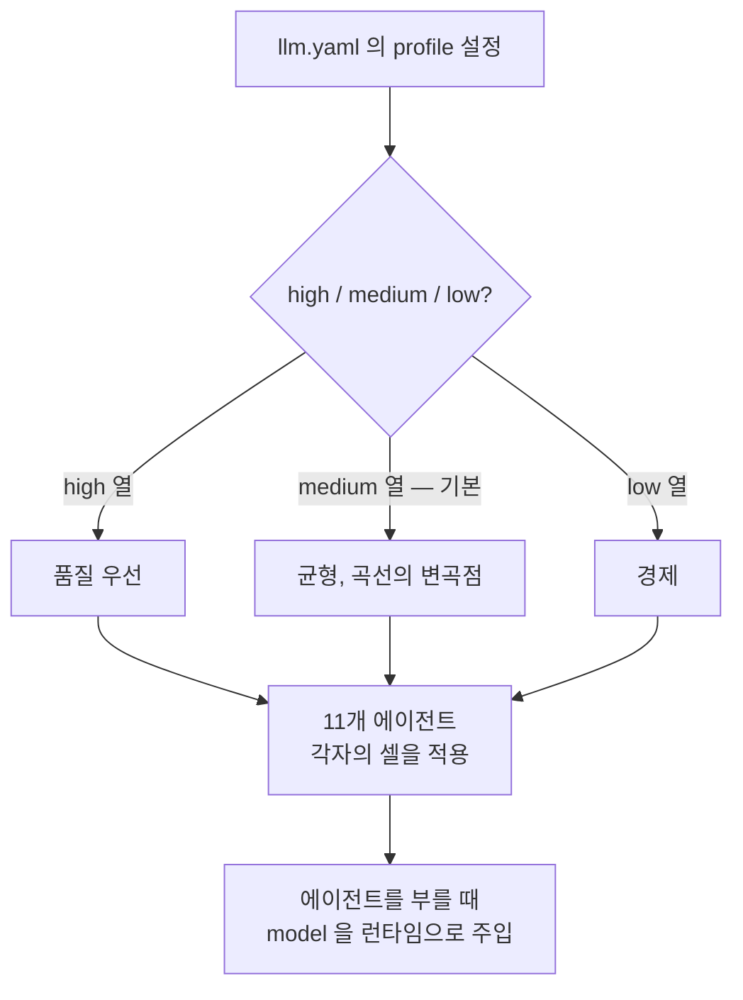
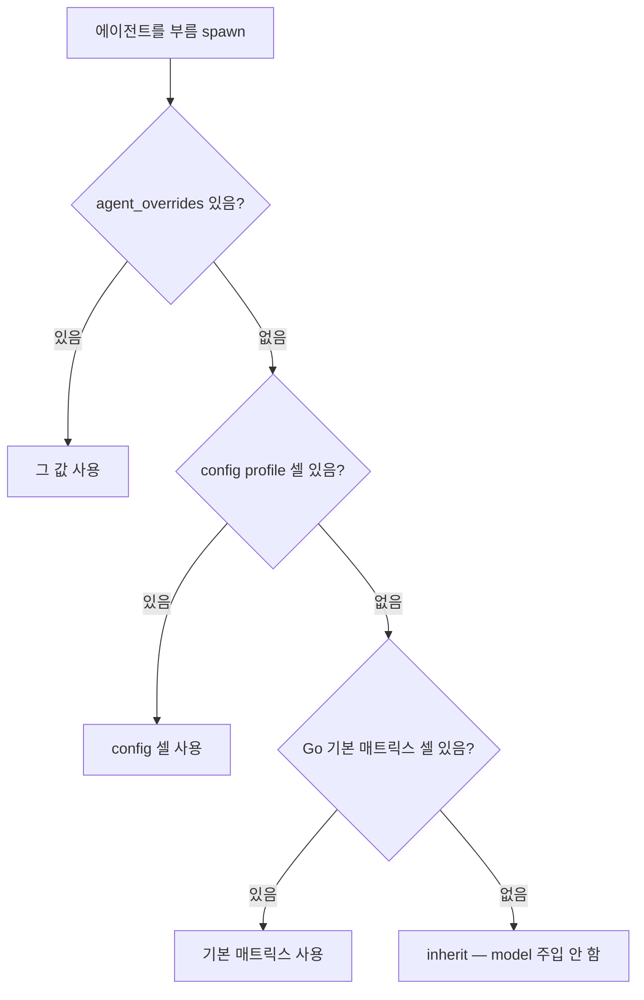

MoAI-ADK가 에이전트(스스로 일하는 AI 도우미)를 부를 때마다 "이 에이전트는 어느 모델로, 얼마나 깊이 생각하게 할 것인가"를 한 칸 한 칸 정해 둔 표가 **프로필 매트릭스**입니다. 가로로는 유지되는 11개 에이전트가, 세로로는 세 가지 품질 열(`high` / `medium` / `low`)이 놓이고, 그 교차점 33칸(에이전트 11개 × 프로필 3개)마다 `{model, effort}` 한 쌍 — 곧 '어느 모델로, 얼마나 깊이 생각할지' — 이 들어 있습니다. 활성 프로필이 한 열을 통째로 고르면, 그 열의 값이 그날 모든 에이전트 부름에 쓰입니다.

이 매트릭스는 이전의 그룹 추상화와 `plan_type × tier` 축을 모두 대체한, 모델·추론 깊이 배정의 단일 원천입니다. 토크노믹스(비용 대비 품질을 따져 토큰을 나눠 쓰는 방식)의 뼈대이자, 하네스(품질 검증 자동 장치)가 싼 작업에 비싼 모델을, 중요한 작업에 싼 모델을 섞지 않도록 지키는 가드 레일입니다.


**한 줄 요약:** 프로필 매트릭스는 "지금 활성 프로필이 고른 한 열의 값이, 11개 에이전트 각각의 모델과 추론 깊이를 한 번에 결정한다"는 단일 규칙입니다. 사용자가 매 작업마다 모델을 고르지 않아도 되는 까닭이 이 표 한 장에 있습니다.


## 매트릭스가 푸는 문제

에이전트가 많아지면 "어떤 에이전트는 어떤 모델로 돌릴까"가 금세 감당이 안 됩니다. 에이전트마다 일의 성격이 다르고, 같은 에이전트라도 오늘 품질을 높일 때와 비용을 아낄 때 쓸 모델이 달라야 합니다. 이걸 에이전트 파일에 하나하나 적어 두면 둘째 날에는 이미 어긋나 있습니다 — 모델 세대가 바뀌고, 비용 곡선이 움직이고, 어제 좋았던 조합이 오늘은 너무 비싸집니다.

매트릭스는 이 문제를 두 축으로 모읍니다. **에이전트 행**은 "이 에이전트는 원래 어떤 일을 하는가"를 묻고, **프로필 열**은 "오늘 전체를 품질 우선으로 갈 것인가, 균형으로 갈 것인가, 비용 절감으로 갈 것인가"를 묻습니다. 교차점의 셀(cell, 매트릭스의 한 칸)만 보면 답이 나옵니다. 모델을 고르는 부담이 열한 곳 이상에서 한 곳(프로필 선택)으로 줄어듭니다.

## 프로필 매트릭스

유지되는 에이전트 11개는 아래 매트릭스에서 각자의 `{model, effort}`를 직접 받습니다. 사용자가 추가한 에이전트만 `inherit`(부모 세션의 모델을 그대로 이어받기)으로 읽혀 모델 주입 대상에서 빠집니다. 매트릭스 어디에도 Haiku는 없습니다.

| 에이전트 | high | medium (기본) | low |
|---|---|---|---|
| manager-spec | opus / high | opus / medium | opus / low |
| plan-auditor | opus / high | opus / medium | opus / low |
| sync-auditor | opus / high | opus / medium | opus / low |
| manager-develop | opus / max | opus / medium | opus / low |
| super-advisor | opus / max | opus / high | opus / medium |
| manager-design | opus / high | opus / medium | opus / low |
| builder-harness | opus / high | opus / medium | opus / low |
| e2e-tester | opus / medium | opus / low | sonnet / low |
| manager-docs | opus / medium | opus / low | sonnet / low |
| manager-git | sonnet / low | sonnet / low | sonnet / low |
| Explore | sonnet / low | sonnet / low | sonnet / low |

33개 셀의 모델 분포는 Opus 25 / Sonnet 8입니다. Fable은 어떤 셀에도 없으며, `xhigh`(가장 깊은 추론 단계)를 쓰는 셀도 없습니다.

`manager-git`과 `Explore` 행은 프로필과 무관하게 `sonnet / low`로 고정됩니다 — 기계적인 커밋·PR 작업과 읽기 전용 탐색은 프로필이 올라가도 모델 클래스를 올리지 않습니다. 각 행은 단조입니다: `high` ≥ `medium` ≥ `low`. 프로필을 낮추면 어떤 에이전트도 이전보다 강한 조합을 받지 않습니다.

## 세 프로필 열의 성격

프로필 값은 세 가지이며, 하나를 고르면 그 열 전체가 활성화됩니다.

- `high` — 품질 우선 열. Opus가 모든 멀티턴 에이전틱 행을 담당하며, `max`(가장 깊은 추론)는 호출 빈도가 가장 낮은 두 행(`manager-develop`, `super-advisor`)에만 배정됩니다. `xhigh`는 어떤 셀에도 없습니다 — Opus에서는 `high`와 같은 점수를 내면서 비용만 뚜렷하게 더 들기 때문입니다.
- `medium`(기본값) — 균형 열이자 나머지 매트릭스가 파생되는 기준점. `manager-develop`이 Opus `medium`에 놓이며, 이 지점이 비용/점수 곡선의 변곡점입니다. 값이 없거나 비어 있으면 `medium`으로 해석됩니다.
- `low` — 경제 열. Opus의 `low`가 Sonnet의 어떤 effort보다도 점수가 높으면서 동시에 과제당 비용이 낮으므로, 모든 에이전틱 행에 Opus를 유지합니다. Sonnet은 단발성·입력 지배 행에만 등장합니다.

`max`는 `high`의 **읽기 전용 별칭**입니다. 예전 설정의 `profile: max`는 그대로 `high`로 읽히고, 저장할 때는 언제나 정규 이름 `high`로 기록됩니다. 따로 옮길 일이 없습니다. `profile`과 `performance_tier`는 별개 필드가 아니라 같은 설정을 가리킵니다 — `llm.profile`이 우선이고, 없으면 legacy `performance_tier`를 별칭으로 읽습니다. 두 필드 모두 `high` / `medium` / `low` 어휘를 그대로 씁니다.

## 왜 하필 이 셀 배치인가

이 셀들은 토큰 단가가 아니라, 점수·과제당 비용·출력 토큰·에이전트 스텝을 effort 단계마다 보고하는 긴 호흡의 코딩 에이전트 벤치마크에서 도출했습니다. 배치를 이끈 실측은 세 가지입니다.

첫째, **Opus는 모든 effort에서 Sonnet을 앞섭니다.** Opus 5 `low`(58%, 과제당 $1.66, 36스텝)는 어떤 단계의 Sonnet 5보다도 점수가 높고 과제당 비용이 낮습니다. Sonnet 5 `max`(54%, 과제당 $26.40, 268스텝)도 예외가 아닙니다. 과제당 비용을 가르는 것은 토큰당 단가가 아니라 완주 효율, 즉 과제를 끝내는 데 쓴 스텝과 출력 토큰입니다. 그래서 Sonnet은 멀티스텝 완주가 걸리지 않는 자리, 즉 단발·입력 지배 행(`Explore` 검색, `manager-git` 기계 작업)에만 남습니다. 그곳에서는 낮은 입력 단가가 실질적인 변수이기 때문입니다.

둘째, **`xhigh`는 Opus에서 완전히 열등합니다.** `high`는 $6.08에 73%를, `xhigh`는 같은 73%를 $9.07에 냅니다 — 이득 없이 비용 +49%, 스텝 +22%. 매트릭스에서 퇴출했습니다(6셀 → 0). `max`는 호출 빈도가 가장 낮은 두 셀에만 살아남습니다.

셋째, **`medium`이 곡선의 변곡점입니다.** 그 위로는 점수 1점당 한계 비용이 몇 배로 뜁니다: `low` → `medium`은 점당 $0.15, `medium` → `high`는 점당 $0.70(4.7배). `manager-develop`을 `medium`에 두어 기본 열의 기준점으로 삼은 이유가 이것입니다.

 **근거의 적용 범위**: 이 벤치마크가 측정하는 대상은 코딩 에이전트입니다. 문서 저작, 감사 판단, SPEC(요구사항 명세서) 저작 품질은 직접 측정하지 않았고, 해당 행 배치는 멀티턴 에이전틱 작업과 비슷하리라는 추론에 기댑니다. 어떤 행이든 `llm.agent_overrides`로 에이전트마다 되돌릴 수 있습니다.

## 리졸버는 어떻게 값을 정하나

에이전트 하나를 부를 때마다, 그 에이전트가 쓸 `{model, effort}`를 정하는 결정기를 **리졸버(resolver)**라고 부릅니다. 리졸버는 정해진 우선순위를 따라 첫 번째로 발견한 값을 씁니다.

1. `llm.agent_overrides[에이전트 이름]`이 있으면 그 값이 우선합니다.
2. 없으면 활성 프로필의 에이전트 셀(config의 `llm.profiles`)을 씁니다.
3. config에 셀이 없으면 Go 기본 매트릭스(`template.DefaultProfileMatrix`)의 에이전트 셀을 씁니다.
4. 매트릭스에 없는 에이전트(사용자가 추가한 에이전트)는 `inherit`입니다 — 모델을 주입하지 않고 부모 세션을 그대로 따릅니다.

`agent_overrides`는 정규 에이전트 이름을 키로 쓰며, 카탈로그와 enum으로 검증합니다. 그래서 알 수 없는 이름은 거부됩니다. 한편 모델 enum은 여전히 `fable`을, effort enum은 `xhigh`를 받습니다 — 기본 매트릭스에서 빠졌을 뿐 어휘에서 지운 것은 아니므로, override로는 지금도 둘 중 어느 쪽이든 고를 수 있습니다.

**model**과 **effort**는 소비되는 경로가 다릅니다. 리졸브된 **model**은 오케스트레이터(전체 작업을 조율하는 주 에이전트)가 에이전트를 부를 때 `Agent(model: <alias>)` 런타임 인자로 넣는 값입니다(`[1m]`-safe, 에이전트 파일의 `model:` 필드와는 별개). 에이전트 파일의 frontmatter는 `model: inherit`으로 그대로 두며, 초기화·갱신·저장 어느 단계에서도 이 값을 건드리지 않습니다. 리졸브된 **effort**는 에이전트가 추론 깊이를 정하는 기준이 되는 *문서화된 의도*입니다 — 에이전트를 부르는 도구가 per-spawn effort 인자를 받지 않으므로, effort는 (a) 에이전트 파일의 effort 기본값, (b) GLM effort 오버레이, (c) 워크플로나 프롬프트 수준 steering을 거쳐서만 반영됩니다.

## 어떻게 읽고 어떻게 바꾸나

활성 프로필로 리졸브된 에이전트별 model+effort는 `moai model profile` 명령으로 확인합니다. 사람이 읽기 좋은 표는 인자 없이, 기계 판독용은 `--json`을 붙입니다. 이 명령은 아무것도 바꾸지 않습니다 — 오케스트레이터가 에이전트를 부를 때 넣을 값을 그대로 보여줄 뿐입니다. 현재 프로필 값은 `.moai/config/sections/llm.yaml`의 `llm.profile` 필드에서 확인할 수 있습니다.

프로필 자체를 바꾸려면 `moai init . --profile high`로 초기화 시점에 정하거나, `moai update --profile low`로 사후 전환합니다. 허용 값은 `high` / `medium` / `low`이며, legacy `max`도 입력으로 받아 `high`로 정규화합니다. 에이전트 하나만 따로 덮어쓰려면 `llm.agent_overrides`에 에이전트 이름을 키로 값을 적습니다 — 모델 enum과 에이전트 카탈로그로 검증하므로, 알 수 없는 이름은 거부됩니다.

## 하네스 스페셜리스트의 model + effort

`/moai:harness`가 만드는 스페셜리스트는 **모델을 `opus`로 통일**하고 **effort로만 차이**를 둡니다. 하네스 에이전트는 사용자가 소유하는 상시 스페셜리스트이고, 이들을 가르는 기준은 모델 티어가 아니라 추론 깊이이기 때문입니다. Haiku를 제외한 모든 모델이 1M 컨텍스트를 쓰므로 모델을 고정해도 컨텍스트가 줄지 않습니다.

effort는 목적 클래스마다 대응하는 유지 에이전트 행에서 빌려옵니다. 예컨대 `implement` 클래스는 `manager-develop` 행의 effort를, `research` 클래스는 `plan-auditor` 행의 effort를 가져옵니다. 클래스별 effort는 `llm.harness_agents[프로필][클래스].effort`로 덮어쓸 수 있지만 모델은 어떤 경로로도 바뀌지 않으며, 알 수 없는 클래스는 `implement`로 폴백합니다.

| 목적 클래스 | effort 출처 행 | high | medium | low |
|---|---|---|---|---|
| `read-only-extract` | Explore | opus / low | opus / low | opus / low |
| `mechanical-transform` | manager-git | opus / low | opus / low | opus / low |
| `synthesize` | manager-docs | opus / medium | opus / low | opus / low |
| `research` | plan-auditor | opus / high | opus / medium | opus / low |
| `verify-judge` | sync-auditor | opus / high | opus / medium | opus / low |
| `implement` | manager-develop | opus / max | opus / medium | opus / low |
| `design-architecture` | manager-design | opus / high | opus / medium | opus / low |

## GLM 백엔드에서의 오버레이

 **정직성 고지**: GLM 백엔드 effort 오버레이는 구현과 배선은 끝났지만, 실제 GLM 세션에서의 유효성은 검증 예정입니다 — "동작 보장"으로 서술하지 않습니다.

GLM 백엔드(`moai glm` 전환, 또는 `moai cg`의 GLM 패널)에서는 프로필 매트릭스 위에 오버레이가 얹힙니다. Fable 슬롯이 `glm-5.2`에 묶이고(z.ai가 도달 가능한 모델), Claude의 5단 effort가 z.ai가 받는 세 단계로 모아집니다: `low`는 추론을 끄고(thinking-off), `medium`과 `high`는 reasoning-high로, `xhigh`와 `max`(legacy effort 값)는 reasoning-max로. 인식하지 못하는 값은 과소 추론을 막기 위해 reasoning-max로 빠집니다. 구현 에이전트인 `manager-develop`은 이 모아짐 결과와 무관하게 reasoning-max로 강제하고, `manager-git`은 `low` effort에서 thinking-off가 됩니다.

z.ai가 호환 shim을 통해 `ANTHROPIC_REASONING_EFFORT` 값을 실제로 소비하는지는 라이브 GLM 세션의 아웃바운드 관측이 필요한 실증 과제입니다. 런타임의 단일 원천은 `internal/template/glm_effort_overlay.go`입니다.

## 다음 단계

- [3-티어 에이전트 아키텍처](/ko/advanced/no-haiku-3tier/) — DeepSWE 리더보드 근거와 3-티어 정의
- [토크노믹스 개요](/ko/advanced/tokenomics-overview/) — 4-층 토크노믹스 구조의 B층 라우팅
- [모델 정책](/ko/multi-llm/model-policy/) — performance_tier 별칭과 GLM 백엔드 상세
