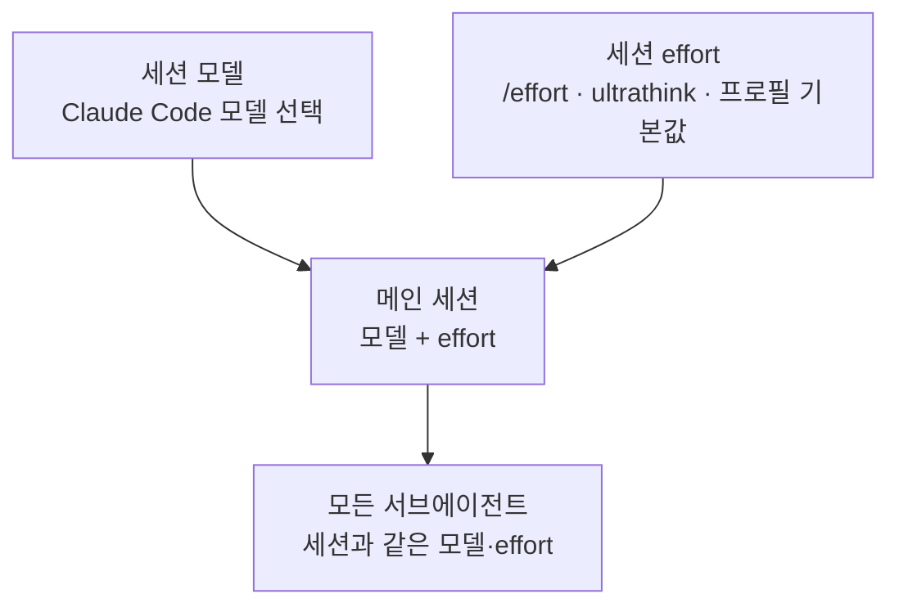

MoAI-ADK는 예전에 **프로필 매트릭스**로 에이전트 하나하나에 `{model, effort}`를
배정했습니다. 유지되는 13개 에이전트를 행으로, 세 가지 품질 열(`high` / `medium` /
`low`)을 열로 놓은 39칸짜리 표(에이전트 13개 × 프로필 3개)가 모델·추론 깊이 배정의
단일 원천이었고, 활성 프로필이 한 열을 고르면 그 열의 값이 모든 서브에이전트
부름에 적용됐습니다.

이 표는 **v3.2에서 물러났습니다.** 이 페이지는 매트릭스가 지워낸 자리에 무엇이
왔는지, 그리고 지금의 모델·추론 깊이가 어떻게 결정되는지를 설명합니다.


**한 줄 요약:** 에이전트별 배정표는 사라졌고, 그 자리는 **세션 상속**이 채웠습니다.
메인 세션이 쓰는 모델과 추론 깊이가 모든 서브에이전트의 모델과 추론 깊이입니다.
에이전트 정의는 어느 쪽도 선언하지 않고, 부를 때도 넘기지 않습니다.


## 매트릭스가 풀던 문제와, 그보다 나은 답

매트릭스는 이 문제를 풀려고 만들어졌습니다. 에이전트가 많아지면 "어떤 에이전트는
어떤 모델로 돌릴까"가 금세 감당이 안 되고, 이걸 에이전트 파일에 하나하나 적어 두면
둘째 날 이미 어긋납니다. 그래서 에이전트 13개를 행으로, 프로필 세 개를 열로 모은
한 장의 표에 배정을 모으고, 곧 프로필 하나 고르기로 줄였습니다.

그런데 실제 운용에서 문제가 드러났습니다. 오케스트레이터가 에이전트를 부를 때
model 인자를 붙이는 부름이 1%에도 못 미친다는 실측이 나왔습니다. 매트릭스는 값을
계산해 두고도 정작 부름에는 아무것도 적용되지 않는 상태 — "적용되지 않았다"고
알려 주는 장치도 없는 상태 — 가 계속됐습니다. 표 한 장으로 모으기는 했지만,
정작 적용 지점이 비어 있으면 모은다는 것 자체가 무의미했습니다.

그래서 배정을 더 정교하게 만드는 대신, 배정이라는 행위 자체를 없애기로 했습니다.
서브에이전트가 메인 세션의 모델과 추론 깊이를 그대로 따르면, 적용 지점이 비어
있을 수가 없습니다. 세션이 무엇으로 돌고 있느냐가 곧 배정이기 때문입니다.

## 지금의 규칙 — 세션 상속

> 서브에이전트는 메인 세션의 모델과 추론 깊이를 그대로 따릅니다 — 서브에이전트를
> 부를 때 `model`도 `effort`도 넘기지 않으며, MoAI 에이전트 정의는 어느 쪽도
> 선언하지 않습니다.

- **에이전트 정의 파일**(`.claude/agents/moai/*.md`)은 frontmatter에 model도
  effort도 적지 않습니다. 예전에 배포되던 `model: inherit` 필드와 effort 기본값은
  물러났습니다.
- **부름(spawn)**에는 model·effort 인자를 넣지 않는 것이 정상입니다. 명시적으로
  넣은 model이 세션과 다르면 그것은 드리프트이며, "부름을 고치는" 게 아니라
  "세션을 바꾸는" 쪽이 정답입니다.
- **세션**의 모델은 Claude Code의 모델 선택이 정하고, 세션의 effort는 `/effort`
  슬래시 명령, `ultrathink` 키워드, 프로필 위자드의 기본값이 정합니다.

```mermaid
flowchart TD
    M["세션 모델<br/>Claude Code 모델 선택"] --> S["메인 세션<br/>모델 + effort"]
    E["세션 effort<br/>/effort · ultrathink · 프로필 기본값"] --> S
    S --> W["모든 서브에이전트<br/>세션과 같은 모델·effort"]
```

## 세션 effort는 어디서 오는가

세션의 추론 깊이가 결정되는 길은 세 가지이고, 먼저 온 것이 이깁니다.

1. **세션 안에서의 조절** — `/effort low|medium|high|xhigh|max` 슬래시 명령이나
   `ultrathink` 키워드. 세션 effort를 바꾸면 이후의 서브에이전트 부름 전부가
   따라갑니다.
2. **프로필 위자드의 세션 모델 정책** — `moai profile setup`의 "세션 모델 정책"
   질문은 이 프로필로 실행하는 Claude 세션의 **기본 추론 강도 폴백**을 정합니다.
   `high` / `medium` / `low` 세 값이 그대로 effort로 옮겨지고, 추론 강도를 따로
   고르지 않았을 때만 적용됩니다. 값이 없으면 오버라이드 없이 Claude Code의
   기본 동작을 따릅니다.
3. **모델 자체의 기본값** — 위 어느 쪽도 개입하지 않으면 모델의 기본 effort를
   따릅니다. Opus 5.5의 기본은 `medium`이고, effort를 지원하는 다른 모델은
   대부분 `high`가 기본입니다.

## 스폰 시점의 관측

상속이 기본이 된 뒤에도 부름 시점에 model 인자를 명시하는 일은 드물게 남을 수
있습니다. 이를 지켜보는 관측 계층이 있습니다. PreToolUse 훅이 부름마다 선언된
model을 읽어 `.moai/logs/agent-model-audit.jsonl`에 한 줄씩 남기고, 선언이 세션
값과 다르면 권고를 냅니다. 차단은 옵트인(`workflow.agent_model_guard.enabled`,
기본값 `false`)이며, 평소에는 신경 쓰지 않아도 되는 관측 계층입니다.

## 예전 매트릭스의 판단 기준은 어디에 남아 있나

39칸 표와 리졸버와 `moai model profile` 접근자는 물러났지만, 매트릭스가 실측으로
확립했던 **모델을 고르는 판단 기준**은 사라지지 않았습니다. 오히려 세션 단위 모델
선택에서 그대로 쓰이는 기준입니다.

- **지출은 판단하는 자리에**: 감사·자문·조율처럼 판단이 무거운 단계에 깊은 추론을
  몰아 주는 것이 비용 대비 품질에서 유리합니다.
- **에이전틱 작업은 Opus**: 긴 호흡의 멀티턴 작업에서는 Opus의 `low`가 어떤
  effort의 Sonnet보다도 점수가 높으면서 과제당 비용은 낮습니다.
- **No-Haiku**: 긴 호흡의 에이전틱 작업에서 Haiku를 끼워 넣으면 완주 실패로
  스텝 낭비가 커져 과제당 비용이 오히려 늘어납니다.

근거가 된 DeepSWE 실측 데이터와 3-티어 설계 의도는
[3-티어 에이전트 아키텍처](/ko/advanced/no-haiku-3tier/) 페이지에,
비용·점수 곡선의 원문 수치는 그 페이지의 리더보드 절에 정리돼 있습니다.

## 하네스 스페셜리스트

`/moai:harness`가 만드는 스페셜리스트도 같은 규칙을 따릅니다. 하네스 에이전트
정의는 model과 effort를 선언하지 않으며, 세션의 모델과 추론 깊이를 그대로
따릅니다. 목적 클래스(읽기 전용 추출, 기계 변환, 구현, 감사 판정 등)에 따른
effort 출처 행 표는 예전 매트릭스의 것으로, 지금은 판단 기준의 기록으로만
남아 있습니다.

## 다음 단계

- [모델 정책](/ko/multi-llm/model-policy/) — 세션 모델 정책과 effort 폴백, GLM reasoning 상한
- [3-티어 에이전트 아키텍처](/ko/advanced/no-haiku-3tier/) — DeepSWE 리더보드 근거와 모델 선택 기준
- [토크노믹스 개요](/ko/advanced/tokenomics-overview/) — 4-층 토크노믹스 구조의 B층 라우팅
