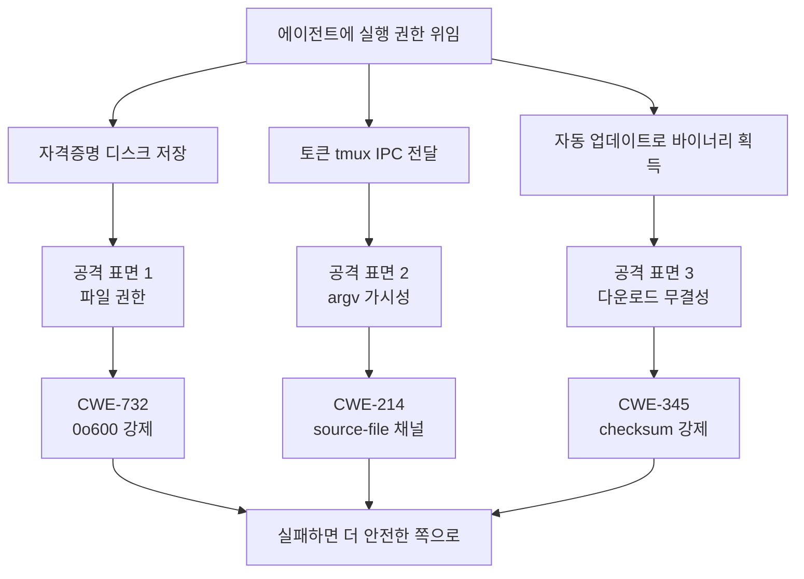
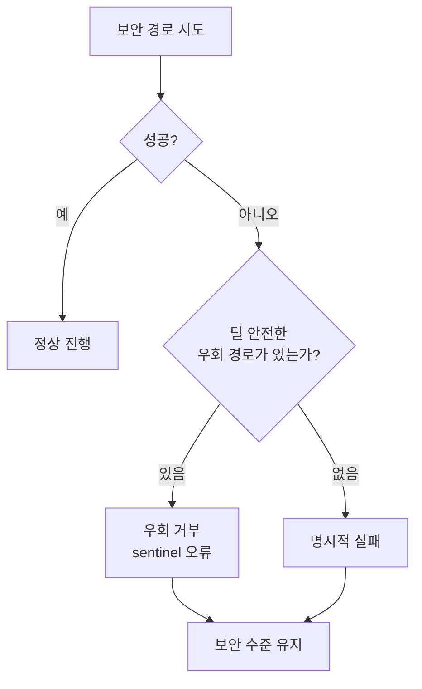

에이전틱 하네스(스스로 일하는 AI 에이전트에게 실행 권한을 맡기는 품질 검증 장치)는 코드를 읽기만 하는 도구가 아닙니다. 에이전트가 파일을 고치고, 셸 명령을 실행하고, 네트워크로 바이너리를 내려받을 수 있는 권한을 갖기 때문에, 그 권한이 믿을 수 있으려면 **자격증명**과 **업데이트 경로**가 안전해야 하네스 전체를 신뢰할 수 있습니다. 이 페이지는 MoAI-ADK v3.0.0에서 도입된 세 가지 사용자 가시 보안 강화를, 변경 이력이 아니라 **왜 이렇게 설계되었는지**를 이해하는 개념 페이지로 풉니다. 같은 강화가 v3.0 계열 현행까지 그대로 유효합니다.

## 공격 표면 지도

에이전트가 일하려면 세 가지가 오갑니다. (1) API 토큰과 OAuth 자격증명은 디스크 파일에 저장되고, (2) `moai cg` 같은 CG 모드(비용 절감을 위해 Claude 리더와 GLM 워커를 조합하는 구성)가 토큰을 tmux 세션 환경으로 넘길 때 프로세스 경계를 가로지르고, (3) `moai update`가 release 바이너리를 인터넷에서 내려받습니다. 권한을 넘기는 시스템이므로 이 세 지점이 곧 공격 표면입니다.

요구사항 명세서 SPEC인 `SPEC-V3R5-SECURITY-CRIT-001`(PR #1032, merge commit `03a2552a2`)은 v2.14.0에서 v3.0.0으로 옮겨가는 코드 리뷰에서 드러난 P0 release blocker 보안 결함 세 건을 정정했습니다. 세 결함은 위 세 지점에 각각 하나씩 대응하며, 모두 회귀 테스트로 잠겨 있어 같은 결함이 다시 들어올 수 없습니다.

## 세 가지 보호, 하나의 원칙

세 보호는 서로 다른 기술을 쓰지만 하나의 원칙을 공유합니다. 보안에 결정적인 경로가 실패했을 때, 덜 안전한 우회로 소리 없이 빠지지 않고 명시적인 오류로 멈춘다는 것입니다. 이 원칙은 "fail open"(실패하면 통과시킨다)이 아니라 **"fail secure"** (실패하면 안전한 쪽으로 닫힌다)로 요약됩니다. 아래 세 절은 각 공격 표면의 위협 모델과 그 위협을 어떻게 막았는지를 다룹니다.

## 자격증명은 쉴 때도 보호받아야 한다 — 파일 권한 강화

**CWE-732 / CWE-552.** API 토큰과 OAuth refresh token, 그리고 `settings.Env`에 담긴 값들은 `.claude/settings.local.json` 파일에 저장됩니다. 이전 버전까지 이 파일은 `0o644` 권한으로 만들어졌습니다 — 소유자는 읽고 쓰지만 같은 호스트의 다른 사용자도 읽을 수 있는 권한입니다. 다중 사용자 워크스테이션에서 이것은 곧 "같은 컴퓨터에 로그인한 다른 로컬 사용자가 당신의 GLM API 토큰을 읽을 수 있다"는 뜻이었습니다.

v3.0.0부터 이 파일은 만들거나 갱신할 때마다 **`0o600`** (소유자만 읽고 쓰기)으로 강제됩니다. 위협 모델은 "같은 호스트의 저권한 로컬 사용자"이고, 공격 표면은 group/world read 권한이며, 누설되는 정보는 `ANTHROPIC_AUTH_TOKEN`과 OAuth refresh token, 기타 `settings.Env` 값입니다. 구현은 `internal/hook/settings_io.go`의 `secureSettingsMode` 상수와 `writeSettingsSecure` 헬퍼가 쥐고 있고, `session_start.go`의 `ensureGLMCredentials`와 `session_end.go`의 GLM 키 기록 경로 등 파일을 쓰는 모든 지점이 이 헬퍼를 거칩니다.

권한은 한 줄로 확인합니다. Linux에서는 `stat -c '%a' .claude/settings.local.json`, macOS에서는 `stat -f '%A' .claude/settings.local.json`이고, 둘 다 `600`이 나와야 합니다. `644`이거나 그보다 느슨하면 다음 세션 시작 때 자동으로 `0o600`으로 되돌아갑니다. 곧바로 고치려면 `chmod 0600 .claude/settings.local.json`을 실행하면 됩니다.

## 비밀은 가장 눈에 띄지 않는 길로 간다 — argv 노출 차단

**CWE-214.** CG 모드가 GLM 토큰을 tmux 세션 환경 변수에 주입할 때, 이전에는 argv 채널(`tmux set-environment <KEY> <VALUE>`)을 썼습니다. argv는 생각보다 훨씬 넓게 관측됩니다 — `ps auxe`, `/proc/<pid>/cmdline`, auditd 로그, sysmon 추적, 심지어 크래시 덤프까지 토큰을 평문으로 남깁니다. 토큰이 "잠깐" 드러나는 순간도, 그 로그가 모이는 시스템에서는 영구 기록이 됩니다.

v3.0.0부터 토큰은 **source-file 채널**로 갑니다. (1) `~/.moai/run/` 아래 임시 파일을 `mkstemp`로 만들고(자동 `0o600`), (2) `set-environment` 한 줄을 그 파일에 쓰고, (3) `tmux source-file <tmp>`로 tmux가 파일을 읽어 환경에 주입한 뒤, (4) 주입 직후 파일을 `os.Remove`로 지웁니다. argv에는 임시 파일 경로만 남고 토큰 자체는 드러나지 않습니다. 구현은 `internal/tmux/session.go`의 `InjectSensitiveEnv`에 있고, `internal/hook/glm_tmux.go`의 `ensureTmuxGLMEnv`가 `ANTHROPIC_AUTH_TOKEN`만 이 sensitive 경로로 보냅니다.

토큰이 아닌 값은 예외입니다. `CLAUDE_CONFIG_DIR`(디렉터리 경로), `ANTHROPIC_BASE_URL`(URL), `ANTHROPIC_DEFAULT_*_MODEL`(모델 이름)은 그대로 argv 경로를 씁니다 — 이 값들은 토큰이 아니며 누설 위험과 무관합니다. CG 모드 실행 중 토큰이 argv에 남지 않는지는 `ps auxe | grep -i 'tmux set-environment.*ANTHROPIC_AUTH_TOKEN'`으로 확인하고(0 매치가 정상), 임시 파일이 깔끔히 지워지는지는 `~/.moai/run/` 디렉터리가 비어 있는지로 확인합니다.

## 내려받는 코드는 반드시 진짜여야 한다 — 업데이트 무결성 강제

**CWE-345.** `moai update`가 release 바이너리를 내려받을 때, 체크섬 검증은 우회할 수 없습니다. release의 `checksums.txt`를 내려받거나 파싱하지 못하면 sentinel 오류 `ErrChecksumUnavailable`을 반환하고 update 흐름 자체를 중단합니다 — 바이너리 다운로드조차 시도하지 않습니다. `--skip-checksum` 같은 우회 옵션은 존재하지 않으며, 이것은 의도된 정책입니다.

위협 모델은 "네트워크 중간자(MITM)"입니다. 공격자가 전체를 차단하지는 못해도 `checksums.txt` URL만 골라 차단하거나 속도를 늦출 수 있습니다. 체크섬 없이도 바이너리가 설치되던 종전의 silent fallback은, 서명되지 않은 백도어 바이너리의 무경고 설치로 이어질 수 있었습니다. 이것이 CWE-345(Insufficient Verification of Data Authenticity)에 해당합니다.

검증은 **두 겹**으로 막힙니다. `internal/update/checker.go`의 `downloadChecksumWithRetry`가 `checksums.txt`를 지수 백오프로 세 번까지 재시도하고(기본 대기 2초, 2^(시도-1) 배수 — 1차 즉시, 2차 2초 대기, 3차 4초 대기, 합산 약 6초), 모두 실패하면 `ErrChecksumUnavailable`을 반환합니다. 만약 빈 체크섬 값이 `internal/update/updater.go`의 `downloadAndVerify`에까지 도달하면, 여기서도 바이너리 다운로드를 진행하지 않고 같은 sentinel 오류로 멈춥니다 — checker 단계와 updater 단계, 두 겹으로 소리 없는 우회를 차단하는 *defense-in-depth* 구조입니다. 정상 동작은 `moai update --check-only`로 release와 `checksums.txt` 존재를 먼저 확인하고, `moai update`를 실행하면 `Downloaded checksums.txt (verified)` 출력을 봅니다.

## 실패하면 더 안전한 쪽으로

세 보호를 하나로 묶는 원칙을 다시 봅니다. source-file 주입이 실패할 때(디스크 가득 참, tmux 오류 등) argv fallback으로 토큰을 흘려보내지 않고 `ErrTmuxSensitiveInjectFailed` sentinel로 주입 자체를 멈춥니다. 체크섬을 구하지 못할 때 "그냥 바이너리라도 받자"가 아니라 update 전체를 중단합니다. 파일 권한은 매 쓰기마다 `0o600`을 재강제합니다. 실패했다고 편한 길로 돌아가지 않는 것, 이것이 이 설계의 핵심입니다.

이 원칙이 중요한 까닭은, 에이전트에게 실행 권한을 넘기는 시스템에서 "편의를 위해 보안을 희석하는 우회"가 열려 있으면 그 우회가 곧 공격 경로가 되기 때문입니다. 공격자가 강제할 필요도 없이, 시스템 스스로 불편한 순간에 보안을 내려놓도록 만들어져 있기 때문입니다.

## 보안과 편의 사이의 의도된 트레이드오프

`0o600` 강제는 group-readable을 전제하는 워크플로우를 깰 수 있습니다 — 같은 프로젝트 디렉터리를 별도의 OS 사용자가 읽는 아주 드문 시나리오입니다. 체크섬 검증 강제는 네트워크가 불안정할 때 update를 거부하므로, 사용자가 직접 무결성을 검증한 뒤 수동 설치 스크립트(`curl -fsSL .../install.sh | bash`)로 넘어가야 할 수 있습니다. 이 트레이드오프는 의도한 것이며, 보안이 분명히 우선합니다.

GLM 자격증명 원본 파일인 `~/.moai/.env.glm`의 권한은 사용자의 책임 영역입니다 — `moai glm` 명령이 자동으로 `0o600`을 부여하지만, 파일을 직접 다룰 때는 `600`인지 확인해야 합니다. 자세한 구조는 [CG 모드](/ko/multi-llm/cg-mode/) 문서를 참조하세요.

## 내 환경에서 직접 확인하기

다섯 지점을 한 번에 점검합니다. (1) `.claude/settings.local.json` 권한 — `stat -c '%a'`(Linux) 또는 `stat -f '%A'`(macOS)로 확인, 기대값 `600`. (2) CG 모드 실행 중 토큰 argv 노출 — `ps auxe | grep 'tmux set-environment.*ANTHROPIC_AUTH_TOKEN'`, 기대값 0 매치. (3) tmux sensitive 임시 디렉터리 — `~/.moai/run/`이 비어 있거나 stale 파일이 없어야 함. (4) update 체크섬 동작 — `moai update --check-only`로 release와 `checksums.txt` 정상 확인. (5) GLM 원본 파일 권한 — `~/.moai/.env.glm`이 `600`(파일이 있을 때). 다섯 항목이 모두 기대값과 맞으면 세 보호가 정상 작동하는 것입니다.

## 참고자료

### SPEC · 커밋

- `SPEC-V3R5-SECURITY-CRIT-001` — upstream source of truth, status `implemented` v0.2.0
- PR #1032 merge commit `03a2552a2`
- `b48bd86cb` — M1 settings.local.json `0o600` hardening (CWE-732/552)
- `10776c4b8` — M2 tmux sensitive env source-file injection (CWE-214)
- `ee1335282` — M3 mandatory checksum verification with retry (CWE-345)
- `b4e7115cb` — M4 cross-cutting verification + frontmatter
- [CHANGELOG v3.0.0 Security 섹션](https://github.com/modu-ai/moai-adk/blob/main/CHANGELOG.md)

### CWE · OWASP

- [CWE-732](https://cwe.mitre.org/data/definitions/732.html) — Incorrect Permission Assignment for Critical Resource
- [CWE-552](https://cwe.mitre.org/data/definitions/552.html) — Files or Directories Accessible to External Parties
- [CWE-214](https://cwe.mitre.org/data/definitions/214.html) — Invocation of Process Using Visible Sensitive Information
- [CWE-345](https://cwe.mitre.org/data/definitions/345.html) — Insufficient Verification of Data Authenticity

### 관련 페이지

- [settings.json 가이드](/ko/advanced/settings-json/) — `settings.local.json` 권한 섹션
- [업데이트](/ko/cli-reference/update/) — checksum 검증 섹션
- [CG 모드](/ko/multi-llm/cg-mode/) — tmux 환경 변수 주입 보안 모델
