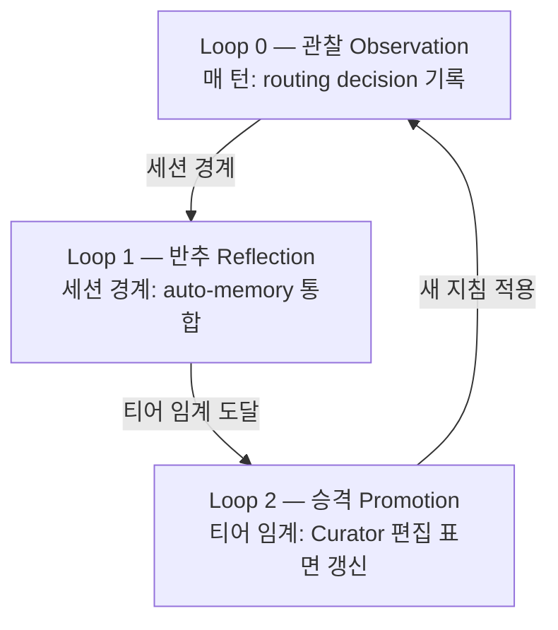

하네스 경쟁력의 핵심은 자기 개선 설계에 있습니다. Lilian Weng의 "Harness Engineering for Self-Improvement"(2026-07-04)가 명명한 대로, 하네스는 모델을 둘러싼 실행·운영 계층이며 자가 개선의 현실 경로는 가중치가 아니라 이 계층의 개선입니다. 이 페이지는 MoAI-ADK의 자가 진화 하네스인 ACE 3-Loop 구조를 공식 문서화합니다.

## 왜 자가 진화인가

Weng의 프레임워크에 따르면, 하네스는 6개 축(계획·도구·컨텍스트·파일/기억·평가·권한)을 결정하는 실행·운영 계층입니다. 자가 개선의 현실 경로는 모델 가중치가 아니라 이 계층의 개선이며, 최적화 대상은 프롬프트 → 구조화 컨텍스트 → 워크플로우 → 하네스 코드로 확장됩니다.

MoAI-ADK는 이 프레임워크를 ACE 역할 모델(Generator → Reflector → Curator)과 3-Loop 구조로 구체화합니다.

## ACE 역할 모델

Weng의 ACE(Agentic Cognitive Engine) 프레임워크는 세 역할을 정의합니다:

- **Generator** — 궤적을 생성하고 실행합니다 (에이전트의 실제 작업 수행)
- **Reflector** — 궤적을 증류하여 패턴을 추출합니다 (관찰에서 학습 신호 도출)
- **Curator** — 불릿 단위로 지침을 갱신합니다 (전체 재작성 금지, 관리 블록 내 CRUD만)

이 세 역할이 3-Loop로 구체화됩니다.

## 3-Loop 구조

### Loop 0 — 관찰 (Observation, 매 턴)

 모든 라우팅 결정을 프라이버시 보존 다이제스트로 routing-ledger.jsonl에 기록합니다. SPEC-HARNESS-EVOLVE-001(CLOSED)에서 구현되었습니다. 기록 필드에는 라우팅 결정, 게이트 증거, `/moai loop`·`/goal` 수렴 궤적, 서브에이전트 위임 결과가 포함됩니다.

### Loop 1 — 반추 (Reflection, 세션 경계)

 관찰된 데이터에서 패턴을 추출하여 auto-memory에 통합합니다. 티어 1-2 수준의 관찰은 임시 메모리에, 티어 3 수준은 CLAUDE.local.md에 append-only로 기록됩니다.

### Loop 2 — 승격 (Promotion, 티어 임계)

 관찰 빈도가 티어 임계(1 / 3 / 5 / 10)에 도달하면 Curator가 편집 가능 표면을 갱신합니다. SPEC-HARNESS-EVOLVE-002(CLOSED)가 Curator 편집 표면을, SPEC-HARNESS-EVOLVE-003(CLOSED)가 프로덕션 배선(L2 Canary, L3 Contradiction, negative evidence)을 구현했습니다.

## 티어 ↔ 표면 매핑

4-계층 학습 사다리가 관찰 빈도에 따라 승격 대상 표면을 결정합니다:

| 티어 | 임계값 | 표면 | 쓰기 주체 |
|------|--------|------|-----------|
| Tier 1-2 | ≥1 관찰 | auto-memory (임시) | 자동 |
| Tier 3 | ≥3 관찰 | CLAUDE.local.md (append-only) | 자동 |
| Tier 4 | ≥5 관찰 | CLAUDE.md 관리 블록 (≤3K자, 불릿 ≤20) | Curator |
| Tier 5 | ≥10 관찰 + 사용자 승인 | CLAUDE.md / rules / agents | 사용자 승인 필수 |

## 3-Zone 편집 표면 계약

보상 해킹 방지를 위해 편집 가능한 표면을 3개 Zone으로 엄격히 분리합니다.

| Zone | 표면 | 안전 장치 |
|------|------|-----------|
| **Frozen** | `.claude/rules/` · `.claude/agents/moai/` · moai-* 스킬 · 평가자 · 템플릿 · 권한 표면 (settings.json · 훅 등록 · frozen-guard 자체) | L1 Frozen Guard 경로 차단. 학습이 자기 성적표나 자기 울타리를 수정 불가 |
| **Evolvable** | harness-* 스킬 · `.claude/agents/harness/` · harness.yaml auto_detection 블록 | 기존 5-layer 파이프라인 + 스키마 범위 검증 |
| **Learned** | CLAUDE.md 관리 블록 · CLAUDE.local.md Learned 섹션 · routing-ledger.jsonl · lineage · negative evidence | 예산 상한 + 만료 pruning. 상세는 원장에, 요약만 상시 로드 |

 **권한 축 Frozen** (A1 보강): 평가자뿐 아니라 settings.json, permission mode, 훅 등록, frozen-guard 자체도 Frozen Zone에 포함됩니다. 학습 루프는 자신의 권한이나 안전 장치를 제안 대상으로 삼을 수 없습니다.

## 프로덕션 배선 (EVOLVE-003)

SPEC-HARNESS-EVOLVE-003(CLOSED)에서 다음 7개 핵심 요소가 프로덕션 배선되었습니다:

1. **A1 Frozen 확장** — 권한 축을 Frozen Zone에 명시 등재
2. **A6 tier ↔ surface 매핑** — harness.yaml auto_detection 블록을 Tier 4 편집 표면에 등재
3. **A7 negative evidence** — 기각·롤백된 승격의 패턴 키를 등재하여 동일 제안 재발 억제
4. **L2 Canary** — held-out 검증 (변경 전후 회귀 테스트)
5. **L3 Contradiction** — 기존 지침과 모순되는 승격 감지
6. **GLM observe-only** — GLM 세션은 관찰만, 승격 제안 생성은 Opus/Fable 세션 한정
7. **anti-fabrication** — 관찰되지 않은 증거의 패브리케이션 방지

## 로드맵

 **진행 중 (REQ-DA-063 정직성 고지)**: 자가 진화 하네스의 Loop 0-2는 프로덕션 배선 완료(EVOLVE-001/002/003 CLOSED)이지만, 다음 표면은 아직 구현되지 않았습니다:

- **EVOLVE-004** — console verbs (`/moai harness evolve/promote/demote/freeze`) — 사용자가 CLI에서 직접 승격/강등/동결을 제어하는 동사
- **EVOLVE-005** — Recall wiring + typed parser — 2계층 Recall(상시 로드 다이제스트 + on-demand 검색 원장)의 전체 배선 + harness-spec.yaml의 typed Go 파서

이 표면들은 v5.1 MCE(Recall 자체의 학습) 및 v6 진화적 탐색 지평과 함께 로드맵 항목으로 기재됩니다. "구현 완료"가 아닌 "진행 중 / 로드맵"으로 명시합니다.

## 다음 단계

- [3-티어 에이전트 아키텍처](/ko/advanced/no-haiku-3tier/) — 자가 진화가 작동하는 기반 모델 아키텍처
- [자율 연속 루프](/ko/advanced/autonomous-loops/) — `/moai loop`·`/goal` 수렴 궤적이 Loop 0 관찰에 통합
- [토크노믹스 개요](/ko/advanced/tokenomics-overview/) — 자가 진화가 토크노믹스와 연결되는 지점
