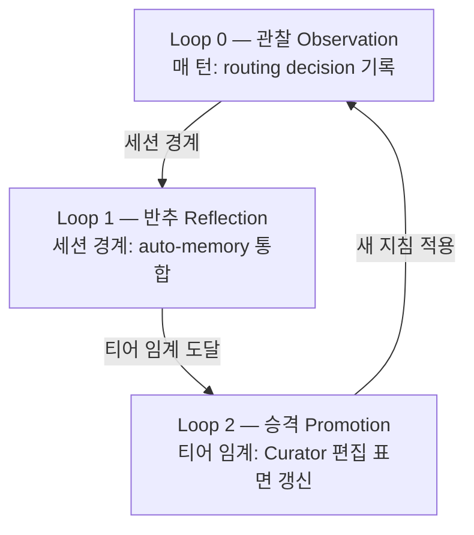

하네스 경쟁력은 결국 자기 개선을 어떻게 설계했느냐로 갈립니다. Lilian Weng의 "Harness Engineering for Self-Improvement"(2026-07-04)가 짚었듯이, 하네스는 모델을 둘러싼 실행·운영 계층이고 자가 개선의 현실적인 길은 가중치가 아니라 이 계층을 다듬는 데 있습니다. 이 페이지는 MoAI-ADK의 자가 진화 하네스인 ACE 3-Loop 구조를 공식 문서로 정리합니다.

## 왜 자가 진화인가

Weng의 프레임워크에서 하네스는 6개 축(계획·도구·컨텍스트·파일/기억·평가·권한)을 결정하는 실행·운영 계층입니다. 자가 개선의 현실적인 길은 모델 가중치가 아니라 이 계층을 다듬는 것이고, 최적화 대상은 프롬프트에서 구조화 컨텍스트로, 다시 워크플로우와 하네스 코드로 넓어집니다.

MoAI-ADK는 이 프레임워크를 ACE 역할 모델(Generator → Reflector → Curator)과 3-Loop 구조로 구체화했습니다.

## ACE 역할 모델

Weng의 ACE(Agentic Cognitive Engine) 프레임워크는 세 역할을 둡니다.

- **Generator** — 궤적을 만들고 실행합니다 (에이전트가 실제로 일하는 부분)
- **Reflector** — 궤적을 추려 패턴을 뽑아냅니다 (관찰에서 학습 신호를 끌어냄)
- **Curator** — 불릿 단위로 지침을 갱신합니다 (전체 재작성 금지, 관리 블록 안에서 CRUD만)

이 세 역할이 3-Loop로 구현됩니다.

## 3-Loop 구조

### Loop 0 — 관찰 (Observation, 매 턴)

 모든 라우팅 결정을 프라이버시 보존 다이제스트 형태로 routing-ledger.jsonl에 남깁니다. SPEC-HARNESS-EVOLVE-001(CLOSED)에서 구현했습니다. 남기는 필드는 라우팅 결정, 게이트 증거, `/moai loop`·`/moai goal` 수렴 궤적, 서브에이전트 위임 결과입니다.

### Loop 1 — 반추 (Reflection, 세션 경계)

 쌓인 관찰에서 패턴을 뽑아 auto-memory에 합칩니다. 티어 1-2 수준의 관찰은 임시 메모리에, 티어 3 수준은 CLAUDE.local.md에 append-only로 남깁니다.

### Loop 2 — 승격 (Promotion, 티어 임계)

 관찰 빈도가 티어 임계(1 / 3 / 5 / 10)에 닿으면 Curator가 편집 가능한 표면을 갱신합니다. SPEC-HARNESS-EVOLVE-002(CLOSED)가 Curator 편집 표면을, SPEC-HARNESS-EVOLVE-003(CLOSED)가 프로덕션 배선(L2 Canary, L3 Contradiction, negative evidence)을 구현했습니다.

## 티어 ↔ 표면 매핑

관찰 빈도에 따라 어느 표면까지 승격할지는 4-계층 학습 사다리가 정합니다.

| 티어 | 임계값 | 표면 | 쓰기 주체 |
|------|--------|------|-----------|
| Tier 1-2 | ≥1 관찰 | auto-memory (임시) | 자동 |
| Tier 3 | ≥3 관찰 | CLAUDE.local.md (append-only) | 자동 |
| Tier 4 | ≥5 관찰 | CLAUDE.md 관리 블록 (≤3K자, 불릿 ≤20) | Curator |
| Tier 5 | ≥10 관찰 + 사용자 승인 | CLAUDE.md / rules / agents | 사용자 승인 필수 |

## 3-Zone 편집 표면 계약

보상 해킹을 막으려고 편집 가능한 표면을 3개 Zone으로 엄격히 갈라 둡니다.

| Zone | 표면 | 안전 장치 |
|------|------|-----------|
| **Frozen** | `.claude/rules/` · `.claude/agents/moai/` · moai-* 스킬 · 평가자 · 템플릿 · 권한 표면 (settings.json · 훅 등록 · frozen-guard 자체) | L1 Frozen Guard가 경로를 차단. 학습이 자기 성적표나 자기 울타리를 고칠 수 없음 |
| **Evolvable** | harness-* 스킬 · `.claude/agents/harness/` · harness.yaml auto_detection 블록 | 기존 5-layer 파이프라인 + 스키마 범위 검증 |
| **Learned** | CLAUDE.md 관리 블록 · CLAUDE.local.md Learned 섹션 · routing-ledger.jsonl · lineage · negative evidence | 예산 상한 + 만료 pruning. 상세는 원장에 두고 요약만 상시 로드 |

 **권한 축 Frozen** (A1 보강): 평가자뿐 아니라 settings.json, permission mode, 훅 등록, frozen-guard 자체도 Frozen Zone에 들어갑니다. 학습 루프는 제 권한이나 제 안전 장치를 제안 대상으로 삼을 수 없습니다.

## 프로덕션 배선 (EVOLVE-003)

SPEC-HARNESS-EVOLVE-003(CLOSED)에서 다음 7개 핵심 요소를 프로덕션에 배선했습니다.

1. **A1 Frozen 확장** — 권한 축을 Frozen Zone에 명시적으로 올림
2. **A6 tier ↔ surface 매핑** — harness.yaml auto_detection 블록을 Tier 4 편집 표면에 올림
3. **A7 negative evidence** — 기각하거나 롤백한 승격의 패턴 키를 남겨 같은 제안이 되돌아오지 않게 함
4. **L2 Canary** — held-out 검증 (변경 전후 회귀 테스트)
5. **L3 Contradiction** — 기존 지침과 어긋나는 승격을 잡아냄
6. **GLM observe-only** — GLM 세션은 관찰만 하고, 승격 제안은 Opus/Fable 세션에서만 만듦
7. **anti-fabrication** — 관찰하지 않은 증거를 지어내지 못하도록 차단

## 로드맵

 **진행 중 (REQ-DA-063 정직성 고지)**: 자가 진화 하네스의 Loop 0-2는 프로덕션 배선을 마쳤지만(EVOLVE-001/002/003 CLOSED), 다음 표면은 아직 구현하지 않았습니다.

- **EVOLVE-004** — console verbs (`/moai harness evolve/promote/demote/freeze`) — 사용자가 CLI에서 직접 승격·강등·동결을 제어하는 동사
- **EVOLVE-005** — Recall wiring + typed parser — 2계층 Recall(상시 로드 다이제스트 + on-demand 검색 원장) 전체 배선과 harness-spec.yaml의 typed Go 파서

이 표면들은 v5.1 MCE(Recall 자체의 학습), v6 진화적 탐색과 함께 로드맵 항목으로 남겨 둡니다. "구현 완료"가 아니라 "진행 중 / 로드맵"이라는 점을 분명히 밝힙니다.

## 다음 단계

- [3-티어 에이전트 아키텍처](/ko/advanced/no-haiku-3tier/) — 자가 진화가 작동하는 기반 모델 아키텍처
- [자율 연속 루프](/ko/advanced/autonomous-loops/) — `/moai loop`·`/moai goal` 수렴 궤적이 Loop 0 관찰에 통합
- [토크노믹스 개요](/ko/advanced/tokenomics-overview/) — 자가 진화가 토크노믹스와 연결되는 지점
