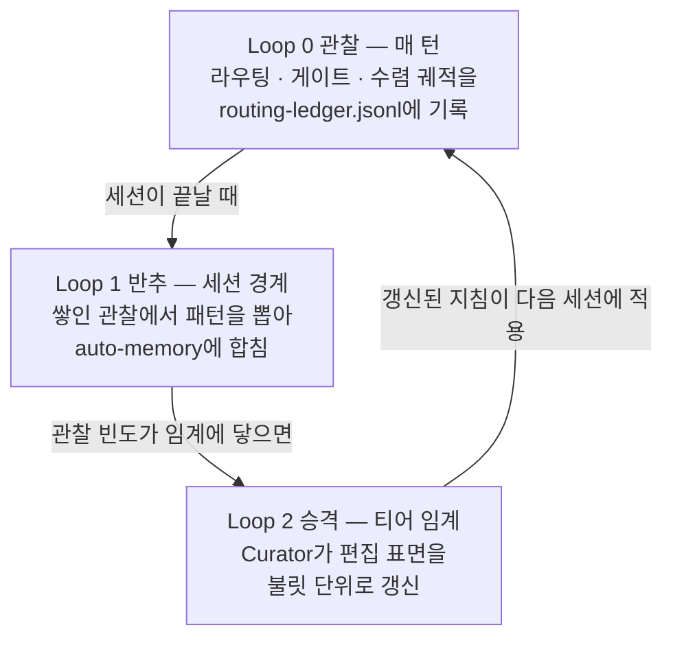
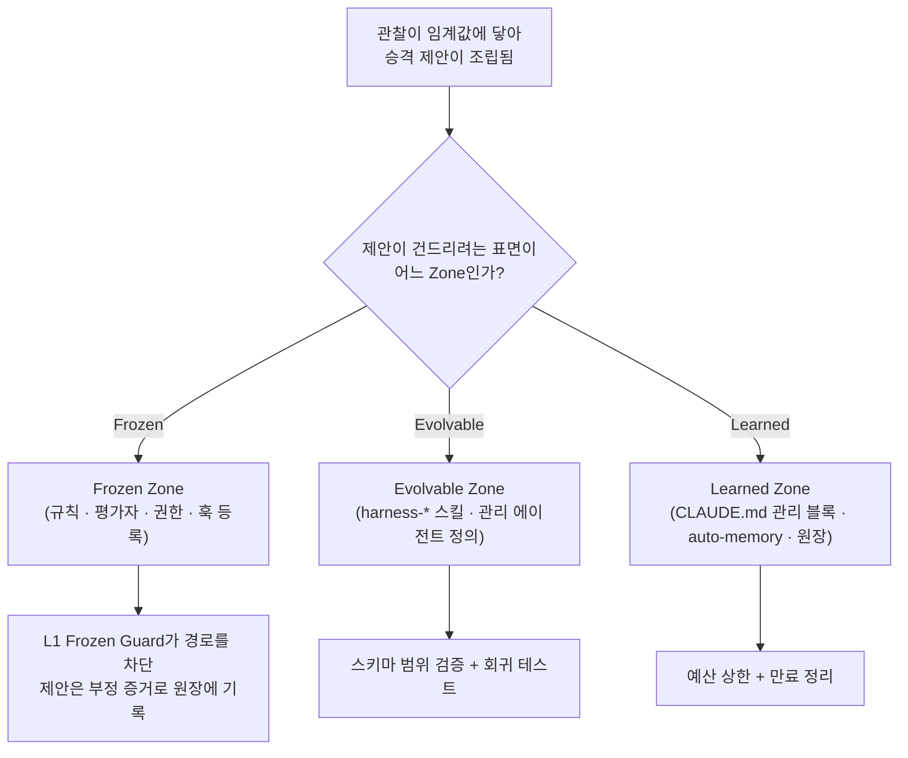

에이전트(스스로 일하는 AI 도우미)를 둘러싼 하네스(품질 검증 자동 장치)가 쓰면 쓸수록 좋아지는 일은, 모델의 지능이 달라져서가 아니라 하네스 자신의 지침과 코드가 세션을 거듭하며 다듬어지기 때문입니다. 모델 가중치(모델이 학습한 매개변수, 사용자가 바꿀 수 없는 층)를 건드리지 않고도, 그 모델을 둘러싼 실행·운영 계층만 개선해서 결과가 점점 나아지게 만드는 길이 있습니다. 이 페이지는 MoAI-ADK가 그 길을 어떻게 설계했는지 — ACE 역할 모델과 3-Loop 구조, 그리고 이 자기 개선이 스스로를 해치지 않도록 지키는 3-Zone 안전 계약까지 — 내부 메커니즘 중심으로 정리합니다.


**한 줄 요약:** 자가 진화는 "관찰을 모으고(Loop 0), 패턴을 뽑아내고(Loop 1), 지침을 갱신하는(Loop 2)" 세 단계를 세 역할(Generator · Reflector · Curator)이 분업해 돌리는 구조이며, 학습이 자기 성적표나 자기 울타리를 고치지 못하도록 편집 표면을 세 Zone(Frozen · Evolvable · Learned)으로 가르고 안전장치를 걸어 둡니다.


## 왜 자가 진화인가

Lilian Weng의 "Harness Engineering for Self-Improvement"(2026-07-04) 프레임워크는 하네스를 모델을 둘러싼 실행·운영 계층으로 정의하고, 여섯 축(계획 · 도구 · 컨텍스트 · 파일 · 평가 · 권한)을 결정하는 바로 이 층이 자가 개선의 현실적인 출발점이라고 짚습니다. 모델 가중치를 다시 학습시키는 일은 비용도 크지만, 에이전트가 매번 겪는 실패의 대부분은 모델이 부족해서가 아니라 하네스가 내린 결정(어떤 도구를 쓸지, 얼마나 깊이 추론할지, 무엇을 컨텍스트에 올릴지)이 틀렸기 때문에 벌어집니다. 그래서 자가 개선의 레버는 가중치가 아니라 이 결정들을 다듬는 쪽에 있고, 최적화 대상은 프롬프트에서 구조화 컨텍스트로, 다시 워크플로우와 하네스 코드로 점점 넓어집니다.

MoAI-ADK는 이 관찰을 두 가지 설계로 구체화했습니다. 하나는 일의 분업을 정하는 ACE 역할 모델이고, 다른 하나는 그 분업이 언제 발동할지를 정하는 3-Loop 구조입니다.

## ACE 역할 모델 — 세 역할의 분업

ACE(Agentic Cognitive Engine, 에이전트 인지 엔진) 프레임워크는 자기 개선을 세 역할로 가릅니다. 한 역할이 세 일을 다 떠안으면, 자기가 낸 결과를 자기가 평가하고 자기가 고치는 순환이 생겨 편향이 숨습니다. 그래서 각 역할이 서로 겹치지 않게 하나씩만 맡습니다.

- **Generator** (생성자) — 궤적(한 세션 동안 쌓이는 실행 기록)을 만듭니다. 에이전트가 실제로 일하고 코드를 쓰는 부분이며, 라우팅 결정과 게이트 증거가 이 궤적 안에 쌓입니다.
- **Reflector** (반추자) — Generator가 남긴 궤적을 추려 패턴을 뽑아냅니다. 한 세션의 관찰이 "이런 상황에서는 이렇게 처리했다"는 학습 신호로 요약되는 자리입니다.
- **Curator** (큐레이터) — 요약된 패턴을 지침에 더합니다. 이때 문서 전체를 통째로 다시 쓰지 못하고, 관리 블록 안에서 불릿(한 줄짜리 조항) 단위로만 더하거나 빼도록 제한합니다.

분업의 핵심은 "일하는 쪽"과 "평가하는 쪽"을 가르는 데 있습니다. Generator는 자기 궤적이 좋았는지 스스로 판정하지 않고, Reflector가 별도로 그 궤적을 읽습니다. Curator는 다시 그 요약을 받아 지침을 고치되, 고친 지침의 효과는 다음 Generator가 증명합니다. 이 순환이 있어야 한 역할의 실수가 다른 역할의 눈을 거쳐 교정됩니다.

## 3-Loop 구조 — 시간 축의 세 단계

세 역할은 각기 다른 시간 간격으로 발동합니다. 매 턴 일어나는 일, 세션이 끝날 때 일어나는 일, 그리고 패턴이 임계값에 닿았을 때 일어나는 일을 세 루프로 나누면, 저렴한 관찰은 자주 모으고 비싼 갱신은 드물게 일으키는 비용 균형이 잡힙니다. 관찰(observation, 한 턴의 라우팅·게이트·수렴 궤적을 남긴 기록)이 쌓여 마침내 지침 표면으로 올라가는 일을 승격(promotion)이라고 부릅니다.

**Loop 0 — 관찰 (매 턴).**  Generator가 내리는 모든 라우팅 결정을 프라이버시 보존 다이제스트(원본이 아니라 식별 불가능한 요약) 형태로 `routing-ledger.jsonl` 원장(시간 순으로 덧붙여 쓰는 기록 로그)에 남깁니다. SPEC-HARNESS-EVOLVE-001(CLOSED)에서 구현한 이 원장에는 라우팅 결정, 게이트 증거, `/moai loop` · `/moai goal` 수렴 궤적, 서브에이전트 위임 결과가 매 턴 쌓입니다. 매 턴 일어나는 일은 기록만 하고 해석은 하지 않아, 턴마다 비용이 거의 들지 않습니다.

**Loop 1 — 반추 (세션 경계).**  세션이 끝나는 경계에서 Reflector가 쌓인 관찰에서 패턴을 뽑아 auto-memory(세션 단위 메모리)에 합칩니다. 한 번 관찰된 일은 예외일 수 있으므로, 이 단계에서는 아직 규칙으로 인정하지 않고 관찰을 묶어 두기만 합니다.

**Loop 2 — 승격 (티어 임계).**  관찰 빈도가 미리 정해둔 임계값에 닿으면 Curator가 편집 가능한 표면을 갱신합니다. 관찰이 한 번 묶이는 임계(1), CLAUDE.local.md(로컬 개발 안내서)에 남는 임계(3), CLAUDE.md(프로젝트 지침 파일)의 관리 블록에 올라가는 임계(5), 그리고 규칙과 에이전트 정의까지 건드리는 임계(10)로 사다리가 이어집니다. SPEC-HARNESS-EVOLVE-002(CLOSED)가 Curator 편집 표면을, SPEC-HARNESS-EVOLVE-003(CLOSED)가 프로덕션 배선을 담당했습니다. 이 사다리가 사용자에게 어떻게 보이는지, 어디까지 자동이고 어디서 개입하는지는 [하네스 학습 표면](/ko/advanced/harness-learning/) 페이지가 다루며, 이 페이지는 그 아래의 메커니즘에 집중합니다.

## 보상 해킹과 3-Zone 계약

자기 개선 시스템이 반드시 넘어져야 하는 함정이 보상 해킹(reward hacking, 자신이 받을 점수를 올리려고 평가 기준이나 제약을 고치는 일)입니다. 학습 루프가 자기가 통과해야 할 게이트나 자기가 받을 권한까지 제안 대상에 넣을 수 있으면, 루프는 가장 빠른 길인 "내 울타리를 허물기"를 택하게 됩니다. MoAI-ADK는 이 함정을 편집 가능한 표면을 세 Zone으로 엄격히 갈라 막습니다.

- **Frozen** (고정) — `.claude/rules/`, `.claude/agents/moai/`, moai-* 스킬, SPEC(요구사항 명세서) 워크플로우를 판정하는 평가자, 그리고 settings.json의 권한 모드·훅(특정 이벤트에 반응해 자동으로 실행되는 갈고리) 등록·frozen-guard 자체가 들어갑니다. L1 Frozen Guard가 이 경로로의 쓰기를 기계적으로 차단하여, 학습 루프가 제 성적표나 제 울타리를 고칠 수 없게 합니다.
- **Evolvable** (진화) — harness-* 스킬과 `.claude/agents/harness/` 정의, harness.yaml 자동 감지 블록이 삽니다. 바꿀 수 있지만, 미리 정해둔 스키마 범위 안에서만 변경을 허용하는 스키마 범위 검증과, 변경 전후로 회귀 테스트를 돌리는 5-layer 파이프라인을 거칩니다.
- **Learned** (학습) — CLAUDE.md의 관리 블록과 auto-memory, routing-ledger.jsonl 원장이 해당합니다. 글자 수·불릿 수 예산 상한과 오래된 항목을 자르는 만료 정리가 적용되며, 상세한 내역은 원장에 두고 요약만 상시 로드해 컨텍스트를 가볍게 유지합니다.

 **Frozen Zone은 하네스의 울타리입니다.** 권한 축(A1 보강)은 평가자뿐 아니라 settings.json의 권한 모드, 훅 등록, frozen-guard 자체까지 모두 Frozen에 들어갑니다. 학습 루프는 제 권한이나 제 안전장치를 제안 대상으로 삼을 수 없습니다 — 이 제약이 깨지면 하네스가 자기 결점을 덮는 길이 열립니다.

## 프로덕션 배선 — 일곱 가지 안전장치

SPEC-HARNESS-EVOLVE-003(CLOSED)는 3-Loop와 3-Zone을 프로덕션 환경에서 안전하게 돌리기 위한 일곱 가지 핵심 요소를 배선했습니다. 각 요소는 자기 개선이 옆으로 새는 것을 막는 독립적인 안전장치입니다.

1. **A1 Frozen 확장** — 권한 축을 Frozen Zone에 명시적으로 올려, 학습이 권한 모드나 훅 등록을 고치지 못하게 합니다.
2. **A6 tier ↔ surface 매핑** — harness.yaml의 자동 감지 블록을 Tier 4 편집 표면에 올려, 어느 임계까지 어느 표면이 움직이는지를 단일 지점에서 정합니다.
3. **A7 부정 증거** — 기각하거나 롤백한 승격의 패턴 키를 원장에 남겨, 같은 제안이 임계값을 다시 채우기 전에는 되돌아오지 않게 합니다.
4. **L2 Canary** — held-out 검증(변경을 검증용으로 남겨둔 데이터로 변경 전후 회귀 테스트)으로, 겉보기엔 나아진 것 같은 변경이 실제로는 다른 곳을 망가뜨리지 않았는지 확인합니다.
5. **L3 Contradiction** — 기존 지침과 어긋나는 승격을 잡아내어, 새 불릿이 모순되는 옛 불릿을 조용히 덮어쓰는 일을 막습니다.
6. **GLM observe-only** — GLM 세션은 관찰만 하고 승격 제안은 Opus/Fable 세션에서만 만듭니다. 비용이 싼 모델이 자칫 품질이 낮은 제안을 무더기로 올리는 것을 원천에서 가둡니다.
7. **anti-fabrication** — 관찰하지 않은 증거를 지어내지 못하도록 차단하여, 제안이 실제 관찰에만 뿌리를 두도록 강제합니다.

## 어디까지 와 있고, 어디까지 남았는가

 **진행 중 (정직성 고지):** 자가 진화 하네스의 Loop 0-2는 프로덕션 배선을 마쳤고(EVOLVE-001/002/003 CLOSED), 3-Zone 계약과 일곱 가지 안전장치는 이미 돌고 있습니다. 다음 두 표면은 아직 구현하지 않았습니다.

- **EVOLVE-004** — CLI 동사 (`/moai harness evolve/promote/demote/freeze`) — 사용자가 명령줄에서 직접 승격·강등·동결을 제어하는 동사.
- **EVOLVE-005** — Recall 배선 + typed parser — 2계층 Recall(상시 로드 다이제스트 + on-demand 검색 원장) 전체 배선과 harness-spec.yaml의 typed Go 파서.

이 표면들은 v5.1 MCE(Recall 자체의 학습)와 v6 진화적 탐색과 함께 로드맵 항목으로 남겨 둡니다. "구현 완료"가 아니라 "진행 중 · 로드맵"이라는 점을 분명히 밝힙니다.

## 다음 단계

- [하네스 학습 표면](/ko/advanced/harness-learning/) — 이 페이지의 내부 메커니즘이 사용자에게는 어떤 파일로 보이는지, 어디까지 자동이고 어디서 개입하는지를 다룹니다.
- [자율 연속 루프](/ko/advanced/autonomous-loops/) — `/moai loop` · `/moai goal` 수렴 궤적이 Loop 0 관찰에 통합되는 지점.
- [3-티어 에이전트 아키텍처](/ko/advanced/no-haiku-3tier/) — 자가 진화가 작동하는 기반이 되는 모델 아키텍처.
- [토크노믹스 개요](/ko/advanced/tokenomics-overview/) — 관리 블록의 크기 상한과 컨텍스트 다이어트가 토큰 비용과 만나는 곳.
