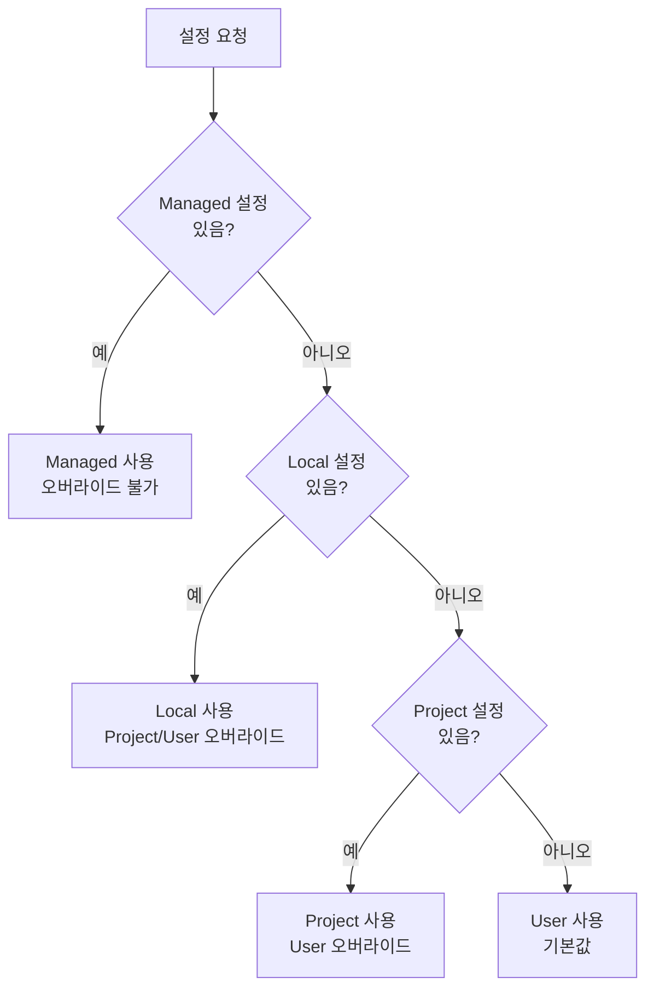
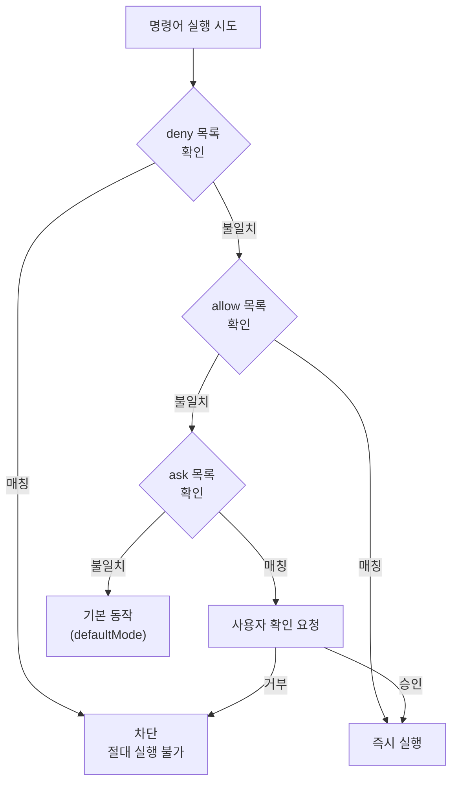

# settings.json 가이드

Claude Code의 설정 파일 체계를 상세히 안내합니다.


**한 줄 요약**: `settings.json`은 Claude Code의 **관제탑**입니다. 권한, 환경 변수, Hook, 보안 정책을 한곳에서 관리합니다.


## 설정 범위 (Configuration Scopes)

Claude Code는 **범위 시스템**을 사용하여 설정이 적용되는 위치와 공유 대상을 결정합니다.

### 4가지 범위 유형

| 범위 | 위치 | 영향 대상 | 팀 공유 | 우선순위 |
|------|------|-----------|---------|----------|
| **Managed** | 시스템 수준 `managed-settings.json` | 머신의 모든 사용자 | ✅ (IT 배포) | 최고 |
| **User** | `~/.claude/` | 사용자 개인 (모든 프로젝트) | ❌ | 낮음 |
| **Project** | `.claude/` | 저장소의 모든 협업자 | ✅ (Git 추적) | 중간 |
| **Local** | `.claude/*.local.*` | 사용자 (이 저장소에서만) | ❌ | 높음 |

### 범위별 우선순위

동일한 설정이 여러 범위에 있는 경우, 더 구체적인 범위가 우선합니다:



**우선순위:** Managed > 명령행 인자 > Local > Project > User

### 각 범위의 사용처

**Managed 범위** - 다음에 사용:
- 조직 전체 적용 보안 정책
- 재정의 불가능한 준수 요구사항
- IT/DevOps에서 배포하는 표준화된 구성

**User 범위** - 다음에 사용:
- 모든 프로젝트에서 원하는 개인 설정 (테마, 에디터 설정)
- 모든 프로젝트에서 사용하는 도구 및 플러그인
- API 키 및 인증 (안전하게 저장)

**Project 범위** - 다음에 사용:
- 팀 공유 설정 (권한, Hook, MCP 서버)
- 팀이 가져야 할 플러그인
- 협업자 간 도구 표준화

**Local 범위** - 다음에 사용:
- 특정 프로젝트의 개인 오버라이드
- 팀과 공유하기 전 설정 테스트
- 다른 사용자에게 작동하지 않는 머신별 설정

## 파일 위치

MoAI-ADK는 4개의 설정 파일 위치를 사용합니다.

| 파일 | 위치 | 용도 | Git 추적 |
|------|------|------|----------|
| `managed-settings.json` | 시스템 수준* | 관리형 설정 (IT 배포) | 아니오 |
| `settings.json` (User) | `~/.claude/settings.json` | 개인 전역 설정 | 아니오 |
| `settings.json` (Project) | `.claude/settings.json` | 팀 공유 설정 | 예 |
| `settings.local.json` | `.claude/settings.local.json` | 개인 프로젝트 설정 | 아니오 |

**시스템 수준 위치:**
- macOS: `/Library/Application Support/ClaudeCode/`
- Linux/WSL: `/etc/claude-code/`
- Windows: `C:\Program Files\ClaudeCode\`


**주의**: `.claude/settings.json`은 MoAI-ADK 업데이트 시 덮어쓰기됩니다. 개인 설정은 반드시 `settings.local.json` 또는 `~/.claude/settings.json`에 작성하세요.


## settings.json이란?

`settings.json`은 Claude Code의 **전역 설정 파일**입니다. 어떤 명령을 자동 허용하고, 어떤 명령을 차단할지, 어떤 Hook을 실행할지, 환경 변수는 무엇으로 설정할지를 정의합니다.

## 전체 구조

```json
{
  "model": "",
  "language": "",
  "attribution": {},
  "companyAnnouncements": [],
  "autoUpdatesChannel": "",
  "spinnerTipsEnabled": true,
  "terminalProgressBarEnabled": true,
  "sandbox": {},
  "hooks": {},
  "permissions": {},
  "enabledPlugins": {},
  "extraKnownMarketplaces": {},
  "enableAllProjectMcpServers": false,
  "enabledMcpjsonServers": [],
  "disabledMcpjsonServers": [],
  "fileSuggestion": {},
  "alwaysThinkingEnabled": false,
  "maxThinkingTokens": 0,
  "statusLine": {},
  "outputStyle": "",
  "cleanupPeriodDays": 30,
  "env": {}
}
```

## 핵심 설정 참조

### model

사용할 기본 모델을 재정의합니다.

```json
{
  "model": "claude-sonnet-4-5-20250929"
}
```

### language

Claude의 기본 응답 언어를 설정합니다.

```json
{
  "language": "korean"
}
```

지원 언어: `"korean"`, `"japanese"`, `"spanish"`, `"french"` 등

### cleanupPeriodDays

이 기간보다 오래된 비활성 세션을 시작 시 삭제합니다. `0`으로 설정하면 모든 세션을 즉시 삭제합니다. (기본값: 30일)

```json
{
  "cleanupPeriodDays": 20
}
```

### autoUpdatesChannel

업데이트를 따를 릴리스 채널입니다.

```json
{
  "autoUpdatesChannel": "stable"
}
```

- `"stable"`: 일주일 정도 된 버전, 주요 회귀 건너뜀
- `"latest"` (기본값): 가장 최신 릴리스

### spinnerTipsEnabled

Claude가 작업하는 동안 스피너에 팁을 표시할지 여부입니다. `false`로 설정하면 팁을 비활성화합니다. (기본값: `true`)

```json
{
  "spinnerTipsEnabled": false
}
```

### terminalProgressBarEnabled

Windows Terminal 및 iTerm2와 같은 지원되는 터미널에서 진행률을 표시하는 터미널 진행률 표시줄을 활성화합니다. (기본값: `true`)

```json
{
  "terminalProgressBarEnabled": false
}
```

### showTurnDuration

응답 후 턴 지속 시간 메시지를 표시합니다 (예: "Cooked for 1m 6s"). `false`로 설정하면 이 메시지를 숨깁니다.

```json
{
  "showTurnDuration": true
}
```

### respectGitignore

`@` 파일 선택기가 `.gitignore` 패턴을 준수할지 여부를 제어합니다. `true`(기본값)이면 `.gitignore` 패턴과 일치하는 파일이 제안에서 제외됩니다.

```json
{
  "respectGitignore": false
}
```

### plansDirectory

플랜 파일을 저장할 위치를 사용자 정의합니다. 경로는 프로젝트 루트에 상대적입니다. 기본값: `~/.claude/plans`

```json
{
  "plansDirectory": "./plans"
}
```

## 권한 설정

Claude Code가 실행할 수 있는 명령어의 권한을 관리합니다.

### 권한 구조

```json
{
  "permissions": {
    "defaultMode": "default",
    "allow": [],
    "ask": [],
    "deny": [],
    "additionalDirectories": [],
    "disableBypassPermissionsMode": "disable"
  }
}
```

### defaultMode

Claude Code를 열 때의 기본 권한 모드입니다.

| 값 | 설명 |
|-----|------|
| `"acceptEdits"` | 파일 편집 자동 허용 |
| `"allowEdits"` | 파일 편집 허용 |
| `"rejectEdits"` | 파일 편집 거부 |
| `"default"` | 기본 동작 |


**참고**: 현재 MoAI-ADK 설정 파일은 `"defaultMode": "default"`를 사용합니다. 이는 레거시 값일 수 있습니다.


### allow (자동 허용)

사용자 확인 없이 **즉시 실행이 허용되는** 명령어 목록입니다.

**기본 허용 명령어 카테고리:**

| 카테고리 | 명령어 예시 | 개수 |
|----------|-------------|------|
| 파일 도구 | `Read`, `Write`, `Edit`, `Glob`, `Grep` | 7개 |
| Git 명령 | `git add`, `git commit`, `git diff`, `git log` 등 | 15개+ |
| 패키지 관리 | `npm`, `pip`, `uv`, `npx` | 4개 |
| 빌드/테스트 | `pytest`, `make`, `node`, `python` | 10개+ |
| 코드 품질 | `ruff`, `black`, `prettier`, `eslint` | 6개+ |
| 탐색 도구 | `ls`, `find`, `tree`, `cat`, `head` | 10개+ |
| GitHub CLI | `gh issue`, `gh pr`, `gh repo view` | 3개 |
| MCP 도구 | `mcp__context7__*`, `mcp__sequential-thinking__*` | 3개 |
| 기타 | `AskUserQuestion`, `Task`, `Skill`, `TodoWrite` | 4개 |

**allow 형식 예시:**

```json
{
  "allow": [
    "Read",                          // 도구 이름만
    "Bash(git add:*)",               // Bash + 명령어 패턴
    "Bash(pytest:*)",                // 와일드카드
    "mcp__context7__resolve-library-id",  // MCP 도구
    "Bash(npm run *)",               // 공백 구분 (새로운 형식)
    "WebFetch(domain:example.com)"   // 도메인 패턴
  ]
}
```

### ask (확인 후 실행)

사용자에게 **확인을 요청한 후 실행**되는 명령어 목록입니다.

```json
{
  "ask": [
    "Bash(chmod:*)",       // 파일 권한 변경
    "Bash(chown:*)",       // 소유권 변경
    "Bash(rm:*)",          // 파일 삭제
    "Bash(sudo:*)",        // 관리자 권한
    "Read(./.env)",        // 환경 변수 파일 읽기
    "Read(./.env.*)"       // 환경 변수 파일 읽기
  ]
}
```

**ask 동작 방식:**
1. Claude Code가 해당 명령 실행을 시도
2. 사용자에게 "이 명령을 실행할까요?" 확인 요청
3. 사용자가 승인하면 실행, 거부하면 중단

### deny (무조건 차단)

어떤 상황에서도 **절대 실행되지 않는** 명령어 목록입니다.

**차단 카테고리:**

| 카테고리 | 차단 패턴 | 이유 |
|----------|-----------|------|
| 민감 파일 접근 | `Read(./secrets/**)`, `Write(~/.ssh/**)` | 보안 자격증명 보호 |
| 클라우드 자격증명 | `Read(~/.aws/**)`, `Read(~/.config/gcloud/**)` | 클라우드 계정 보호 |
| 시스템 파괴 | `Bash(rm -rf /:*)`, `Bash(rm -rf ~:*)` | 시스템 보호 |
| 위험한 Git | `Bash(git push --force:*)`, `Bash(git reset --hard:*)` | 코드 보호 |
| 디스크 포맷 | `Bash(dd:*)`, `Bash(mkfs:*)`, `Bash(fdisk:*)` | 디스크 보호 |
| 시스템 명령 | `Bash(reboot:*)`, `Bash(shutdown:*)` | 시스템 안정성 |
| DB 삭제 | `Bash(DROP DATABASE:*)`, `Bash(TRUNCATE:*)` | 데이터 보호 |

**deny 형식 예시:**

```json
{
  "deny": [
    "Read(./secrets/**)",           // 비밀 디렉토리 읽기 차단
    "Write(~/.ssh/**)",             // SSH 키 수정 차단
    "Bash(git push --force:*)",     // 강제 푸시 차단
    "Bash(rm -rf /:*)",            // 루트 삭제 차단
    "Bash(DROP DATABASE:*)"        // DB 삭제 차단
  ]
}
```

### additionalDirectories

Claude가 접근할 수 있는 추가 작업 디렉토리입니다.

```json
{
  "permissions": {
    "additionalDirectories": [
      "../docs/"
    ]
  }
}
```

### disableBypassPermissionsMode

`bypassPermissions` 모드가 활성화되는 것을 방지합니다. `--dangerously-skip-permissions` 명령행 플래그를 비활성화합니다.

```json
{
  "permissions": {
    "disableBypassPermissionsMode": "disable"
  }
}
```

## 권한 규칙 구문 (Permission Rule Syntax)

권한 규칙은 `Tool` 또는 `Tool(specifier)` 형식을 따릅니다.

### 규칙 평가 순서

여러 규칙이 동일한 도구 사용과 일치할 때, 규칙은 다음 순서로 평가됩니다:

1. **Deny** 규칙이 먼저 확인됨
2. **Ask** 규칙이 두 번째로 확인됨
3. **Allow** 규칙이 마지막으로 확인됨

첫 번째 일치하는 규칙이 동작을 결정합니다. 즉, deny 규칙이 항상 allow 규칙보다 우선합니다.

### 도구의 모든 사용 일치시키기

도구의 모든 사용을 일치시키려면 괄호 없이 도구 이름만 사용하세요:

| 규칙 | 효과 |
|------|------|
| `Bash` | **모든** Bash 명령 일치 |
| `WebFetch` | **모든** 웹 가져오기 요청 일치 |
| `Read` | **모든** 파일 읽기 일치 |

`Bash(*)`는 `Bash`와 동일하며 모든 Bash 명령과 일치합니다. 두 구문을 상호 교환적으로 사용할 수 있습니다.

### 세부 제어를 위한 지정자 사용

괄호 안에 지정자를 추가하여 특정 도구 사용을 일치시킵니다:

| 규칙 | 효과 |
|------|------|
| `Bash(npm run build)` | 정확한 명령 `npm run build`와 일치 |
| `Read(./.env)` | 현재 디렉토리의 `.env` 파일 읽기와 일치 |
| `WebFetch(domain:example.com)` | example.com에 대한 가져오기 요청과 일치 |

### 와일드카드 패턴

Bash 규칙은 `*`와 함께 glob 패턴을 지원합니다. 와일드카드는 명령의 시작, 중간, 끝 등 모든 위치에 나타날 수 있습니다.

```json
{
  "permissions": {
    "allow": [
      "Bash(npm run *)",
      "Bash(git commit *)",
      "Bash(git * main)",
      "Bash(* --version)",
      "Bash(* --help *)"
    ],
    "deny": [
      "Bash(git push *)"
    ]
  }
}
```

**중요:** `*` 앞의 공백이 중요합니다:
- `Bash(ls *)`는 `ls -la`와 일치하지만 `lsof`는 일치하지 않음
- `Bash(ls*)`는 둘 다와 일치

**레거시 구문:** `:*` 접미사 구문 (예: `Bash(npm run:*)`)은 `*`와 동일하지만 사용되지 않습니다.

### 도메인별 패턴

WebFetch와 같은 도구에 대해 도메인별 패턴을 사용할 수 있습니다:

```json
{
  "permissions": {
    "allow": [
      "WebFetch(domain:docs.anthropic.com)",
      "WebFetch(domain:github.com)"
    ],
    "deny": [
      "WebFetch(domain:malicious-site.com)"
    ]
  }
}
```

### 권한 우선순위 다이어그램



**우선순위:** `deny` > `ask` > `allow` > `defaultMode`

## 샌드박스 설정 (Sandbox Settings)

고급 샌드박싱 동작을 구성합니다. 샌드박싱은 파일시스템과 네트워크에서 bash 명령을 격리합니다.


**중요:** 파일시스템 및 네트워크 제한은 Read, Edit, WebFetch 권한 규칙을 통해 구성되며, 샌드박스 설정을 통해서가 아닙니다.


```json
{
  "sandbox": {
    "enabled": true,
    "autoAllowBashIfSandboxed": true,
    "excludedCommands": ["docker"],
    "allowUnsandboxedCommands": false,
    "network": {
      "allowUnixSockets": [
        "/var/run/docker.sock"
      ],
      "allowLocalBinding": true,
      "httpProxyPort": 8080,
      "socksProxyPort": 8081
    },
    "enableWeakerNestedSandbox": false
  }
}
```

### 샌드박스 설정 참조

| 키 | 설명 | 예시 |
|-----|------|------|
| `enabled` | bash 샌드박싱 활성화 (macOS, Linux, WSL2). 기본값: false | `true` |
| `autoAllowBashIfSandboxed` | 샌드박싱된 bash 명령 자동 승인. 기본값: true | `true` |
| `excludedCommands` | 샌드박스 외부에서 실행해야 할 명령어 | `["docker", "git"]` |
| `allowUnsandboxedCommands` | `dangerouslyDisableSandbox` 매개변수를 통해 명령이 샌드박스 외부에서 실행되도록 허용. 기본값: true | `false` |
| `network.allowUnixSockets` | 샌드박스에서 액세스할 수 있는 Unix 소켓 경로 (SSH 에이전트 등) | `["~/.ssh/agent-socket"]` |
| `network.allowLocalBinding` | localhost 포트에 바인딩 허용 (macOS만). 기본값: false | `true` |
| `network.httpProxyPort` | 자체 프록시를 가져오려는 경우 HTTP 프록시 포트 | `8080` |
| `network.socksProxyPort` | 자체 프록시를 가져오려는 경우 SOCKS5 프록시 포트 | `8081` |
| `enableWeakerNestedSandbox` | 권한 없는 Docker 환경을 위한 약한 샌드박스 활성화 (Linux, WSL2만). **보안 감소**. 기본값: false | `true` |

## 귀속 설정 (Attribution Settings)

Claude Code는 git 커밋과 풀 리퀘스트에 귀속을 추가합니다. 이들은 별도로 구성됩니다.

```json
{
  "attribution": {
    "commit": "Custom attribution text\n\nCo-Authored-By: AI <email@example.com>",
    "pr": ""
  }
}
```

### 귀속 설정 참조

| 키 | 설명 |
|-----|------|
| `commit` | git 커밋을 위한 귀속 (트레일러 포함). 빈 문자열은 커밋 귀속 숨김 |
| `pr` | 풀 리퀘스트 설명을 위한 귀속. 빈 문자열은 PR 귀속 숨김 |

### 기본 커밋 귀속

```
🤖 Generated with [Claude Code](https://claude.com/claude-code)

Co-Authored-By: Claude Sonnet 4.5 <noreply@anthropic.com>
```

### 기본 PR 귀속

```
🤖 Generated with [Claude Code](https://claude.com/claude-code)
```

## Hook 설정

Claude Code 이벤트에 반응하는 스크립트를 등록합니다.

```json
{
  "hooks": {
    "SessionStart": [
      {
        "matcher": "",
        "hooks": [
          {
            "type": "command",
            "command": "스크립트 경로"
          }
        ]
      }
    ],
    "PreToolUse": [
      {
        "matcher": "Write|Edit",
        "hooks": [
          {
            "type": "command",
            "command": "보안 가드 스크립트 경로",
            "timeout": 5000
          }
        ]
      }
    ],
    "PostToolUse": [
      {
        "matcher": "Write|Edit",
        "hooks": [
          {
            "type": "command",
            "command": "포맷터 스크립트 경로",
            "timeout": 30000
          },
          {
            "type": "command",
            "command": "린터 스크립트 경로",
            "timeout": 60000
          }
        ]
      }
    ]
  }
}
```

### Hook 이벤트 유형

| 이벤트 | 설명 |
|--------|------|
| `SessionStart` | 세션 시작 시 실행 |
| `SessionEnd` | 세션 종료 시 실행 |
| `PreToolUse` | 도구 사용 전 실행 |
| `PostToolUse` | 도구 사용 후 실행 |
| `PreCompact` | 컨텍스트 압축 전 실행 |


Hook 설정의 자세한 내용은 [Hooks 가이드](/advanced/hooks-guide)를 참고하세요.


## 플러그인 설정 (Plugin Settings)

플러그인 관련 설정입니다.

```json
{
  "enabledPlugins": {
    "formatter@acme-tools": true,
    "deployer@acme-tools": true,
    "analyzer@security-plugins": false
  },
  "extraKnownMarketplaces": {
    "acme-tools": {
      "source": {
        "source": "github",
        "repo": "acme-corp/claude-plugins"
      }
    }
  }
}
```

### enabledPlugins

활성화할 플러그인을 제어합니다. 형식: `"plugin-name@marketplace-name": true/false`

**범위:**
- **User settings** (`~/.claude/settings.json`): 개인 플러그인 선호도
- **Project settings** (`.claude/settings.json`): 팀과 공유하는 프로젝트별 플러그인
- **Local settings** (`.claude/settings.local.json`): 머신별 오버라이드 (커밋되지 않음)

### extraKnownMarketplaces

저장소에서 사용 가능하게 만들 추가 마켓플레이스를 정의합니다. 일반적으로 저장소 수준 설정에서 사용하여 팀 구성원이 필요한 플러그인 소스에 접근할 수 있도록 합니다.

## MCP 설정 (MCP Settings)

MCP (Model Context Protocol) 서버 관련 설정입니다.

```json
{
  "enableAllProjectMcpServers": true,
  "enabledMcpjsonServers": ["memory", "github"],
  "disabledMcpjsonServers": ["filesystem"]
}
```

### MCP 설정 참조

| 키 | 설명 | 예시 |
|-----|------|------|
| `enableAllProjectMcpServers` | 프로젝트 `.mcp.json` 파일에 정의된 모든 MCP 서버 자동 승인 | `true` |
| `enabledMcpjsonServers` | 승인할 특정 MCP 서버 목록 | `["memory", "github"]` |
| `disabledMcpjsonServers` | 거부할 특정 MCP 서버 목록 | `["filesystem"]` |
| `allowedMcpServers` | managed-settings.json에서만 사용. MCP 서버 허용목록 | `[{ "serverName": "github" }]` |
| `deniedMcpServers` | managed-settings.json에서만 사용. MCP 서버 거부목록 (우선 적용) | `[{ "serverName": "filesystem" }]` |

## 파일 제안 설정 (File Suggestion Settings)

`@` 파일 경로 자동완성을 위한 사용자 정의 명령을 구성합니다.

```json
{
  "fileSuggestion": {
    "type": "command",
    "command": "~/.claude/file-suggestion.sh"
  }
}
```

내장된 파일 제안은 빠른 파일시스템 순회를 사용하지만, 큰 모노레포는 프로젝트별 인덱싱(예: 사전 빌드된 파일 인덱스나 사용자 정의 도구)의 이점을 볼 수 있습니다.

## 확장 사고 설정 (Extended Thinking Settings)

확장 사고(Extended Thinking) 관련 설정입니다.

```json
{
  "alwaysThinkingEnabled": true,
  "maxThinkingTokens": 10000
}
```

### 확장 사고 설정 참조

| 키 | 설명 | 예시 |
|-----|------|------|
| `alwaysThinkingEnabled` | 모든 세션에서 기본적으로 확장 사고 활성화 | `true` |
| `maxThinkingTokens` | 사고 토큰 예산 재정의 (기본값: 31999, 0 = 비활성화) | `10000` |

환경 변수를 통해서도 설정 가능합니다:
- `MAX_THINKING_TOKENS=10000`: 사고 토큰 제한
- `MAX_THINKING_TOKENS=0`: 사고 비활성화

## 회사 공지사항 (Company Announcements)

시작 시 사용자에게 표시할 공지사항입니다. 여러 공지사항을 제공하면 무작위로 순환됩니다.

```json
{
  "companyAnnouncements": [
    "Welcome to Acme Corp! Review our code guidelines at docs.acme.com",
    "Reminder: Code reviews required for all PRs",
    "New security policy in effect"
  ]
}
```

## 상태 표시줄 설정

Claude Code 하단에 표시되는 상태 표시줄을 설정합니다.

```json
{
  "statusLine": {
    "type": "command",
    "command": "${SHELL:-/bin/bash} -l -c 'uv run --no-sync moai-adk statusline'",
    "padding": 0,
    "refreshInterval": 300
  }
}
```

| 필드 | 설명 |
|------|------|
| `type` | `"command"` (명령어 실행) |
| `command` | 실행할 명령어 (상태 정보 반환) |
| `padding` | 패딩 크기 |
| `refreshInterval` | 갱신 주기 (밀리초) |

## 출력 스타일 설정

```json
{
  "outputStyle": "R2-D2"
}
```

출력 스타일은 Claude Code의 응답 형식을 결정합니다. `settings.local.json`에서 개인 선호 스타일로 변경할 수 있습니다.

## 환경 변수 설정

`env` 섹션에서 Claude Code의 동작을 제어하는 환경 변수를 설정합니다.

### MoAI-ADK 환경 변수


**MoAI-ADK 확장**: 이 설정은 MoAI-ADK에 특정하며 공식 Claude Code의 일부가 아닙니다.


```json
{
  "env": {
    "MOAI_CONFIG_SOURCE": "sections"
  }
}
```

| 변수 | 값 | 설명 |
|------|-----|------|
| `MOAI_CONFIG_SOURCE` | `"sections"` | MoAI 설정 소스 방식 |

### 공식 Claude Code 환경 변수

```json
{
  "env": {
    "ENABLE_TOOL_SEARCH": "auto:5",
    "MAX_THINKING_TOKENS": "31999",
    "CLAUDE_CODE_FILE_READ_MAX_OUTPUT_TOKENS": "64000",
    "CLAUDE_CODE_MAX_OUTPUT_TOKENS": "32000",
    "CLAUDE_AUTOCOMPACT_PCT_OVERRIDE": "50"
  }
}
```

### 주요 환경 변수 참조

| 변수 | 값 | 설명 |
|------|-----|------|
| `ENABLE_TOOL_SEARCH` | `"auto"`, `"auto:N"`, `"true"`, `"false"` | MCP 도구 검색 제어 |
| `MAX_THINKING_TOKENS` | `0`-`31999` | 사고 토큰 제한 (0=비활성화) |
| `CLAUDE_CODE_MAX_OUTPUT_TOKENS` | `1`-`64000` | 최대 출력 토큰 (기본값: 32000) |
| `CLAUDE_CODE_FILE_READ_MAX_OUTPUT_TOKENS` | 숫자 | 파일 읽기 최대 출력 토큰 |
| `CLAUDE_AUTOCOMPACT_PCT_OVERRIDE` | `1`-`100` | 자동 압축 트리거 백분율 (기본값: ~95%) |
| `CLAUDE_CODE_ENABLE_TELEMETRY` | `"1"` | OpenTelemetry 데이터 수집 활성화 |
| `CLAUDE_CODE_DISABLE_BACKGROUND_TASKS` | `"1"` | 백그라운드 작업 비활성화 |
| `DISABLE_AUTOUPDATER` | `"1"` | 자동 업�데이트 비활성화 |
| `HTTP_PROXY` | URL | HTTP 프록시 서버 |
| `HTTPS_PROXY` | URL | HTTPS 프록시 서버 |


**팁**: `ENABLE_TOOL_SEARCH` 값 `"auto:5"`는 컨텍스트 사용량이 5%일 때 도구 검색을 활성화합니다. `"auto"`는 기본 10%, `"true"`는 항상 켜기, `"false"`는 항상 끕니다.


### 도구 검색 상세

`ENABLE_TOOL_SEARCH`는 MCP 도구 검색을 제어합니다:

| 값 | 설명 |
|-----|------|
| `"auto"` (기본값) | 10% 컨텍스트에서 활성화 |
| `"auto:N"` | 사용자 지정 임계값 (예: `"auto:5"`는 5%) |
| `"true"` | 항상 활성화 |
| `"false"` | 비활성화 |

## settings.json vs settings.local.json

| 항목 | settings.json | settings.local.json |
|------|---------------|---------------------|
| 관리 주체 | MoAI-ADK | 사용자 |
| Git 추적 | 추적됨 | .gitignore |
| 업데이트 시 | 덮어쓰기 | 보존 |
| 용도 | 팀 공유 설정 | 개인 설정 |
| 우선순위 | 기본값 | 오버라이드 (우선) |

### settings.local.json 활용 예시

```json
{
  "permissions": {
    "allow": [
      "Bash(bun:*)",     // 개인적으로 사용하는 도구
      "Bash(bun add:*)"
    ]
  },
  "enabledMcpjsonServers": [
    "context7"          // 개인적으로 활성화하는 MCP 서버
  ],
  "outputStyle": "Mr.Alfred"  // 개인 선호 출력 스타일
}
```


`settings.local.json`의 설정은 `settings.json`의 설정에 **병합**됩니다. 동일한 키가 있으면 `settings.local.json`이 우선합니다.


## MoAI 전용 설정


**MoAI-ADK 확장**: 이 섹션의 설정은 MoAI-ADK에 특정하며 공식 Claude Code 문서에 포함되지 않습니다.


### MoAI 사용자 정의 statusLine

MoAI-ADK는 사용자 정의 상태 표시줄을 제공합니다:

```json
{
  "statusLine": {
    "type": "command",
    "command": "${SHELL:-/bin/bash} -l -c 'uv run --no-sync moai-adk statusline'",
    "padding": 0,
    "refreshInterval": 300
  }
}
```

### MoAI Statusline v3 기능

MoAI-ADK statusline v3에는 다음이 포함됩니다:

- **RGB 그라디언트 색상**: 시스템 상태에 따른 동적 색상 그라디언트
- **5H/7D 사용량 모니터링**: 5시간 및 7일 API 사용량 바 표시
- **다중 라인 레이아웃**: Compact (3줄), default, full 디스플레이 모드
- **테마**:
  - **MoAI Dark** (기본값): RGB 그라디언트가 있는 다크 테마
  - **MoAI Light**: 밝은 환경을 위한 라이트 테마


**참고**: 이전 테마(Default, Catppuccin Mocha, Catppuccin Latte)는 MoAI Dark/MoAI Light로 이름이 변경되었습니다.


statusline 테마와 세그먼트는 `.moai/config/sections/statusline.yaml`에서 설정합니다.
### MoAI 사용자 정의 Hooks

MoAI-ADK는 다음 사용자 정의 Hook을 제공합니다:

```json
{
  "hooks": {
    "SessionStart": [
      {
        "matcher": "",
        "hooks": [
          {
            "type": "command",
            "command": "/bin/zsh -l -c 'uv run \"$CLAUDE_PROJECT_DIR/.claude/hooks/moai/session_start__show_project_info.py\"'"
          }
        ]
      }
    ],
    "PreCompact": [
      {
        "matcher": "",
        "hooks": [
          {
            "type": "command",
            "command": "/bin/zsh -l -c 'uv run \"$CLAUDE_PROJECT_DIR/.claude/hooks/moai/pre_compact__save_context.py\"'",
            "timeout": 5000
          }
        ]
      }
    ],
    "SessionEnd": [
      {
        "matcher": "",
        "hooks": [
          {
            "type": "command",
            "command": "/bin/zsh -l -c 'uv run \"$CLAUDE_PROJECT_DIR/.claude/hooks/moai/session_end__auto_cleanup.py\" &'"
          }
        ]
      }
    ],
    "PreToolUse": [
      {
        "matcher": "Write|Edit",
        "hooks": [
          {
            "type": "command",
            "command": "/bin/zsh -l -c 'uv run \"$CLAUDE_PROJECT_DIR/.claude/hooks/moai/pre_tool__security_guard.py\"'",
            "timeout": 5000
          }
        ]
      }
    ],
    "PostToolUse": [
      {
        "matcher": "Write|Edit",
        "hooks": [
          {
            "type": "command",
            "command": "/bin/zsh -l -c 'uv run \"$CLAUDE_PROJECT_DIR/.claude/hooks/moai/post_tool__code_formatter.py\"'",
            "timeout": 30000
          },
          {
            "type": "command",
            "command": "/bin/zsh -l -c 'uv run \"$CLAUDE_PROJECT_DIR/.claude/hooks/moai/post_tool__linter.py\"'",
            "timeout": 60000
          },
          {
            "type": "command",
            "command": "/bin/zsh -l -c 'uv run \"$CLAUDE_PROJECT_DIR/.claude/hooks/moai/post_tool__ast_grep_scan.py\"'",
            "timeout": 30000
          }
        ]
      }
    ]
  }
}
```

### MoAI 출력 스타일

```json
{
  "outputStyle": "Mr.Alfred"
}
```

이 스타일은 Alfred AI 오케스트레이터의 고유한 응답 형식을 제공합니다.

## 실전 예시: 설정 커스터마이징

### 새 도구 허용 추가

프로젝트에서 `bun`을 사용한다면, `settings.local.json`에 추가합니다.

```json
{
  "permissions": {
    "allow": [
      "Bash(bun:*)",
      "Bash(bun add:*)",
      "Bash(bun remove:*)",
      "Bash(bun run:*)"
    ]
  }
}
```

### MCP 서버 활성화

Context7 MCP 서버를 활성화합니다.

```json
{
  "enabledMcpjsonServers": [
    "context7"
  ]
}
```

### 샌드박스 활성화

보안을 위해 샌드박스를 활성화하고 Docker를 제외합니다.

```json
{
  "sandbox": {
    "enabled": true,
    "autoAllowBashIfSandboxed": true,
    "excludedCommands": ["docker"],
    "network": {
      "allowUnixSockets": [
        "/var/run/docker.sock"
      ]
    }
  },
  "permissions": {
    "deny": [
      "Read(.envrc)",
      "Read(~/.aws/**)"
    ]
  }
}
```

### 커스텀 Hook 추가

개인 Hook을 등록합니다.

```json
{
  "hooks": {
    "PostToolUse": [
      {
        "matcher": "Write|Edit",
        "hooks": [
          {
            "type": "command",
            "command": "python3 .claude/hooks/my-hooks/custom_check.py",
            "timeout": 10000
          }
        ]
      }
    ]
  }
}
```

### 귀속 설정 사용자 정의

```json
{
  "attribution": {
    "commit": "Generated with AI\n\nCo-Authored-By: AI <email@example.com>",
    "pr": ""
  }
}
```

## v2.9.0 신규 설정 파일

### Harness 설정 (harness.yaml)

품질 파이프라인 깊이 수준과 자동 감지 임계값을 정의합니다.

**3단계 깊이 수준:**

| 레벨 | 설명 | evaluator | 건너뛰는 Phase |
|------|------|-----------|---------------|
| minimal | 빠른 반복 (간단한 변경) | 비활성 | 0, 0.5, 2.0, 2.5, 2.75, 2.8a, 2.9, 2.10 |
| standard | 균형 잡힌 품질 (대부분 개발) | final-pass | 없음 |
| thorough | 최대 품질 (중요한 기능) | per-sprint | 없음 |

```yaml
# .moai/config/sections/harness.yaml
harness:
  default_level: standard
  auto_detection:
    minimal:
      - "file_count <= 3 AND single_domain"
      - "spec_type in [bugfix, docs, config]"
    thorough:
      - "security_keywords OR payment_keywords present"
      - "spec_priority == critical"
  levels:
    thorough:
      evaluator_profile: "strict"
```

### Constitution 설정 (constitution.yaml)

프로젝트 기술 제약을 기계 판독 가능하게 정의합니다.

```yaml
# .moai/config/sections/constitution.yaml
constitution:
  approved_languages: [go, typescript, python]
  approved_frameworks: [cobra, viper, gin, react, next]
  forbidden_patterns:
    - "global mutable state"
    - "panic() in library code"
  security:
    required_checks: [input-validation, sql-injection-prevention]
    forbidden_practices: ["hardcoded credentials", "HTTP without TLS"]
```

### Evaluator Profiles (evaluator-profiles/)

4종 평가자 프로필이 제공됩니다.

| 프로필 | 설명 | Coverage | Security |
|--------|------|----------|----------|
| default | 표준 회의적 평가 | >= 85% | No Critical/High |
| strict | 강화된 보안/신뢰성 (인증/결제) | >= 90% | ANY finding = FAIL |
| lenient | 완화된 평가 (프로토타입) | >= 60% | Critical only = FAIL |
| frontend | UI/UX 집중 | N/A | WCAG AA required |

프로필 파일 위치: `.moai/config/evaluator-profiles/{name}.md`

## 관련 문서

- [Claude Code 공식 설정 문서](https://code.claude.com/docs/en/settings) - 공식 Claude Code 설정
- [Hooks 가이드](/advanced/hooks-guide) - Hook 설정 상세
- [CLAUDE.md 가이드](/advanced/claude-md-guide) - 프로젝트 지침 설정
- [MCP 서버 활용](/advanced/mcp-servers) - MCP 서버 설정 방법
- [IAM 문서](https://code.claude.com/docs/en/iam) - 권한 시스템 개요


**팁**: 설정을 변경한 후에는 Claude Code를 재시작해야 적용됩니다. `settings.local.json`은 Git에 추적되지 않으므로 개인 환경에 맞게 자유롭게 수정하세요.

