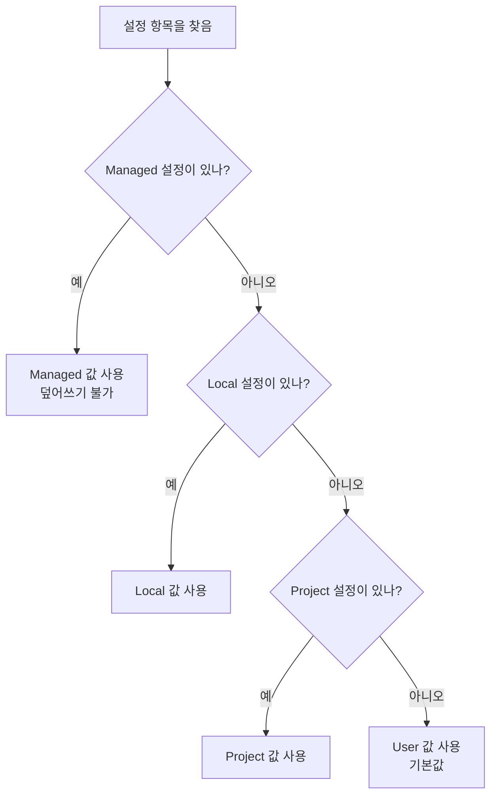
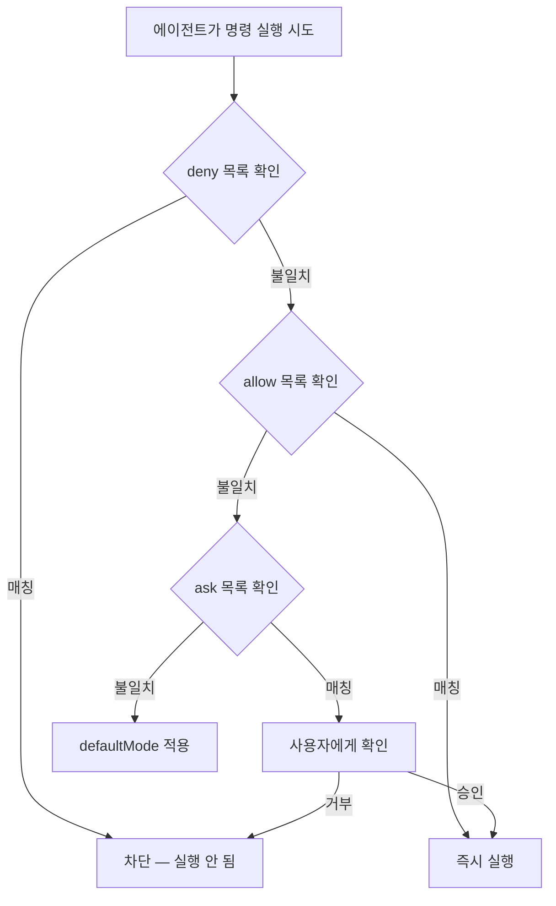

MoAI-ADK는 에이전트(스스로 일하는 AI 도구)에게 파일 편집, 명령어 실행, git 작업까지 맡깁니다. 그 위임에 **경계선을 그어 주는 파일**이 바로 `settings.json`입니다. 무엇은 묻지 않고 허락할지, 무엇은 한 번 더 확인받을지, 무엇은 아예 막을지를 이 파일 한 장에 적어 둡니다. 능력은 좋지만 어디까지 허락된 일인지 모르는 조수에게 열쇠를 건네면서 "냉장고는 마음대로 쓰고 안방은 들어가지 마"라는 **집 규칙**을 적은 메모를 함께 건넨다고 생각하면 됩니다.

이 문서는 그 집 규칙이 어디에 적히고, 어떤 순서로 읽히고, 어떻게 안전하게 고치는지를 처음부터 짚어 줍니다. 하네스(품질 검증과 권한 관리를 자동으로 챙기는 장치)가 에이전트에게 무엇을 허락할지 결정할 때 참고하는 파일이기도 합니다.


**한 줄 요약**: `settings.json`은 Claude Code의 **관제탑**입니다. 권한, 환경 변수, 훅(특정 이벤트에 반응해 자동으로 실행되는 갈고리), 보안 정책을 한곳에서 관리합니다.


## Step 1: settings.json이 하는 일 이해하기

`settings.json`은 Claude Code가 켜질 때 읽는 **전역 설정 파일**입니다. 이 파일이 정하는 것은 크게 다섯 가지입니다.

| 구분            | 정하는 것                                            | 예시                                                  |
| --------------- | ---------------------------------------------------- | ----------------------------------------------------- |
| **권한**        | 어떤 명령을 자동 허용 / 확인 / 차단할지              | `Bash(git commit:*)` 자동 허용, `Bash(rm:*)` 확인 요청 |
| **훅**          | 어떤 이벤트에 어떤 스크립트를 묶을지                 | 파일 저장 후 포매터 실행                              |
| **환경 변수**   | Claude Code 동작을 조절하는 env 값                   | `ENABLE_TOOL_SEARCH=1`                                |
| **표시**        | 상태 표시줄, 출력 스타일, 모델, 언어                 | `outputStyle: MoAI-Easy`                              |
| **보안 정책**   | 샌드박스, 민감 파일 접근 차단, 우회 모드 금지        | `~/.aws/**` 읽기 차단                                 |

### 설정이 적용되는 네 겹의 범위

Claude Code는 설정을 **네 겹의 범위(scope)** 로 나눠 읽습니다. 같은 항목이 여러 겹에 있으면 더 구체적인 쪽이 이깁니다.

| 범위         | 위치                          | 누구에게 적용되는가        | Git 추적 | 우선순위 |
| ------------ | ----------------------------- | -------------------------- | -------- | -------- |
| **Managed**  | 시스템 수준 (IT 배포)         | 머신의 모든 사용자         | 아니오   | 가장 높음 |
| **User**     | `~/.claude/settings.json`     | 한 사용자의 모든 프로젝트  | 아니오   | 낮음     |
| **Project**  | `.claude/settings.json`       | 이 저장소의 모든 협업자    | 예       | 중간     |
| **Local**    | `.claude/settings.local.json` | 나만 (이 저장소에서만)     | 아니오   | Project보다 높음 |

MoAI-ADK는 Project 범위의 `.claude/settings.json`을 템플릿으로 배포하고, 여러분의 개인 취향은 Local 범위인 `settings.local.json`에 적도록 설계돼 있습니다. 이 분리가 왜 중요한지는 Step 3에서 다룹니다.


```mermaid
flowchart TD
    A["설정 항목을 찾음"] --> B{"Managed 설정이 있나?"}
    B -->|예| C["Managed 값 사용<br/>덮어쓰기 불가"]
    B -->|아니오| D{"Local 설정이 있나?"}
    D -->|예| E["Local 값 사용"]
    D -->|아니오| F{"Project 설정이 있나?"}
    F -->|예| G["Project 값 사용"]
    F -->|아니오| H["User 값 사용<br/>기본값"]
```

우선순위를 한 줄로 정리하면 **Managed > 명령행 인자 > Local > Project > User**입니다. Managed 겹은 IT 부서가 조직 전체 정책으로 덮어둔 값이라, 아래 겹에서 아무리 바꿔도 무시됩니다.

## Step 2: 권한의 세 상자 — allow / ask / deny

권한 설계의 목표는 단순합니다. 안전한 명령은 확인 없이 흘려 보내 에이전트의 작업 흐름을 끊지 않고, 위험한 명령은 어떤 상황에서도 통과시키지 않는 것입니다. 이를 위해 `permissions` 블록은 세 개의 상자를 들고 있습니다.

```json
{
  "permissions": {
    "defaultMode": "acceptEdits",
    "allow": [],
    "ask": [],
    "deny": [],
    "additionalDirectories": []
  }
}
```

### defaultMode — 기본 태도

네 가지 값이 있습니다. Claude Code를 열 때의 **기본 태도**를 정합니다.

| 값                    | 의미                                                       |
| --------------------- | ---------------------------------------------------------- |
| `"default"`           | 매 작업마다 사용자에게 확인                                |
| `"acceptEdits"`       | 파일 편집은 자동 허용, 그 외 명령은 확인 (MoAI 기본값)     |
| `"plan"`              | 읽기 전용 — 파일 수정 자체를 안 함                         |
| `"bypassPermissions"` | 모든 권한 자동 허용 (위험, 설정에서 끌 수 있음)            |

MoAI-ADK 템플릿은 `"acceptEdits"`를 기본으로 깔아 줍니다. 파일 편집 창을 줄이면서도 위험한 셸 명령은 그대로 확인받는 절충 지점입니다.

### 세 상자의 의미

- **`allow`** — 사용자 확인 없이 **즉시 실행**되는 명령. 안전하고 자주 쓰는 명령을 여기 넣습니다.
- **`ask`** — 실행 전 **사용자에게 한 번 더 확인**하는 명령. `chmod`, `rm`, `sudo` 같은 명령을 여기 둡니다.
- **`deny`** — 어떤 상황에서도 **실행되지 않는** 명령. 민감 파일 접근과 파괴적 명령을 막습니다.

세 상자를 평가하는 순서는 정해져 있습니다. 에이전트가 명령을 시도하면 먼저 `deny`를 보고, 다음 `allow`, 그 다음 `ask`를 봅니다. 첫 번째로 걸리는 상자가 결정을 내립니다. 그래서 `deny`에 들어간 명령은 `allow`에도 들어 있어도 무조건 막힙니다.


```mermaid
flowchart TD
    A["에이전트가 명령 실행 시도"] --> B{"deny 목록 확인"}
    B -->|매칭| C["차단 — 실행 안 됨"]
    B -->|불일치| D{"allow 목록 확인"}
    D -->|매칭| E["즉시 실행"]
    D -->|불일치| F{"ask 목록 확인"}
    F -->|매칭| G["사용자에게 확인"]
    F -->|불일치| H["defaultMode 적용"]
    G -->|승인| E
    G -->|거부| C
```

### 규칙 적는 법

규칙은 `Tool` 또는 `Tool(지정자)` 형태로 적습니다.

```json
{
  "permissions": {
    "allow": [
      "Read",                       // 도구 이름만 → 모든 Read 허용
      "Bash(git commit *)",         // 패턴 매칭
      "Bash(npm run build)",        // 정확한 명령
      "WebFetch(domain:github.com)" // 도메인 제한
    ],
    "ask": [
      "Bash(rm:*)",                 // 파일 삭제는 확인
      "Read(./.env)"                // 환경 변수 파일 읽기도 확인
    ],
    "deny": [
      "Read(~/.aws/**)",            // 클라우드 자격증명 보호
      "Write(~/.ssh/**)",           // SSH 키 수정 금지
      "Bash(git push --force:*)"    // 강제 푸시 금지
    ]
  }
}
```

Bash 규칙에서 `*`는 와일드카드입니다. `Bash(npm run *)`는 `npm run build`, `npm run test` 모두에 매칭됩니다. 주의할 점은 `*` **앞의 공백**입니다. `Bash(ls *)`는 `ls -la`에는 매칭되지만 `lsof`에는 매칭되지 않습니다. 반면 `Bash(ls*)`는 둘 다 매칭됩니다. 의도를 정확히 적으려면 공백을 신경 써야 합니다.

## Step 3: settings.json과 settings.local.json 나누기

이 단계가 실무에서 가장 자주 부딪히는 함정입니다. MoAI-ADK는 `moai update`로 템플릿을 덮어쓸 때 Project 범위의 `.claude/settings.json`을 **새 버전으로 교체**합니다. 여기에 개인 설정을 적어 두면 업데이트 한 번에 날아갑니다.

### 왜 두 파일로 나누는가

| 항목        | `.claude/settings.json`        | `.claude/settings.local.json`        |
| ----------- | ------------------------------ | ------------------------------------ |
| 관리 주체   | MoAI-ADK (템플릿)              | 사용자                               |
| Git 추적    | 추적됨 (팀과 공유)             | `.gitignore`로 무시됨                |
| 업데이트 시 | 덮어쓰기                       | 보존됨                               |
| 용도        | 팀 공통 설정                   | 개인 설정                            |
| 병합 순서   | 기본값                         | 위에 얹어져 우선 (오버라이드)        |

`settings.local.json`에 적은 값은 `settings.json` 위에 **병합**됩니다. 같은 키가 겹치면 `settings.local.json` 쪽이 이깁니다. 그래서 "팀 전체에 필요한 규칙"은 Git에 남는 `settings.json`에, "내 머신에서만 쓰는 도구"는 `settings.local.json`에 적는 것이 규칙입니다.


**주의**: `.claude/settings.json`은 `moai update`로 덮어쓰기됩니다. 개인 설정은 반드시 `settings.local.json` 또는 `~/.claude/settings.json`에 작성하세요.


### settings.local.json의 권한 강화 (0o600)

`settings.local.json`에는 API 키나 인증 토큰 같은 민감 값이 자주 들어갑니다. v3.0.0부터 이 파일은 만들거나 갱신할 때 **`0o600`**(소유자만 읽고 쓰기) 권한으로 강제됩니다. 예전 `0o644` 권한에서는 여러 사용자가 쓰는 컴퓨터에서 다른 로컬 계정이 이 값을 엿볼 수 있었습니다 (CWE-732).

내 파일이 안전한 권한인지 직접 확인해 봅니다.

```bash
# macOS
stat -f '%A' .claude/settings.local.json
# 기대값: 600

# Linux / WSL
stat -c '%a' .claude/settings.local.json
# 기대값: 600
```

출력이 `600`이 아니면 다음 명령으로 바로잡습니다. 다음 세션 시작 때 MoAI-ADK가 알아서 고치지만, 지금 당장 고치고 싶을 때 씁니다.

```bash
chmod 0600 .claude/settings.local.json
```

파일이 정말 Git에 안 남는지도 확인합니다. 아래 명령이 경로를 출력하면 무시되고 있다는 뜻입니다.

```bash
git check-ignore .claude/settings.local.json
# 출력: .claude/settings.local.json  → 무시됨(정상)
```

## Step 4: 직접 커스터마이징하기

앞의 세 단계를 알았으니, 이제 `settings.local.json`에 내 취향을 반영해 봅니다.

### 새 도구 허용 목록에 넣기

프로젝트에서 `bun`을 쓴다면 매번 확인받지 않도록 `allow`에 넣습니다.

```json
{
  "permissions": {
    "allow": [
      "Bash(bun:*)",
      "Bash(bun add:*)",
      "Bash(bun remove:*)",
      "Bash(bun run:*)"
    ]
  }
}
```

### 기본 모드 바꾸기

파일 편집조차 매번 확인받고 싶다면 `defaultMode`를 `"default"`로, 읽기만 하게 두려면 `"plan"`으로 바꿉니다.

```json
{
  "permissions": {
    "defaultMode": "plan"
  }
}
```

### MoAI가 깔아 주는 기본값 들여다보기

MoAI-ADK 템플릿이 `settings.json`에 미리 넣어 두는 값에는 이런 것들이 있습니다. 여러분이 바꿀 필요가 없다면 그대로 두면 됩니다.

```json
{
  "statusLine": {
    "type": "command",
    "command": "bash \"$CLAUDE_PROJECT_DIR/.moai/status_line.sh\""
  },
  "outputStyle": "MoAI-Easy",
  "env": {
    "ENABLE_TOOL_SEARCH": "1"
  }
}
```

- **statusLine** — MoAI의 상태 표시줄(컨텍스트 사용량, 세션 정보 등)을 그리는 `.moai/status_line.sh`를 실행합니다.
- **outputStyle** — `MoAI-Easy`는 친근하고 간결한 응답 형식을 쓰라는 뜻입니다.
- **ENABLE_TOOL_SEARCH** — `"1"`이면 세션 시작 시 전체 도구 스키마를 한꺼번에 로드하지 않고 필요할 때 검색해 로드합니다. 컨텍스트를 크게 아껴 줍니다.

### 훅은 settings.json에, 내용은 hooks-guide로

훅(특정 이벤트에 반응해 자동으로 실행되는 갈고리)은 `.claude/settings.json`의 `hooks` 블록에 묶입니다. MoAI-ADK의 훅은 얇은 셸 스크립트가 `moai hook <event>` 서브커맨드를 호출하는 구조입니다. 예를 들어 SPEC(요구사항 명세서) 파일의 상태가 바뀔 때 감사 로그를 남기는 훅이 이 방식으로 동작합니다.

```json
{
  "hooks": {
    "PostToolUse": [
      {
        "matcher": "Write|Edit",
        "hooks": [
          {
            "type": "command",
            "command": "bash \"$CLAUDE_PROJECT_DIR/.claude/hooks/moai/handle-post-tool.sh\"",
            "timeout": 10
          }
        ]
      }
    ]
  }
}
```

훅 `timeout`의 단위는 **초**입니다 (밀리초가 아닙니다). 훅을 더 추가하고 싶거나 각 이벤트(`SessionStart`, `PreToolUse`, `Stop` 등)의 의미가 궁금하다면 [훅 가이드](/ko/advanced/hooks-guide)에서 이어서 다룹니다.

### 샌드박스와 환경 변수

샌드박스(OS 수준에서 bash 명령을 격리하는 물리적 방어선)와 추가 환경 변수(`CLAUDE_AUTOCOMPACT_PCT_OVERRIDE`, `HTTP_PROXY` 등)는 자리가 한정돼 이 문서에서 깊이 다루지 않습니다. 권한 규칙이 논리적 방어선이라면 샌드박스는 그 뒤를 받치는 물리적 방어선입니다. 두 영역 모두 [CLAUDE.md 가이드](/ko/advanced/claude-md-guide)와 보안 노트에서 다룹니다.


**팁**: 설정을 바꾼 뒤에는 Claude Code를 다시 시작해야 반영됩니다. `settings.local.json`은 Git에 추적되지 않으므로 내 환경에 맞게 자유롭게 고쳐 쓰세요.


## 관련 문서

- [훅 가이드](/ko/advanced/hooks-guide) — 훅 설정과 이벤트 유형 상세
- [CLAUDE.md 가이드](/ko/advanced/claude-md-guide) — 프로젝트 지침 설정
- [보안 노트](/ko/advanced/security-notes) — CWE-732 권한 강화와 위협 분석
- [Claude Code 공식 설정 문서](https://code.claude.com/docs/en/settings) — 공식 Claude Code 설정 참조
