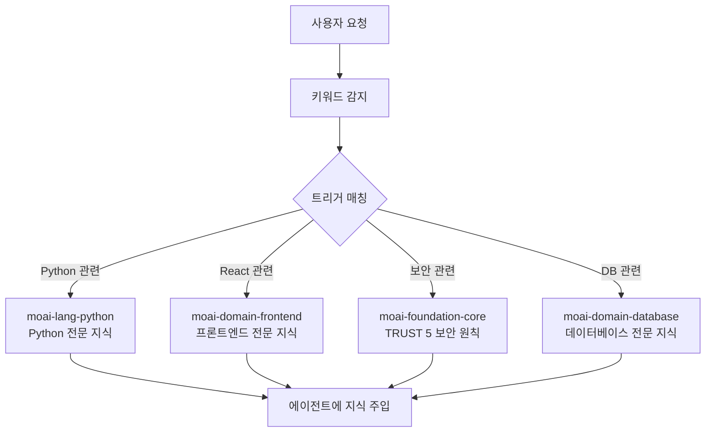
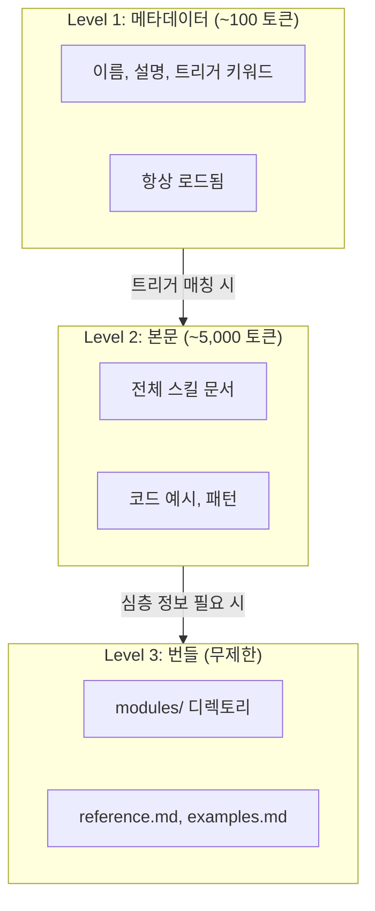
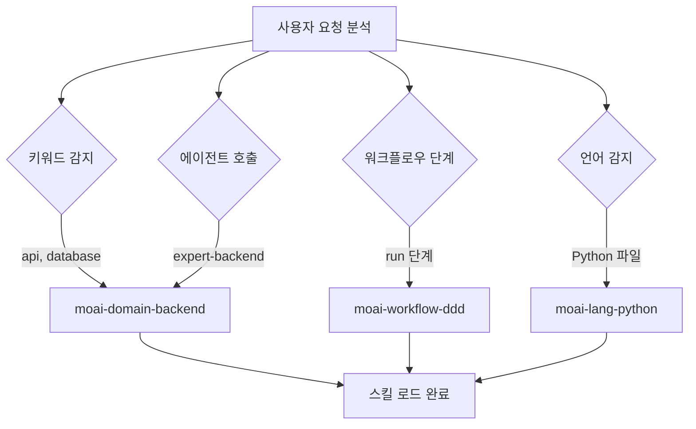
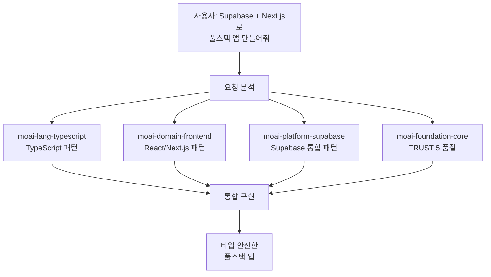

MoAI-ADK의 스킬 시스템을 상세히 안내합니다.



**스킬이란?**

1999년 영화 **메트릭스**의 헬기 조종 장면을 기억하시나요? 네오가 트리티니에게
헬기 조종을 할 줄 아느냐고 묻자, 본부에 전화해 헬기 모델을 알리고 사용 설명서를
전송해달라고 하는 씬이 있습니다.

<p align="center">
  <iframe
    width="720"
    height="360"
    src="https://www.youtube.com/embed/9Luu4itC-Zs"
    title="메트릭스 헬기 조종 장면"
    frameBorder="0"
    allow="accelerometer; autoplay; clipboard-write; encrypted-media; gyroscope; picture-in-picture"
    allowFullScreen
  ></iframe>
</p>

**Claude Code의 스킬** **(이 바로 그 **사용 설명서**입니다. 필요한 순간에
필요한 지식만 로드하여 AI가 즉시 전문가처럼 행동할 수 있게 합니다.



## 스킬이란?

스킬은 Claude Code에게 특정 분야의 전문 지식을 제공하는 **지식 모듈**입니다.

학교에 비유하면, Claude Code가 학생이고 스킬은 교과서입니다. 수학 시간에는 수학
교과서를, 과학 시간에는 과학 교과서를 펴는 것처럼, Claude Code도 Python 코드를
작성할 때는 Python 스킬을, React UI를 만들 때는 Frontend 스킬을 로드합니다.



**스킬이 없는 경우**: Claude Code는 일반적인 지식으로만 응답합니다. **스킬이
있는 경우**: MoAI-ADK의 규칙, 패턴, 모범 사례를 적용하여 응답합니다.

## 스킬 카테고리

MoAI-ADK에는 총 **52개 스킬**이 9개 카테고리로 분류되어 있습니다.

### Foundation (핵심 철학) - 5개

| 스킬 이름                     | 설명                                             |
| ----------------------------- | ------------------------------------------------ |
| `moai-foundation-core`        | SPEC 기반 TDD/DDD, TRUST 5 프레임워크, 실행 규칙    |
| `moai-foundation-claude`      | Claude Code 확장 패턴 (Skills, Agents, Hooks 등) |
| `moai-foundation-philosopher` | 전략적 사고 프레임워크, 의사결정 분석            |
| `moai-foundation-quality`     | 코드 품질 자동 검증, TRUST 5 밸리데이션          |
| `moai-foundation-context`     | 토큰 예산 관리, 세션 상태 유지                   |

### Workflow (자동화 워크플로우) - 11개

| 스킬 이름                 | 설명                                     |
| ------------------------- | ---------------------------------------- |
| `moai-workflow-spec`      | SPEC 문서 생성, EARS 형식, 요구사항 분석 |
| `moai-workflow-project`   | 프로젝트 초기화, 문서 생성, 언어 설정    |
| `moai-workflow-ddd`       | ANALYZE-PRESERVE-IMPROVE 사이클          |
| `moai-workflow-tdd`       | RED-GREEN-REFACTOR 테스트 주도 개발        |
| `moai-workflow-testing`   | 테스트 생성, 디버깅, 코드 리뷰 통합      |
| `moai-workflow-worktree`  | Git worktree 기반 병렬 개발              |
| `moai-workflow-thinking`  | Sequential Thinking, UltraThink 모드     |
| `moai-workflow-loop`      | Ralph Engine 자율 루프, LSP 연동         |
| `moai-workflow-jit-docs`  | 필요 시점 문서 로딩, 지능형 검색         |
| `moai-workflow-templates` | 코드 보일러플레이트, 프로젝트 템플릿     |
| `moai-docs-generation`     | 기술 문서, API 문서, 사용 가이드 생성       |

### Domain (도메인 전문성) - 4개

| 스킬 이름              | 설명                                             |
| ---------------------- | ------------------------------------------------ |
| `moai-domain-backend`  | API 설계, 마이크로서비스, 데이터베이스 통합      |
| `moai-domain-frontend` | React 19, Next.js 16, Vue 3.5, 컴포넌트 아키텍처 |
| `moai-domain-database` | PostgreSQL, MongoDB, Redis, 고급 데이터 패턴     |
| `moai-domain-uiux`     | 디자인 시스템, 접근성, 테마 통합                 |

### Language (프로그래밍 언어) - 16개

| 스킬 이름              | 대상 언어                                 |
| ---------------------- | ----------------------------------------- |
| `moai-lang-python`     | Python 3.13+, FastAPI, Django             |
| `moai-lang-typescript` | TypeScript 5.9+, React 19, Next.js 16     |
| `moai-lang-javascript` | JavaScript ES2024+, Node.js 22, Bun, Deno |
| `moai-lang-go`         | Go 1.23+, Fiber, Gin, GORM (통합)           |
| `moai-lang-rust`       | Rust 1.92+, Axum, Tokio (통합)           |
| `moai-lang-flutter`    | Flutter 3.24+, Dart 3.5+, Riverpod (통합)   |
| `moai-lang-java`       | Java 21 LTS, Spring Boot 3.3              |
| `moai-lang-cpp`        | C++23/C++20, CMake, RAII                  |
| `moai-lang-ruby`       | Ruby 3.3+, Rails 7.2                      |
| `moai-lang-php`        | PHP 8.3+, Laravel 11, Symfony 7           |
| `moai-lang-kotlin`     | Kotlin 2.0+, Ktor, Compose Multiplatform  |
| `moai-lang-csharp`     | C# 12, .NET 8, ASP.NET Core               |
| `moai-lang-scala`      | Scala 3.4+, Akka, ZIO                     |
| `moai-lang-elixir`     | Elixir 1.17+, Phoenix 1.7, LiveView       |
| `moai-lang-swift`      | Swift 6+, SwiftUI, Combine                |
| `moai-lang-r`          | R 4.4+, tidyverse, ggplot2, Shiny         |

### Platform (클라우드/BaaS) - 4개

| 스킬 이름                     | 대상 플랫폼                                  |
| ----------------------------- | -------------------------------------------- |
| `moai-platform-auth`        | Auth0, Clerk, Firebase-auth 통합 인증     |
| `moai-platform-database-cloud` | Neon, Supabase, Firestore 통합 데이터베이스 |
| `moai-platform-deployment`   | Vercel, Railway, Convex 통합 배포        |

### Library (특수 라이브러리) - 4개

| 스킬 이름              | 설명                            |
| ---------------------- | ------------------------------- |
| `moai-library-shadcn`  | shadcn/ui 컴포넌트 구현 가이드  |
| `moai-library-mermaid` | Mermaid 11.12 다이어그램 생성  |
| `moai-library-nextra`  | Nextra 문서 사이트 프레임워크   |
| `moai-formats-data`    | TOON 인코딩, JSON/YAML 최적화   |

### Tool (개발 도구) - 2개

| 스킬 이름            | 설명                                 |
| -------------------- | ------------------------------------ |
| `moai-tool-ast-grep` | AST 기반 구조적 코드 검색, 보안 스캔 |
| `moai-tool-svg`      | SVG 생성, 최적화, 아이콘 시스템      |

### Framework (앱 프레임워크) - 1개

| 스킬 이름                 | 설명                          |
| ------------------------- | ----------------------------- |
| `moai-framework-electron` | Electron 33+ 데스크톱 앱 개발 |

### Design Tools (디자인 도구) - 1개

| 스킬 이름                 | 설명                          |
| ------------------------- | ----------------------------- |
| `moai-design-tools` | Figma, Pencil 통합 디자인 도구  |

## 점진적 공개 시스템

MoAI-ADK의 스킬은 **3단계 점진적 공개** (Progressive Disclosure) 시스템을
사용합니다. 모든 스킬을 한 번에 로드하면 토큰이 낭비되므로, 필요한 만큼만
단계적으로 로드합니다.



### 각 레벨의 역할

| 레벨    | 토큰   | 로드 시점      | 내용                                |
| ------- | ------ | -------------- | ----------------------------------- |
| Level 1 | ~100   | 항상           | 스킬 이름, 설명, 트리거 키워드      |
| Level 2 | ~5,000 | 트리거 매칭 시 | 전체 문서, 코드 예시, 패턴          |
| Level 3 | 무제한 | 온디맨드       | modules/, reference.md, examples.md |

### 토큰 절약 효과

- **기존 방식**: 52개 스킬 전체 로드 = 약 260,000 토큰 (불가능)
- **점진적 공개**: 메타데이터만 로드 = 약 5,200 토큰 (97% 절약)
- **필요 시 로드**: 작업에 필요한 2~3개 스킬만 = 약 15,000 토큰 추가

## 스킬 트리거 메커니즘

스킬은 **4가지 트리거 조건**으로 자동 로드됩니다.



### 트리거 설정 예시

```yaml
# 스킬 프론트매터에서 트리거 정의
triggers:
  keywords: ["api", "database", "authentication"] # 키워드 매칭
  agents: ["manager-spec", "expert-backend"] # 에이전트 호출 시
  phases: ["plan", "run"] # 워크플로우 단계
  languages: ["python", "typescript"] # 프로그래밍 언어
```

**트리거 우선순위:**

1. **키워드** (keywords): 사용자 메시지에서 키워드를 감지하면 즉시 로드
2. **에이전트** (agents): 특정 에이전트가 호출될 때 자동 로드
3. **단계** (phases): Plan/Run/Sync 단계에 따라 로드
4. **언어** (languages): 작업 중인 파일의 프로그래밍 언어에 따라 로드

## 스킬 사용법

### 명시적 호출

Claude Code 대화에서 직접 스킬을 호출할 수 있습니다.

```bash
# Claude Code에서 스킬 호출
> Skill("moai-lang-python")
> Skill("moai-domain-backend")
> Skill("moai-library-mermaid")
```

### 자동 로드

대부분의 경우 스킬은 트리거 메커니즘에 의해 **자동으로 로드**됩니다. 사용자가
직접 호출할 필요 없이, 대화 컨텍스트를 분석하여 적절한 스킬이 활성화됩니다.

## 스킬 디렉토리 구조

스킬 파일은 `.claude/skills/` 디렉토리에 위치합니다.

```
.claude/skills/
├── moai-foundation-core/       # Foundation 카테고리
│   ├── skill.md                # 메인 스킬 문서 (500줄 이하)
│   ├── modules/                # 심층 문서 (무제한)
│   │   ├── trust-5-framework.md
│   │   ├── spec-first-ddd.md
│   │   └── delegation-patterns.md
│   ├── examples.md             # 실전 예시
│   └── reference.md            # 외부 참조 링크
│
├── moai-lang-python/           # Language 카테고리
│   ├── skill.md
│   └── modules/
│       ├── fastapi-patterns.md
│       └── testing-pytest.md
│
└── my-skills/                  # 사용자 커스텀 스킬 (업데이트 제외)
    └── my-custom-skill/
        └── skill.md
```


  **주의**: `moai-*` 접두사가 붙은 스킬은 MoAI-ADK 업데이트 시 덮어쓰기됩니다.
  개인 스킬은 반드시 `.claude/skills/my-skills/` 디렉토리에 생성하세요.


### 스킬 파일 구조

각 스킬의 `skill.md`는 다음 구조를 따릅니다.

```markdown
---
name: moai-lang-python
description: >
  Python 3.13+ 개발 전문가. FastAPI, Django, pytest 패턴 제공. Python API, 웹
  앱, 데이터 파이프라인 개발 시 사용.
version: 3.0.0
category: language
status: active
triggers:
  keywords: ["python", "fastapi", "django", "pytest"]
  languages: ["python"]
allowed-tools: ["Read", "Grep", "Glob", "Bash", "Context7 MCP"]
---

# Python 개발 전문가

## Quick Reference

(빠른 참조 - 30초)

## Implementation Guide

(구현 가이드 - 5분)

## Advanced Patterns

(고급 패턴 - 10분+)

## Works Well With

(연관 스킬/에이전트)
```

## 실전 예시

### Python 프로젝트에서 스킬 자동 로드

사용자가 Python FastAPI 프로젝트에서 작업하는 시나리오입니다.

```bash
# 1. 사용자가 API 개발을 요청
> FastAPI로 사용자 인증 API를 만들어줘

# 2. MoAI-ADK가 자동으로 감지하는 키워드
# "FastAPI" → moai-lang-python 트리거
# "인증"    → moai-domain-backend 트리거
# "API"     → moai-domain-backend 트리거

# 3. 자동 로드되는 스킬
# - moai-lang-python (Level 2): FastAPI 패턴, pytest 테스트
# - moai-domain-backend (Level 2): API 설계 패턴, 인증 전략
# - moai-foundation-core (Level 1): TRUST 5 품질 기준

# 4. 에이전트가 스킬 지식을 활용하여 구현
# - FastAPI 라우터 패턴 적용
# - JWT 인증 모범 사례 적용
# - pytest 테스트 자동 생성
# - TRUST 5 품질 기준 충족
```

### 스킬 간 협업

하나의 작업에서 여러 스킬이 협력하는 과정입니다.



## 관련 문서

- [에이전트 가이드](/advanced/agent-guide) - 스킬을 활용하는 에이전트 체계
- [빌더 에이전트 가이드](/advanced/builder-agents) - 커스텀 스킬 생성 방법
- [CLAUDE.md 가이드](/advanced/claude-md-guide) - 스킬 설정과 규칙 체계


  **팁**: 스킬을 잘 활용하는 핵심은 **적절한 키워드 사용**입니다. "Python으로
  REST API 만들어줘"라고 요청하면 `moai-lang-python`과 `moai-domain-backend`
  스킬이 자동으로 활성화되어 최적의 코드를 생성합니다.

