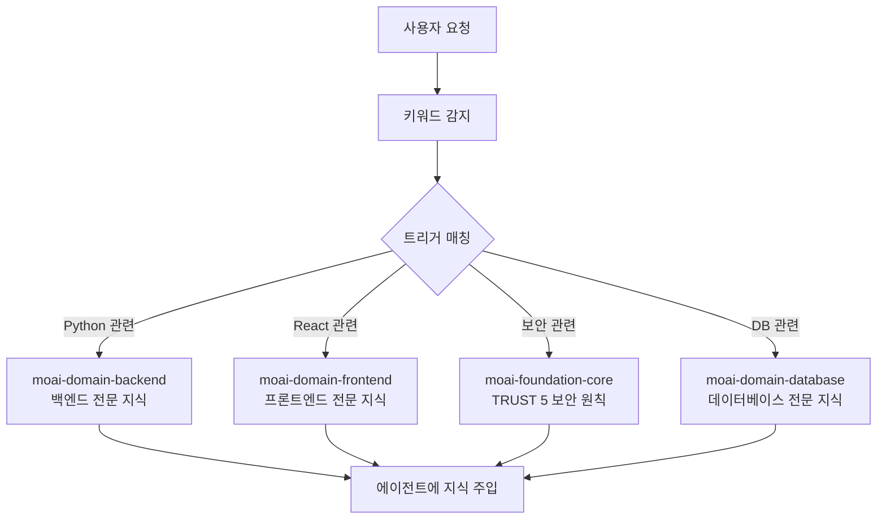
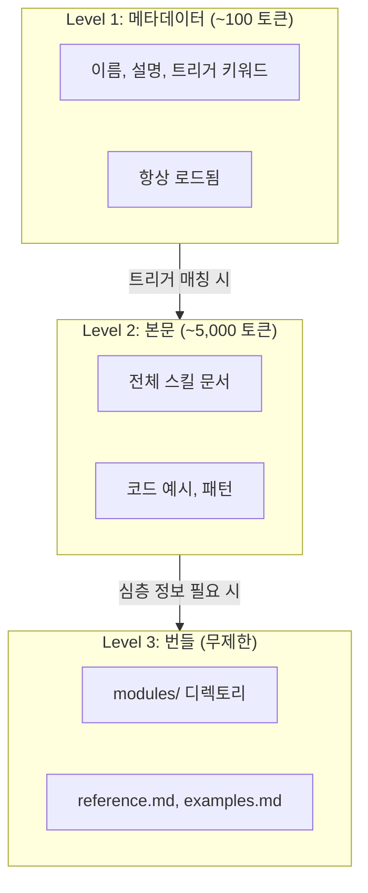
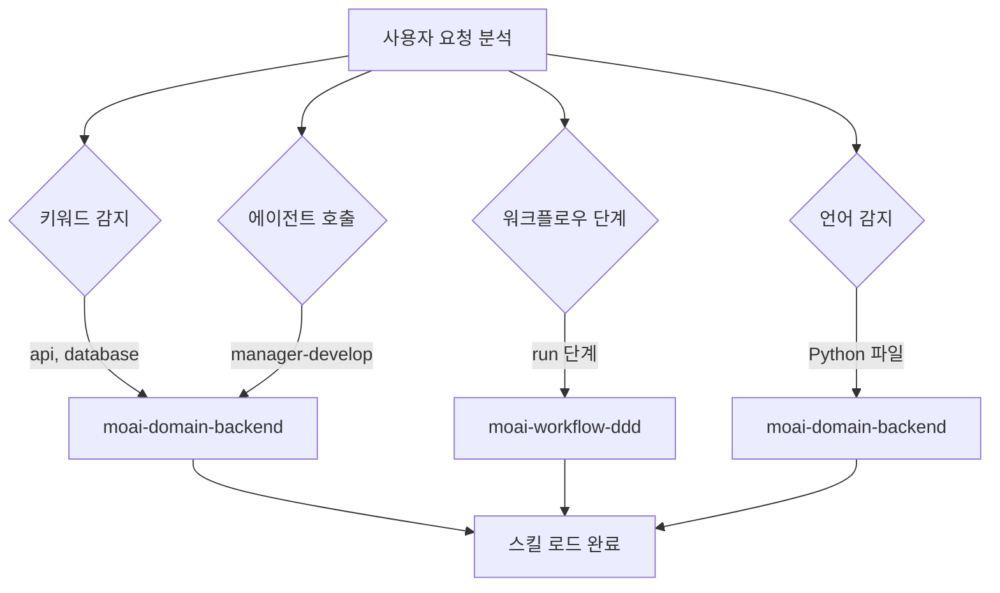
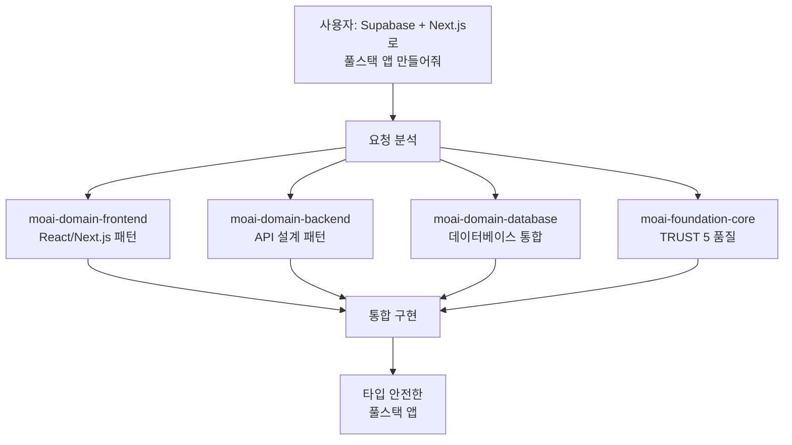

MoAI-ADK의 스킬 시스템을 상세히 안내합니다.



**스킬이란?**

1999년 영화 **메트릭스**의 헬기 조종 장면을 기억하시나요? 네오가 트리티니에게
헬기 조종을 할 줄 아느냐고 묻자, 본부에 전화해 헬기 모델을 알리고 사용 설명서를
전송해달라고 하는 씬이 있습니다.

<p align="center">
  <iframe
    width="720"
    height="360"
    src="https://www.youtube.com/embed/9Luu4itC-Zs"
    title="메트릭스 헬기 조종 장면"
    frameBorder="0"
    allow="accelerometer; autoplay; clipboard-write; encrypted-media; gyroscope; picture-in-picture"
    allowFullScreen
  ></iframe>
</p>

**Claude Code의 스킬** **(이 바로 그 **사용 설명서**입니다. 필요한 순간에
필요한 지식만 로드하여 AI가 즉시 전문가처럼 행동할 수 있게 합니다.



## 스킬이란?

스킬은 Claude Code에게 특정 분야의 전문 지식을 제공하는 **지식 모듈**입니다.

학교에 비유하면, Claude Code가 학생이고 스킬은 교과서입니다. 수학 시간에는 수학
교과서를, 과학 시간에는 과학 교과서를 펴는 것처럼, Claude Code도 Python 코드를
작성할 때는 Python 스킬을, React UI를 만들 때는 Frontend 스킬을 로드합니다.



**스킬이 없는 경우**: Claude Code는 일반적인 지식으로만 응답합니다. **스킬이
있는 경우**: MoAI-ADK의 규칙, 패턴, 모범 사례를 적용하여 응답합니다.

## 스킬 카테고리

MoAI-ADK 템플릿에는 총 **27개 `moai-*` 스킬**이 6개 카테고리로 분류되어 있습니다 (Foundation 4 + Workflow 10 + Domain 9 + Reference 5 + Meta/Harness 2 = 27). 사용자 프로젝트에서는 추가로 `harness-*` 사용자 정의 스킬을 작성할 수 있습니다. 프로그래밍 언어 지원은 `rules/moai/languages/` 아래의 규칙으로 제공되며 별도 스킬이 아닙니다.

### Foundation (핵심 철학) - 4개

| 스킬 이름                  | 설명                                                |
| -------------------------- | --------------------------------------------------- |
| `moai-foundation-core`     | SPEC 기반 TDD/DDD, TRUST 5 프레임워크, 실행 규칙    |
| `moai-foundation-cc`       | Claude Code 확장 패턴 (Skills, Agents, Hooks)       |
| `moai-foundation-thinking` | 구조화 사고, 아이디에이션, 제1원리 분석             |
| `moai-foundation-quality`  | 코드 품질 자동 검증, TRUST 5 밸리데이션             |

### Workflow (자동화 워크플로우) - 10개

| 스킬 이름                | 설명                                          |
| ------------------------ | --------------------------------------------- |
| `moai-workflow-spec`     | SPEC 문서 생성, GEARS 형식, 요구사항 분석     |
| `moai-workflow-project`  | 프로젝트 초기화, 문서 생성, 언어 설정         |
| `moai-workflow-ddd`      | ANALYZE-PRESERVE-IMPROVE 사이클               |
| `moai-workflow-tdd`      | RED-GREEN-REFACTOR 테스트 주도 개발           |
| `moai-workflow-testing`  | 테스트 생성, 디버깅, 코드 리뷰 통합           |
| `moai-workflow-worktree` | Git worktree 기반 병렬 개발                   |
| `moai-workflow-loop`     | Ralph Engine 자율 루프, LSP 연동              |
| `moai-workflow-ci-loop`  | CI 감시 및 자동 수정 루프 워크플로우          |
| `moai-workflow-gan-loop` | Builder-Evaluator GAN 루프, 디자인 품질       |
| `moai-workflow-design`   | 디자인 워크플로우, Claude Design 가져오기     |

### Domain (도메인 전문성) - 9개

| 스킬 이름                   | 설명                                             |
| --------------------------- | ------------------------------------------------ |
| `moai-domain-backend`       | API 설계, 마이크로서비스, 데이터베이스 통합      |
| `moai-domain-frontend`      | React 19, Next.js 16, Vue 3.5, 컴포넌트 아키텍처 |
| `moai-domain-database`      | PostgreSQL, MongoDB, Redis, 고급 데이터 패턴     |
| `moai-domain-ideation`      | Lean Canvas, 제안 생성, 발산-수렴                |
| `moai-domain-research`      | 시장 조사, 생태계 분석, WebSearch                |
| `moai-domain-brand-design`  | 브랜드 정합 비주얼 디자인, 디자인 토큰           |
| `moai-domain-design-handoff`| Claude Design 핸드오프 패키지                    |
| `moai-domain-copywriting`   | 브랜드 정합 마케팅 카피, 안티-AI-slop            |
| `moai-domain-humanize`      | AI 텍스트 휴머나이제이션, 윤문, 한국어 AI-tell 분류체계 |

### Reference (모범 사례) - 5개

| 스킬 이름                  | 설명                                              |
| -------------------------- | ------------------------------------------------- |
| `moai-ref-api-patterns`    | REST/GraphQL API 설계 패턴, 에러 처리             |
| `moai-ref-git-workflow`    | Git 워크플로우, 브랜치 전략, Conventional Commits |
| `moai-ref-owasp-checklist` | OWASP Top 10 보안 패턴, 입력 검증                 |
| `moai-ref-react-patterns`  | React/Next.js 컴포넌트 패턴, 상태 관리            |
| `moai-ref-testing-pyramid` | 테스트 피라미드 전략, 커버리지 목표               |

### Meta/Harness (시스템 확장) - 2개

| 스킬 이름              | 설명                                        |
| ---------------------- | ------------------------------------------- |
| `moai-meta-harness`    | 프로젝트 특화 에이전트 팀 동적 생성         |
| `moai-harness-learner` | Harness 학습 서브시스템, 자동 업데이트 제안 |

> 27개 `moai-*` 스킬은 MoAI-ADK 템플릿에 기본으로 포함되며, 각 스킬은 독립적으로 로드되어 토큰을 절약합니다. 사용자는 추가적으로 프로젝트별 `harness-*` 사용자 정의 스킬을 작성할 수 있습니다.

## 점진적 공개 시스템

MoAI-ADK의 스킬은 **3단계 점진적 공개** (Progressive Disclosure) 시스템을
사용합니다. 모든 스킬을 한 번에 로드하면 토큰이 낭비되므로, 필요한 만큼만
단계적으로 로드합니다.



### 각 레벨의 역할

| 레벨    | 토큰   | 로드 시점      | 내용                                |
| ------- | ------ | -------------- | ----------------------------------- |
| Level 1 | ~100   | 항상           | 스킬 이름, 설명, 트리거 키워드      |
| Level 2 | ~5,000 | 트리거 매칭 시 | 전체 문서, 코드 예시, 패턴          |
| Level 3 | 무제한 | 온디맨드       | modules/, reference.md, examples.md |

### 토큰 절약 효과

- **기존 방식**: 27개 스킬 전체 로드 = 약 135,000 토큰 (불가능)
- **점진적 공개**: 메타데이터만 로드 = 약 5,200 토큰 (97% 절약)
- **필요 시 로드**: 작업에 필요한 2~3개 스킬만 = 약 15,000 토큰 추가

## 스킬 트리거 메커니즘

스킬은 **4가지 트리거 조건**으로 자동 로드됩니다.



### 트리거 설정 예시

```yaml
# 스킬 프론트매터에서 트리거 정의
triggers:
  keywords: ["api", "database", "authentication"] # 키워드 매칭
  agents: ["manager-spec", "manager-develop"] # 에이전트 호출 시
  phases: ["plan", "run"] # 워크플로우 단계
  languages: ["python", "typescript"] # 프로그래밍 언어
```

**트리거 우선순위:**

1. **키워드** (keywords): 사용자 메시지에서 키워드를 감지하면 즉시 로드
2. **에이전트** (agents): 특정 에이전트가 호출될 때 자동 로드
3. **단계** (phases): Plan/Run/Sync 단계에 따라 로드
4. **언어** (languages): 작업 중인 파일의 프로그래밍 언어에 따라 로드

## 스킬 사용법

### 명시적 호출

Claude Code 대화에서 직접 스킬을 호출할 수 있습니다.

```bash
# Claude Code에서 스킬 호출
> Skill("moai-domain-backend")
> Skill("moai-domain-frontend")
> Skill("moai-ref-api-patterns")
```

### 자동 로드

대부분의 경우 스킬은 트리거 메커니즘에 의해 **자동으로 로드**됩니다. 사용자가
직접 호출할 필요 없이, 대화 컨텍스트를 분석하여 적절한 스킬이 활성화됩니다.

## 스킬 디렉토리 구조

스킬 파일은 `.claude/skills/` 디렉토리에 위치합니다.

```
.claude/skills/
├── moai-foundation-core/       # Foundation 카테고리
│   ├── skill.md                # 메인 스킬 문서 (500줄 이하)
│   ├── modules/                # 심층 문서 (무제한)
│   │   ├── trust-5-framework.md
│   │   ├── spec-first-ddd.md
│   │   └── delegation-patterns.md
│   ├── examples.md             # 실전 예시
│   └── reference.md            # 외부 참조 링크
│
├── moai-domain-backend/        # Domain 카테고리
│   ├── skill.md
│   └── modules/
│       ├── api-patterns.md
│       └── microservices.md
│
└── my-skills/                  # 사용자 커스텀 스킬 (업데이트 제외)
    └── my-custom-skill/
        └── skill.md
```


  **주의**: `moai-*` 접두사가 붙은 스킬은 MoAI-ADK 업데이트 시 덮어쓰기됩니다.
  개인 스킬은 반드시 `.claude/skills/my-skills/` 디렉토리에 생성하세요.


### 스킬 파일 구조

각 스킬의 `skill.md`는 다음 구조를 따릅니다.

```markdown
---
name: moai-domain-backend
description: >
  백엔드 개발 전문가. API 설계, 마이크로서비스, 데이터베이스 통합 패턴 제공.
  API, 웹 앱, 데이터 파이프라인 개발 시 사용.
version: 3.0.0
category: domain
status: active
triggers:
  keywords: ["api", "database", "microservices", "authentication"]
allowed-tools: ["Read", "Grep", "Glob", "Bash", "Context7 MCP"]
---

# 백엔드 개발 전문가

## Quick Reference

(빠른 참조 - 30초)

## Implementation Guide

(구현 가이드 - 5분)

## Advanced Patterns

(고급 패턴 - 10분+)

## Works Well With

(연관 스킬/에이전트)
```

## 실전 예시

### Python 프로젝트에서 스킬 자동 로드

사용자가 Python FastAPI 프로젝트에서 작업하는 시나리오입니다.

```bash
# 1. 사용자가 API 개발을 요청
> FastAPI로 사용자 인증 API를 만들어줘

# 2. MoAI-ADK가 자동으로 감지하는 키워드
# "FastAPI" → moai-domain-backend 트리거 (Python 패턴은 rules/moai/languages/ 통해 제공)
# "인증"    → moai-domain-backend 트리거
# "API"     → moai-domain-backend 트리거

# 3. 자동 로드되는 스킬
# - moai-domain-backend (Level 2): API 설계 패턴, 인증 전략
# - moai-foundation-core (Level 1): TRUST 5 품질 기준

# 4. 에이전트가 스킬 지식을 활용하여 구현
# - FastAPI 라우터 패턴 적용
# - JWT 인증 모범 사례 적용
# - pytest 테스트 자동 생성
# - TRUST 5 품질 기준 충족
```

### 스킬 간 협업

하나의 작업에서 여러 스킬이 협력하는 과정입니다.



## 스킬 범위와 디스커버리 (Skill Scope and Discovery)

### 중첩 `.claude/skills` 로딩

Claude Code는 프로젝트 루트뿐만 아니라 중첩된 하위 디렉터리(parent-walk)에서도 `.claude/skills/`를 발견합니다. 따라서 모노레포는 각 패키지 자체의 `.claude/skills/` 디렉터리에 패키지 로컬 스킬을 배치할 수 있습니다. 자체 `.claude/skills/`를 포함하는 중첩 디렉터리 내부에서 작업할 때, 해당 중첩 디렉터리의 스킬은 해당 하위 트리에서 작업하는 동안 루트 수준 스킬과 함께 로드됩니다.

### 이름 충돌 시 closest-wins

중첩 체인을 따라 둘 이상의 `.claude/skills/` 디렉터리에 같은 스킬 이름이 나타나면, **closest-directory-wins**(가장 가까운 디렉터리 우선) 규칙이 충돌을 해결합니다: 현재 작업 디렉터리에 가장 가까운 `.claude/skills/`가 더 위쪽 트리의 것을 가립니다(shadow). 이는 중첩 `.claude/` 디렉터리 하위에서 에이전트, 워크플로우, output-styles에 이미 적용되는 선행 규칙과 동일합니다 — 가장 안쪽의 `.claude/`가 이깁니다. 루트 스킬을 의도적으로 재정의하는 패키지 로컬 스킬은 같은 이름을 유지해야 합니다. 이름을 바꾸면 재정의가 아닌 두 번째 스킬이 생성됩니다.

### `disableBundledSkills` 토글

`disableBundledSkills` (settings.json 불리언, 또는 환경변수 형태)는 Claude Code 번들 skills 및 워크플로우 — 예: `/deep-research`, 내장 슬래시 명령 skills — 를 discovery에서 숨기고 enterprise + personal + project + plugin skills만 보이게 합니다. 선별된 번들 없는 skill 표면을 제공할 때 사용하세요. MoAI-ADK는 이 토글을 자체 생성기에서 생성하지 않습니다. 사용 가능한 옵션으로 이곳에 문서화됩니다. 동반되는 `--safe-mode` 런칭 플래그는 [Settings JSON 가이드](/ko/advanced/settings-json#disablebundledskills)에 문서화되어 있습니다.

## 관련 문서

- [에이전트 가이드](/advanced/agent-guide) - 스킬을 활용하는 에이전트 체계
- [빌더 에이전트 가이드](/advanced/builder-agents) - 커스텀 스킬 생성 방법
- [CLAUDE.md 가이드](/advanced/claude-md-guide) - 스킬 설정과 규칙 체계


  **팁**: 스킬을 잘 활용하는 핵심은 **적절한 키워드 사용**입니다. "Python으로
  REST API 만들어줘"라고 요청하면 `moai-domain-backend` 스킬이 자동으로 활성화되어
  (Python 패턴은 `rules/moai/languages/`를 통해 제공) 최적의 코드를 생성합니다.

