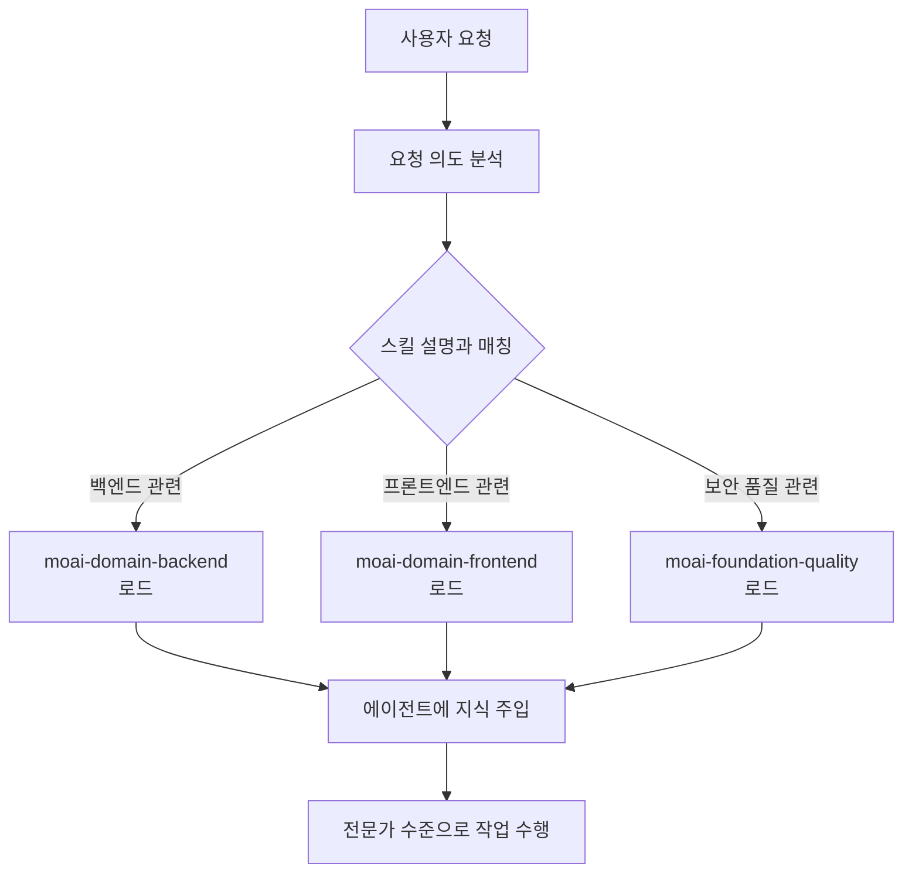
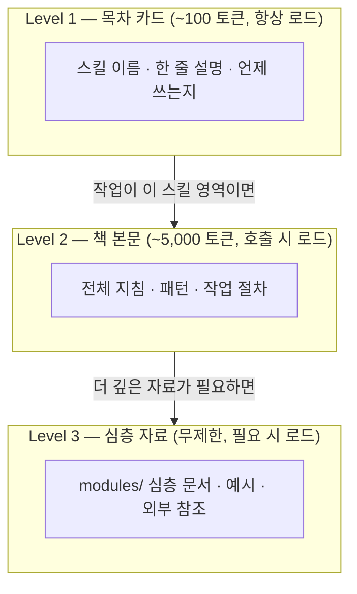
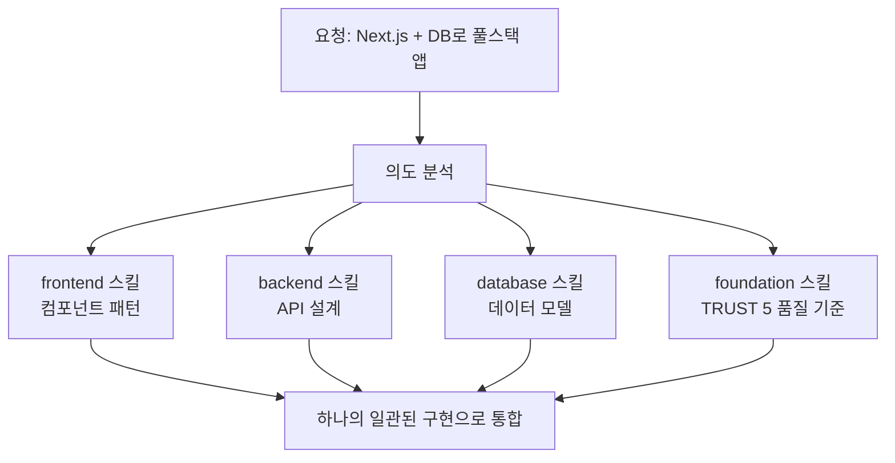

스킬은 MoAI-ADK가 특정 작업에 필요한 전문 지식을 **필요한 순간에만** 불러오는 지식 모듈입니다. 32개 스킬이 한데 묶여 "어떤 요청이 들어왔을 때 어떤 지식을 꺼내 읽을지"를 자동으로 결정하며, 이 결정 과정이 곧 토크노믹스(비용 대비 품질을 극대화하도록 토큰을 나눠 쓰는 방식)가 가장 구체적으로 실현되는 지점입니다. 이 문서는 스킬이 무엇이고, 왜 필요하며, 어떻게 발동하고, 누가 관리하는지를 처음 읽는 사람도 친구에게 설명할 수 있을 만큼 명확하게 정리합니다.


플랫폼 계층의 배경 설명은 [스킬](/ko/claude-code/extensibility/skills)에 있습니다. MoAI-ADK 기준 설명은 이 문서가 전부입니다.




**스킬, 한 줄 비유**

1999년 영화 **매트릭스**의 헬기 조종 장면을 떠올려 보세요. 네오가 트리니티에게 헬기를 조종할 줄 아느냐고 묻자, 트리니티는 본부에 전화해 헬기 모델을 알리고 사용 설명서를 전송해 달라고 합니다. 잠시 뒤 그녀는 헬기를 조종합니다.

<p align="center">
  <iframe
    width="720"
    height="360"
    src="https://www.youtube.com/embed/9Luu4itC-Zs"
    title="매트릭스 헬기 조종 장면"
    frameBorder="0"
    allow="accelerometer; autoplay; clipboard-write; encrypted-media; gyroscope; picture-in-picture"
    allowFullScreen
  ></iframe>
</p>

스킬이 바로 그 **사용 설명서**입니다. 평소에는 책장에 꽂아 두고, 타고 낼 일이 생겼을 때만 꺼내 읽습니다. 다 읽고 나면 다시 책장에 놓습니다.



## 스킬이 무엇인가

스킬은 Claude Code가 특정 분야의 전문 지식을 갖추고 일하도록 돕는 **지식 모듈**입니다. 학교에 비유하면, Claude Code가 학생이고 스킬은 교과서입니다. 수학 시간에는 수학 교과서를, 과학 시간에는 과학 교과서를 펴듯, 백엔드 API를 설계할 때는 백엔드 스킬을, React 화면을 만들 때는 프론트엔드 스킬을 꺼내 읽습니다.

스킬이 없으면 Claude Code는 자신이 원래 알고 있는 일반적인 지식만으로 응답합니다. 스킬이 있으면 MoAI-ADK가 정해 둔 규칙과 패턴, 모범 사례를 해당 작업에 정확히 맞춰 적용합니다. 같은 질문에도 답의 깊이와 일관성이 달라지는 이유가 여기에 있습니다.

아래 흐름은 사용자의 요청이 들어왔을 때, 요청의 의미를 분석해 알맞은 스킬을 찾고 그 지식을 에이전트(스스로 일하는 AI 도우미)에 주입하는 과정을 보여 줍니다.


```mermaid
flowchart TD
    REQ[사용자 요청] --> AN[요청 의도 분석]
    AN --> MATCH{스킬 설명과 매칭}
    MATCH -->|백엔드 관련| BE["moai-domain-backend<br/>로드"]
    MATCH -->|프론트엔드 관련| FE["moai-domain-frontend<br/>로드"]
    MATCH -->|보안 품질 관련| SEC["moai-foundation-quality<br/>로드"]
    BE --> INJ[에이전트에 지식 주입]
    FE --> INJ
    SEC --> INJ
    INJ --> WORK[전문가 수준으로 작업 수행]
```

## 왜 스킬이 필요한가 — 토큰 예산의 문제

스킬이 존재하는 근본 이유는 하나입니다. **모든 지식을 한꺼번에 올려 놓으면 비용이 감당이 안 된다**는 것.

MoAI-ADK 템플릿에는 32개 스킬이 들어 있고, 각 스킬의 본문은 대략 5,000 토큰 안팎입니다. 이걸 세션 시작마다 전부 컨텍스트에 올리면 약 13만5,000 토큰부터 시작하게 됩니다 — 작업을 시작도 하기 전에 이미 예산을 다 써버립니다. 그래서 MoAI-ADK는 반대 방향으로 설계됐습니다. **항상 올라가는 분량은 최소로 줄이고, 작업에 맞는 지식만 그 작업을 하는 순간에 끌어올린다.** 이 원칙을 구체적으로 실현하는 메커니즘이 바로 점진적 공개입니다.

## 점진적 공개 — 필요한 만큼만 단계적으로

점진적 공개(Progressive Disclosure)는 스킬을 세 단계로 나눠 저장하고, 단계를 올라갈수록 더 많은 지식을 불러오는 구조입니다. 도서관에 비유하면 이해하기 쉽습니다.

- **1단계 — 목차 카드**: 책 제목과 "이 책은 언제 펼치는가" 한 줄만 적힌 카드. 누구나 항상 볼 수 있게 진열대에 놓습니다.
- **2단계 — 책 본문**: 카드가 마음에 들어 책을 빼면, 비로소 전체 내용을 읽습니다. 이때 토큰을 지불합니다.
- **3단계 — 참고 서가**: 책 안에서 "더 자료가 필요하다" 싶으면, 심층 자료함에서 해당 장만 추가로 가져옵니다.

이렇게 나누면 평소에는 32개 스킬의 '목차 카드'만 항상 보이고(약 100 토큰 × 32 = 3,200 토큰 남짓), 실제로 일에 착수할 때만 그 일에 해당하는 책 2~3권을 빼서 읽습니다. 아래 다이어그램이 이 흐름을 보여 줍니다.


```mermaid
flowchart TD
    subgraph L1["Level 1 — 목차 카드 (~100 토큰, 항상 로드)"]
        L1a["스킬 이름 · 한 줄 설명 · 언제 쓰는지"]
    end
    subgraph L2["Level 2 — 책 본문 (~5,000 토큰, 호출 시 로드)"]
        L2a["전체 지침 · 패턴 · 작업 절차"]
    end
    subgraph L3["Level 3 — 심층 자료 (무제한, 필요 시 로드)"]
        L3a["modules/ 심층 문서 · 예시 · 외부 참조"]
    end
    L1 -->|"작업이 이 스킬 영역이면"| L2
    L2 -->|"더 깊은 자료가 필요하면"| L3
```

| 단계 | 분량 | 언제 불러오나 | 들어 있는 것 |
| ---- | ---- | ------------ | ----------- |
| Level 1 | ~100 토큰 | 항상 | 스킬 이름, 한 줄 설명, 언제 쓰는지 |
| Level 2 | ~5,000 토큰 | 호출됐을 때 | 전체 지침, 코드 패턴, 작업 절차 |
| Level 3 | 무제한 | 더 깊은 자료가 필요할 때 | `modules/` 심층 문서, 예시, 외부 참조 |

저장 효과는 분명합니다. 32개 스킬 전체를 올리면 약 13만5,000 토큰부터 시작해야 하지만, 점진적 공개를 쓰면 목차 카드만으로 약 3,200 토큰에 머무릅니다 — 97% 가까이 줄입니다. 그리고 실제 작업에 필요한 2~3개 스킬의 본문만 추가로 부르면 됩니다.

## 스킬이 발동하는 과정

스킬은 자신이 언제 필요한지를 글로 적어 둡니다. 각 스킬의 `SKILL.md` 맨 앞에는 `description`(이 스킬이 무엇인지)과 `when_to_use`(언제 쓰는지)라는 두 칸의 설명 문장이 들어 있습니다. Claude Code는 사용자의 요청을 읽고, 이 설명 문장들과 의미가 맞닿는 스킬을 스스로 찾아냅니다. 별도의 키워드 목록을 하드코딩하지 않습니다 — 요청의 의미와 설명 문장이 매칭되면 그 스킬이 후보가 됩니다.

여기에 오케스트레이터가 한 단계 더 관여합니다. 에이전트를 실행(spawn)할 때, 오케스트레이터는 그 작업에 필요한 스킬을 미리 짚어 "시작하면서 이 스킬을 불러라"라는 지시를 에이전트에게 직접 전합니다. 예컨대 백엔드 API를 구현하는 에이전트를 띄우면 `시작하면서 Skill("moai-ref-api-patterns")을 불러 REST 엔드포인트와 에러 처리 규칙을 읽어라`는 식의 지시가 프롬프트에 한 줄 박힙니다. 이렇게 하면 에이전트가 '내가 어떤 스킬을 읽어야 할지' 매번 추측하지 않아도 됩니다.

발동 경로를 정리하면 네 가지입니다. (1) 사용자 요청의 도메인 키워드가 스킬 설명과 맞닿을 때, (2) 오케스트레이터가 에이전트를 띄우면서 스킬 주입 지시를 넣을 때, (3) SPEC(요구사항 명세서) 기반 워크플로우의 특정 단계에서 해당 스킬이 필요할 때, (4) 프로젝트 언어(예: Python 파일 존재)가 감지될 때입니다. 네 경로 모두 결국 같은 결과로 수렴합니다 — 해당 스킬의 본문이 로드되고 에이전트가 그 지식을 바탕으로 일합니다.

## 하나의 요청에 여러 스킬이 협력한다

재미있는 점은, 하나의 요청에 스킬이 하나만 필요한 건 아니라는 것입니다. "Next.js와 데이터베이스로 풀스택 앱을 만들어 줘"라는 요청이 들어오면, 프론트엔드와 백엔드, 데이터베이스, 그리고 품질 기준을 다루는 스킬이 한꺼번에 필요해집니다. 오케스트레이터는 이런 요청을 분석해 필요한 스킬을 동시에 끌어올리고, 각 스킬의 지식을 하나의 일관된 구현으로 엮어 냅니다.


```mermaid
flowchart TD
    REQ["요청: Next.js + DB로 풀스택 앱"] --> AN[의도 분석]
    AN --> S1["frontend 스킬<br/>컴포넌트 패턴"]
    AN --> S2["backend 스킬<br/>API 설계"]
    AN --> S3["database 스킬<br/>데이터 모델"]
    AN --> S4["foundation 스킬<br/>TRUST 5 품질 기준"]
    S1 --> IMPL[하나의 일관된 구현으로 통합]
    S2 --> IMPL
    S3 --> IMPL
    S4 --> IMPL
```

## 스킬 카탈로그 한눈에

MoAI-ADK 템플릿은 **32개 스킬**을 제공합니다. 요청을 알맞은 전문 스킬로 라우팅하는 `moai` umbrella 스킬 1개와, 다섯 갈래로 묶인 전문 스킬 31개입니다. 배포 범위로 따지면 모든 프로젝트에 기본으로 깔리는 **핵심 스킬 19개**와, 백엔드/디자인/데브옵스/프론트엔드 선택 팩에만 들어가는 **선택 스킬 13개**로 나뉩니다. 사용자 프로젝트에서는 여기에 더해 `hns-*` 접두사의 사용자 정의 하네스(품질 검증 자동 장치) 스킬을 직접 만들 수 있습니다. 프로그래밍 언어 지원은 스킬이 아니라 `rules/moai/languages/` 규칙으로 따로 제공됩니다 — 언어 감지는 규칙이, 도메인 지식은 스킬이 맡는 식으로 역할이 나뉘어 있습니다.

이 숫자도 다이어트의 결과입니다. 스킬 카탈로그는 v3 기간 동안 48개에서 38개로 정련됐고, 선택 팩까지 합친 현재 수가 32개입니다.

### Foundation — 핵심 철학 (4개)

| 스킬 | 하는 일 |
| ---- | ------ |
| `moai-foundation-core` | SPEC 기반 TDD/DDD, TRUST 5 프레임워크, 실행 규칙 |
| `moai-foundation-cc` | Claude Code 확장 패턴 (Skills, Agents, Hooks) |
| `moai-foundation-thinking` | 구조화 사고, 아이디에이션, 제1원리 분석 |
| `moai-foundation-quality` | 코드 품질 자동 검증, TRUST 5 검증 |

### Workflow — 자동화 워크플로우 (8개)

| 스킬 | 하는 일 |
| ---- | ------ |
| `moai-workflow-spec` | SPEC 문서 생성, GEARS 형식, 요구사항 분석 |
| `moai-workflow-project` | 프로젝트 초기화, 문서 생성, 언어 설정 |
| `moai-workflow-ddd` | ANALYZE-PRESERVE-IMPROVE 사이클 |
| `moai-workflow-tdd` | RED-GREEN-REFACTOR 테스트 주도 개발 |
| `moai-workflow-testing` | 테스트 생성, 디버깅, 코드 리뷰 통합 |
| `moai-workflow-worktree` | Git worktree 기반 병렬 개발 |
| `moai-workflow-loop` | 자율 루프, LSP 연동 |
| `moai-workflow-docs-claim-check` | 공개 문서 주장 검증 (읽기 전용) |

### Domain — 도메인 전문성 (6개)

| 스킬 | 하는 일 |
| ---- | ------ |
| `moai-domain-backend` | API 설계, 마이크로서비스, 데이터베이스 통합 |
| `moai-domain-frontend` | React 19, Next.js 16, Vue 3.5, 컴포넌트 아키텍처 |
| `moai-domain-database` | PostgreSQL, MongoDB, Redis, 고급 데이터 패턴 |
| `moai-domain-html-report` | Markdown → 단일 HTML 리포트 렌더러 (외부 의존성 없음) |
| `moai-domain-humanize` | AI 텍스트 윤문/휴머나이제이션 (KO/EN/JA/ZH) |
| `moai-domain-svg-infographic` | 편집 가능 SVG 기술 인포그래픽 (CJK 폰트) |

### Reference — 모범 사례 (11개)

| 스킬 | 하는 일 |
| ---- | ------ |
| `moai-ref-api-patterns` | REST/GraphQL API 설계 패턴, 에러 처리 |
| `moai-ref-git-workflow` | Git 워크플로우, 브랜치 전략, Conventional Commits |
| `moai-ref-owasp-checklist` | OWASP Top 10 보안 패턴, 입력 검증 |
| `moai-ref-react-patterns` | React/Next.js 컴포넌트 패턴, 상태 관리 |
| `moai-ref-testing-pyramid` | 테스트 피라미드 전략, 커버리지 목표 |
| `moai-ref-llm-security` | AI/LLM 방어 보안 (프롬프트 인젝션, OWASP LLM Top 10) |
| `moai-ref-secops` | DevSecOps/컨테이너/API 운영 방어 보안 |
| `moai-ref-supply-chain` | 소프트웨어 공급망 방어 (SBOM, SLSA, Sigstore) |
| `moai-ref-ui-polish` | UI 디자인 완성도, 인터페이스 폴리시 참조 |
| `moai-ref-seo` | 검색 노출과 크롤링 가능성 (정규 URL, 페이지별 메타, JSON-LD) |
| `moai-ref-cross-model-audit` | 크로스 모델 감사 수렴 (codex · GLM 병렬 리뷰 후 판정) |

### Meta/Harness — 시스템 확장 (2개)

| 스킬 | 하는 일 |
| ---- | ------ |
| `moai-meta-harness` | **DEPRECATED** — 레거시 메타 하네스. v4 Builder(`/moai:harness <자연어 요청>`)로 리다이렉트 |
| `moai-harness-learner` | 하네스 학습 서브시스템, 자동 업데이트 제안 |

## 스킬 네임스페이스와 소유권

스킬 이름의 접두사는 **누가 그 스킬을 관리하는지**, 그래서 **`moai update`가 그 스킬을 어떻게 다루는지**를 결정합니다. 이 규칙을 모르면 내가 만든 스킬이 업데이트 한 번에 사라지는 사고를 겪게 됩니다.

| 접두사 | 소유권 | `moai update` 동작 |
| ------ | ------ | ------------------ |
| `moai-*` / `moai-harness-*` | template-managed (MoAI-ADK 템플릿) | 덮어쓰기 (sync) |
| `hns-*` | user-owned (사용자 하네스) | 보존 (수정·삭제 금지) |
| (접두사 없음) / 기타 | user-owned (개인) | 보존 |

`moai-*` 접두사가 붙은 스킬은 MoAI-ADK가 업데이트될 때 템플릿 버전으로 덮어씌워집니다. 반대로 `hns-*` 접두사 스킬은 사용자가 만든 하네스 스킬로, `moai update`가 절대 건드리지 않습니다. 개인적으로 만든 스킬은 접두사 없는 디렉터리에 두면 역시 보존됩니다. **직접 만든 스킬은 반드시 `hns-*` 접두사나 접두사 없는 디렉터리에 두어야 업데이트에 날아가지 않습니다.**


**주의**: `moai-*` 접두사가 붙은 스킬은 MoAI-ADK 업데이트 시 덮어쓰기됩니다. 개인 스킬과 하네스 스킬은 `hns-*` 접두사 또는 접두사 없는 디렉토리에 생성하세요. 템플릿 원본에 `hns-*` 스킬을 미러링하면 CI 가드가 감지합니다.


## 스킬 파일 구조

스킬은 `.claude/skills/<스킬 이름>/` 디렉터리 아래에 모입니다. 각 스킬 디렉터리의 기본 구조는 이렇습니다.

```
.claude/skills/
├── moai-foundation-core/       # Foundation (template-managed, moai-*)
│   ├── SKILL.md                # 메인 문서 — 목차 카드 + 본문(Level 1 + 2)
│   ├── modules/                # 심층 자료 (Level 3, 무제한)
│   │   ├── trust-5-framework.md
│   │   └── spec-first-ddd.md
│   ├── examples.md             # 실전 예시
│   └── reference.md            # 외부 참조 링크
│
├── hns-my-harness/             # 사용자 하네스 스킬 (user-owned, hns-*)
│   └── SKILL.md
│
└── my-custom-skill/            # 사용자 개인 스킬 (user-owned, 접두사 없음)
    └── SKILL.md
```

각 `SKILL.md`의 맨 앞에는 프론트매터가 들어갑니다. 이 프론트매터가 곧 Level 1의 '목차 카드'입니다.

| 프론트매터 칸 | 역할 |
| ------------ | ---- |
| `name` | 스킬 이름 (접두사 포함) |
| `description` | 이 스킬이 무엇인지 — 의미 매칭의 근거 |
| `when_to_use` | 언제 쓰는지 — 발동 조건의 근거 |
| `allowed-tools` | 이 스킬이 쓸 수 있는 도구 목록 (**CSV 문자열**, 공백 구분·배열 금지) |
| `metadata.version` · `category` | 버전과 분류 |

`description`과 `when_to_use`에 적은 문장이 스킬 발동을 결정짓는 핵심이라는 점을 다시 한번 짚습니다. 이 두 칸에 "어떤 요청에 쓰는지"가 자연스럽게 드러나야, 사용자의 요청과 제대로 매칭됩니다.

## 중첩 디렉터리와 충돌 규칙

Claude Code는 프로젝트 루트뿐 아니라 하위 디렉터리로 내려가면서도 `.claude/skills/`를 찾아냅니다(parent-walk). 그래서 모노레포에서는 패키지마다 자체 `.claude/skills/`를 두고 패키지 전용 스킬을 둘 수 있습니다. 그 디렉터리 안에서 작업하는 동안에는 그 스킬이 루트 수준 스킬과 함께 로드됩니다.

둘 이상의 `.claude/skills/`에 같은 이름의 스킬이 있으면 **가장 가까운 디렉터리가 이긴다** (closest-directory-wins)는 규칙으로 충돌을 정리합니다. 현재 작업 디렉터리에서 가장 가까운 `.claude/skills/`가 위쪽 트리의 같은 이름 스킬을 가립니다(shadow). 루트 스킬을 일부러 재정의하려는 패키지 전용 스킬은 이름을 똑같이 맞춰야 합니다 — 이름을 바꾸면 재정의가 아니라 별개 스킬이 하나 더 생깁니다.

한 가지 더. `disableBundledSkills`(settings.json 불리언) 토글을 켜면 Claude Code 번들 스킬과 번들 워크플로우가 발견에서 빠지고, enterprise + personal + project + plugin 스킬만 남습니다. 번들 스킬을 빼고 직접 고른 스킬만 노출하고 싶을 때 씁니다. MoAI-ADK 생성기가 이 토글을 만들지는 않지만, 필요하면 쓸 수 있는 선택지입니다. 함께 쓰는 `--safe-mode` 실행 플래그는 [Settings JSON 가이드](/ko/advanced/settings-json#disablebundledskills)에 정리돼 있습니다.

## 관련 문서

- [에이전트 가이드](/ko/advanced/agent-guide) — 스킬을 활용하는 에이전트 체계
- [빌더 에이전트 가이드](/ko/advanced/builder-agents) — 커스텀 스킬 생성 방법
- [CLAUDE.md 가이드](/ko/advanced/claude-md-guide) — 스킬 설정과 규칙 체계


**핵심 요약**: 스킬은 "필요한 지식을 필요한 순간에만" 불러오는 점진적 공개 구조 위에서 작동합니다. 평소에는 목차 카드(Level 1)만 항상 보이고, 작업이 걸리면 본문(Level 2)을, 더 깊이 필요하면 심층 자료(Level 3)를 불러옵니다. 이 구조가 32개 스킬을 세션 시작 부담 없이 운용하게 만듭니다.

