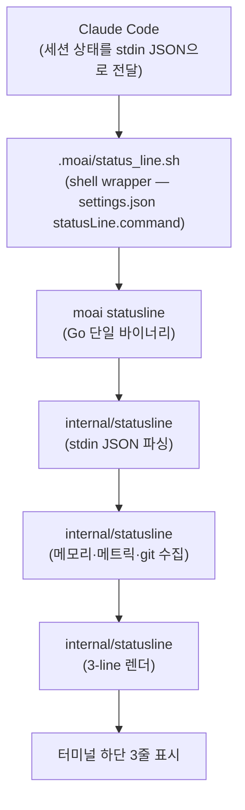
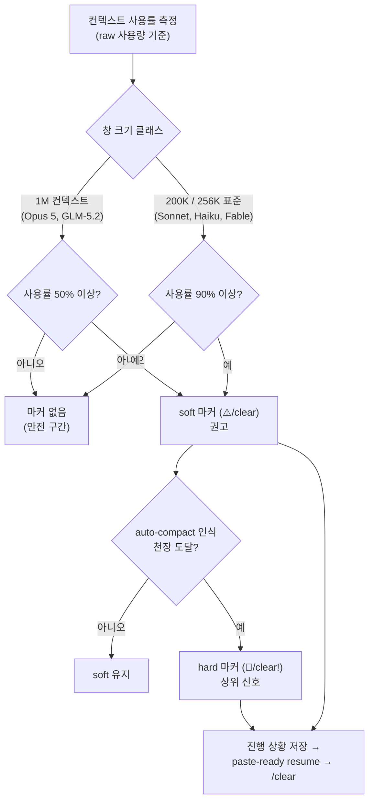

측정하지 않으면 통제할 수 없습니다. 에이전틱 개발은 한 번의 세션에서 수십만 토큰을 쓰고, 컨텍스트 창(context window, 모델이 한 번에 기억할 수 있는 대화의 총량)을 빠르게 채우며, 여러 에이전트(스스로 일하는 AI 도우미)가 병렬로 돌아가며 프롬프트 캐시(prompt cache, 같은 맥락을 재사용해 비용을 줄이는 기법)의 적중 여부를 좌우합니다. 이 모든 일이 터미널 안에서 눈에 보이지 않으면, "왜 이번 세션은 비용이 두 배 나왔을까"라는 질문에 답할 수 없습니다. **커스텀 statusline 시스템**은 바로 이 지점에서 출발합니다. 토크노믹스(tokenomics, 토큰을 경제적으로 쓰는 방식)는 측정에서 시작하므로, 컨텍스트 사용률과 캐시 적중률, rate limit 소진율을 터미널 하단에 늘 띄워 둡니다.

이 문서는 statusline이 무엇을 보여 주는지, 데이터가 어떻게 흐르는지, 그리고 컨텍스트가 찰 때 어떤 신호를 주는지를 입문서 수준으로 정리합니다. 세그먼트 포맷의 세부 사항보다 "왜 이 정보가 필요하고 어떻게 읽는가"를 먼저 설명합니다.

## 상태표시줄이 왜 필요한가

에이전틱 코딩에서 비용과 품질을 결정하는 변수는 다섯 가지입니다. 어느 모델을 쓰는지, 어느 추론 깊이로 돌고 있는지, 컨텍스트 창이 얼마나 찼는지, rate limit이 얼마나 남았는지, 그리고 프롬프트 캐시가 제대로 먹히고 있는지입니다. 이 다섯 가지는 서로 연결되어 있습니다. 컨텍스트가 차면 SSE 스톨(stream stall, 스트리밍이 멈추는 현상)이 나고, 캐시가 안 되면 비용이 곧바로 오르며, rate limit이 바닥나면 무거운 작업을 멈춰야 합니다.

문제는 이 변수들이 기본으로 보이지 않는다는 것입니다. Claude Code 자체의 상태표시줄은 풍부하지만, MoAI 워크플로우가 다루는 정보 — 활성 SPEC(요구사항 명세서), 현재 PR의 리뷰 상태, 핸드오프(handoff, 세션을 이어주는 작업) 권고 시점 — 까지는 담지 않습니다. 그래서 MoAI는 자체 상태표시줄을 터미널 하단에 3줄로 띄워, "지금 토큰을 어떻게 쓰고 있는지"와 "지금 어디서 무엇을 하고 있는지"를 한눈에 읽게 합니다.

## 한눈에 보는 3줄

최종 레이아웃은 세 줄로 구성됩니다. 아래 예시는 실제 렌더된 출력의 한 사례로, 각 세그먼트가 쓰는 글리프(glyph, 작은 그림 문자)까지 그대로 옮겼습니다.

```text
🤖 Opus │ 🧠 xhigh·t │ ♻️ 87% │ 🔅 v2.1.212 │ 🗿 v3.0.0 │ ⏳ 4h 52m │ 💬 MoAI
🪫 CW: ███████░░░ 72% (⚠️/clear) │ 🔋 5H: █████░░░░░ 56% (46m) │ 🔋 7D: █░░░░░░░░░ 13% (May 28)
📁 moai-adk-go │ 🔀 modu-ai/moai-adk | 🅱️ main ↑5 +2 │ 💾 +0 M1 ?1 │ 💌 PR #1234 (⌥approved)
```

- **첫째 줄 — 세션이 "어떻게" 돌고 있는가**: 모델, 추론 깊이, 캐시 적중률, Claude Code 버전, MoAI 버전, 세션 시간, 출력 스타일을 한 줄로 보여 줍니다. "이 세션이 어느 설정으로 돌고 있는가"를 즉시 알려 줍니다.
- **둘째 줄 — 예산이 "얼마나" 남았는가**: 컨텍스트 창 사용률(CW)과 두 개의 롤링 rate limit(5시간·7일)을 게이지 바로 보여 줍니다. "지금 당장 큰 작업을 돌려도 되는가"를 판단하는 근거입니다.
- **셋째 줄 — 지금 "어디서, 무엇을" 하는가**: 디렉터리, 리포지토리와 브랜치, git 상태, 활성 SPEC 작업, 그리고 열려 있는 PR의 리뷰 상태를 묶어 줍니다. PR 중심 워크플로우에서 가장 자주 보게 되는 줄입니다.

## 데이터가 흐르는 길

statusline은 단일 프로그램이 아니라 짧은 파이프라인입니다. Claude Code가 매 렌더 주기마다 세션 상태를 JSON으로 만들어 넘기면, MoAI가 이를 받아 세 줄로 가공해 터미널로 돌려줍니다.



왜 shell wrapper가 그 사이에 끼일까? Claude Code의 `statusLine.command`는 하나의 명령어 문자열만 받습니다. 그래서 `.moai/status_line.sh`가 최소한의 셸 래퍼가 되어 `moai statusline` 바이너리를 호출하고, 무거운 일(파싱·수집·렌더)은 전부 컴파일된 Go 바이너리 안에서 빠르게 처리됩니다. 덕분에 매 렌더마다 프로세스를 여러 개 띄우지 않고도 넉넉한 정보를 한 번에 그려 낼 수 있습니다.

데이터 수집 단계에서는 stdin에 없는 정보도 보충합니다. git 상태는 로컬 `git status --porcelain`을 직접 파싱하고, MoAI 버전은 로컬 설정에서 읽으며, 활성 작업은 세션 상태 파일에서 가져옵니다. 이렇게 하면 Claude Code가 넘겨주지 않는 문맥까지 한 줄에 담을 수 있습니다.

## 첫째 줄 — 세션이 "어떻게" 돌고 있는가

첫째 줄은 "이 세션의 설정과 상태"를 읽는 줄입니다. 모델 이름은 물론이고, Claude Code v2.1.139부터 stdin에 추가된 **effort/thinking** 값으로 "어느 추론 깊이로, 확장 사고(thinking)가 켜져 있는지"를 보여 줍니다. `xhigh·t`처럼 레벨 뒤에 `·t`가 붙으면 확장 사고가 활성화되어 있다는 뜻이며, 이 표시가 있으면 모델 정책이 실제로 적용되고 있는지 한눈에 점검할 수 있습니다.

그중에서도 **캐시 적중률**은 토크노믹스의 핵심 지표입니다. `cache_read` 토큰을 `(cache_read + cache_creation)`으로 나눈 값인데, 항상 로드되는 지침을 줄이면 이 숫자가 바로 오릅니다. 반대로 매 턴마다 큰 파일을 새로 읽거나 지침 트리가 갑자기 바뀌면 떨어집니다. 적중률이 낮게 나온다면, 어떤 변경이 캐시를 갉아먹고 있는지 추적하는 단서가 됩니다.

데이터가 부족할 때는 값을 지어내지 않고 조용히 숨깁니다(graceful degradation). 캐시 생성 토큰이 0이거나 두 값이 모두 0이면 적중률 세그먼트를 아예 표시하지 않습니다. 이런 겸손한 생략이 "없는 숫자로 거짓 확신"을 주는 일을 막아 줍니다.

## 둘째 줄 — 예산이 "얼마나" 남았는가

둘째 줄은 세 개의 게이지 바로 이루어지며, 각각 의미가 다릅니다.

- **CW(컨텍스트 창)**: 현재 세션이 창을 얼마나 채웠는지를 나타냅니다. 바의 색은 초록에서 노랑, 빨강으로 이어지는 연속 그라디언트이고, 앞의 배터리 글리프는 표시 퍼센티지가 70%를 넘으면 "약한 배터리" 표식으로 바뀝니다. 창이 가득 차면 SSE 스톨의 위험이 커지므로, 이 게이지는 "언제 세션을 갈아타야 하는가"의 첫 신호입니다.
- **5H(5시간 롤링)**: 최근 5시간 동안의 rate limit 소진율입니다. 리셋 시각을 함께 보여 주어 "한도가 풀리기 전에 얼마나 기다려야 하는가"를 알려 줍니다.
- **7D(7일 롤링)**: 최근 7일 동안의 rate limit 소진율입니다. 주 단위 예산이 얼마나 남았는지를 가늠하게 합니다.

구독 요금제 사용자에게 5H/7D 바는 사실상 예산 게이지입니다. 이 두 바를 보면 "지금 당장 무거운 작업을 돌릴지, 아니면 비용 절감을 위해 CG 모드로 GLM 워커에 넘길지"를 합리적으로 정할 수 있습니다. CW 바가 가득 차고 5H 바도 높다면, 세션을 멈추고 핸드오프로 이어가는 것이 비용과 안정성 양쪽에 유리합니다.

## 셋째 줄 — 지금 "어디서, 무엇을" 하는가

셋째 줄은 작업의 문맥을 묶어 줍니다. 디렉터리, 리포지토리와 브랜치(앞·뒤 차이와 더러운 파일 수 포함), git 상태, 활성 SPEC 작업, 그리고 열려 있는 PR의 리뷰 상태가 한 줄에 들어갑니다.

리포지토리와 브랜치는 하나의 통합 세그먼트로 렌더됩니다. `owner/name` 부분은 Claude Code v2.1.145부터 stdin에 추가된 `workspace.repo`에서 오고, 브랜치는 로컬 git에서 읽습니다. 두 값이 합쳐지면 "어느 리포의 어느 브랜치에서 일하고 있는가"가 한눈에 들어옵니다. worktree(연결된 별도 작업 디렉터리)에서 작업 중일 때는 브랜치 앞에 `[WT]` 표시가 붙어 일반 체크아웃과 구분됩니다.

PR 세그먼트는 리뷰 상태를 색으로 구분합니다. `approved`는 녹색, `pending`은 노란색, `changes_requested`는 빨간색, `draft`는 회색으로 표시되어, 리뷰를 기다리는 PR의 상태를 색만 봐도 파악할 수 있습니다. MoAI 워크플로우는 모든 SPEC이 plan-PR → run-PR → sync-PR 사이클을 만들므로, PR 상태를 항상 띄워 두면 다음 수를 결정하는 데 직접 도움이 됩니다.

## 핸드오프 마커 — 컨텍스트가 찰 때

CW 바 옆에 붙는 마커는 statusline이 주는 가장 중요한 권고입니다. 컨텍스트 사용량이 모델별 임계값을 넘으면 두 단계로 켜집니다. soft 단계는 "가능하면 세션을 갈아타라"는 권고이고, hard 단계는 "지금 당장 갈아타라"는 상위 신호입니다.



임계값이 모델 클래스마다 다른 이유는, 창이 클수록 더 일찍 갈아타는 것이 SSE 스톨 예방에 유리하기 때문입니다. 1M 컨텍스트 모델은 절반(50%)을 채웠을 때, 200K/256K 모델은 90%를 채웠을 때 soft 마커가 켜집니다. hard 마커는 auto-compact이 작동할 시점을 미리 반영한 천장입니다. 다만 런타임의 auto-compact이 종종 이 천장을 먼저 선점하므로, hard 단계는 실제로는 드물게 발화되는 상위 신호입니다.

마커가 켜지면 정해진 순서를 따르면 됩니다. 진행 중인 작업을 `progress.md`에 저장하고, 오케스트레이터가 만든 paste-ready resume 메시지를 받은 뒤 `/clear`로 세션을 비우고, 그 메시지를 새 세션에 붙여넣어 이어갑니다. 이 흐름은 세션 핸드오프 규칙과 일치합니다.

### GLM 컨텍스트 게이지 보정 (Issue #653)

한 가지 주의할 점이 있습니다. GLM-5.2는 실제로 1M 컨텍스트 모델인데, Claude Code는 제공자와 무관하게 Claude 슬롯 기준(Opus=1M, Sonnet/Haiku=200K)으로 `context_window_size`를 보고합니다. 그래서 GLM 세션에서는 원본 관측값이 약 180K로 잘못 나올 수 있습니다. MoAI는 `internal/statusline/memory.go`의 `ResolveGLMContextWindow`로 이 값을 바로잡습니다. `glm-5.2`는 1,000,000으로 매핑되며, `MOAI_STATUSLINE_CONTEXT_SIZE` 환경변수로 직접 덮어쓰거나 `llm.glm.context_windows` 테이블로 설정할 수도 있습니다. GLM 세션에서는 원본 값이 아니라 MoAI 상태표시줄의 CW%를 신뢰하세요.

## 컨텍스트 사용량 스냅샷 — 다음 세션을 위해

상태표시줄은 렌더할 때마다 관측값을 `.moai/state/context-usage.json`에도 기록합니다. 이 스냅샷은 다음 세션이 시작될 때 "직전에 창이 얼마나 찼는가"를 읽는 근거로 쓰입니다. `raw_pct`(원시 사용률)와 `stage`(none/soft/hard)가 핵심 필드이며, 어느 세션이 쓴 값인지 구분하려고 `session_id`, `writer_pid`, `captured_at`을 함께 남깁니다.

왜 세션 구분이 필요할까요? 하나의 작업 디렉터리를 여러 세션이 함께 쓸 때, 한 세션이 다른 세션의 사용량을 이어받아 "창이 가득 찼다"고 잘못 판단하면 안 됩니다. 그래서 기록을 쓴 세션의 신원을 확인하고, 일치하지 않거나 오래된 기록은 무시하고 원본 관측값으로 폴백합니다. 보수적으로 행동하는 것이 목적이지, 빠진 값으로 거짓 확신을 주는 것이 아닙니다.

## 설정 — 켜고 끄기

세그먼트는 `.moai/config/sections/statusline.yaml`에서 켜고 끕니다. 각 줄이 하나의 세그먼트 토글입니다.

```yaml
statusline:
  theme: catppuccin-mocha    # 색상 테마
  segments:
    # 첫째 줄
    model: true
    effort_thinking: true
    cache_hit: true
    claude_version: true
    moai_version: true
    session_time: true
    output_style: true
    # 둘째 줄
    context: true
    usage_5h: true
    usage_7d: true
    # 셋째 줄
    directory: true
    git_branch: true         # 리포지토리+브랜치 통합
    git_status: true
    task: true
    pr: true
    worktree: false          # opt-in
```

열여섯 개 키가 정식 설정 스키마입니다. 리포지토리를 뜻하는 `owner/name` 부분은 `git_branch` 세그먼트 안에서 함께 렌더되는 열일곱 번째 요소로, 스키마 밖이라 개별 토글은 없습니다. 과거의 이름 붙은 프리셋(full/compact/minimal)은 폐기되었으므로, 원하는 조합은 세그먼트 단위로 직접 켜고 끄면 됩니다.

새로고침 주기는 `settings.json`의 `statusLine.refreshInterval`(단위: 초, 기본값 10)로 정합니다. 상태표시줄 설정 파일이 아니라 Claude Code 런타임 설정에 해당합니다. 주기를 너무 짧게 하면 CPU 부담이 커지고, 너무 길게 하면 컨텍스트 사용률 변화가 늦게 반영됩니다. 보통 기본값이면 충분합니다.

## 트러블슈팅

**PR이 안 나온다면** 세 가지를 확인합니다. Claude Code가 v2.1.145 이상이어야 stdin에 `pr` 필드가 들어옵니다. 현재 브랜치에 열린 PR이 있는지 `gh pr view`로 확인합니다. 설정에서 `pr: false`로 명시되어 있지 않은지도 봅니다.

**핸드오프 마커가 안 나온다면** 대개 정상입니다. 1M 모델에서 50% 미만, 200K/256K 모델에서 90% 미만이면 아직 임계값에 도달하지 않은 것입니다. 임계값을 넘었는데도 나오지 않는다면, 모델의 창 크기가 제대로 매핑되었는지(특히 GLM 보정)를 확인합니다.

**색상이 안 나온다면** 터미널이 ANSI 256-color를 지원하는지, `NO_COLOR=1`이 설정되어 있지 않은지, 테마가 환경에 맞는지 확인합니다.

**실제 출력을 확인하고 싶다면** 샘플 stdin을 파이프로 넘겨 상태표시줄을 한 번 그려 볼 수 있습니다. `moai statusline` 명령에 세션 상태를 담은 JSON 문자열을 표준 입력으로 주면, 터미널에 찍힐 세 줄이 그대로 나옵니다. 이 방식으로 설정 변경이 렌더에 어떤 영향을 주는지 렌더링 없이 점검할 수 있습니다.

## `/cd` 로 디렉터리 바꾸기 (CC 2.1.169+)

Claude Code 2.1.169 이상에서는 **프롬프트 캐시를 유지한 채** 세션의 작업 디렉터리를 바꾸는 `/cd <path>` 명령을 씁니다. 상태표시줄의 디렉터리 표시는 새 경로로 갱신되지만, 그동안 쌓인 추론 컨텍스트는 다시 쌓지 않습니다. 새 터미널 세션을 여는 대신 캐시를 살려 두는 방법이라 보면 됩니다. 세션 도중 컨텍스트를 잃지 않고 작업 디렉터리만 옮기고 싶을 때(예: 작업 중에 worktree로 전환) 가장 손이 덜 가는 선택입니다. resume 패턴과의 연계는 [세션 핸드오프](/ko/workflow-commands/moai-sync)를 참조하세요.

## 관련 문서

- [Settings JSON](/ko/advanced/settings-json) — Claude Code `statusLine` 필드 설정
