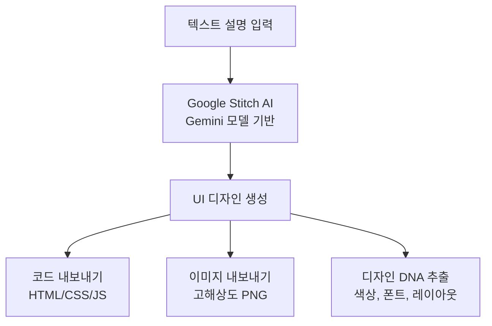
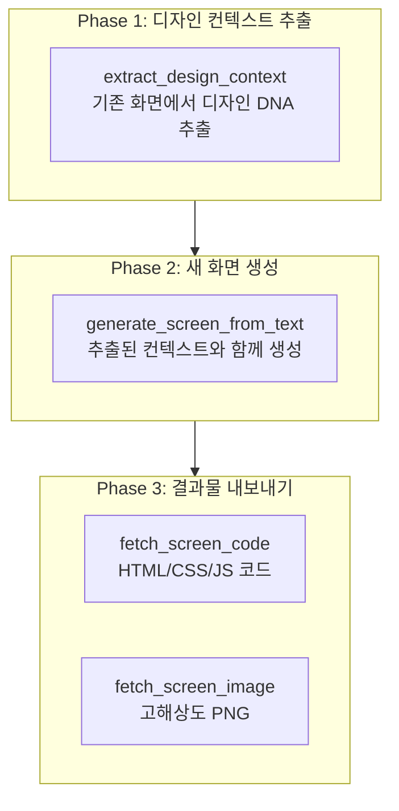
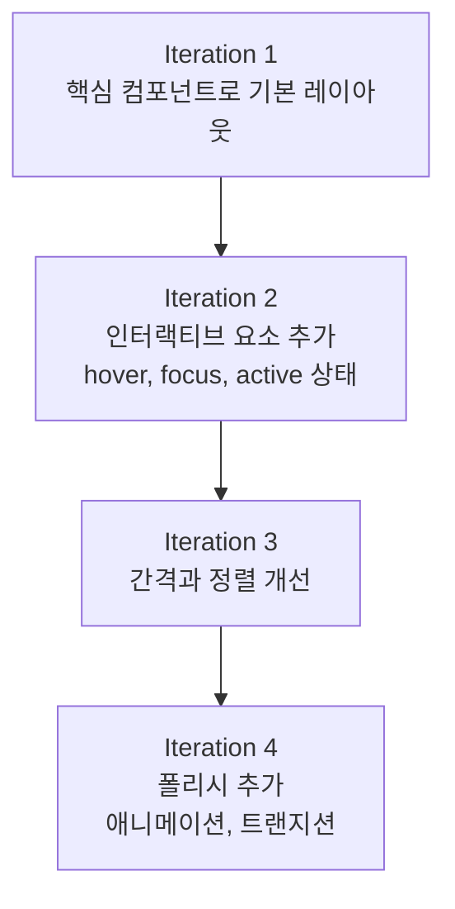

# Google Stitch 가이드

Google Stitch MCP 서버를 활용하여 AI 기반 UI/UX 디자인을 생성하는 방법을 상세히 안내합니다.


**한 줄 요약**: Google Stitch는 **텍스트 설명만으로 UI 화면을 생성하는 AI 디자인 도구**입니다. MCP 서버를 통해 Claude Code에서 직접 UI를 생성하고, 디자인 컨텍스트를 추출하며, 프로덕션 코드로 내보낼 수 있습니다.


## Google Stitch란?

Google Stitch는 Google Labs에서 개발한 AI 기반 UI/UX 디자인 생성 도구입니다. Gemini AI 모델을 사용하여 자연어 설명을 전문가 수준의 UI 화면으로 변환합니다.

디자이너가 없는 개발 환경에서도 Stitch를 활용하면 일관된 디자인 시스템을 유지하며 빠르게 UI를 프로토타이핑할 수 있습니다.



### 주요 기능

| 기능 | 설명 |
|------|------|
| **AI 디자인 생성** | 텍스트 프롬프트로 완전한 UI 화면 생성 |
| **디자인 DNA 추출** | 기존 화면에서 색상, 폰트, 레이아웃 패턴 추출 |
| **코드 내보내기** | HTML/CSS/JavaScript 프로덕션 코드 생성 |
| **이미지 내보내기** | 고해상도 PNG 스크린샷 다운로드 |
| **프로젝트 관리** | 화면을 프로젝트 단위로 구성 및 관리 |
| **Figma 연동** | 생성된 디자인을 Figma로 복사 가능 |


Google Stitch는 **무료**로 사용할 수 있습니다. Standard Mode에서 월 350회, Experimental Mode에서 월 50회 생성이 가능합니다. Google 계정만 있으면 됩니다.


## 사전 준비

Google Stitch MCP를 사용하려면 다음 4단계 설정이 필요합니다.

### Step 1: Google Cloud 프로젝트 생성

Google Cloud Console에서 새 프로젝트를 생성하거나 기존 프로젝트를 선택합니다.

```bash
# gcloud CLI가 없다면 먼저 설치
# https://cloud.google.com/sdk/docs/install

# Google Cloud 인증
gcloud auth login

# 프로젝트 설정 (기존 프로젝트 사용 시)
gcloud config set project YOUR_PROJECT_ID
```

### Step 2: Stitch API 활성화

```bash
# beta 컴포넌트 설치 (처음 한 번만)
gcloud components install beta

# Stitch API 활성화
gcloud beta services mcp enable stitch.googleapis.com --project=YOUR_PROJECT_ID
```

### Step 3: Application Default Credentials 설정

```bash
# 애플리케이션 기본 자격 증명 로그인
gcloud auth application-default login

# 할당량 프로젝트 설정
gcloud auth application-default set-quota-project YOUR_PROJECT_ID
```

### Step 4: 환경 변수 설정

```bash
# .bashrc 또는 .zshrc에 추가
export GOOGLE_CLOUD_PROJECT="YOUR_PROJECT_ID"
```


**Google Cloud 프로젝트에 결제** (Billing)가 활성화되어 있어야 합니다. Stitch 자체는 무료이지만, API 호출을 위해 결제가 설정된 프로젝트가 필요합니다. 또한 프로젝트에 `roles/serviceusage.serviceUsageConsumer` IAM 역할이 부여되어 있어야 합니다.


## MCP 설정

### .mcp.json 설정

프로젝트 루트의 `.mcp.json` 파일에 Stitch MCP 서버를 추가합니다.

```json
{
  "mcpServers": {
    "stitch": {
      "command": "${SHELL:-/bin/bash}",
      "args": ["-l", "-c", "exec npx -y stitch-mcp"],
      "env": {
        "GOOGLE_CLOUD_PROJECT": "YOUR_PROJECT_ID"
      }
    }
  }
}
```

`YOUR_PROJECT_ID`를 실제 Google Cloud 프로젝트 ID로 교체하세요.

### settings.json 권한 설정

MCP 도구를 사용하려면 `permissions.allow`에 등록해야 합니다.

```json
{
  "permissions": {
    "allow": [
      "mcp__stitch__*"
    ]
  }
}
```

### settings.local.json 활성화

개인 환경에서 Stitch MCP를 활성화합니다.

```json
{
  "enabledMcpjsonServers": ["stitch"]
}
```

### 연결 확인

설정이 완료되면 Claude Code에서 프로젝트 목록을 조회하여 연결을 확인합니다.

```bash
# Claude Code에서 실행
> Stitch 프로젝트 목록을 보여줘
```

## MCP 도구 목록

Stitch MCP는 9개의 도구를 제공합니다.

### 도구 전체 목록

| 도구 | 용도 |
|------|------|
| `create_project` | 새 Stitch 프로젝트 (워크스페이스) 생성 |
| `get_project` | 프로젝트 상세 메타데이터 조회 |
| `list_projects` | 접근 가능한 모든 프로젝트 나열 |
| `list_screens` | 프로젝트 내 모든 화면 나열 |
| `get_screen` | 개별 화면 메타데이터 조회 |
| `generate_screen_from_text` | 텍스트 프롬프트로 새 UI 화면 생성 |
| `fetch_screen_code` | 화면의 HTML/CSS/JS 코드 다운로드 |
| `fetch_screen_image` | 화면의 고해상도 스크린샷 다운로드 |
| `extract_design_context` | 화면의 디자인 DNA 추출 (색상, 폰트, 레이아웃) |

### 도구 선택 가이드

| 목적 | 사용할 도구 |
|------|-------------|
| 새 디자인을 생성하고 싶다 | `generate_screen_from_text` |
| 기존 디자인을 분석하고 싶다 | `extract_design_context` |
| 디자인을 코드로 내보내고 싶다 | `fetch_screen_code` |
| 디자인 이미지가 필요하다 | `fetch_screen_image` |
| 여러 디자인을 프로젝트로 관리하고 싶다 | `create_project`, `list_projects` |

## Designer Flow 워크플로우

AI 에이전트로 여러 화면을 생성할 때 가장 큰 문제는 **디자인 일관성**입니다. 각 화면을 독립적으로 생성하면 폰트, 색상, 레이아웃이 제각각이 됩니다.

**Designer Flow**는 이 문제를 해결하는 3단계 패턴입니다.



### 실전 예시: E-Commerce 앱

```bash
# Phase 1: 기존 홈 화면에서 디자인 컨텍스트 추출
> 홈 화면의 디자인 컨텍스트를 추출해줘
# → extract_design_context(screen_id="home-screen-001")
# → 색상 팔레트, 폰트, 간격 패턴 추출

# Phase 2: 추출된 컨텍스트로 제품 목록 화면 생성
> 제품 목록 페이지를 생성해줘. 3열 그리드, 왼쪽 필터 사이드바,
#   각 카드에 이미지/제목/가격/장바구니 버튼 포함
# → generate_screen_from_text(prompt=..., design_context=추출된 컨텍스트)

# Phase 3: 코드와 이미지 내보내기
> 생성된 화면의 코드와 이미지를 내보내줘
# → fetch_screen_code(screen_id="product-listing-001")
# → fetch_screen_image(screen_id="product-listing-001")
```


**핵심**: 새 화면을 생성하기 전에 **반드시** 기존 화면에서 `extract_design_context`를 실행하세요. 이렇게 하면 프로젝트 전체에서 일관된 디자인을 유지할 수 있습니다.


## 프롬프트 작성 가이드

Stitch에서 좋은 결과를 얻으려면 구조화된 프롬프트가 중요합니다.

### 5-Part 프롬프트 구조

| 순서 | 요소 | 설명 | 예시 |
|------|------|------|------|
| 1 | **컨텍스트** | 화면의 목적과 대상 사용자 | "E-commerce 제품 목록 페이지" |
| 2 | **디자인** | 전체 시각적 스타일 | "미니멀 모던, 밝은 배경" |
| 3 | **컴포넌트** | 필요한 UI 요소 전체 목록 | "헤더, 검색, 필터, 카드 그리드" |
| 4 | **레이아웃** | 컴포넌트 배치 방식 | "3열 그리드, 왼쪽 필터 사이드바" |
| 5 | **스타일** | 색상, 폰트, 시각 속성 | "파란 주색, Inter 폰트" |

### 좋은 프롬프트 vs 나쁜 프롬프트

| 나쁜 프롬프트 | 좋은 프롬프트 |
|--------------|--------------|
| "멋진 로그인 페이지 만들어줘" | "로그인 화면: 이메일/비밀번호 입력, 로그인 버튼 (파란색 primary), 소셜 로그인 (Google, Apple), 비밀번호 찾기 링크. 센터 카드 레이아웃, 모바일 세로 스택" |
| "대시보드 하나 만들어줘" | "분석 대시보드: 상단 3개 지표 카드 (매출, 사용자, 전환율), 아래 라인 차트, 하단 최근 거래 테이블. 사이드바 내비게이션. 모바일: 사이드바 숨김, 카드 세로 배치" |
| "375px 너비 버튼" | "모바일 전체 너비 버튼, 큰 터치 영역" |

### 효과적인 프롬프트 템플릿

```
[화면 유형]을 생성해줘. [컴포넌트 목록] 포함.
[레이아웃 유형]으로 배치하고 [콘텐츠 계층] 적용.
[인터랙티브 요소]와 [반응형 동작] 포함.
[디자인 스타일/컨텍스트] 적용.
```


**Golden Rule**: 프롬프트당 **하나의 화면**, **한두 가지 조정**만 요청하세요. 프롬프트는 **500자 이하**로 유지하는 것이 좋습니다. 복잡한 화면은 기본 레이아웃부터 시작하여 점진적으로 개선하세요.


## 모범 사례

| 원칙 | 설명 |
|------|------|
| **일관성 우선** | 새 화면 생성 전 항상 `extract_design_context`를 실행하여 디자인 일관성을 유지합니다 |
| **점진적 접근** | 기본 레이아웃부터 생성하고, 후속 프롬프트로 인터랙션과 세부사항을 추가합니다 |
| **접근성 포함** | ARIA 라벨, 키보드 내비게이션, 포커스 인디케이터를 항상 명시합니다 |
| **반응형 명시** | 모바일과 데스크톱 동작을 항상 프롬프트에 포함합니다 |
| **시맨틱 HTML** | header, main, section, nav, footer 등 시맨틱 요소를 요청합니다 |
| **프로젝트 구성** | 관련 화면을 같은 프로젝트에 그룹화하여 관리합니다 |

### 점진적 개선 전략

복잡한 화면은 여러 번에 나눠서 생성하면 품질이 향상됩니다.



## 피해야 할 안티패턴


다음 패턴을 피하면 더 좋은 결과를 얻을 수 있습니다.

- **과도한 명세**: "375px 너비", "48px 높이 버튼" 같은 픽셀 단위 지정 대신 "모바일 너비", "큰 터치 영역" 같은 상대적 용어를 사용하세요
- **모호한 프롬프트**: "멋진 로그인 페이지"가 아닌 컴포넌트 목록, 레이아웃, 콘텐츠 계층을 구체적으로 명시하세요
- **디자인 컨텍스트 무시**: 기존 화면이 있다면 반드시 `extract_design_context`로 추출한 후 전달하세요
- **관심사 혼합**: "사이드바를 추가하고 헤더도 고정해줘"처럼 레이아웃 변경과 컴포넌트 추가를 한 프롬프트에 섞지 마세요
- **긴 프롬프트**: 500자를 초과하면 결과가 불안정해집니다. 핵심 요소만 포함하고 점진적으로 개선하세요
- **반응형 미지정**: Stitch가 자동으로 모바일 최적화를 하지 않습니다. 모바일/데스크톱 동작을 항상 명시하세요


## 문제 해결

| 문제 | 원인 | 해결 방법 |
|------|------|-----------|
| 인증 오류 | ADC 설정 미완료 | `gcloud auth application-default login` 재실행 |
| API 미활성화 | Stitch API 비활성 상태 | `gcloud beta services mcp enable stitch.googleapis.com` 실행 |
| 권한 거부 | IAM 역할 미부여 | 프로젝트에 Owner 또는 Editor 역할 확인, 결제 활성화 확인 |
| 할당량 초과 | 일일/월별 사용량 제한 | 할당량 리셋 대기 (Standard: 월 350회, Experimental: 월 50회) |
| 생성 결과 불량 | 프롬프트 모호 | 컴포넌트 목록, 레이아웃 유형, 콘텐츠 계층 추가 |
| 일관성 부족 | design_context 미사용 | 기존 화면에서 `extract_design_context` 후 전달 |

### 인증 문제 해결

```bash
# 1. 재인증
gcloud auth application-default login

# 2. API 활성화 확인
gcloud services list --enabled | grep stitch

# 3. 프로젝트 ID 확인
echo $GOOGLE_CLOUD_PROJECT

# 4. API 활성화 (비활성 상태인 경우)
gcloud beta services mcp enable stitch.googleapis.com --project=YOUR_PROJECT_ID
```

## 관련 문서

- [MCP 서버 활용](/advanced/mcp-servers) - MCP 프로토콜 개요 및 다른 MCP 서버
- [settings.json 가이드](/advanced/settings-json) - MCP 서버 권한 설정
- [스킬 가이드](/advanced/skill-guide) - moai-platform-stitch 스킬 활용
- [에이전트 가이드](/advanced/agent-guide) - 에이전트 시스템과의 연동


**팁**: Google Stitch를 최대한 활용하는 핵심은 **Designer Flow 패턴**입니다. 기존 화면에서 디자인 컨텍스트를 추출한 후 새 화면을 생성하면 프로젝트 전체에서 일관된 디자인을 유지할 수 있습니다.

