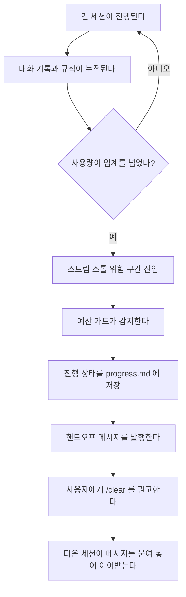
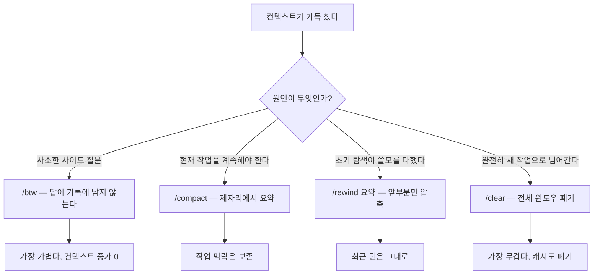

토큰 예산(token budget)은 한 세션이 쓸 수 있는 토큰의 한도, 곧 컨텍스트 윈도우(한 번에 담을 수 있는 정보의 양)의 용량을 뜻합니다. MoAI-ADK는 이 한도를 프로젝트 예산처럼 다룹니다. 얼마나 썼는지 추적하고, 한도에 가까워지면 미리 경고하고, 마침내 넘기 전에 안전하게 멈춥니다. 이것이 토크노믹스 네 층 가운데 "위험한 순간에 안전하게 멈추는" 예산 가드(budget guard) 층입니다. 에이전트(스스로 일하는 AI 도우미)가 컨텍스트 천장에 다다랐을 때 세션을 그냥 끊어 버리는 대신, 진행 상태를 남겨 다음 세션이 이어받게 하는 것을 안전한 중단(graceful abort)이라 부릅니다. 이 페이지는 그 메커니즘을 입문서 수준으로 풉니다.


플랫폼 계층의 배경 설명은 [컨텍스트 윈도우](/ko/claude-code/context-memory/context-window)에 있습니다. MoAI-ADK 기준 설명은 이 문서입니다.


## 토큰 예산이 무엇인가

한 세션이 돌 동안 컨텍스트 윈도우를 채우는 것은 대화 기록만이 아닙니다. 매 턴마다 오케스트레이터(전체 작업을 조율하는 지휘자)가 지침과 규칙을 다시 올리고, 에이전트가 돌려준 결과가 쌓이고, 읽어 들인 파일 내용이 더해집니다. SPEC(요구사항 명세서) 하나를 끝내는 과정에서 이런 재료가 누적되면 윈도우는 빠르게 차오릅니다. 토큰 예산 관리는 "이 창고가 차기 전에, 그리고 창고가 넘쳐 흘러 작업을 잃기 전에, 무엇을 할 것인가"를 묻는 일입니다.

MoAI-ADK의 대답은 세 단계로 요약됩니다. 먼저 **잰다** — 컨텍스트 사용량을 상태 파일로 기록하고 statusline에 비율로 보여 줍니다. 다음으로 **줄인다** — 윈도우를 비우는 가장 무거운 수단(`/clear`)으로 곧장 가기 전에, 더 가벼운 네 가지 수단을 먼저 씁니다(이어지는 '줄이기 사다리' 절). 마지막으로 **멈춘다** — 그래도 임계에 닿으면 진행 상태를 남기고 안전하게 중단해 다음 세션으로 넘깁니다.

## 예산 가드가 필요한 이유

Anthropic 스트리밍은 컨텍스트 윈도우 천장에 가까워지면 `stream_idle_partial` 상태로 간헐적인 스톨을 일으킵니다. 간헐적이긴 해도 임계값을 넘어서면 충분히 예측할 수 있는 현상입니다. 스톨이 나면 에이전트 호출이 스트림 도중에 실패해 그동안 쌓은 진행 상태를 잃을 수 있습니다. Claude Code 2.1.196부터는 스트리밍 아이들 와치독이 기본으로 켜져 5분간 이벤트가 없으면 자동으로 중단했다가 다시 시도합니다. 하지만 이 와치독은 스톨의 *결과*를 부드럽게 할 뿐, 스톨 *위험* 자체를 없애지는 않습니다. 천장 근처에서 한 턴을 낭비하는 비용은 그대로 남습니다.

예산 가드는 이 문제를 미리 막습니다. 컨텍스트 사용량이 임계에 닿기 전에 시스템이 먼저 안전한 중단을 수행하므로, 세션은 아무것도 잃지 않고 다음 단계로 넘어갑니다.



## 모델별 컨텍스트 임계치

운영 임계값은 모델마다 다릅니다. 윈도우가 크면 그만큼 높은 사용률까지 버틸 수 있고, 윈도우가 작으면 남는 여유 자체가 적습니다. 그래서 MoAI-ADK는 모델 클래스별로 서로 다른 임계값을 씁니다.

| 모델 클래스 | 윈도우 | 핸드오프 임계 | 절대 천장 |
|-------------|--------|---------------|-----------|
| Opus 5 (1M) | 1,000,000 토큰 | 50% | ~500,000 토큰 |
| Opus 4.8 (1M) | 1,000,000 토큰 | 50% | ~500,000 토큰 |
| GLM-5.2 (1M) | 1,000,000 토큰 | 50% | ~500,000 토큰 |
| Fable (256K) | 256,000 토큰 | 90% | ~230,000 토큰 |
| Sonnet / Opus 표준 (200K) | 200,000 토큰 | 90% | ~180,000 토큰 |
| Haiku (200K) | 200,000 토큰 | 90% | ~180,000 토큰 |

임계값의 의미를 헷갈리지 않는 것이 중요합니다. 1M 윈도우 모델의 임계가 50%라고 해서 이 모델이 200K 모델보다 일찍 멈춘다는 뜻은 아닙니다. 1M의 절반은 500,000 토큰으로, 200K 모델의 90%인 180,000 토큰보다 훨씬 넉넉합니다. 비율이 다른 이유는 윈도우가 클수록 스톨 위험이 지배하기 시작하는 시점이 비율상으로는 더 이르기 때문입니다. 절대량으로 보면 1M 모델이 훨씬 더 오래 버팁니다.

GLM-5.2(`moai glm` / `moai cg` GLM 패널)는 1M 컨텍스트 모델이므로 50% 임계로 운영합니다. Claude Code가 보고하는 `context_window_size`는 Claude 슬롯 기준(Opus=1M, Sonnet/Haiku=200K)이라, GLM 세션에서 원시 telemetry가 ~180K로 나와도 MoAI가 1M로 바로잡습니다. statusline의 CW% 게이지를 신뢰하세요.

## 줄이기 사다리 — /clear 전에 더 가벼운 수단

`/clear`는 손에 쥔 가장 무거운 수단입니다. 윈도우 전체를 버리기 때문에 따뜻하게 예열해 둔 프롬프트 캐시까지 함께 날아가고, 다음 턴은 항시 로드되는 지침 전체를 다시 지불하며 시작합니다. 그래서 MoAI-ADK는 `/clear`로 곧장 가기 전에 원인에 따라 골라 쓰는 네 가지 가벼운 수단을 먼저 봅니다. 사다리의 아래부터, 즉 가장 가벼운 것부터 올라갑니다.

- **`/btw <질문>`** — 사소한 사이드 질문을 던질 때. 답이 dismissible 오버레이에만 뜨고 대화 기록에 들어가지 않아 컨텍스트가 전혀 늘지 않습니다. 가장 가볍습니다.
- **`/compact <지시>`** — 윈도우가 찼지만 *지금 하던 작업*을 계속해야 할 때. 제자리에서 요약하며, 지시문이 무엇을 살릴지를 결정합니다.
- **`Esc Esc` / `/rewind` → 요약** — 초기 탐색은 쓸모가 다했지만 최근 턴은 그대로 두어야 할 때. 오래된 앞부분만 압축하고 꼬리를 보존합니다.
- **`Esc Esc` / `/rewind` → 체크포인트 복원** — 한 줄의 시도가 컨텍스트를 오염시켰거나 트리를 되돌려야 할 때. 프롬프트마다 찍히는 자동 스냅샷에서 대화와 파일을 복원합니다.

`/clear`는 진짜 작업 전환일 때 여전히 올바른 선택이며, 아래 임계값에서는 여전히 의무입니다. 사다리는 그 임계에 닿는 횟수를 줄일 뿐, 임계 자체를 옮기지는 않습니다.



## 2-단계 핸드오프 마커

statusline은 컨텍스트 바에 `/clear` 힌트를 두 단계로 표시합니다. 사용자가 statusline 게이지를 보고 판단할 수 있도록, 색상과 강도로 단계를 구분합니다.

-  **소프트 마커** — statusline 컨텍스트 바에 `/clear` 힌트가 경고 색상으로 뜹니다. 밴드의 소프트 임계에서 나타나며, `/clear`를 실행할지는 사용자가 판단하면 되는 권고 신호입니다.
-  **하드 마커** — statusline 컨텍스트 바에 `/clear` 힌트가 강한 경고 색상으로 뜹니다. auto-compact 인식 천장에서 나타나며, 다음 액션은 반드시 `/clear`여야 합니다.

한 가지 주의점이 있습니다. 하드 천장은 런타임 auto-compact 임계값 바로 옆에 잡히므로, auto-compact가 먼저 발동하는 일이 많습니다. 그래서 하드 마커는 실제로는 드물게 뜹니다. 이는 auto-compact 인식 공식이 감수한 트레이드오프입니다. 하드 마커가 보이지 않다고 안전한 것이 아니라, 소프트 마커에서 미리 대응하는 것이 정석입니다.

## 안전한 중단 절차

SPEC-TOKEN-BUDGET-STOP-001로 구현한 안전한 중단 메커니즘은 정해진 순서로 작동합니다. 핵심은 "끊는다"가 아니라 "상태를 남기고 넘긴다"입니다.

1. **감지** — 누적 사용량이 하드 임계(기본 0.90)에 닿으면 예산 가드가 이를 감지합니다.
2. **상태 저장** — 진행 중인 작업 상태를 `progress.md`에 영속화합니다.
3. **핸드오프 발행** — 붙여넣기 가능한 resume 메시지를 생성합니다.
4. **턴 종료 권고** — 사용자에게 `/clear`를 권고합니다.
5. **증거 영속화** — 검증 증거를 `.moai/state/verify/` 아래에 영속화합니다.

이 순서에서 사용자의 판단이 빠지는 지점은 없습니다. `/clear`는 결코 자동으로 실행되지 않으며, 시스템은 권고만 하고 실행 여부는 사용자가 정합니다.

## 핸드오프 메시지의 구조

세션 핸드오프 메시지는 여섯 블록 구조를 따릅니다. 다음 세션이 최소한의 정보만으로 작업을 이어받도록 짠 구조로, 각 블록이 한 가지 역할만 맡습니다.

```text
✂──── 여기부터 복사 ────✂

ultrathink. <SPEC-ID> <phase> 진입.
applied lessons: <memory-file-1>, <memory-file-2>

전제 검증:
1) <검증 가능한 전제 1>
2) <검증 가능한 전제 2>

실행: <명령 또는 액션>

머지 후: <다음 액션 또는 SPEC>

✂──── 여기까지 복사 ────✂
```

각 블록의 역할은 이렇습니다. 블록 1은 `ultrathink.` 오프너로 추론 깊이를 높이고 진입하는 단계와 SPEC-ID를 선언합니다. 블록 2는 이전 세션이 학습한 memory 파일을 참조합니다. 블록 3은 구분선과 `전제 검증:` 헤더로 다음 세션이 먼저 확인해야 할 전제를 나열하고, 블록 4는 각 전제를 검증 가능한 명령 한 줄로 채웁니다. 블록 5는 `실행:` 아래 단일 주요 액션을, 블록 6은 `머지 후:` 다음 액션이나 SPEC ID를 적습니다. 가위표 기호로 묶은 것은 터미널 스크롤백에서 복사 경계를 분명히 하기 위해서입니다.

## 검증 다이어트와 증거 영속화

예산 관리는 컨텍스트 윈도우만이 아니라 검증 출력에도 해당됩니다. 테스트나 린트 같은 검증 명령은 긴 출력을 쏟아내 컨텍스트를 빠르게 채웁니다. MoAI-ADK는 이 출력을 디스크로 돌리고 컨텍스트에는 exit code와 짧은 꼬리만 남기는 파일-리다이렉트 계약(file-redirect contract)을 씁니다. 기본적으로 출력이 50줄 또는 2KB 가운데 작은 쪽을 넘으면 파일로 돌리고, 요약만 인라인으로 둡니다. 증거를 버리는 것이 아니라 인라인 출력과 배너 재인용이 겹치는 이중 소비(double-burn)를 없애는 것입니다.

여기에 한 겹이 더 있습니다. 파일로 돌린 증거가 `/tmp`에 그대로 남으면 OS가 주기적으로 지워 버립니다(macOS 재부팅, Linux tmpfs 리마운트, systemd-tmpfiles). 인용한 경로에 파일이 없으면 감사 시점에 증거를 확인할 방법이 없습니다. 그래서 MoAI-ADK는 검증 증거를 `.moai/state/verify/<session>/` 아래에 남기도록 의무화합니다. 이 영역은 `context-usage.json` 같은 런타임 상태가 사는 gitignored 공간으로, `/tmp`가 비워진 뒤에도 감사 시점에 그대로 열어볼 수 있습니다. 정확히 어떻게 남길지(바로 기록할지, `/tmp`에 쓴 뒤 복사할지)는 구현 세부 사항이고, 계약이 못 박는 것은 의무입니다.

## 다음 단계

- [토크노믹스 개요](/ko/advanced/tokenomics-overview/) — 네 층 구조 전체 개관
- [3-티어 에이전트 아키텍처](/ko/advanced/no-haiku-3tier/) — 라우팅 층의 모델 정책 기초
