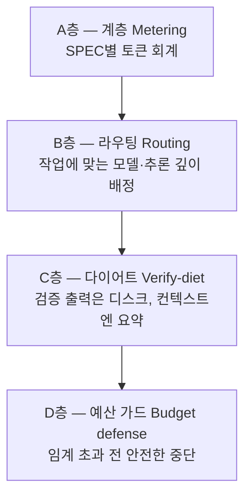
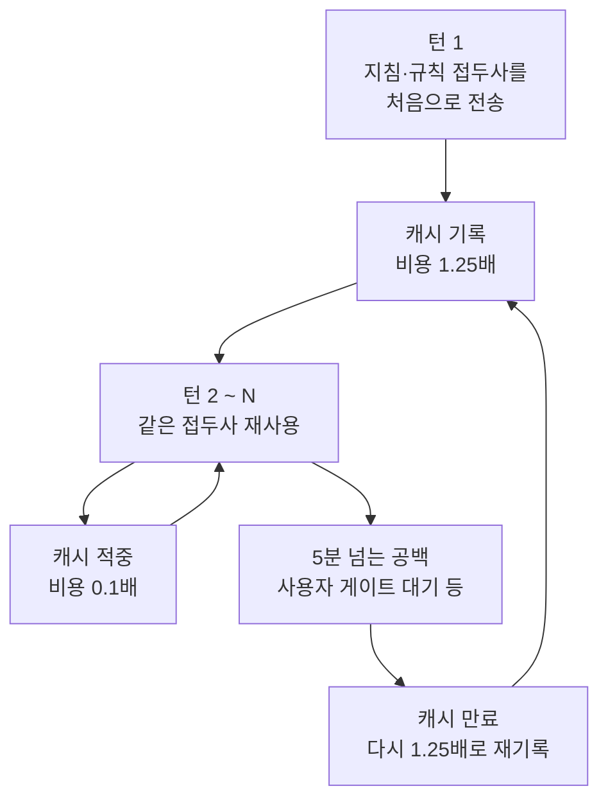

토크노믹스(Token Economics, 토큰 경제학)는 AI가 한 번의 작업에 토큰을 얼마나 쓰는지, 그 비용을 어떻게 줄이고 지켜내는지를 다루는 영역입니다. 친구에게 한 문장으로 말하자면 "똑같은 품질을 더 적은 토큰으로 뽑아내는 방법"이 토크노믹스입니다. 모델 가격이 내려가도 에이전트(스스로 일하는 AI 도우미)가 여럿 돌고 컨텍스트(한 번에 기억하는 정보)가 길어지면 한 세션의 토큰 소비는 가파르게 늘어납니다. 그래서 비용을 가르는 것은 단가표가 아니라 토큰을 어떻게 굴리느냐입니다. 이 페이지는 토크노믹스의 전체 구조를 짚고, 각 주제의 심화 페이지로 이어줍니다.


**한 줄 요약:** 토크노믹스는 "어떤 일에 어떤 모델을 얼만큼 깊게 생각시킬지를 가르고(라우팅), 컨텍스트를 가볍게 유지하며(다이어트), 위험한 순간에 안전하게 멈추는(예산 가드)" 네 층의 토큰 운용 방식입니다.


## 왜 모델 단가가 아니라 토큰인가

토큰 단가는 해마다 내려갑니다. 하지만 에이전틱 개발은 한 자리에서 대화하는 챗봇과 토큰 소비 양상이 다릅니다. 에이전트가 여러 개 돌고, 매 턴마다 지침과 규칙과 대화 기록이 누적되고, 추론이 깊어질수록 한 세션이 쓰는 토큰은 챗봇 한 턴과는 비교가 되지 않습니다. 단가 하락 속도보다 사용량 증가 속도가 빠른 상황에서는, 모델 하나의 가격을 깎는 것보다 "어떤 일에 어떤 모델을, 얼만큼 깊게 생각시킬지"를 가르는 것이 비용을 훨씬 크게 줄입니다.

여기에 컨텍스트 윈도우(한 번에 담을 수 있는 정보의 양)라는 물리적 한계가 겹칩니다. 컨텍스트가 천장에 닿으면 스트림이 멈추거나 이전 맥락이 잘려 나갑니다. 그러면 같은 설명을 반복하게 되고, 반복이 곧 토큰 낭비로 이어집니다. 그래서 토크노믹스는 단순히 "싸게 쓰자"가 아니라 "품질을 유지하면서 토큰을 덜 쓰고, 위험한 순간에는 안전하게 멈추자"는 문제를 풉니다.

MoAI-ADK가 이 문제에 대하는 세 가지 접근은 이렇습니다.

1. **작업마다 맞는 모델과 추론 깊이를 배정합니다** — 계획은 깊게, 구현은 가볍게, 검증은 독립적으로.
2. **컨텍스트를 다이어트합니다** — 항상 로드되는 지침을 최소화하고, 검증 출력은 디스크로 돌립니다.
3. **예산을 시스템이 지켜냅니다** — 토큰 사용을 추적하고, 임계를 넘기 전에 안전하게 멈춥니다.

## 세 가지 핵심과의 관계

MoAI-ADK v3.0의 가치는 세 가지 핵심으로 요약됩니다. 토크노믹스는 그 가운데 비용을 맡은 영역이고, 나머지 둘과 촘촘히 맞물려 돌아갑니다. 비용만 깎으면 품질이 무너지고 재작업이 따라오는데, 모든 토큰 지출 가운데 가장 비싼 것이 바로 재작업입니다. 그래서 비용은 품질 게이트가 재작업을 막아 줄 때 유지되고, 품질은 자율 루프가 검증된 패턴을 기억할 때 강제할 수 있으며, 자율 루프는 예산 가드가 한도를 넘기 전에 멈춰 줄 때 적정 가격에 머뭅니다.

 **토크노믹스** (이 페이지, 비용) — 측정하고, 라우팅하고, 다이어트하고, 예산 초과 전에 중단합니다.

 **에이전틱 루프 엔지니어링** (자기 개선) — 언제 멈추고 언제 계속할 것인가. [자율 연속 루프](/ko/advanced/autonomous-loops/) 페이지에서 다룹니다.

 **에이전틱 하네스(품질 검증 자동 장치)** (품질·통제) — 어떤 에이전트가, 어떤 프로필로, 어떻게 진화하는가. [3-티어 아키텍처](/ko/advanced/no-haiku-3tier/), [프로필 매트릭스](/ko/advanced/profile-matrix/), [하네스 자가 진화](/ko/advanced/self-evolving/) 페이지에서 다룹니다.

## 4-층 토크노믹스 구조

토크노믹스는 네 개의 층으로 이뤄집니다. 각 층은 따로 작동하면서도 서로를 보완합니다. 위에서 아래로 흐르는 한 줄로 읽으면 "무엇을 썼는지 알아야(계측) 줄일 수 있고, 줄이려면 어디에 얼마나 쓸지 가른 뒤(라우팅), 쓰는 동안 컨텍스트를 가볍게 유지하며(다이어트), 끝까지 지키지 못할 것 같으면 미리 멈춘다(예산 가드)"가 됩니다.

### A층 — 계층 (Metering)

 모든 에이전트 호출의 토큰 사용량을 SPEC(요구사항 명세서) 단위로 회계합니다. `moai spec audit` 출력의 토큰 컬럼과 `progress.md`의 토큰 회계 섹션이 이 층의 산출물입니다. 무엇이 토큰을 썼는지 모르면 줄일 수도 없습니다. 그래서 계층은 네 층 가운데 가장 먼저 자리잡습니다.

### B층 — 라우팅 (Routing)

 유지되는 에이전트마다 모델과 추론 깊이(effort, 모델이 한 번에 얼만큼 깊이 생각할지를 정하는 단계)를 선언적으로 배정합니다. 활성 프로필(`high` / `medium` / `low`)이 프로필 매트릭스의 한 열을 고르고, 각 에이전트를 그 일에 걸맞은 추론 깊이 단계에 앉힙니다. 단발성 기계 작업에는 Sonnet을, 멀티턴으로 이어지는 에이전틱 작업에는 Opus를 쓰고, 호출 빔이 가장 낮은 두 행에는 `max` effort를 얹어 비용 대비 품질을 끌어올립니다. 자세한 매트릭스는 [프로필 매트릭스](/ko/advanced/profile-matrix/) 페이지를 보세요.

### C층 — 다이어트 (Verify-diet)

 검증 명령이 쏟아내는 긴 출력을 디스크 파일로 흘려보내고, 컨텍스트에는 exit code와 bounded tail(최대 50줄)만 남깁니다. 이 파일-리다이렉트 계약 덕분에 검증 증거는 그대로 지키면서 컨텍스트 소비만 줄일 수 있습니다. 다이어트는 검증 출력에만 국한되지 않습니다. 항상 로드되는 지침을 줄이고, 프롬프트 캐시 적중률을 높이는 일도 이 층에 속합니다. 자세한 메커니즘은 [토큰 예산 관리와 안전한 중단](/ko/advanced/token-budget/) 페이지를 보세요.

### D층 — 예산 가드 (Budget defense)

 에이전트별 토큰 사용량이 hard-limit(기본 90%)에 닿으면 안전한 중단(graceful abort)을 수행합니다. 진행 상태를 `progress.md`에 저장하고 붙여넣기 가능한 핸드오프 메시지(paste-ready resume)를 발행하되, 자동 `/clear`는 하지 않습니다. 멈춤은 시스템이 권고하고 실행은 사용자가 판단합니다. 자세한 절차는 [토큰 예산 관리와 안전한 중단](/ko/advanced/token-budget/) 페이지를 보세요.

## 프롬프트 캐시: 같은 지침을 두 번째부터는 싸게

토크노믹스에서 자주 간과되는 비용 구조가 프롬프트 캐시(이전에 보낸 입력을 잠시 저장해 두는 기능)입니다. Anthropic의 프롬프트 캐싱은 렌더링된 요청의 앞부분(tools → system → messages 순서)에 대해 접두사 일치로 작동합니다. 처음 한 번은 그 접두사를 캐시에 기록해야 하므로 1.25배의 비용이 들지만, 이후 같은 접두사를 재사용하는 턴에서는 0.1배 비용으로 읽어 옵니다. 한 턴의 입력을 10배 가까이 싸게 만들 수 있는 구조입니다.

여기에는 두 가지 함정이 있습니다.

첫째, 캐시 수명은 5분입니다. 그런데 이 5분은 "5분 뒤에 만료"가 아니라 "5분 넘는 빈 시간이 끼면 만료"입니다. 사용자 게이트에서 답을 기다리는 시간이 길어지면 캐시가 만료되고, 다음 턴은 접두사 전체를 다시 1.25배로 기록해야 합니다. 그래서 늦게 물어보는 질문일수록 비용이 큽니다.

둘째, 캐시는 쓰는 중에는 읽을 수 없습니다. 같은 정의를 가진 에이전트 여럿을 한 번에 띄우면, 동시에 출발한 요청들은 첫 번째가 캐시에 기록하는 동안 기다려 주지 않으므로 모두가 차가운 상태(cold)로 접두사를 각자 다시 기록하게 됩니다.

이 구조 때문에 MoAI-ADK는 실행 순서를 의식적으로 조정합니다. 사용자 게이트는 컨텍스트가 작을 때 일찍 물어보고, 같은 종류 에이전트를 병렬로 띄울 때는 하나를 먼저 띄워 캐시를 따뜻하게 만든 뒤 나머지를 이어 띄우며(stagger-spawn), 세션 시작에 로드되는 지침 파일을 중간에 편집하지 않고 작업 끝으로 미룹니다. 캐시는 게이트 의미를 바꾸지 않습니다. 승인 게이트는 그대로 필수이고, 다만 그 게이트를 "언제, 어떤 순서로" 물을지만 다이어트 하는 것이 캐시 인식 실행입니다.

## 모델별 컨텍스트 임계치

예산 가드가 언제 멈출지를 정하는 운영 임계값은 모델마다 다릅니다. 윈도우가 크면 높은 사용률까지 버틸 수 있고, 윈도우가 작으면 남는 여유 자체가 적습니다.

| 모델 클래스 | 윈도우 | 핸드오프 임계 | 절대 천장 |
|-------------|--------|---------------|-----------|
| Opus 5 (1M) | 1,000,000 토큰 | 50% | ~500,000 토큰 |
| GLM-5.2 (1M) | 1,000,000 토큰 | 50% | ~500,000 토큰 |
| Fable (256K) | 256,000 토큰 | 90% | ~230,000 토큰 |
| Sonnet / Opus 표준 (200K) | 200,000 토큰 | 90% | ~180,000 토큰 |

1M 컨텍스트 모델(Opus 5, GLM-5.2)은 50%에서 핸드오프를 권고합니다. 윈도우가 넓다고 끝까지 쓰는 것이 아니라, 오히려 더 일찍 접어서 캐시와 여유를 지키는 것이 안정적입니다. statusline의 컨텍스트 게이지(CW%)를 보고 임계에 가까워지면 `/clear`를 준비합니다. 자세한 절차와 핸드오프 메시지 구조는 [토큰 예산 관리와 안전한 중단](/ko/advanced/token-budget/) 페이지에 있습니다.

## CG 모드: 하이브리드 비용 최적화

`moai cg`는 Claude 리더와 GLM 워커를 묶은 하이브리드 모드입니다. 전략과 계획, 감사는 Claude가 맡고, 대량 구현 작업은 GLM이 맡습니다. 구현 중심 작업에서 60~70%까지 비용을 줄일 수 있습니다.

GLM-5.2는 1M 컨텍스트 단일 모델이고 단가는 1M 토큰당 입력 $2 / 출력 $8이며, z.ai의 암시적 프롬프트 캐싱이 자동으로 걸립니다. Claude Code가 보고하는 `context_window_size`는 Claude 슬롯 기준이라 GLM 세션에서 원시 값이 ~180K로 나와도, MoAI가 1M로 바로잡아 50% 임계로 운영합니다. statusline의 CW% 게이지를 신뢰하세요. CG 모드와 GLM 단독 세션(`moai glm`)은 [다중 모델 감사](/ko/advanced/multi-model-audit/) 페이지에서 자세히 다룹니다.

## 구현 상태와 로드맵

이 페이지에 적힌 내용의 구현 상태를 분명히 갈라 둡니다.

 **구현 완료 (배포 중)** — 4-층 구조(A/B/C/D) 전 층, 3-티어 모델 정책(프로필 매트릭스 리졸버), CG 모드, 검증 다이어트 파일-리다이렉트 계약, 예산 가드의 안전한 중단 메커니즘.

 **설계 단계 (로드맵)** — GLM 백엔드에서 effort 오버레이가 실제로 어떻게 내려가는지는 라이브 GLM 세션의 아웃바운드를 직접 관찰해야 확인할 수 있는 실증 과제입니다. 프로필 매트릭스 페이지에도 이 구분을 함께 적어두었습니다.

## 다음 단계

- [토큰 예산 관리와 안전한 중단](/ko/advanced/token-budget/) — D층 심화 (모델별 임계치, paste-ready resume 구조, 검증 다이어트)
- [3-티어 에이전트 아키텍처](/ko/advanced/no-haiku-3tier/) — 왜 Haiku를 배제했는가, B층 라우팅의 모델 정책 기초
- [프로필 매트릭스](/ko/advanced/profile-matrix/) — 단일 3-열 per-agent 프로필 매트릭스
- [자율 연속 루프](/ko/advanced/autonomous-loops/) — 에이전틱 루프 엔지니어링 (세 가지 핵심 가운데 자기 개선)
