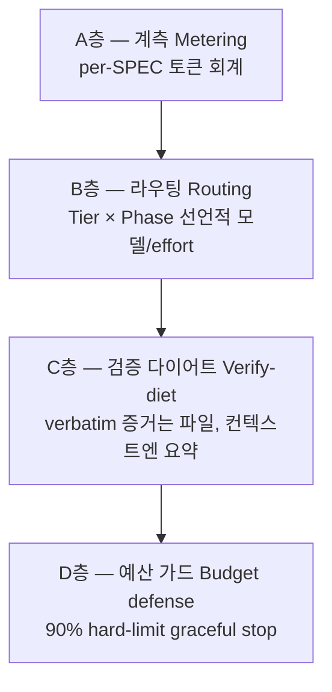

토크노믹스(Token Economics)는 MoAI-ADK v3.0의 세 가지 핵심 가운데 비용을 다루는 영역입니다. 토큰 단가가 내려가도 에이전틱 개발은 토큰을 워낙 많이 쓰기 때문에, 비용을 가르는 것은 모델 가격이 아니라 토큰을 어떻게 굴리느냐입니다. 이 페이지는 토크노믹스의 전체 구조를 훑고, 각 주제의 심화 페이지로 이어줍니다.

## 왜 토크노믹스인가

에이전트가 여러 개 돌고, 컨텍스트가 길어지고, 추론이 깊어질수록 한 세션의 토큰 소비는 가파르게 늘어납니다. 단가 하락이 사용량 증가를 따라가지 못하는 상황에서는, 하네스가 토큰을 어떻게 재고 라우팅하고 다이어트하고 지켜내는지가 곧 비용 경쟁력이 됩니다.

MoAI-ADK의 답은 세 가지입니다.

1. **작업마다 맞는 모델과 추론 깊이를 배정한다** — 계획은 깊게, 구현은 싸게, 검증은 독립적으로.
2. **컨텍스트를 다이어트한다** — 항시 로드되는 지침을 최소화하고, 프롬프트 캐시 적중률을 측정한다.
3. **예산을 시스템이 지킨다** — 토큰 사용을 추적하고, 임계 초과 전에 안전하게 멈춘다.

## 세 가지 핵심

v3.0의 제품 차별화는 세 가지 핵심으로 이뤄집니다. 토크노믹스는 그중 비용을 맡은 영역이고, 나머지 둘과 촘촘히 맞물려 있습니다.

 **토크노믹스** (이 페이지, 비용) — 측정하고, 라우팅하고, 다이어트하고, 예산 초과 전에 중단한다.

 **에이전틱 루프 엔지니어링** (자가개선) — 언제 멈추고 언제 계속할 것인가. [자율 연속 루프](/ko/advanced/autonomous-loops/) 페이지에서 다룹니다.

 **에이전틱 하네스** (품질·통제) — 어떤 에이전트가, 어떤 프로필로, 어떻게 진화하는가. [3-티어 아키텍처](/ko/advanced/no-haiku-3tier/), [프로필 매트릭스](/ko/advanced/profile-matrix/), [하네스 자가 진화](/ko/advanced/self-evolving/) 페이지에서 다룹니다.

## 4-층 토크노믹스 구조

토크노믹스는 네 개의 층으로 이뤄집니다. 층마다 따로 작동하면서도 서로를 보완합니다.

### A층 — 계측 (Metering)

 모든 에이전트 호출의 토큰 사용량을 SPEC 단위로 회계합니다. `moai spec audit` 출력의 토큰 컬럼과 progress.md의 토큰 회계 섹션이 이 층의 산출물입니다. 무엇이 토큰을 썼는지 모르면 줄일 수도 없습니다.

### B층 — 라우팅 (Routing)

 유지되는 에이전트마다 모델과 추론 깊이(effort)를 선언적으로 배정합니다. 활성 프로필(`high`/`medium`/`low`)이 프로필 매트릭스의 한 열을 고르고, 각 에이전트를 그 일에 걸맞은 추론 깊이 단계에 앉힙니다. Sonnet은 단발성 기계 작업 행에 남겨 비용 대비 품질을 끌어올립니다. 자세한 매트릭스는 [프로필 매트릭스](/ko/advanced/profile-matrix/) 페이지를 보세요.

### C층 — 검증 다이어트 (Verify-diet)

 검증 명령의 긴 출력을 디스크 파일로 흘려보내고, 컨텍스트에는 exit code와 bounded tail(최대 50줄)만 남깁니다. 이 파일-리다이렉트 계약(file-redirect contract) 덕분에 검증 증거는 그대로 지키면서 컨텍스트 소비만 줄일 수 있습니다. 자세한 메커니즘은 [토큰 예산 관리와 우아한 중단](/ko/advanced/token-budget/) 페이지를 보세요.

### D층 — 예산 가드 (Budget defense)

 에이전트별 토큰 사용량이 hard-limit(기본 90%)에 닿으면 우아한 중단(graceful abort)을 수행합니다. 진행 상태를 progress.md에 저장하고 붙여넣기 가능한 핸드오프 메시지(paste-ready resume)를 발행하되, 자동 `/clear`는 절대 하지 않습니다. 자세한 절차는 [토큰 예산 관리와 우아한 중단](/ko/advanced/token-budget/) 페이지를 보세요.

## 모델 티어 라우팅

B층의 라우팅을 구체화한 것이 모델 프로필 정책입니다. MoAI-ADK v3.0은 Haiku를 라우팅 모델 세트에서 빼고, 작업 성격에 맞춘 3-티어 구조로 일을 나눕니다 — 단발성 행에는 Sonnet, 멀티턴 에이전틱 행 전체에는 Opus, 호출 빈도가 가장 낮은 두 행에는 `max` effort를 씁니다. 이 설계의 근거와 프로필 매트릭스 구현은 다음 두 페이지에서 다룹니다.

- [3-티어 에이전트 아키텍처](/ko/advanced/no-haiku-3tier/) — 왜 Haiku를 배제했는가, DeepSWE 리더보드 근거
- [프로필 매트릭스](/ko/advanced/profile-matrix/) — 단일 3-열 per-agent 프로필 매트릭스

## CG 모드 (비용 최적화)

`moai cg`는 Claude 리더와 GLM 워커를 묶은 하이브리드 모드입니다. 전략, 계획, 감사는 Claude가 맡고 대량 구현 작업은 GLM이 맡습니다. 구현 중심 작업에서 60-70%까지 비용을 줄일 수 있습니다.

GLM-5.2는 1M 컨텍스트 단일 모델이고 단가는 1M 토큰당 입력 $2 / 출력 $8이며, z.ai의 암시적 프롬프트 캐싱이 자동으로 걸립니다. CG 모드와 GLM 단독 세션(`moai glm`)은 다중 LLM 섹션에서 자세히 다룹니다.

## 검증된 사실과 로드맵

이 페이지에 적힌 내용의 구현 상태를 분명히 갈라 둡니다.

 **구현 완료 (배포 중)** — 4-층 구조(A/B/C/D) 전 층, 3-티어 모델 정책(프로필 매트릭스 리졸버), CG 모드, 검증 다이어트 파일-리다이렉트 계약, 우아한 중단 메커니즘.

 **설계 단계 (로드맵)** — GLM 백엔드 effort 오버레이의 wire 유효성은 라이브 GLM 세션의 아웃바운드를 직접 관측해야 확인할 수 있는 실증 과제입니다. 프로필 매트릭스 페이지에도 이 구분을 함께 적어두었습니다.

## 다음 단계

- [토큰 예산 관리와 우아한 중단](/ko/advanced/token-budget/) — D층 심화 (모델별 임계치, paste-ready resume 구조)
- [3-티어 에이전트 아키텍처](/ko/advanced/no-haiku-3tier/) — 하네스 아키텍처 기초
- [프로필 매트릭스](/ko/advanced/profile-matrix/) — 단일 3-열 per-agent 프로필 매트릭스
