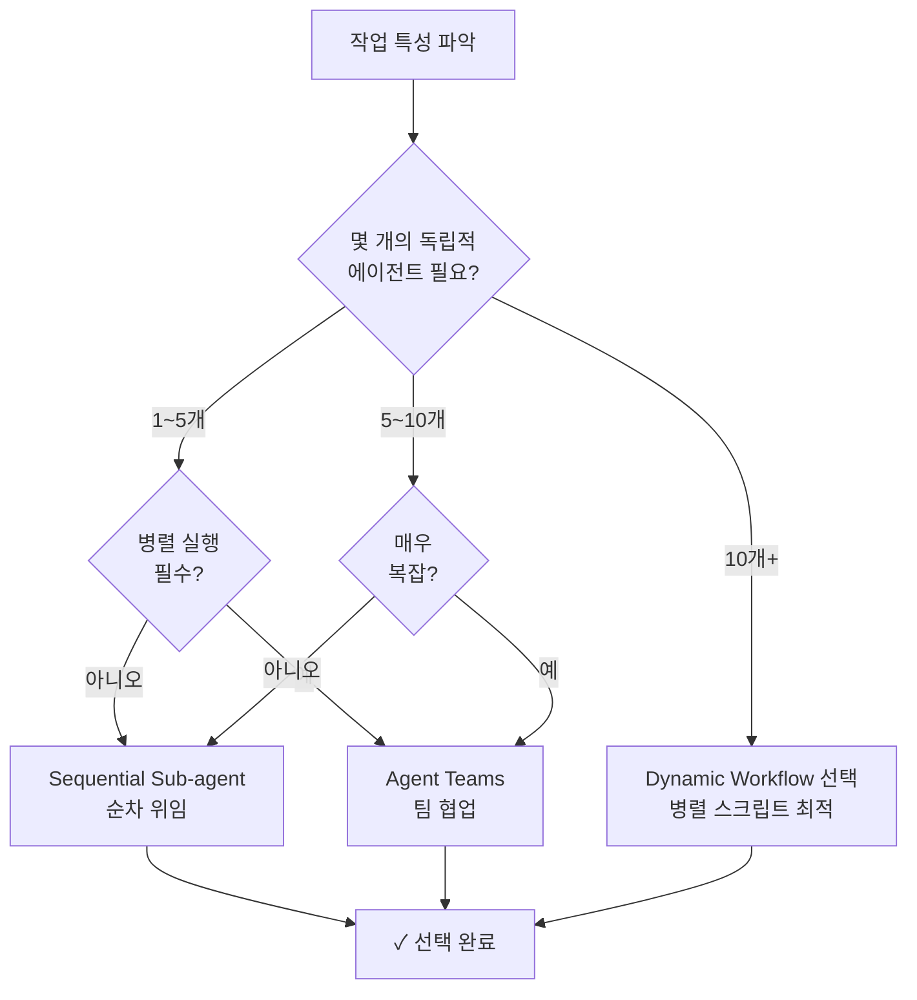

Claude Code의 동적 워크플로우 프리미티브와 MoAI-ADK의 Ultracode 통합을 안내합니다.


**한 줄 요약**: 동적 워크플로우는 JavaScript로 작성된 자동화 스크립트로, 수십~수백 개의 에이전트를 병렬 조율합니다. Ultracode는 `/effort ultracode` 또는 `ultracode` 키워드로 트리거됩니다.


## 3가지 오케스트레이션 프리미티브

MoAI-ADK는 **3가지 다른 오케스트레이션 프리미티브**를 제공하며, 각각은 다른 용도에 최적화되어 있습니다.

### 1. Sequential Sub-agents (순차 위임)

MoAI 기본 모드 — 한 턴마다 하나의 에이전트를 차례로 위임합니다.

| 특성 | 설명 |
|------|------|
| **계획 위치** | Claude의 컨텍스트 (turn-by-turn 판단) |
| **중간 결과** | Claude의 컨텍스트 윈도우에 누적 |
| **병렬도** | 순차 실행 (1개 에이전트 per turn) |
| **규모** | 일반적으로 3~5개 에이전트 |
| **컨텍스트 비용** | 각 에이전트 결과가 컨텍스트 소비 |

**사용 시점**:
- 간단한 1~5개 에이전트 작업
- 코딩 중심 run-phase 작업
- 에이전트 간 의존성이 많은 경우

### 2. Agent Teams (팀 협업)

여러 팀원이 **공유 TaskList**로 협업하는 고급 모드입니다.

| 특성 | 설명 |
|------|------|
| **계획 위치** | 공유 TaskList (팀 간 조율) |
| **중간 결과** | TaskList + 각 팀원의 컨텍스트 |
| **병렬도** | 3~5명 동시 실행 (Anthropic 권장) |
| **규모** | 소규모 팀 (3~5명) |
| **컨텍스트 비용** | 팀원별 독립 컨텍스트 |

**사용 시점**:
- 여러 팀원이 병렬 작업
- 크로스레이어 의존성 (백엔드 ↔ 프론트엔드)
- 팀원 간 손꼽질과 리뷰 필요

### 3. Dynamic Workflows (동적 워크플로우)

JavaScript로 작성된 **자동화 스크립트**로 다수의 에이전트를 조율합니다.

| 특성 | 설명 |
|------|------|
| **계획 위치** | 스크립트 코드 (선언적 계획) |
| **중간 결과** | 스크립트 변수 (컨텍스트 누적 없음) |
| **병렬도** | 최대 16 동시 (최대 1000 총) |
| **규모** | 매우 큼 (수십~수백 에이전트) |
| **컨텍스트 비용** | 최종 결과만 컨텍스트 소비 |

**사용 시점**:
- 대규모 병렬 작업 (수십~수백 에이전트)
- 코드베이스 전체 스캔
- 대규모 마이그레이션
- 크로스 소스 검증

## 선택 결정 트리

어떤 프리미티브를 선택할지 판단하는 흐름도입니다.



## Ultracode와 Dynamic Workflows

### /effort ultracode

```bash
/effort ultracode
```

현재 세션의 모든 substantive 작업에 대해 **자동 워크플로우 생성**을 활성화합니다.

**효과**:
- Reasoning effort: `xhigh`로 설정
- 자동 워크플로우 생성 활성화
- 각 작업마다 최적 오케스트레이션 프리미티브 선택

**사용 시점**:
- 매우 복잡한 멀티페이즈 작업
- 자동 오케스트레이션이 필요한 대규모 프로젝트

### ultracode 키워드

단일 요청에서 워크플로우를 트리거합니다.

```bash
> 우리 codebase의 모든 TODO 주석을 찾아서 분류해줘.
> (ultracode keyword를 포함하지 않으면 일반 sub-agent 실행)

VS

> ultracode: 우리 codebase의 모든 TODO 주석을 찾아서 분류해줘.
> (워크플로우 자동 생성)
```

## Dynamic Workflow 구조

### 기본 스크립트 템플릿

```javascript
// 워크플로우 스크립트: 코드베이스 전체 TODO 분류
const packages = [
  "internal/auth",
  "internal/api",
  "internal/db",
  "pkg/utils"
];

const results = [];

for (const pkg of packages) {
  // 각 패키지마다 독립 에이전트 생성
  const result = await agent({
    agentType: "Explore",
    model: "haiku",
    effort: "low",
    prompt: `
      ${pkg} 패키지에서 모든 TODO 주석을 찾고 분류하세요.
      형식: [파일] [라인] [카테고리] [내용]
    `
  });
  results.push({ pkg, todos: result });
}

// 최종 종합
const summary = {
  total_packages: packages.length,
  package_summaries: results,
  grand_total_todos: results.reduce((sum, r) => sum + r.todos.length, 0)
};

return summary;
```

### 특징

| 항목 | 설명 |
|------|------|
| **에이전트 생성** | 루프로 동적 생성 (`await agent({...})`) |
| **중간 결과** | 스크립트 변수에 저장 (컨텍스트 미누적) |
| **병렬 실행** | 독립적 작업은 자동 병렬 (최대 16 동시) |
| **최종 반환** | 통합 결과만 현재 세션으로 반환 |

## MoAI 통합 고려사항

### AskUserQuestion 제약

워크플로우 에이전트는 사용자와 **직접 상호작용 불가**합니다.

```
❌ 워크플로우 에이전트가 사용자 질문 발생 → 불가능
✓ MoAI 오케스트레이터가 사전에 모든 선택지 수집 → 워크플로우 실행
```

**해결 방식**:
1. MoAI 오케스트레이터가 `AskUserQuestion` 호출
2. 사용자 응답 수집
3. 응답을 워크플로우 입력에 포함하여 실행

### Implementation Kickoff Approval

워크플로우 실행도 일반 run-phase와 동일하게 사용자 승인이 필요합니다.

```
/moai run --workflow SPEC-XXX

→ MoAI: "이 SPEC을 워크플로우로 실행합니다. 진행할까요?"
→ AskUserQuestion 승인 필수
```

### 비용 인식

동적 워크플로우는 **높은 토큰 소비**를 야기할 수 있습니다.

| 작업 | 에이전트 수 | 예상 비용 |
|------|-----------|---------|
| 소규모 패키지 스캔 | 5 | 낮음 |
| 중규모 코드베이스 | 20 | 중간 |
| 전체 리포 스캔 | 100+ | 높음 |

**비용 조절**:
- 모델: `haiku` 사용 (read-only 추출)
- 에이전트 수: 범위 제한 (`packages.slice(0, 20)`)
- 병렬도: 최대 16에서 수동 조정

## Workflow 활성화 및 설정

### 활성화 조건

동적 워크플로우는 다음 조건에서만 실행됩니다:

1. Claude Code v2.1.154+
2. 유료 플랜 (Pro 또는 Team)
3. `/config`에서 `"disableWorkflows": false`

### 비활성화

조직 또는 사용자 수준에서 비활성화 가능:

```bash
/config
# Dynamic workflows toggle 끄기

OR

export CLAUDE_CODE_DISABLE_WORKFLOWS=1
```

## 관련 문서

- [Harness v4 Builder](/advanced/builder-agents) - 동적 팀 생성
- [에이전트 가이드](/advanced/agent-guide) - 에이전트 시스템 개요
- [SPEC 기반 개발](/workflow-commands/moai-plan) - 통합 워크플로우


**팁**: 규모가 작다면 Sequential Sub-agents가 충분합니다. 동적 워크플로우는 "수십~수백 개의 독립적 작업을 병렬 조율해야 할 때"만 사용하세요.

