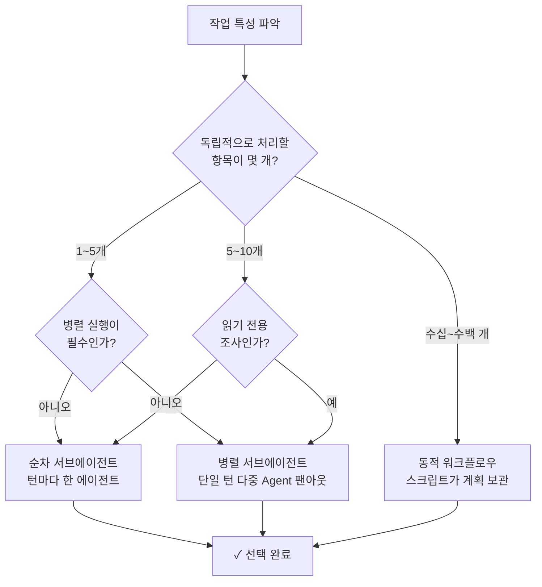
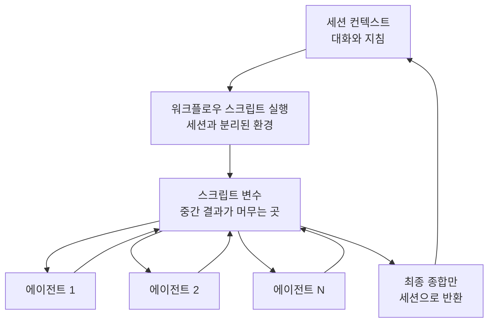

에이전트(스스로 일하는 AI 도우미) 100개를 한 턴에 하나씩 차례로 위임하면, 대화 창이 먼저 무너집니다. 각 에이전트가 돌려주는 중간 결과가 모두 오케스트레이터의 컨텍스트(한 번에 기억할 수 있는 대화 창)에 쌓이기 때문입니다. 동적 워크플로우(Dynamic Workflow)는 이 문제를 계획을 대화 창이 아니라 **스크립트 변수**에 두는 방식으로 풉니다. 수십~수백 개의 에이전트를 한꺼번에 펼쳐 놓으면서도, 정작 대화 창이 감당하는 건 마지막 종합 결과 한 덩어리뿐입니다. 대규모 팬아웃(여러 갈래로 작업을 펼치는 방식)을 열어주면서 컨텍스트 비용은 눌러두는, 토크노믹스와 루프 엔지니어링이 만나는 지점입니다.


**한 줄 요약**: 동적 워크플로우는 JavaScript로 작성된 자동화 스크립트로, 수십~수백 개의 에이전트를 병렬 조율합니다. `ultracode`는 이 워크플로우를 켜는 트리거 키워드이고, `/effort ultracode`는 세션 전체에서 자동 워크플로우 조율을 켜는 스위치입니다.



동적 워크플로우라는 런타임 프리미티브 자체의 배경 설명은 [다이내믹 워크플로우](/ko/claude-code/agentic/workflows)에 있습니다. 이 문서는 그 프리미티브를 MoAI-ADK가 어떻게 끌어다 쓰는지를 다룹니다.


## Step 1. 세 가지 오케스트레이션 프리미티브부터 가른다

동적 워크플로우를 켜기 전에, 지금 작업이 정말로 동적 워크플로우에 맞는지부터 확인해야 합니다. MoAI-ADK는 다중 단계 작업을 맡길 **3가지 오케스트레이션 프리미티브**(실행을 조율하는 기본 단위)를 제공하며, 선택 기준은 한 가지입니다. "계획을 누가 들고 있는가."

| 프리미티브 | 다음 단계를 누가 결정 | 중간 결과 | 규모 | 반복 단위 |
|-----------|----------------------|----------|------|-----------|
| **순차 서브에이전트** | Claude가 턴마다 판단 | Claude의 컨텍스트에 누적 | 한 턴에 몇 개 | 에이전트 정의 |
| **에이전트 팀** | Claude와 팀원이 공유 TaskList로 | 각 팀원의 컨텍스트 | 3~5명 팀 | 팀 구성 |
| **동적 워크플로우** | **스크립트** | **스크립트 변수** | 수십~수백 에이전트 | 조율 스크립트 |

순차 서브에이전트와 에이전트 팀은 계획을 Claude의 컨텍스트에 둡니다. Claude가 턴마다 다음 수를 결정하므로 유연하지만, 에이전트가 늘어날수록 컨텍스트가 부풀어 올라 비용과 지연이 같이 커집니다. 동적 워크플로우는 계획을 코드로 옮깁니다. 스크립트가 루프와 분기, 중간 결과를 모두 품고 있기 때문에, 세션 컨텍스트는 마지막 정답 한 개만 받습니다. 이 차이 덕분에 서로 독립적인 에이전트들이 서로의 결과를 교차 검증하는 품질 패턴을 반복 가능한 스크립트 하나로 담아낼 수도 있습니다.


v3.0에서 MoAI의 에이전트 팀 **정적 오케스트레이션 계층은 은퇴**했습니다. `--team`을 강제해도 순차 서브에이전트 모드로 폴백합니다. 다만 Claude Code의 네이티브 teammate 런타임(`moai cg`의 tmux 분할 창)은 그대로 동작합니다.


### 선택 결정 트리

어떤 프리미티브를 고를지 판단하는 흐름도입니다. 작업의 **모양과 물량**으로 라우팅합니다.


```mermaid
flowchart TD
    START["작업 특성 파악"] --> Q1{"독립적으로 처리할<br/>항목이 몇 개?"}
    Q1 -->|"1~5개"| Q2{"병렬 실행이<br/>필수인가?"}
    Q1 -->|"5~10개"| Q3{"읽기 전용<br/>조사인가?"}
    Q1 -->|"수십~수백 개"| WF["동적 워크플로우<br/>스크립트가 계획 보관"]
    Q2 -->|"아니오"| SEQ["순차 서브에이전트<br/>턴마다 한 에이전트"]
    Q2 -->|"예"| PAR["병렬 서브에이전트<br/>단일 턴 다중 Agent 팬아웃"]
    Q3 -->|"예"| PAR
    Q3 -->|"아니오"| SEQ
    SEQ --> DONE["✓ 선택 완료"]
    PAR --> DONE
    WF --> DONE
```

코딩 중심의 run-phase 작업은 대부분 진짜 병렬로 쪼개지기 어렵기 때문에, 기본값은 순차 서브에이전트입니다. 동적 워크플로우는 코드베이스 전체 스캔, 수백 군데의 호출 지점을 바꾸는 대규모 마이그레이션, 여러 소스를 서로 교차 검증해야 하는 리서치처럼 **물량이 크고 항목이 서로 독립적인** 작업에만 가져갑니다.

## Step 2. ultracode로 워크플로우를 켠다

동적 워크플로우를 트리거하는 스위치는 두 가지입니다. 세션 전체에 걸칭 모드와, 한 번의 요청에만 걸치는 키워드입니다. 두 방식은 "얼마나 오래 켜져 있는가"가 다를 뿐, 같은 워크플로우 런타임을 구동합니다.

### 세션 전체: `/effort ultracode`

```bash
/effort ultracode
```

현재 세션에서 "실질적인 작업마다 워크플로우를 자동으로 만들어 구동"을 켭니다. 세 가지가 함께 바뀝니다.

- 추론 깊이(reasoning effort)가 `xhigh`로 올라갑니다.
- 이후 각 작업에 대해 알아서 적정 오케스트레이션 프리미티브를 골라 워크플로우 스크립트를 작성합니다.
- 한 번 구동된 워크플로우는 다음 작업으로 넘어가도 이어집니다.

세션 전체 모드이므로, **모든 작업이 더 많은 토큰을 씁니다**. 매 작업마다 워크플로우가 붙기 때문입니다. 그래서 일상적인 단순 작업에는 과하고, 복잡한 멀티페이즈 작업에만 빛을 봅니다. 새 세션이 시작되면 모드는 원래대로 돌아가고, 단발 작업으로 되돌리려면 `/effort high`로 한 단계 내립니다.

### 단일 요청: `ultracode` 키워드

세션 전체가 아니라 한 요청에만 워크플로우를 걸고 싶을 때는 키워드를 붙입니다.

```text
ultracode: 우리 코드베이스의 모든 TODO 주석을 찾아서 카테고리별로 분류해줘.
```

같은 문장이라도 키워드가 빠지면 일반 서브에이전트 실행으로 빠지고, 키워드가 들어가면 그 요청 한 건에 한해 워크플로우가 자동 생성됩니다.


`/effort ultracode`는 세션 단위 모드이기 때문에, 세션 경계를 넘지 않습니다. resume(이어하기) 메시지의 `ultrathink.` 오프너가 되돌리는 것은 추론 깊이뿐이며, 자동 워크플로우 조율은 새 세션에서 직접 다시 켜야 합니다.


## Step 3. 워크플로우 스크립트를 작성한다

동적 워크플로우의 본체는 JavaScript 스크립트입니다. Claude가 작업에 맞춰 스크립트를 작성하면, Claude Code 런타임이 이 스크립트를 세션과 분리된 환경에서 실행합니다. 핵심은 아래 흐름도에 담긴 "중간 결과는 스크립트에 머문다"는 한 줄입니다.


```mermaid
flowchart TD
    SESS["세션 컨텍스트<br/>대화와 지침"] --> RUN["워크플로우 스크립트 실행<br/>세션과 분리된 환경"]
    RUN --> VARS["스크립트 변수<br/>중간 결과가 머무는 곳"]
    VARS --> A1["에이전트 1"]
    VARS --> A2["에이전트 2"]
    VARS --> AN["에이전트 N"]
    A1 --> VARS
    A2 --> VARS
    AN --> VARS
    VARS --> FINAL["최종 종합만<br/>세션으로 반환"]
    FINAL --> SESS
```

### 기본 템플릿

```javascript
// 워크플로우 스크립트: 코드베이스 전체 TODO 주석 분류
// args로 패키지 목록을 주입받고, 본문은 결정론적으로 유지한다.
const packages = (args && args.trim())
  ? args.split(/\s+/)
  : ["internal/auth", "internal/api", "internal/db", "pkg/utils"];

const results = [];

for (const pkg of packages) {
  // 패키지마다 읽기 전용 에이전트를 하나 띄운다.
  const result = await agent({
    agentType: "Explore",
    model: "sonnet",
    effort: "low",          // 읽기 전용 추출 용도 → low 추론 (Step 4 참고)
    prompt: `${pkg} 패키지에서 모든 TODO 주석을 찾아 분류하세요.
형식: [파일] [라인] [카테고리] [내용]`
  });
  results.push({ pkg, todos: result });
}

// 최종 종합만 세션으로 돌려보낸다.
return {
  total_packages: packages.length,
  grand_total_todos: results.reduce((sum, r) => sum + r.todos.length, 0),
  package_summaries: results
};
```

이 템플릿이 보여주는 네 가지 습관이 동적 워크플로우의 기본기입니다. 첫째, 에이전트는 루프 안에서 `await agent({...})`로 동적으로 만듭니다. 둘째, 중간 결과는 스크립트의 `results` 배열에 담겨 세션 컨텍스트를 잡아먹지 않습니다. 셋째, 독립적인 작업은 런타임이 알아서 병렬로 돌립니다(최대 16개 동시, 실행 1회당 최대 1000개 에이전트가 상한). 넷째, 세션으로 돌아오는 건 `return` 한 줄의 종합 결과뿐입니다.

### 결정론(정해진 값)을 지킨다

가장 자주 걸리는 함정은 스크립트 본문에서 시계(`Date.now()`)나 난수(`Math.random()`)를 부르는 것입니다. 워크플로우는 실행을 멈췄다가 같은 세션 안에서 다시 이어할 수 있는데, 이 "이어하기" 캐시는 스크립트가 결정론적으로 내뱉는 결과를 키로 삼습니다. 본문에서 시계나 난수를 부르면 이어하기 때 결과가 달라져 캐시가 조용히 깨집니다. 시간이나 난수가 필요하면 `args` 입력으로 주입받거나, 실행이 끝난 뒤 결과에 찍어야 합니다. 프롬프트 문자열이나 주석 안에서 이 함수 이름을 언급하는 것은 괜찮습니다 — `agent()` 호출부에서 실제로 부르는 것만 문제입니다.

## Step 4. 용도별로 모델과 추론 깊이를 배정한다

팬아웃 규모는 곧 비용입니다. 그래서 각 `agent()` 호출에는 그 에이전트가 무슨 용도인지에 따라 알맞은 `(model, effort)` 짝을 직접 적어 줍니다. 추론 깊이(effort)를 생략하면 세션 기본값을 물려받는데, 세션이 `xhigh`로 돌고 있었다면 읽기 전용 추출 에이전트조차 `xhigh`로 돌아가 토큰이 조용히 새어 나갑니다.

| 용도 | 예시 | 추천 모델 | 추천 effort |
|------|------|-----------|-------------|
| **읽기 전용 추출** | 패키지별 의존성 그래프·공개 표면 추출, 기계적 grep 스윕 | sonnet | **low** |
| **기계적 변환** | 호출 지점 이름 바꾸기, API 모양 바꾸기 같은 대규모 마이그레이션 | sonnet | medium |
| **종합** | 결정론적 추출 위에 얹는 아키텍처 종합, 다중 소스 리서치 종합 | sonnet | high |
| **연구** | 교차 검증과 투표가 붙는 리서치, 단일 주제 심층 조사 | sonnet 또는 opus | high 또는 xhigh |
| **검증·판정** | 코드 리뷰, 독립적 plan/SPEC 감사, 품질 채점 | sonnet 또는 opus | xhigh |
| **구현** | 백엔드·프론트엔드 코드 생성, 테스트 작성 | sonnet 또는 opus | xhigh |

읽기 순서가 있습니다. 한 에이전트가 여러 용도를 띠면, 표에서 가장 추론이 높은 용도에 맞춥니다. 용도가 애매하면 더 싼 추론 쪽으로 보냅니다 — 읽기 전용 추출을 과하게 추론시키면 토큰이 조용히 새고, 검증·판정을 낮게 추론시키면 놓치는 결함이 생깁니다. 두 비용의 대칭성을 기억해 두면 좋습니다.

### 비용 조절 레버

| 레버 | 어떻게 | 효과 |
|------|--------|------|
| 모델 | 읽기 전용 추출은 `sonnet` low effort | 단가가 가장 싼 조합 |
| 범위 | `packages.slice(0, 20)`으로 처리 대상 자르기 | 에이전트 수 자체를 줄임 |
| 병렬도 | 동시 실행을 16 아래로 수동 조정 | 동시 토큰 피크를 낮춤 |
| 크기 가이드 | `/config`의 워크플로우 크기 설정(small/medium/large/unrestricted) | 기본 medium은 15개 미만을 목표 |

## Step 5. 실행하고 모니터링하고 이어한다

스크립트가 정해지면, 그 다음부터는 실행과 관리입니다. Claude Code 런타임은 스크립트를 세션과 분리된 환경에서 돌리며, 스크립트 본문은 파일 시스템이나 셸에 직접 닿지 않습니다 — 읽고 쓰고 명령을 내리는 건 에이전트들이고, 스크립트는 그 에이전트들을 조율할 뿐입니다.

### 실행 중 관리 — `/workflows` TUI

워크플로우가 돌아가는 동안 `/workflows` 터미널 UI로 실행을 관리합니다.

| 키 | 동작 |
|----|------|
| `p` | 일시정지(pause) |
| `x` | 취소·정지(cancel/stop) |
| `s` | 끝난 실행의 스크립트를 재사용 가능한 명령으로 저장(save) |
| `r` | 일시정지한 실행을 다시 잇기(resume) |

### 같은 세션 안에서 이어하기

실행은 같은 세션 안에서 이어 올릴 수 있습니다. 이미 끝난 에이전트는 캐시된 결과를 돌려주고, 나머지만 살아서 돕니다. 단, Claude Code를 빠져나갔다가 다음 세션을 열면 실행은 처음부터 다시 시작됩니다. 워크플로우 에이전트는 항상 `acceptEdits` 모드로 돌아가 세션의 도구 허용 목록을 물려받으므로, 오래 걸리는 실행 전에 에이전트가 필요한 명령을 허용 목록에 미리 넣어 두면 실행 도중 허락 프롬프트에 걸리지 않습니다.

### 두 종류의 승인 게이트

워크플로우 실행에는 두 겹의 승인이 관여합니다. 둘을 섞지 않는 것이 중요합니다.

- **실행 단위 승인**(런타임이 묻습니다) — 권한 모드에 따라 다릅니다. 기본 모드나 accept-edits 모드에서는 실행할 때마다, 자동 모드에서는 처음 한 번만, 우회 모드와 헤드리스 `-p`, SDK에서는 아예 묻지 않습니다.
- **구현 착수 승인** (Implementation Kickoff Approval, MoAI가 묻습니다) — 계획이 구현으로 넘어가는 휴먼 게이트입니다. 이 게이트는 워크플로우 밖, 오케스트레이터가 워크플로우를 띄우기 전에 결정됩니다. 워크플로우가 그 게이트를 대신하지 않습니다.

## MoAI의 안전망이 워크플로우에도 그대로 묶인다

동적 워크플로우는 run-phase를 실행하는 기제 중 하나입니다. 그래서 MoAI의 안전망이 느슨해지는 일은 없습니다. 오히려 팬아웃이 클수록 안전망이 더 중요해집니다.

**사용자 상호작용 경계.** 워크플로우 안의 에이전트는 사용자에게 직접 묻지 못합니다. 일반 서브에이전트와 같은 비대칭 경계가 걸려 있습니다. 그래서 오케스트레이터가 워크플로우를 띄우기 **전에** `AskUserQuestion`으로 필요한 선택을 모두 모아서 입력에 넣어 둡니다.

**구현 착수 승인.** SPEC(요구사항 명세서) 하나를 워크플로우로 돌리든, 코드베이스 스캔을 돌리든, 구현으로 들어가는 휴먼 게이트는 일반 run-phase와 똑같이 필수입니다. 팬아웃 규모가 휴먼 게이트를 없애주지 않습니다.

**비용 인식.** 동적 워크플로우는 컨텍스트를 아끼는 대신 **총 토큰 소비는 훨씬 클 수 있습니다**. 팬아웃 규모가 곧 비용이라는 점을 사용자에게 미리 보여주고 큰 팬아웃을 열어야 합니다. 실행 한 번이 같은 작업을 대화로 처리할 때보다 눈에 띄게 많은 토큰을 쓸 수 있으며, 이는 세션 사용량과 컨텍스트 창 임계값에 그대로 합산됩니다.

## 세션 밖 팬아웃 — `claude -p` 배치

세 개의 프리미티브는 모두 한 세션 안에서 돕니다. 작업이 "세션 하나가 감당해야 할 양"을 넘어설 때 — 수천 개 파일을 건드리는 기계적 변환 같은 경우 — 병렬의 단위는 세션 밖으로 나갑니다. 셸 루프가 항목마다 한 번씩 비대화형 `claude -p`를 부르고, 각 호출은 자기만의 새 컨텍스트를 쓰고 끝날 때 같이 죽습니다.

```bash
# 항목마다 새 비대화형 호출을 한 번씩 (allowedTools가 안전망)
for file in $(cat files.txt); do
  claude -p "$file를 <옛 패턴>에서 <새 패턴>으로 옮기고 OK 또는 FAIL을 돌려줘" \
    --allowedTools "Edit,Bash(git commit *)"
done
```

이 방식이 이런 작업에 맞는 이유는 세 가지입니다. 항목별 컨텍스트 격리(900번 항목이 1번 항목의 파일 내용을 짊어지지 않음), `--allowedTools`가 곧 안전망(아무도 지켜보지 않으므로 프롬프트를 줄이는 대신 도구를 정확히 한정), 프롬프트는 모든 항목에서 고정(중간에 고칠 수 없음). **전체 세트를 돌리기 전에 2~3개 항목으로 보정**하는 것이 핵심입니다. 처음 몇 개가 "의도한 것"과 "실제 하는 것"의 차이를 드러내고, 나머지 N개는 그 차이를 그대로 물려받습니다.

동적 워크플로우와 이 배치를 나누는 기준은 "결과들이 어디서 만나야 하는가"입니다. 워크플로우는 중간 결과를 스크립트 변수에 모아 종합·교차 검증·적대적 리뷰를 한 단계 더 돌립니다 — 항목들이 서로 정보를 주고받을 때 씁니다. 반면 `claude -p` 배치는 공유 상태도 종합 단계도 없고, 합산이 "통과/실패" 집계 하나뿐이어야 할 때 — 항목들이 정말로 서로 독립일 때 — 맞습니다.

## 활성화 조건과 끄기

### 켜는 조건

동적 워크플로우가 돌려면 세 가지가 필요합니다.

1. Claude Code v2.1.154 이상(리서치 프리뷰).
2. 유료 플랜. Claude API·Amazon Bedrock·Google Vertex AI·Microsoft Foundry에서 사용 가능하며, Pro 플랜에서는 `/config`로 켭니다.
3. `/config`에서 `"disableWorkflows": false`.

### 끄기

사용자 또는 조직 단위로 끌 수 있습니다.

```bash
# 사용자 단위 끄기
/config
# Dynamic workflows 토글을 끕니다

# 또는 환경변수로
export CLAUDE_CODE_DISABLE_WORKFLOWS=1
```

조직 관리자는 관리 설정 `workflowKeywordTriggerEnabled`를 `false`로 두어 키워드 트리거를 조직 전체에 끌 수 있습니다. 꺼지면 번들된 워크플로우 명령을 쓸 수 없고 `ultracode` 키워드도 듣지 않으며, `/effort` 메뉴에서 `ultracode`가 빠집니다. MoAI는 배포 템플릿에서 워크플로우를 강제로 켜거나 끄지 않고, 그 선택은 사용자와 조직에 맡겨 둡니다.

## 관련 문서

- [빌더 에이전트와 하네스 v4](/ko/advanced/builder-agents) — 동적 팀 생성
- [에이전트 가이드](/ko/advanced/agent-guide) — 에이전트 시스템 개요
- [SPEC 기반 개발](/ko/workflow-commands/moai-plan) — 통합 워크플로우
- [다이내믹 워크플로우(플랫폼)](/ko/claude-code/agentic/workflows) — 런타임 프리미티브 배경


**팁**: 규모가 작다면 순차 서브에이전트로 충분합니다. 동적 워크플로우는 "수십~수백 개의 독립적인 작업을 병렬로 조율해야 할 때"에만 가져가세요. 팬아웃 자체가 비용이라는 점을 잊지 마세요.

