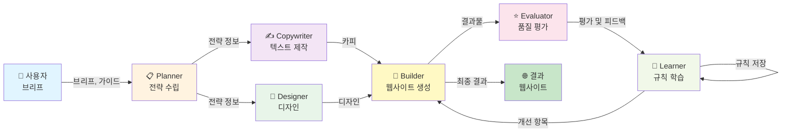

# AI Agency

## AI Agency란?

AI Agency는 사용할수록 사용자 업무에 맞게 진화하는 크리에이티브 프로덕션 시스템입니다. 단순한 개발 도구를 넘어, 디자인과 카피라이팅, 웹 개발을 담당하는 6명의 전문 에이전트가 협력하여 랜딩 페이지, SaaS 웹사이트, 마케팅 사이트를 자동으로 제작합니다.

처음에는 사용자의 브리프와 가이드라인을 따르지만, 더 많은 프로젝트를 수행할수록 **학습된 휴리스틱과 규칙이 축적**되어 점차 자동화되고 품질이 향상됩니다. 이것이 **자기진화**입니다.

## moai와의 차이

| 구분 | moai (개발 도구) | AI Agency (크리에이티브 시스템) |
|------|-----------------|------------------------------|
| **목적** | 소프트웨어 개발 | 웹사이트 제작 |
| **워크플로우** | SPEC → 구현 → 문서화 | 브리프 → 설계 → 제작 → 평가 |
| **주요 담당** | 백엔드, 프론트엔드, 보안, 테스트 | 카피, 디자인, 빌드, 평가, 진화 |
| **학습 메커니즘** | 스킬 추가, 룰 확장 | GAN Loop 기반 자동 진화 |
| **출력** | 코드 저장소 | 완성된 웹사이트 |

## 핵심 특징

### 1. 자기진화 스킬 (Self-Evolving Skills)

에이전트들이 수행한 작업에서 패턴을 발견하면 **휴리스틱(heuristic)**으로 기록합니다.
- 1회 실행 → 기록 (1x)
- 3회 반복 성공 → 휴리스틱으로 승격 (3x)
- 5회 이상 검증 → 규칙으로 확정 (5x)
- 10회+ 안정적 성공 → 신뢰도 높은 규칙

### 2. GAN Loop (Generative-Adversarial Network Loop)

Builder와 Evaluator 에이전트가 협력하여 품질을 지속적으로 향상시킵니다:
- **Builder**: "이렇게 만들어볼게" → 웹사이트 생성
- **Evaluator**: "이건 이 점에서 부족해" → 평가 및 개선점 제시
- **Learner**: "이 패턴을 배워두자" → 규칙 저장

이 루프를 반복하면서 점차 평가자의 기준을 만족하는 결과물을 자동으로 생성합니다.

### 3. Brand Context

프로젝트마다 **브랜드 아이덴티티**를 정의합니다:
- 색상, 타이포그래피, 톤앤매너
- 로고, 아이콘, 이미지 스타일
- 마케팅 메시지, 핵심 가치
- 대상 고객, 경쟁사 분석

이 컨텍스트는 모든 에이전트가 참고하며, 프로젝트를 진행하면서 더욱 정교해집니다.

### 4. 이중 영역 (Dual-Zone Architecture)

- **FROZEN Zone**: 브랜드 가이드라인, 법적 요구사항, 핵심 메시지 (변경 불가)
- **EVOLVABLE Zone**: 디자인 패턴, 카피 스타일, 레이아웃 (자동 진화 가능)

### 5. Upstream Sync

새로운 프로젝트를 진행할 때, 이전 프로젝트에서 배운 규칙들을 자동으로 적용합니다.
- 프로젝트 1: 패턴 학습
- 프로젝트 2: 학습된 패턴 적용 → 더 빠르고 정확함
- 프로젝트 3+: 점진적 개선

## 파이프라인 아키텍처

## 사용 시나리오

### 랜딩 페이지
스타트업의 제품 랜딩 페이지: 브리프 입력 → 3-5개 디자인 후보 생성 → 평가 → 최적화 → 배포

### SaaS 웹사이트
기존 SaaS 서비스의 웹사이트 개선: 현재 사이트 분석 → 개선 방안 제시 → A/B 테스트 → 규칙 저장

### 마케팅 사이트
캠페인별 랜딩 페이지: 캠페인별 브리프 → 템플릿 기반 생성 → 캠페인 지표별 최적화 → 점진적 개선

## moai vs AI Agency 비교

| 관점 | moai | AI Agency |
|------|------|-----------|
| **기술 스택** | Go, TypeScript, Python | Next.js, React, Tailwind |
| **주요 산출물** | 소스 코드 | 배포 가능한 웹사이트 |
| **개발 사이클** | SPEC 문서 → 구현 → 리뷰 | 브리프 → 생성 → 평가 → 진화 |
| **자동화 수준** | 높음 (DDD/TDD) | 매우 높음 (GAN Loop) |
| **학습 방식** | 스킬/규칙 추가 | 자동 패턴 인식 |
| **배포 방식** | Git 기반 버전 관리 | 즉시 배포 (CD) |
| **대상 사용자** | 개발팀, 엔지니어 | 마케팅팀, 브랜드 담당자 |
| **커스터마이제이션** | 코드 수정 | 브리프/가이드라인 수정 |

## 다음 단계

[시작하기](/ko/agency/getting-started)에서 첫 프로젝트를 시작하는 방법을 배우세요.
