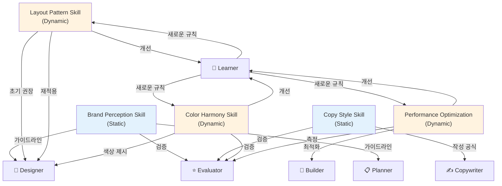

# 에이전트 & 스킬

AI Agency의 핵심은 **6명의 전문 에이전트**와 **5개의 스킬 모듈**로 구성됩니다.

## 6개 에이전트

### 1. Planner (기획자)

**역할:** 프로젝트 전략 수립 및 콘텐츠 구조화

**담당 업무:**
- 브리프 분석
- 사이트 맵 작성
- 섹션별 목표 정의
- 사용자 여정(User Journey) 설계
- SEO 전략 수립

**의사결정 권한:**
- 페이지 구조 (FROZEN Zone 내에서만)
- 콘텐츠 흐름
- SEO 타겟 키워드

**예시:**
```
Input: "SaaS 제품 랜딩 페이지"
Output:
- 히어로 섹션: 문제 → 해결책 제시
- 기능 섹션: 3가지 핵심 기능
- 가격 섹션: 3단계 플랜
- 푸터: 신뢰도 신호
```

### 2. Copywriter (카피라이터)

**역할:** 설득력 있는 텍스트 작성

**담당 업무:**
- 헤드라인 작성
- 바디 카피 작성
- 버튼 라벨 작성
- 메타 디스크립션 작성
- 톤앤매너 유지

**의사결정 권한:**
- 메시지 및 표현 방식
- 카피 길이
- 콜투액션(CTA) 텍스트

**예시:**
```
약함: "서비스를 사용하세요"
강함: "5분 안에 첫 결과 확인하세요"
```

### 3. Designer (디자이너)

**역할:** 시각 디자인 및 레이아웃 구성

**담당 업무:**
- 와이어프레임 작성
- 색상 선택
- 타이포그래피 적용
- 이미지/아이콘 선택
- 반응형 레이아웃 설계

**의사결정 권한:**
- 레이아웃 및 여백
- 색상 및 폰트
- 시각 계층 구조
- 모션/애니메이션

**제약사항:**
- 브랜드 가이드라인 내 선택 (FROZEN Zone)

### 4. Builder (빌더)

**역할:** 웹사이트 구현 및 배포

**담당 업무:**
- 반응형 HTML/CSS 작성
- 컴포넌트 구현
- API 통합
- 성능 최적화
- 빌드 및 배포

**의사결정 권한:**
- 기술 스택 선택 (기본값: Next.js)
- 라이브러리 및 도구
- 성능 최적화 기법

### 5. Evaluator (평가자)

**역할:** 품질 평가 및 개선 피드백 제공

**담당 업무:**
- 디자인 가이드라인 준수 검증
- 성능 측정 (Lighthouse)
- 접근성 검증 (WCAG)
- SEO 점수 계산
- 사용성 테스트
- 개선 제안

**평가 기준:**
- 브랜드 일관성: 100점 만점
- 성능: LCP < 2.5초
- 접근성: WCAG AA 준수
- SEO: 기본 최적화 완료

**예시 피드백:**
```
디자인: 8/10
"히어로 텍스트의 대비도가 낮음 (WCAG AA 미충족)"

성능: 7/10
"이미지 크기 최적화 필요 (450KB → 150KB 가능)"

CTA: 9/10
"위치와 디자인은 좋으나, 더 크게 표시 고려"
```

### 6. Learner (학습자)

**역할:** 작업 결과에서 패턴 추출 및 규칙 생성

**담당 업무:**
- Evaluator 평가 분석
- 반복되는 패턴 인식
- 휴리스틱(heuristic) 생성
- 규칙으로 승격
- Upstream Sync 관리

**학습 메커니즘:**

```
1회차: "이렇게 했더니 평가 점수 8점"
  → 기록 (로그에 저장)

2-3회차: "비슷한 상황에서 같은 방법으로 7-8점"
  → 휴리스틱으로 생성 ("긴 헤드라인은 여러 줄로 표시")

4-5회차: "일관되게 높은 점수 달성"
  → 규칙으로 확정 ("헤드라인 길이 > 30글자: 2줄 이상")

10회차+: "다양한 프로젝트에서 검증됨"
  → 신뢰도 높은 규칙 (모든 프로젝트에 자동 적용)
```

## FROZEN Zone vs EVOLVABLE Zone

AI Agency의 핵심 아키텍처는 **이중 영역(Dual-Zone)** 구조입니다.

### FROZEN Zone (변경 불가)

고정되어야 하는 요소들:
- 브랜드 로고 및 색상
- 법적 요구사항 (이용약관, 개인정보처리방침)
- 필수 페이지 및 섹션
- 고객 정보 및 연락처
- 회사명 및 주요 메시지

**Planner, Designer, Copywriter**는 이 영역을 건드리지 않습니다.

### EVOLVABLE Zone (자동 진화 가능)

개선될 수 있는 요소들:
- 레이아웃 및 여백
- 헤드라인 및 부제목 표현
- 섹션 순서 (통상적 범위 내)
- 컬러 악센트 (메인 색상 제외)
- 이미지 스타일
- CTA 텍스트 및 위치

**Learner**는 이 영역의 개선 패턴만 학습합니다.

## 5개 스킬 모듈

### Static Zone 스킬 (변경 불가)

#### 1. Brand Perception Skill

특정 브랜드 아이덴티티를 이해하고 유지합니다.
- 로고, 색상, 폰트 인식
- 브랜드 톤 적용
- 가이드라인 해석 및 실행

#### 2. Copy Style Skill

설득력 있는 카피를 작성합니다.
- 헤드라인 작성 공식
- 베네핏 표현
- 강력한 CTA 문구

### Dynamic Zone 스킬 (자동 진화)

#### 3. Layout Pattern Skill

효과적인 레이아웃 패턴을 학습합니다.
- 섹션 배치 최적화
- 정보 계층 구조
- 여백 및 정렬 규칙

**진화 예시:**
```
초기: "이미지와 텍스트를 나란히 배치"

3회 반복 후: 휴리스틱
"이미지가 크면(>300px), 텍스트는 아래에 배치"

5회 검증 후: 규칙
"메인 이미지 너비 > 400px → 텍스트 하단 배치
 (점수 +0.5점 향상)"

10회+ 후: 자동 규칙
"모든 프로젝트에 자동 적용"
```

#### 4. Color Harmony Skill

시각적으로 조화로운 색상 조합을 생성합니다.
- 보조 색상 선택
- 명도/채도 조정
- 접근성 준수

#### 5. Performance Optimization Skill

웹사이트 성능을 최적화합니다.
- 이미지 포맷 및 크기 결정
- 지연 로딩(Lazy Loading) 적용
- 번들 크기 최적화

## 스킬 의존성 그래프



## moai 스킬 복사 메커니즘

AI Agency는 **moai 개발 도구**와 스킬을 공유합니다.

### 공유되는 스킬

```
moai-domain-frontend
├─ React 컴포넌트 패턴
├─ Next.js 최적화
└─ Tailwind CSS 활용
    ↓ (복사)
Agency Designer
├─ 컴포넌트 선택
├─ 성능 최적화
└─ 반응형 디자인

moai-ref-api-patterns
└─ API 설계 패턴
    ↓ (복사)
Agency Builder
└─ API 통합 및 최적화
```

### 스킬 업데이트 흐름

1. **moai** 팀이 새로운 패턴 발견
2. moai 스킬 업데이트
3. AI Agency 자동 동기화
4. 모든 프로젝트에 새로운 패턴 적용

## 에이전트 간 통신 프로토콜

### 메시지 형식

```yaml
from: Copywriter
to: Designer
type: request_feedback
content:
  section: "Features"
  text: "Unlock unlimited possibilities"
  needs: "Visual emphasis on 'unlimited'"
priority: normal
```

### 품질 보증 (QA)

각 에이전트의 결과는 **Evaluator**를 거칩니다:

```
Copywriter → Evaluator: "카피 검증"
  ├─ 톤앤매너 일관성: ✓
  ├─ 문법 및 철자: ✓
  ├─ CTA 명확성: ✓
  └─ 길이 적절성: ✓
  
Designer → Evaluator: "디자인 검증"
  ├─ 브랜드 가이드라인: ✓
  ├─ 접근성 (WCAG): ✓
  ├─ 반응형: ✓
  └─ 시각 계층: ✓
```

부적합하면 Evaluator가 피드백을 반환하고 해당 에이전트가 수정합니다.

## 다음 단계

- [자기진화 시스템](/ko/agency/self-evolution) - 학습 메커니즘 상세
- [커맨드 레퍼런스](/ko/agency/command-reference) - 에이전트 제어 명령어
