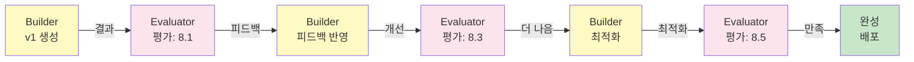

# 커맨드 레퍼런스

AI Agency의 모든 커맨드를 상세히 설명합니다.

## 주요 커맨드 요약

| 커맨드 | 설명 | 주요 옵션 |
|--------|------|---------|
| `agency init` | 새 프로젝트 초기화 | `--template`, `--name` |
| `agency build` | 웹사이트 생성 (전체 파이프라인) | `--with-feedback`, `--skip-evaluator` |
| `agency serve` | 로컬 미리보기 | `--port 3000`, `--open` |
| `agency feedback` | 피드백 입력 및 반영 | `--file`, `--interactive` |
| `agency evolve` | 규칙 학습 및 반영 | `--dry-run`, `--force` |
| `agency plan` | 전략 수립 단계만 실행 | - |
| `agency write-copy` | 카피 작성 단계만 실행 | `--section <name>` |
| `agency design` | 디자인 단계만 실행 | `--section <name>` |
| `agency evaluate` | 평가 단계만 실행 | `--detailed` |
| `agency learn` | 규칙 학습만 실행 | `--review` |
| `agency status` | 프로젝트 상태 확인 | `--detailed`, `--json` |
| `agency rule` | 규칙 관리 | `list`, `enable`, `disable`, `test` |
| `agency deploy` | 배포 | `--provider`, `--production` |
| `agency log` | 로그 확인 | `--tail`, `--filter` |

## 상세 커맨드 설명

### agency init

새로운 AI Agency 프로젝트를 초기화합니다.

```bash
# 기본 초기화
agency init

# 프로젝트명 지정
agency init --name my-website

# 템플릿 선택 (SaaS, E-commerce, Service, Landing)
agency init --template saas

# 대화형 설정
agency init --interactive
```

**생성되는 파일:**
```
my-website/
├── .agency/
│   ├── context/
│   │   ├── brand.md
│   │   ├── design-system.md
│   │   ├── copy-guidelines.md
│   │   └── audience.md
│   ├── briefs/
│   └── learnings/
├── src/
├── output/
└── .agencyrc.json  # 프로젝트 설정
```

### agency build

웹사이트를 생성합니다. 전체 파이프라인(Planner → Copywriter → Designer → Builder → Evaluator → Learner)을 실행합니다.

```bash
# 기본 빌드 (Interactive)
agency build

# 자동 빌드 (대화 없음)
agency build --non-interactive

# 평가 단계 스킵 (빠른 빌드)
agency build --skip-evaluator

# 피드백 자동 적용
agency build --with-feedback

# 특정 섹션만 빌드
agency build --section features
agency build --section pricing

# 병렬 실행 비활성화
agency build --sequential

# 결과를 특정 디렉토리에 저장
agency build --output ./dist
```

**진행 상황 예시:**
```
🔄 Planner: 브리프 분석 중...
   ✓ 섹션 5개 식별됨
   ✓ SEO 타겟 설정 완료

📝 Copywriter: 카피 작성 중... (2/5)
   ✓ 히어로 섹션
   ✓ 기능 섹션
   ⏳ 가격 섹션

🎨 Designer: 디자인 생성 중...
   ✓ 와이어프레임
   ⏳ 비주얼 디자인

🔨 Builder: 웹사이트 빌드 중...
   
⭐ Evaluator: 평가 중...
   점수: 8.5/10 (우수)

🧠 Learner: 규칙 학습 중...
   새로운 패턴 1개 발견
```

### agency serve

로컬 서버에서 생성된 웹사이트를 미리봅니다.

```bash
# 기본 포트 3000에서 서버 실행
agency serve

# 커스텀 포트
agency serve --port 8000

# 브라우저 자동 열기
agency serve --open

# 외부 접속 허용
agency serve --host 0.0.0.0

# 개발 모드 (핫 리로드)
agency serve --mode development
```

**출력:**
```
✓ 서버가 시작되었습니다
  Local:   http://localhost:3000
  Network: http://192.168.1.100:3000
  
⌨️  Press 'r' to rebuild
   Press 'q' to quit
```

### agency feedback

피드백을 입력하고 반영합니다.

```bash
# 대화형 피드백 입력
agency feedback

# 파일에서 피드백 읽기
agency feedback --file ./feedback.md

# 특정 섹션에 대한 피드백
agency feedback --section features

# 점수 포함 피드백
agency feedback --with-scores

# 시각적 비교 (이전 vs 현재)
agency feedback --compare
```

**대화형 피드백 흐름:**
```
🎯 어느 섹션에 대한 피드백입니까?
   1. 히어로
   2. 기능
   3. 가격
   4. 푸터
   > 2

📝 기능 섹션에 대한 피드백을 입력하세요:
> 아이콘이 더 크면 좋겠어요. 지금 너무 작음

💯 평가 점수를 입력하세요 (1-10):
> 7

📌 추가 피드백이 있습니까? (Y/n)
> Y

> 설명 텍스트도 조금 더 짧으면 좋겠어요

💾 피드백이 저장되었습니다.
```

### agency evolve

피드백을 기반으로 웹사이트를 개선하고 규칙을 학습합니다.

```bash
# 기본 진화 (모든 피드백 반영)
agency evolve

# 시뮬레이션 (실제 적용 안 함)
agency evolve --dry-run

# 특정 피드백만 반영
agency evolve --feedback-id f123 --feedback-id f456

# 강제 진화 (낮은 신뢰도 규칙도 적용)
agency evolve --force

# 피드백 검토 후 진화
agency evolve --review
```

**진화 과정:**
```
📊 피드백 분석:
   - 새로운 피드백: 3개
   - 평균 점수: 7.8/10
   - 개선 영역: 기능, 모바일

🔍 패턴 인식:
   ✓ "아이콘 크기" → 3회 반복 (휴리스틱)
   ✓ "모바일 여백" → 5회 검증 (규칙)
   ✓ "CTA 위치" → 새로운 패턴

💾 규칙 업데이트:
   ✓ 모바일 여백 규칙: 신뢰도 75% → 85%
   ✓ 새로운 규칙 추가: "아이콘 최소 크기: 48px"

🔄 재빌드 중...
   ✓ 기능 섹션 재생성
   ✓ 모바일 레이아웃 최적화
   
✨ 완료!
   이전 점수: 8.1/10
   현재 점수: 8.4/10 (+0.3)
```

### agency plan

전략 수립(Planner) 단계만 실행합니다.

```bash
# 기본 실행
agency plan

# 결과 저장
agency plan --output ./plan.md

# 상세 정보
agency plan --detailed
```

### agency write-copy

카피 작성(Copywriter) 단계만 실행합니다.

```bash
# 전체 카피 작성
agency write-copy

# 특정 섹션만 작성
agency write-copy --section features

# 다른 톤 적용 (formal, casual, technical)
agency write-copy --tone casual

# 동의 없이 기존 카피 덮어쓰기
agency write-copy --force
```

### agency design

디자인 생성(Designer) 단계만 실행합니다.

```bash
# 전체 디자인 생성
agency design

# 특정 섹션 디자인
agency design --section hero

# 컬러 스키마 지정
agency design --color-scheme vibrant

# 목업 생성만 (실제 구현 전)
agency design --mockup-only
```

### agency evaluate

평가(Evaluator) 단계만 실행합니다.

```bash
# 전체 평가
agency evaluate

# 상세 평가 보고서
agency evaluate --detailed

# JSON 형식 결과
agency evaluate --json

# 특정 기준만 평가
agency evaluate --criteria performance,accessibility
```

**평가 결과 예시:**
```
📊 평가 결과: 8.5/10

✅ 브랜드 준수: 9.2/10
   - 색상: ✓
   - 타이포그래피: ✓
   - 톤: ✓

⚡ 성능: 7.8/10
   - LCP: 2.3초 (목표: <2.5초) ✓
   - CLS: 0.05 ✓
   - FID: 85ms ⚠️ (개선 필요)

♿ 접근성: 8.6/10
   - WCAG AA: ✓
   - 명도 대비: ✓
   - 키보드 네비게이션: ⚠️ (3개 문제)

📈 SEO: 8.9/10
   - 메타데이터: ✓
   - 헤딩 구조: ✓
   - 모바일 친화: ✓
```

### agency rule

규칙을 관리합니다.

```bash
# 모든 규칙 목록
agency rule list

# 규칙 상세 정보
agency rule info "Hero Overlay Rule"

# 규칙 비활성화
agency rule disable "Hero Overlay Rule"

# 규칙 활성화
agency rule enable "Hero Overlay Rule"

# 규칙 A/B 테스트
agency rule test "New Color Rule" --traffic 10%

# 규칙 영향도 분석
agency rule impact "Layout Pattern" --projects 5

# 규칙 삭제
agency rule delete "Outdated Rule" --confirm

# 신뢰도 확인
agency rule list --filter confidence>80

# 규칙 이력 확인
agency rule history "Hero Overlay Rule"
```

**규칙 목록 출력:**
```
📋 규칙 라이브러리:

🟢 신뢰도 높음 (95%+) - 자동 적용
   1. Hero Overlay Pattern
   2. Mobile Spacing Rule
   3. Typography Scale
   4. Color Harmony

🟡 보통 (70-95%) - 제안으로 표시
   5. CTA Position Rule (점수: +0.2)
   6. Image Optimization
   
🟠 낮음 (50-70%) - A/B 테스트 중
   7. Gradient Background (9% 트래픽)
   8. Animation Pattern (5% 트래픽)

⏰ 곧 만료 (신뢰도 감쇠)
   9. Layout Grid v1 (89일, 신뢰도 47%)
```

### agency deploy

웹사이트를 배포합니다.

```bash
# 배포 제공자 선택
agency deploy

# 특정 제공자로 배포
agency deploy --provider vercel
agency deploy --provider netlify
agency deploy --provider aws

# 프로덕션 배포
agency deploy --environment production

# 스테이징 배포
agency deploy --environment staging

# 커스텀 도메인 지정
agency deploy --domain mysite.com

# 배포 전 확인
agency deploy --review

# 배포 후 자동 테스트
agency deploy --with-tests
```

**배포 과정:**
```
🔗 배포 제공자: Vercel
🏗️  빌드 중... (45초)
   ✓ Next.js 최적화 완료
   ✓ 이미지 최적화 완료
   ✓ 번들 크기: 245KB

📤 업로드 중...
   ✓ 파일 전송: 142개

✅ 배포 완료!
   URL: https://mysite.com
   배포 시간: 2024-04-01 10:30:45 UTC
```

### agency status

프로젝트 상태를 확인합니다.

```bash
# 기본 상태
agency status

# 상세 정보
agency status --detailed

# JSON 형식
agency status --json

# 진행률 표시
agency status --progress
```

**상태 출력:**
```
📊 프로젝트 상태: 진행 중

⏱️  실행 시간: 45분 / 60분 예상

📋 작업 진행도:
   ✓ Planner: 완료 (10분)
   ✓ Copywriter: 완료 (8분)
   ✓ Designer: 완료 (12분)
   ⏳ Builder: 진행 중 (15분)
   ⏹️  Evaluator: 대기 중
   ⏹️  Learner: 대기 중

💾 저장된 버전:
   - initial (2024-04-01 10:00)
   - with-feedback v1 (2024-04-01 10:45)

🔄 마지막 빌드: 2024-04-01 10:00
📈 현재 점수: 8.3/10 (이전: 8.1)
```

### agency log

로그를 확인합니다.

```bash
# 최근 로그
agency log

# 최근 N줄
agency log --tail 50

# 특정 에이전트 로그
agency log --filter agent:designer

# 특정 시간 범위
agency log --since 1h
agency log --since 2024-04-01T10:00:00

# 에러만 표시
agency log --filter level:error

# 실시간 모니터링
agency log --follow

# 로그를 파일로 저장
agency log --output debug.log
```

## GAN Loop 상세

Builder와 Evaluator가 협력하여 품질을 향상시킵니다.



**각 반복에서의 개선:**

Iteration 1:
- Builder: 기본 레이아웃 구현
- Evaluator: "이미지 최적화 필요, 접근성 검토 필요"
- 점수: 8.1 → 8.3

Iteration 2:
- Builder: 이미지 최적화, 키보드 네비게이션 추가
- Evaluator: "모바일 레이아웃 조정 필요"
- 점수: 8.3 → 8.5

Iteration 3:
- Builder: 모바일 반응형 개선
- Evaluator: 모든 기준 만족
- 점수: 8.5 → 8.6 (목표 달성)

## 설정 파일 레퍼런스

### .agencyrc.json

프로젝트 설정 파일입니다.

```json
{
  "project_name": "my-website",
  "brand": {
    "name": "Acme Corp",
    "colors": {
      "primary": "#007AFF",
      "secondary": "#34C759"
    }
  },
  "agents": {
    "planner": {
      "enabled": true,
      "model": "claude-opus"
    },
    "builder": {
      "enabled": true,
      "framework": "next.js",
      "tailwind": true
    }
  },
  "quality_gates": {
    "min_score": 8.0,
    "accessibility": "wcag_aa"
  },
  "rules": {
    "auto_apply": true,
    "min_confidence": 0.75
  },
  "deployment": {
    "provider": "vercel",
    "auto_deploy": false
  }
}
```

## 데이터 위치 테이블

| 항목 | 위치 | 설명 |
|------|------|------|
| 프로젝트 설정 | `.agencyrc.json` | 프로젝트 전체 설정 |
| 브랜드 가이드 | `.agency/context/brand.md` | 브랜드 아이덴티티 |
| 프로젝트 브리프 | `.agency/briefs/*.md` | 프로젝트 요구사항 |
| 피드백 | `.agency/feedback/*.md` | 사용자 피드백 |
| 규칙 | `.agency/learnings/rules.yaml` | 학습된 규칙들 |
| 생성된 사이트 | `./output/website/` | 최종 산출물 |
| 로그 | `.agency/logs/` | 실행 로그 |
| 버전 히스토리 | `.agency/history/` | 이전 버전들 |

## 다음 단계

- [시작하기](/ko/agency/getting-started) - 실제 프로젝트 시작
- [에이전트 & 스킬](/ko/agency/agents-and-skills) - 각 에이전트의 역할
- [자기진화 시스템](/ko/agency/self-evolution) - 진화 메커니즘
