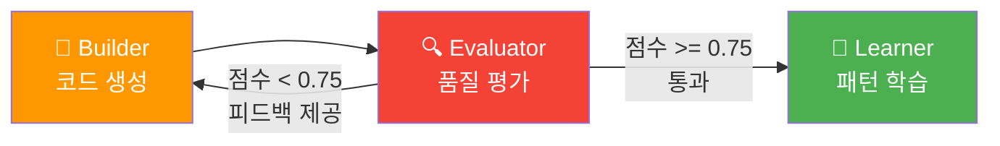
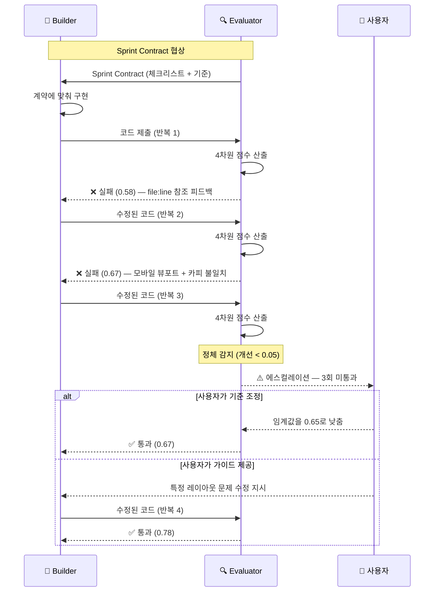

## GAN Loop이란?

GAN(Generative-Adversarial Network) Loop은 Builder와 Evaluator 에이전트 간의 **적대적 품질 보증 메커니즘**입니다. Evaluator는 기본적으로 **회의적(skeptical)**으로 설정되어 있으며, 결함을 찾도록 튜닝되어 있습니다.

## 루프 메커니즘

1. Builder가 카피 + 디자인 스펙으로 코드 산출물 생성
2. Evaluator가 BRIEF 기준으로 산출물 점수 산출 (0.0 ~ 1.0)
3. 점수 >= 0.75: **통과**, Learner로 진행
4. 점수 < 0.75: **실패**, Evaluator가 실행 가능한 피드백 제공
5. Builder가 피드백을 반영하여 수정된 산출물 생성
6. 통과하거나 최대 5회 반복될 때까지 반복

## Sprint Contract 프로토콜

각 GAN Loop 반복 전에 Builder와 Evaluator는 **Sprint Contract**를 협상합니다:

### 1단계: 계약 생성

Evaluator가 BRIEF를 분석하여 다음을 포함하는 Sprint Contract를 생성합니다:
- **수락 체크리스트**: 이번 반복의 구체적이고 테스트 가능한 기준
- **우선 차원**: 집중할 평가 차원 (Design Quality, Originality, Completeness, Functionality 중 하나)
- **테스트 시나리오**: 성공을 검증할 Playwright 테스트 케이스
- **통과 조건**: 이번 스프린트의 기준별 최소 점수

### 2단계: 계약 검토

Builder가 Sprint Contract를 검토하고:
- **그대로 수락**: 구현 진행
- **조정 요청**: 기준이 실현 불가능한 경우 대안 제시 (근거 포함)
- Evaluator가 BRIEF 요구사항을 참조하여 분쟁 해결

### 3단계: 계약 실행

Builder가 합의된 체크리스트에 맞춰 구현. Evaluator는 **계약된 기준에 대해서만** 점수 산출 (임의 기준 불가).

### 4단계: 계약 진화

후속 반복에서:
- 통과된 기준은 이월 (회귀 불허)
- 실패한 기준은 피드백 기반으로 정제
- 이전 스프린트에서 발견된 갭이 있으면 새 기준 추가

## 점수 차원

| 차원 | 가중치 | 측정 내용 | 자동 실패 트리거 |
|------|--------|----------|----------------|
| **Design Quality** | 30% | 시각적 완성도, 간격, 타이포그래피, 색상 조화 | AI 클리셰 (보라색 그라데이션 + 흰 카드 + 제네릭 아이콘) |
| **Originality** | 25% | 고유한 브랜드 표현, 비템플릿 느낌 | Copywriter 출력과 다른 카피 사용 |
| **Completeness** | 25% | 모든 섹션, 반응형, 인터랙티브 요소 | 모바일 뷰포트 깨짐, 404 링크 |
| **Functionality** | 20% | 링크, 폼, 애니메이션, Lighthouse 점수 | Lighthouse 접근성 < 80 |

통과 임계값: **0.75** (Must-pass 기준 개별 통과 필수)

## 반복 흐름 상세

## 에스컬레이션

| 조건 | 동작 |
|------|------|
| 3회 연속 미통과 | 상세 실패 보고서와 함께 사용자에게 에스컬레이션 |
| 정체 감지 (개선 < 0.05) | Evaluator가 다른 차원의 개선점 제시 |
| 2회 연속 정체 | 즉시 사용자에게 에스컬레이션 |
| 최대 5회 도달 | 종합 실패 보고서 + 사용자 선택지 제시 |

**사용자 선택지:**
- 기준 조정 (임계값 낮추기)
- 구체적 가이드 제공
- 강제 통과 (force-pass)

## 관대함 방지 메커니즘 (5가지)

Evaluator의 객관성을 유지하기 위한 5가지 보호 장치:

### 1. 루브릭 앵커링 (Rubric Anchoring)

모든 평가 기준에 0.25, 0.50, 0.75, 1.0 점수의 구체적 예시가 포함된 루브릭이 있습니다. Evaluator는 점수 부여 시 반드시 루브릭을 참조해야 합니다.

### 2. 회귀 베이스라인 (Regression Baseline)

이전 프로젝트들의 점수 베이스라인을 유지합니다. 현재 프로젝트가 베이스라인보다 0.15 이상 높은데 해당 품질 향상이 없다면 점수가 검토 대상으로 표시됩니다.

### 3. Must-Pass 방화벽

Must-pass 기준은 다른 영역의 높은 점수로 보상될 수 없습니다. Nice-to-have에서 만점이라도 must-pass 기준이 실패하면 전체가 실패합니다. 이 규칙은 **FROZEN** (변경 불가)입니다.

### 4. 독립 재평가

5번째 프로젝트마다 독립 재평가가 실행됩니다: Evaluator가 다른 프롬프팅으로 동일 프로젝트를 두 번 평가하며, 두 점수가 0.10 이내여야 합니다.

### 5. 안티패턴 교차 검증

통과 점수를 확정하기 전에 모든 알려진 안티패턴을 체크합니다. 코드가 안티패턴 행동을 보이면 해당 기준 점수가 0.50으로 캡됩니다.

## 다음 단계

- [/agency 사용법 가이드](/ko/agency/usage-guide) — 전체 명령어와 워크플로우
- [자기진화 시스템](/ko/agency/self-evolution) — 학습 파이프라인과 5계층 안전 아키텍처
- [에이전트 & 스킬](/ko/agency/agents-and-skills) — 6개 Agency 에이전트 상세
