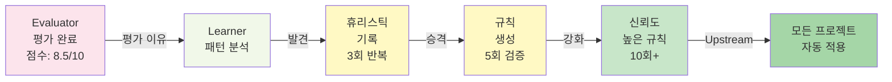
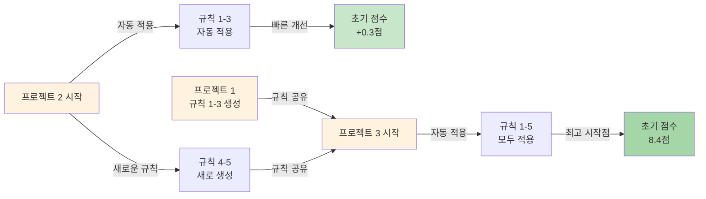

AI Agency의 가장 강력한 기능은 **자기진화(Self-Evolution)** 입니다. 프로젝트를 진행할수록 에이전트들이 자동으로 학습하고 규칙을 업데이트합니다.

## Learnings Pipeline 흐름



## 승격 임계값 테이블

| 단계 | 조건 | 형태 | 신뢰도 | 사용 범위 |
|------|------|------|--------|----------|
| **기록** | 1회 실행 | 로그 | 10% | 아카이브만 |
| **휴리스틱** | 3회 반복 성공 | 제안 | 40% | 제안으로 표시 |
| **규칙** | 5회 검증 + 평균 점수 > 7.5 | 자동 | 70% | 프로젝트 내 자동 |
| **신뢰도 높음** | 10회+ 다양한 컨텍스트 | 자동 | 95% | 모든 프로젝트 자동 |

## Knowledge Graduation Protocol

### Phase 1: 기록 (1회)

```yaml
timestamp: 2024-04-01T10:30:00Z
agent: Designer
action: "히어로 섹션의 배경 이미지를 40% 투명도로 오버레이"
project: acme-landing
result_score: 8.2
reason: "텍스트가 명확하고 이미지도 보임"
evaluator_feedback: "좋은 디자인 선택"
```

### Phase 2: 휴리스틱 (3회)

3회 이상에서 비슷한 점수가 나오면 **휴리스틱**으로 승격:

```yaml
name: "Hero Overlay Pattern"
discovered: 2024-04-15
times_applied: 3
average_score: 8.1
pattern: "배경 이미지 + 40% 어두운 오버레이 → 텍스트 명확성 향상"
suggested_by: Learner
status: "heuristic"

projects:
  - acme-landing: 8.2
  - startup-hub: 8.0
  - saas-demo: 8.1
```

AI Agency는 이제 **제안**으로 Designer에게 표시합니다:
```
"💡 Heuristic: 유사 프로젝트에서 배경 오버레이가 효과적입니다"
```

### Phase 3: 규칙 (5회)

5회 이상에서 점수가 안정적(평균 > 7.5)이면 **규칙**으로 승격:

```yaml
name: "Hero Overlay Rule"
created: 2024-05-01
times_applied: 5
average_score: 8.15
min_score: 7.9
confidence: 0.85

rule: |
  IF
    - Section type = Hero
    - Background = Image
    - Text color = Light
  THEN
    - Apply dark overlay (40% opacity)
    - Expected score improvement: +0.3
  ELSE IF
    - Text contrast already high (WCAG AAA)
  THEN
    - Skip overlay (unnecessary)

status: "rule"
auto_apply: true  # 프로젝트 내에서 자동 적용
scope: [current_project]
```

Designer가 영웅 섹션을 만들면 **자동으로** 오버레이가 적용됩니다.

### Phase 4: 신뢰도 높은 규칙 (10회+)

10회 이상 다양한 프로젝트에서 검증되면 **신뢰도 높은 규칙**으로 승격:

```yaml
name: "Hero Overlay Rule"
status: "trusted_rule"
times_applied: 12
projects_applied: 5
average_score: 8.18
confidence: 0.95

auto_apply: true
scope: [all_projects]  # 모든 프로젝트에서 자동 적용
priority: "high"
```

이제 **모든 새로운 프로젝트**에서 자동으로 이 규칙이 적용됩니다.

## Confidence 시간 감쇠

규칙은 오래되면 신뢰도가 감소합니다:

```
confidence(t) = base_confidence × e^(-t / half_life)

half_life = 90일
```

### 계산 예시

```
규칙 생성 시: confidence = 95%
90일 후: confidence = 47.5% (절반으로 감소)
180일 후: confidence = 23.75%
```

**효과:**
- 90일 이내: 신규 규칙으로 자동 적용
- 90-180일: 제안으로 표시
- 180일+: 아카이브 (수동 재활성화 가능)

이렇게 설계한 이유:
1. **기술 진화**: 새로운 UI 트렌드 반영
2. **고객 피드백**: 시간이 지나면서 선호도 변화
3. **신선도**: 과거 규칙에 과도하게 의존하지 않기

## 안전 5계층 아키텍처

자기진화가 안전하게 작동하도록 5단계 검증이 있습니다:

### Layer 1: Evaluator 검증

모든 규칙은 Evaluator가 평가한 점수를 기반으로만 생성됩니다.

```
점수 < 7.5 → 규칙 생성 거부
평가 없음 → 규칙 생성 거부
```

### Layer 2: Human Override

사용자는 언제든 규칙을 비활성화할 수 있습니다:

```bash
agency rule disable "Hero Overlay Rule"
```

### Layer 3: 브랜드 보호 (FROZEN Zone)

FROZEN Zone의 규칙은 절대 자동으로 변경되지 않습니다:

```yaml
frozen_elements:
  - logo_color
  - brand_font
  - legal_text
  - company_name

# 이 요소들은 휴리스틱에도 포함될 수 없음
rule: |
  IF
    - Needs color change
  THEN
    - NEVER modify frozen elements
```

### Layer 4: A/B 테스트

신뢰도가 낮은 규칙(confidence < 70%)은 자동으로 적용되지 않고, 대신 A/B 테스트로 제안됩니다:

```bash
agency rule test "Color Harmony v2"
# 10% 트래픽에만 적용하여 성과 측정
```

### Layer 5: 롤백 메커니즘

규칙이 성과를 악화시키면 자동으로 이전 버전으로 롤백됩니다:

```
Rule 적용 후 스코어:
- 이전: 8.2
- 이후: 7.8 (0.4 하락)

→ 자동 롤백 및 신뢰도 -20%
```

## Upstream Sync 설명

**Upstream Sync**는 이전 프로젝트에서 배운 규칙을 새 프로젝트에 자동으로 적용합니다.

### 예시: 3개 프로젝트 여정

#### 프로젝트 1: Acme Corp 랜딩 페이지

```
Week 1: 초기 빌드 → 평가: 7.8/10
Week 2: 개선 사항 적용
  - 헤드라인 길이 줄임 → +0.3점
  - 이미지 최적화 → +0.2점
  - 색상 대비 향상 → +0.2점
  최종: 8.5/10

Learner가 발견한 규칙:
1. 헤드라인 < 50글자 (3회 검증)
2. 이미지 최적화 (JPEG 85% 품질) (5회)
3. 색상 명도 대비 > 7:1 (5회)
```

#### 프로젝트 2: Startup Hub 웹사이트 (3주 후)

```
Week 1: 초기 빌드 → Upstream Sync 적용
  - 헤드라인 규칙 자동 적용
  - 이미지 최적화 자동 적용
  - 색상 규칙 자동 적용
  → 초기 점수: 8.1/10 (이전보다 0.3점 향상)

Week 2: 추가 개선
  - 섹션 여백 최적화 → +0.2점
  - 모바일 CTA 위치 → +0.2점
  최종: 8.5/10

새로운 규칙:
4. 섹션 여백: 3rem 기준
5. 모바일 CTA: 화면 상단에서 60vh 위치
```

#### 프로젝트 3: SaaS Demo (6주 후)

```
Week 1: 초기 빌드 → Upstream Sync 적용
  - 프로젝트 1, 2의 모든 규칙 적용 (5개)
  - 예상 점수: 8.3/10

실제 결과:
  - 헤드라인 규칙 적용 + 프로젝트 2 여백 규칙 적용
  - 초기 점수: 8.4/10 (예상보다 0.1점 높음!)

개선 사항 추가:
  - 정렬(alignment) 미세 조정
  최종: 8.6/10

효과:
- 프로젝트 1: 8.5점 달성하는데 2주 소요
- 프로젝트 2: 첫 주에 8.1점 (3일 단축)
- 프로젝트 3: 첫 주에 8.4점 (5일 단축, 최종 점수는 더 높음)
```

### Upstream Sync 동작 원리



## 진화 시나리오: 10개 프로젝트 후

```
Project 1-3: 기초 규칙 학습 (15개)
  - 디자인 기본: 색상, 여백, 타이포그래피
  - 카피 기본: 헤드라인, CTA, 길이

Project 4-6: 중급 규칙 학습 (25개)
  - 섹션별 최적화: 히어로, 기능, 가격
  - 반응형 최적화: 모바일, 태블릿 레이아웃
  - SEO 최적화: 메타데이터, 헤딩 구조

Project 7-10: 고급 규칙 학습 (40개)
  - 산업별 최적화: SaaS, E-commerce, Service
  - 진정성 신호: 고객 후기, 사례 연구 배치
  - 전환 최적화: CTA 위치, 버튼 색상, 폼 설계

최종 규칙 라이브러리: 80개 규칙
신뢰도 분포:
  - 신뢰도 95%+: 40개 (항상 자동 적용)
  - 신뢰도 70-95%: 30개 (제안으로 표시)
  - 신뢰도 50-70%: 10개 (A/B 테스트)
```

**결과:**
- 초기 점수: 프로젝트 1 = 7.8, 프로젝트 10 = 8.6
- 개선 시간: 2주 → 3일 (80% 단축)
- 최종 품질: 안정적 8.5+ 달성
- Evaluator 개입: 프로젝트 1 = 주 5회, 프로젝트 10 = 주 2회 (60% 감소)

## 롤백 메커니즘

규칙이 실패하면 자동으로 이전 상태로 돌아갑니다:

```bash
# 최근 변경사항 확인
agency log rules --recent

# 특정 규칙 롤백
agency rule rollback "Color Harmony v3"

# 전체 롤백 (마지막 배포 이전)
agency rule rollback --all --to=2024-04-01
```

## 파이프라인 적응 5규칙

AI Agency는 프로젝트 특성에 따라 파이프라인을 자동으로 조정합니다:

### Rule 1: 산업별 파이프라인 선택

```
if industry == "SaaS":
  -> 기능 설명에 집중
  -> 신뢰도 신호(로고, 고객 수) 강조
  
if industry == "E-commerce":
  -> 제품 이미지에 집중
  -> 리뷰 및 평가 강조
  
if industry == "Service":
  -> 전문성 강조
  -> 포트폴리오 및 사례 강조
```

### Rule 2: 지원하는 언어에 따른 조정

```
if language == "Korean":
  -> 더 큰 폰트 (가독성)
  -> 더 큰 터치 타겟 (모바일)
  
if language == "English":
  -> 더 많은 공간 (단어 길이)
```

### Rule 3: 모바일 vs 데스크탑 우선순위

```
if primary_device == "mobile":
  -> 한 열 레이아웃 강조
  -> 큰 버튼 및 텍스트
  
if primary_device == "desktop":
  -> 다단 레이아웃 활용
  -> 세밀한 타이포그래피
```

### Rule 4: 예산에 따른 품질 목표

```
if budget == "premium":
  -> 모든 규칙 적용 (80개)
  -> Evaluator 관여도 높음
  -> 최종 목표: 8.8+
  
if budget == "standard":
  -> 주요 규칙만 적용 (40개)
  -> Evaluator 중간 관여
  -> 최종 목표: 8.2-8.5
  
if budget == "economy":
  -> 기초 규칙만 적용 (15개)
  -> Evaluator 최소 관여
  -> 최종 목표: 7.8+
```

### Rule 5: 시간 제약에 따른 파이프라인

```
if deadline < 1주:
  -> 가장 신뢰도 높은 규칙만 (신뢰도 95%+)
  -> 수동 검토 단계 스킵
  -> 병렬 실행 최대화
  
if deadline >= 2주:
  -> 모든 규칙 활용
  -> 반복적 개선
  -> 신규 규칙 테스트 기회
```

## 다음 단계

- [커맨드 레퍼런스](/ko/agency/command-reference) - 규칙 관리 커맨드
- [시작하기](/ko/agency/getting-started) - 실제 프로젝트 시작
