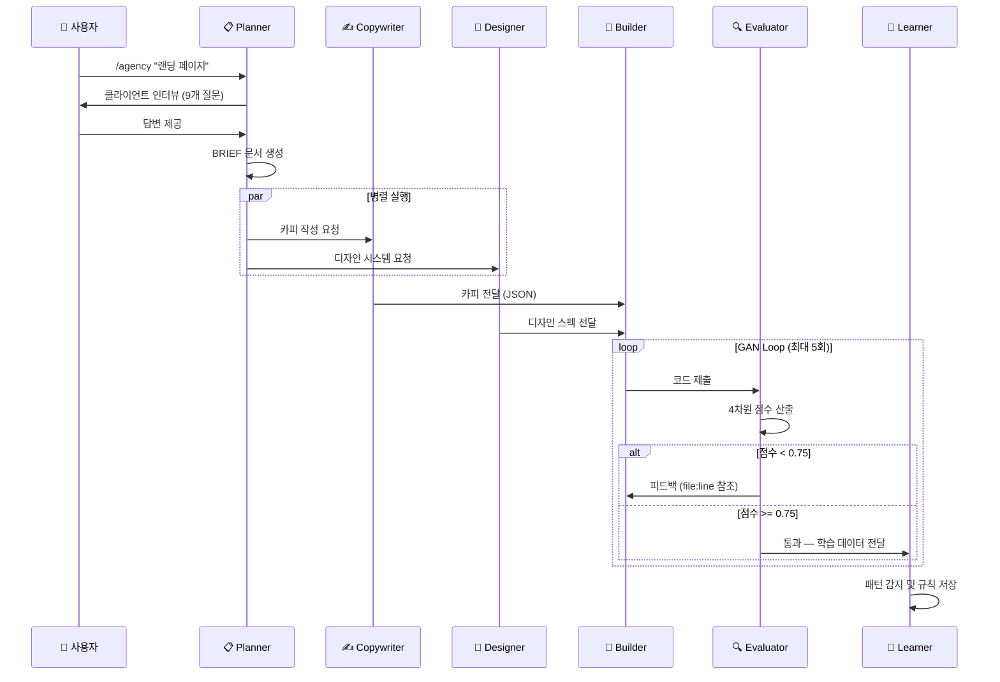

# /agency 사용법 가이드

## 빠른 시작: 한 줄로 전체 파이프라인

```bash
/agency "AI 개발 도구 스타트업용 SaaS 랜딩 페이지"
```

이 한 줄의 명령으로 **전체 자율 워크플로우**가 시작됩니다:

1. **클라이언트 인터뷰** — 비즈니스, 브랜드, 기술 선호도에 대해 9개의 구조화된 질문 (최초 설정 시)
2. **BRIEF 생성** — Planner가 요청을 종합적인 프로젝트 브리프로 확장
3. **카피 + 디자인** — 병렬 실행: Copywriter가 브랜드 카피 작성, Designer가 디자인 시스템 생성
4. **코드 구현** — Builder가 TDD로 프로덕션 코드 구현 (기본: Next.js + Tailwind)
5. **품질 보증** — Evaluator가 Playwright 테스트, Lighthouse 감사, 4차원 점수 산출
6. **GAN Loop** — 품질 미달 시 Builder와 Evaluator가 반복 (최대 5라운드)
7. **자기학습** — Learner가 세션에서 패턴을 감지하고 스킬 개선 제안

> **소요 시간**: 완전한 랜딩 페이지 기준 약 15-45분, 완전 자율 실행

## 전체 명령어 레퍼런스

### 자율 워크플로우 (권장)

```bash
# 전체 파이프라인 자동 실행
/agency "SaaS 랜딩 페이지 for my AI startup"
```

### 단계별 워크플로우

```bash
# 인터뷰 + BRIEF 생성만 (빌드 전 검토 가능)
/agency brief "개발 도구용 랜딩 페이지"

# 기존 BRIEF로 전체 파이프라인 실행
/agency build BRIEF-001

# 각 단계마다 사용자 승인 요청
/agency build BRIEF-001 --step
```

### 품질 & 리뷰

```bash
# 기존 빌드에 평가자 재실행
/agency review BRIEF-001

# 특정 단계만 재실행
/agency phase BRIEF-001 copywriter
```

### 자기진화

```bash
# 패턴 감지를 위한 피드백 기록
/agency learn

# 학습된 규칙을 스킬에 적용
/agency evolve

# 특정 에이전트만 진화
/agency evolve --agent copywriter
```

### 세션 & 프로필 관리

```bash
# 중단된 워크플로우 재개
/agency resume BRIEF-001

# 적응 통계 및 진화 이력 확인
/agency profile
```

### 시스템 관리

```bash
# MoAI 업데이트와 포크된 에이전트 동기화
/agency sync-upstream

# 스킬을 이전 버전으로 롤백
/agency rollback agency-copywriting

# 파이프라인 설정 확인/편집
/agency config
```

## 파이프라인 흐름



## 각 에이전트의 역할

| 에이전트 | 모델 | 하는 일 |
|---------|------|--------|
| **Planner** | opus | 클라이언트 인터뷰 수행, 구조화된 BRIEF 문서 생성 |
| **Copywriter** | sonnet | 마케팅 카피를 JSON으로 작성 — 헤드라인, 본문, CTA — 브랜드 보이스 규칙 준수 |
| **Designer** | sonnet | 완전한 디자인 시스템 생성 — 색상 토큰, 타이포그래피 스케일, 간격, 컴포넌트 스펙 |
| **Builder** | sonnet | TDD(RED-GREEN-REFACTOR)로 프로덕션 코드 구현. 기본 스택: Next.js, TypeScript, Tailwind, shadcn/ui |
| **Evaluator** | sonnet | Playwright 비주얼 테스트 + Lighthouse 감사. 4차원 점수: Design Quality(30%), Originality(25%), Completeness(25%), Functionality(20%) |
| **Learner** | opus | 반복 패턴 감지, 5계층 안전 게이트를 통한 스킬 진화 제안 |

## 클라이언트 인터뷰 (브랜드 컨텍스트)

최초 실행 시 Agency는 4단계, 9개 질문의 구조화된 인터뷰를 진행합니다:

| 단계 | 질문 내용 | 생성 파일 |
|------|----------|----------|
| **비즈니스 컨텍스트** | 목표, 타겟 고객, 성공 KPI | `.agency/context/target-audience.md` |
| **브랜드 아이덴티티** | 보이스 형용사, 레퍼런스 사이트, 디자인 선호 | `.agency/context/brand-voice.md`, `visual-identity.md` |
| **기술 범위** | 필요 페이지, 기술 요구사항 | `.agency/context/tech-preferences.md` |
| **품질 기대** | 우선순위 요소 | `.agency/context/quality-standards.md` |

브랜드 컨텍스트는 **모든 에이전트**에게 불변 제약 조건으로 전달됩니다. 5개 이상의 프로젝트를 진행하면 인터뷰가 핵심 3개 질문만 묻도록 적응합니다.

## 기본 기술 스택

| 레이어 | 기본값 | 설정 파일 |
|--------|--------|----------|
| 프레임워크 | Next.js + App Router | `.agency/context/tech-preferences.md` |
| 언어 | TypeScript (strict) | `.agency/context/tech-preferences.md` |
| 스타일링 | Tailwind CSS v4 | `.agency/context/tech-preferences.md` |
| 컴포넌트 | shadcn/ui | `.agency/context/tech-preferences.md` |
| 테스팅 | Vitest + Playwright | `.agency/config.yaml` |
| 호스팅 | Vercel | `.agency/context/tech-preferences.md` |

> 모든 기본값은 `tech-preferences.md`를 수정하여 변경할 수 있습니다.

## 실전 팁

1. **처음에는 `--step` 플래그 사용** — 각 단계를 검토하며 Agency의 동작을 이해
2. **BRIEF를 먼저 리뷰** — `/agency brief`로 BRIEF만 생성 후 검토, 이후 `/agency build`
3. **브랜드 컨텍스트가 핵심** — `.agency/context/`의 파일을 상세히 작성할수록 결과물 품질 향상
4. **진화 이력 확인** — `/agency profile`로 학습된 패턴과 진화 통계 확인
5. **롤백 가능** — 진화된 스킬이 품질을 저하시키면 `/agency rollback`으로 복구

## moai vs agency 사용 판단

| 상황 | 사용할 명령 |
|------|-----------|
| REST API, CLI 도구, 라이브러리 개발 | `/moai` |
| 마케팅 웹사이트, SaaS 랜딩 페이지 | `/agency` |
| 카피, 디자인 토큰, 코드를 별도 산출물로 필요 | `/agency` |
| 기존 코드 리팩토링 | `/moai` |
| 브랜드 일관성이 중요한 웹 앱 | `/agency` |

## 다음 단계

- [GAN Loop 품질 보증](/ko/agency/gan-loop) — Builder-Evaluator 적대적 품질 시스템 상세
- [자기진화 시스템](/ko/agency/self-evolution) — 5계층 안전 아키텍처와 지식 졸업 프로토콜
- [에이전트 & 스킬](/ko/agency/agents-and-skills) — 각 에이전트의 상세 역할과 스킬
