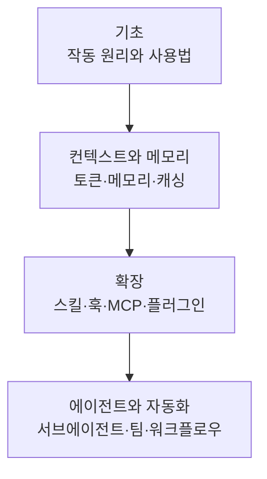

이 섹션은 앤트로픽의 터미널 CLI인 Claude Code를 처음부터 이해하기 위한 학습 경로입니다. Claude Code를 막 접한 개발자, 그리고 MoAI-ADK의 동작 기반을 정확히 파악하려는 분을 위한 안내서입니다.

Claude Code는 터미널에서 실행되는 코딩 에이전트로, 코드를 읽고 수정하고 명령을 실행하며 개발자와 대화를 통해 작업합니다. MoAI-ADK는 이 Claude Code 위에서 동작하는 오케스트레이션 계층으로, SPEC 기반 워크플로우와 전문 에이전트 위임을 더합니다. 따라서 MoAI-ADK를 제대로 활용하려면 먼저 그 토대가 되는 플랫폼 (Claude Code 자체)을 이해하는 것이 중요합니다.


**한 줄 요약**: 이 섹션은 도구 (플랫폼)인 Claude Code 자체를 익히는 단계입니다. MoAI 고유의 활용법은 핵심 개념 및 심화 학습 섹션에서 이어집니다.


## 학습 흐름

먼저 기초 그룹에서 Claude Code의 작동 원리를 익히고, 컨텍스트와 메모리 관리로 장기 세션의 핵심을 다집니다. 이후 확장으로 기능을 넓히고, 마지막으로 에이전트와 자동화로 자율 실행까지 나아갑니다.

## 목차

| 문서 | 설명 |
|------|------|
| [기초](/claude-code/foundations) | Claude Code의 작동 원리와 기본 사용법 |
| [컨텍스트와 메모리](/claude-code/context-memory) | 토큰·컨텍스트·메모리·캐싱·체크포인트 관리 |
| [확장](/claude-code/extensibility) | 스킬·훅·MCP·플러그인으로 기능 확장 |
| [에이전트와 자동화](/claude-code/agentic) | 서브에이전트·팀·워크플로우·자율 실행 |

네 그룹을 차례로 마치면 Claude Code 플랫폼 전반을 이해하게 됩니다. 그다음에는 MoAI-ADK의 핵심 개념 섹션으로 이동해 이 토대 위에서 어떻게 SPEC 기반 개발을 수행하는지 살펴보시기 바랍니다.
