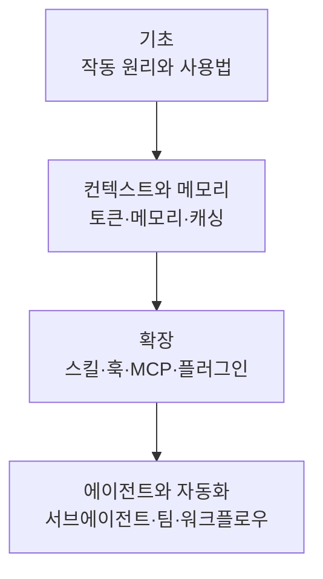

이 섹션은 앤트로픽의 터미널 CLI인 Claude Code를 처음부터 이해하기 위한 학습 경로입니다. Claude Code를 막 접한 개발자, 그리고 MoAI-ADK의 동작 기반을 정확히 파악하려는 분을 위한 안내서입니다.

Claude Code는 터미널에서 실행되는 코딩 에이전트로, 코드를 읽고 수정하고 명령을 실행하며 개발자와 대화를 통해 작업합니다. MoAI-ADK는 이 Claude Code 위에서 동작하는 오케스트레이션 계층이며, 세 가지 핵심 가치 — **토크노믹스** (Token Economics), **에이전틱 루프 엔지니어링** (재귀적 자가 학습), **에이전틱 하네스** (Agentic Harness) — 는 모두 이 섹션에서 다루는 Claude Code의 기본 메커니즘 위에 세워져 있습니다. 컨텍스트 윈도우와 프롬프트 캐싱을 모르면 토크노믹스를 설계할 수 없고, 서브에이전트와 `/goal`을 모르면 에이전틱 루프를 이해할 수 없으며, 스킬·훅·MCP를 모르면 하네스를 만들 수 없습니다.


**한 줄 요약**: 이 섹션은 도구 (플랫폼)인 Claude Code 자체를 익히는 단계입니다. MoAI-ADK가 이 토대 위에서 세 기둥을 어떻게 세우는지는 핵심 개념 및 심화 학습 섹션에서 이어집니다.


## 학습 흐름

```mermaid
flowchart TD
    A[기초<br/>작동 원리와 사용법] --> B[컨텍스트와 메모리<br/>토큰·메모리·캐싱]
    B --> C[확장<br/>스킬·훅·MCP·플러그인]
    C --> D[에이전트와 자동화<br/>서브에이전트·팀·워크플로우]
```

먼저 기초 그룹에서 Claude Code의 에이전틱 루프가 어떻게 도는지 익히고, 컨텍스트와 메모리 관리로 토큰 경제의 기본기를 다집니다. 이후 확장으로 하네스의 재료를 갖추고, 마지막으로 에이전트와 자동화로 자율 실행 루프까지 나아갑니다.

## 목차 — 네 그룹과 세 기둥의 대응

| 문서 | 설명 | 이어지는 MoAI 기둥 |
|------|------|--------------------|
| [기초](/ko/claude-code/foundations) | Claude Code의 작동 원리와 기본 사용법 | 세 기둥 공통 토대 |
| [컨텍스트와 메모리](/ko/claude-code/context-memory) | 토큰·컨텍스트·메모리·캐싱·체크포인트 관리 | 토크노믹스 |
| [확장](/ko/claude-code/extensibility) | 스킬·훅·MCP·플러그인으로 기능 확장 | 에이전틱 하네스 |
| [에이전트와 자동화](/ko/claude-code/agentic) | 서브에이전트·팀·워크플로우·자율 실행 | 에이전틱 루프 엔지니어링 |

네 그룹을 차례로 마치면 Claude Code 플랫폼 전반을 이해하게 됩니다. 그다음에는 MoAI-ADK의 핵심 개념 섹션으로 이동해, 이 토대 위에서 SPEC 기반 개발과 토큰 효율 설계가 어떻게 결합되는지 살펴보시기 바랍니다.
