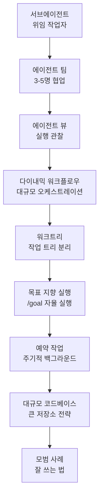

이 그룹은 Claude Code의 에이전트 오케스트레이션과 자율 실행을 다룹니다. 단일 대화를 넘어 여러 작업자를 위임하고, 팀으로 협업하고, 스크립트로 대규모 작업을 펼치는 방법을 배우려는 개발자를 위한 내용입니다.

서브에이전트·에이전트 팀·다이내믹 워크플로우라는 세 가지 오케스트레이션 원시를 중심으로, 워크트리 분리·목표 지향 실행·예약 작업·대규모 코드베이스 탐색·모범 사례까지 차례로 이어집니다.


**한 줄 요약**: 어떤 작업을 누가 (서브에이전트·팀·워크플로우) 실행할지 고른 뒤, 워크트리와 목표·예약·규모 전략으로 자율 실행을 안정적으로 운영하는 법을 익힙니다.


## 학습 흐름

세 가지 오케스트레이션 원시(서브에이전트 → 에이전트 팀 → 다이내믹 워크플로우)를 먼저 이해한 뒤, 워크트리와 목표·예약·규모 전략으로 확장하고 마지막에 모범 사례로 마무리하는 순서를 권장합니다.

## 목차

| 문서 | 설명 |
|------|------|
| [서브에이전트](/claude-code/agentic/sub-agents) | 격리 컨텍스트의 위임 작업자 |
| [에이전트 팀](/claude-code/agentic/agent-teams) | 3-5명 팀 협업 |
| [에이전트 뷰](/claude-code/agentic/agent-view) | 실행 관찰 화면 |
| [다이내믹 워크플로우](/claude-code/agentic/workflows) | 스크립트 기반 대규모 오케스트레이션 |
| [워크트리](/claude-code/agentic/worktrees) | 작업 트리 분리 |
| [목표 지향 실행 (/goal)](/claude-code/agentic/goal) | 조건 충족까지 자율 실행 |
| [예약 작업](/claude-code/agentic/scheduled-tasks) | 주기적 백그라운드 실행 |
| [대규모 코드베이스](/claude-code/agentic/large-codebases) | 큰 저장소 탐색 전략 |
| [모범 사례](/claude-code/agentic/best-practices) | Claude Code를 잘 쓰는 법 |

먼저 [서브에이전트](/claude-code/agentic/sub-agents)부터 읽으며 위임의 기본 단위를 익힌 뒤 다음 문서로 이동하시기 바랍니다.
