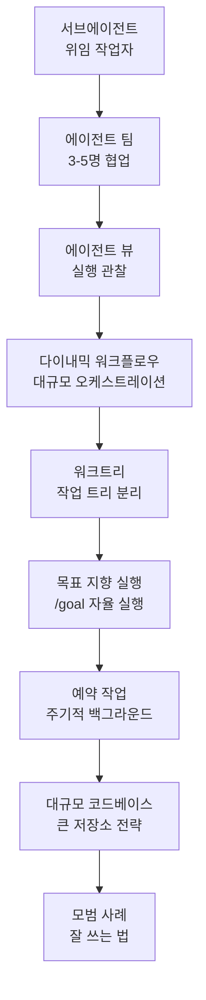

친구에게 이 그룹을 설명하자면, 한 번의 대화로는 끝내기 어려운 큰일을 Claude에게 어떻게 쪼개 맡기고, 사람이 매번 손대지 않아도 스스로 끝까지 돌게 만드는지를 모아 둔 곳입니다. 단일 대화를 넘어 여러 작업자에게 위임하고, 팀으로 협업하고, 스크립트로 대규모 작업을 펼치는 법을 배우는 학습 경로입니다.


이 문서는 MoAI-ADK가 올라타 있는 플랫폼인 **Claude Code 자체**를 다루는 배경 자료입니다. MoAI-ADK 자체 기능은 사이드바 위쪽 섹션에서 다룹니다.


## 세 가지 오케스트레이션 원시

이 그룹의 중심에는 **오케스트레이션 원시** (orchestration primitive) 세 가지가 서 있습니다 — 서브에이전트·에이전트 팀·다이내믹 워크플로우. 셋 다 "여러 단계 작업을 수행한다"는 점은 같지만, **계획을 누가 쥐고 있는가**가 다릅니다. 이 하나의 질문이 세 가지를 갈라 놓고, 이 그룹 전체의 이해를 잡아 주는 열쇠이기도 합니다.

| 원시 | 정체 | 계획은 어디에 |
|------|------|---------------|
| **서브에이전트** (subagent) | Claude가 만드는 일회성 워커 | Claude의 머릿속 (턴마다 결정) |
| **에이전트 팀** (Agent Teams) | 공유 작업 목록으로 협업하는 세션들 | 공유 목록 + Claude의 조율 |
| **다이내믹 워크플로우** (dynamic workflow) | 런타임이 실행하는 JavaScript 스크립트 | 스크립트 코드 |

서브에이전트와 에이전트 팀은 Claude가 오케스트레이터로서 매 턴 무엇을 만들지 결정하고 그 결과가 Claude의 컨텍스트로 들어옵니다. 반면 다이내믹 워크플로우는 조율 로직을 스크립트가 스스로 품고 있어, 수백 개 에이전트의 중간 산출물이 오케스트레이터의 컨텍스트를 채우지 않습니다. 이 차이가 "왜 대규모 팬아웃에는 워크플로우가 유리한가"의 핵심입니다.

## 위임을 넘어 자율 실행으로

세 원시가 "작업을 누구에게 맡길까"를 다룬다면, 나머지 문서들은 "맡긴 루프를 어떻게 안정적으로 운영할까"를 다룹니다. **워크트리** (worktree) 로 작업 트리를 분리해 동시 세션끼리 엇갈리지 않게 하고, **`/goal`** 로 조건이 충족될 때까지 자율 실행을 이어가며, **예약 작업** (scheduled task) 으로 주기적 백그라운드 작업을 걸어 두고, **대규모 코드베이스** 전략으로 큰 저장소를 다루는 법까지 — 자율 실행 루프를 안전하게 굴리는 데 필요한 축들을 차례로 짚습니다.

MoAI-ADK가 말하는 **에이전틱 루프 엔지니어링** (Agentic Loop Engineering) — 사람이 매 턴 개입하는 대신 루프 자체를 설계하고, 루프가 남긴 관찰로 하네스를 학습시키는 일 — 은 정확히 이 그룹의 메커니즘 위에 서 있습니다. `/goal`의 조건 평가 루프, 서브에이전트 위임, 워크플로우 팬아웃이 바로 그 루프의 실체입니다.


**한 줄 요약**: 어떤 작업을 누가 실행할지(서브에이전트·팀·워크플로우) 고른 뒤, 워크트리와 `/goal`·예약·규모 전략으로 자율 실행 루프를 안정적으로 운영하는 법을 익힙니다.



이 그룹은 Claude Code 최근 변화의 핵심 영역입니다. **서브에이전트 중첩**이 v2.1.219부터 다시 기본 활성화되어 깊이 3까지 중첩 spawn할 수 있고 (`CLAUDE_CODE_MAX_SUBAGENT_SPAWN_DEPTH=1`로 끔), **백그라운드 실행**이 v2.1.198부터 기본값이 되었습니다. 최신 **Opus 4.7+/4.8/5** 모델은 서브에이전트를 자동으로 spawn하지 않고 추론을 우선하므로 위임이 필요할 때 명시적으로 지시하는 것이 권장되며, 에이전트 정의 본문은 간결하게 유지할수록 스폰 비용과 캐시 효율이 좋아집니다. **다이내믹 워크플로우**는 v2.1.154 이상에서 쓸 수 있습니다. 세부 버전과 함의는 각 문서에서 다시 다룹니다.


## 학습 흐름

```mermaid
flowchart TD
    A[서브에이전트<br/>위임 작업자] --> B[에이전트 팀<br/>3-5명 협업]
    B --> C[에이전트 뷰<br/>실행 관찰]
    C --> D[다이내믹 워크플로우<br/>대규모 오케스트레이션]
    D --> E[워크트리<br/>작업 트리 분리]
    E --> F[목표 지향 실행<br/>/goal 자율 실행]
    F --> G[예약 작업<br/>주기적 백그라운드]
    G --> H[대규모 코드베이스<br/>큰 저장소 전략]
    H --> I[모범 사례<br/>잘 쓰는 법]
```

세 가지 오케스트레이션 원시(서브에이전트 → 에이전트 팀 → 다이내믹 워크플로우)를 먼저 이해한 뒤, 워크트리와 `/goal`·예약·규모 전략으로 확장하고 마지막에 모범 사례로 마무리하는 순서를 권장합니다.

## 목차

| 문서 | 설명 |
|------|------|
| [서브에이전트](/ko/claude-code/agentic/sub-agents) | 격리 컨텍스트의 위임 작업자 · 중첩·백그라운드·권한 상속 |
| [에이전트 팀](/ko/claude-code/agentic/agent-teams) | 3-5명 팀 협업과 공유 작업 목록 |
| [에이전트 뷰](/ko/claude-code/agentic/agent-view) | 에이전트 실행을 관찰하는 화면 |
| [다이내믹 워크플로우](/ko/claude-code/agentic/workflows) | 스크립트 기반 대규모 오케스트레이션 |
| [워크트리](/ko/claude-code/agentic/worktrees) | 작업 트리 분리와 동시 세션 충돌 회피 |
| [목표 지향 실행 (/goal)](/ko/claude-code/agentic/goal) | 조건 충족까지 자율 실행 |
| [예약 작업](/ko/claude-code/agentic/scheduled-tasks) | 주기적 백그라운드 실행 |
| [대규모 코드베이스](/ko/claude-code/agentic/large-codebases) | 큰 저장소 탐색 전략 |
| [모범 사례](/ko/claude-code/agentic/best-practices) | Claude Code를 잘 쓰는 법 |

먼저 [서브에이전트](/ko/claude-code/agentic/sub-agents)부터 읽으며 위임의 기본 단위를 익힌 뒤 다음 문서로 이동하시기 바랍니다.
