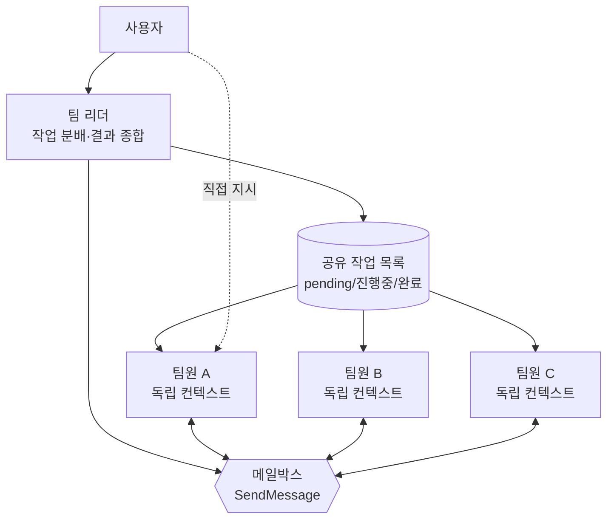

# 에이전트 팀

에이전트 팀 (Agent Teams)은 여러 Claude Code 세션을 하나의 팀으로 묶어 공유 작업 목록과 상호 메시징으로 협업하게 하는 실험적 기능입니다.


**한 줄 요약**: 서브에이전트가 리더에게만 보고하는 일방향 일꾼이라면, 에이전트 팀은 서로 대화하고 작업을 직접 가져가며 검증까지 주고받는 동료 집단입니다.


## 에이전트 팀이란

에이전트 팀은 여러 Claude Code 인스턴스가 함께 일하도록 조율하는 구조입니다. 한 세션이 **팀 리더 (team lead)**가 되어 작업을 분배하고 결과를 종합하며, 나머지 **팀원 (teammate)**은 각자 독립된 컨텍스트 윈도우에서 일하면서 서로 직접 통신합니다.

서브에이전트와의 결정적 차이는 통신 방향입니다. 서브에이전트는 메인 에이전트에게만 결과를 보고하고 서로 대화할 수 없지만, 에이전트 팀의 팀원은 공유 작업 목록을 보고 일감을 스스로 가져가며 팀원끼리 직접 메시지를 주고받습니다. 리더를 거치지 않고 사용자가 특정 팀원에게 바로 지시할 수도 있습니다.

에이전트 팀은 **병렬 탐색**이 실질적 가치를 더하는 작업에 가장 강력합니다.

| 적합한 작업 | 이유 |
| --- | --- |
| 리서치 / 리뷰 | 여러 팀원이 서로 다른 측면을 동시에 조사하고 발견을 교차 검증 |
| 신규 모듈 / 기능 | 팀원마다 별도 영역을 소유하여 충돌 없이 병렬 작업 |
| 경쟁 가설 디버깅 | 서로 다른 이론을 병렬 검증하고 더 빨리 수렴 |
| 레이어 횡단 작업 | 프런트엔드 / 백엔드 / 테스트를 팀원별로 분담 |

반대로 순차적 작업, 같은 파일을 함께 고치는 작업, 의존성이 많은 작업은 단일 세션이나 서브에이전트가 더 효율적입니다. 에이전트 팀은 조율 비용과 토큰 사용량이 단일 세션보다 크게 늘어납니다.

## 서브에이전트 vs 에이전트 팀

|  | 서브에이전트 | 에이전트 팀 |
| --- | --- | --- |
| **컨텍스트** | 자체 컨텍스트 윈도우, 결과는 호출자에게 반환 | 자체 컨텍스트 윈도우, 완전히 독립 |
| **통신** | 메인 에이전트에게만 결과 보고 | 팀원끼리 직접 메시지 교환 |
| **조율** | 메인 에이전트가 모든 작업 관리 | 공유 작업 목록 기반 자율 조율 |
| **적합한 용도** | 결과만 필요한 집중 작업 | 토론과 협업이 필요한 복합 작업 |
| **토큰 비용** | 낮음 (결과를 메인 컨텍스트로 요약) | 높음 (팀원마다 별도 Claude 인스턴스) |

빠르고 집중된 일꾼이 보고만 하면 되는 경우 서브에이전트를, 팀원이 발견을 공유하고 서로를 검증하며 자율적으로 조율해야 하는 경우 에이전트 팀을 선택합니다.

## 권장 규모: 3-5명

팀원 수에 강제 상한은 없지만 현실적 제약이 있습니다.

- **토큰 비용은 선형 증가**합니다. 팀원마다 독립된 컨텍스트 윈도우를 가지고 토큰을 따로 소비합니다.
- 팀원이 많아질수록 **통신과 조율 부담**이 커지고 충돌 가능성도 늘어납니다.
- 일정 수를 넘으면 **수확 체감**이 발생합니다. 추가 팀원이 작업 속도를 비례해서 높여 주지 않습니다.

공식 가이드는 대부분의 워크플로우에서 **3-5명**으로 시작하기를 권장합니다. 팀원당 5-6개의 작업 (task)을 배정하면 과도한 컨텍스트 전환 없이 모두를 바쁘게 유지할 수 있습니다. 예를 들어 독립적인 15개 작업이 있다면 3명이 좋은 출발점입니다. 집중된 3명이 흩어진 5명보다 나은 결과를 내는 경우가 많습니다.

## 협업 메커니즘

에이전트 팀은 네 가지 구성 요소로 동작합니다.

| 구성 요소 | 역할 |
| --- | --- |
| **팀 리더 (team lead)** | 팀을 생성하고 팀원을 스폰하며 작업을 조율하는 메인 세션 |
| **팀원 (teammate)** | 배정된 작업을 수행하는 독립 Claude Code 인스턴스 |
| **작업 목록 (Task list)** | 팀원이 가져가고 완료하는 공유 작업 목록 |
| **메일박스 (Mailbox)** | 에이전트 간 통신을 담당하는 메시징 시스템 |

### 공유 작업 목록과 SendMessage

작업은 `pending`, `in progress`, `completed` 세 가지 상태를 가지며, 작업 간 의존성도 설정할 수 있습니다. 의존성이 해소되지 않은 `pending` 작업은 선행 작업이 완료되기 전까지 가져갈 수 없습니다. 한 팀원이 선행 작업을 완료하면 의존하던 작업이 자동으로 잠금 해제됩니다.

작업 분배는 두 가지 방식으로 이뤄집니다.

- **리더 배정**: 리더가 특정 작업을 특정 팀원에게 명시적으로 할당합니다.
- **자율 클레임 (self-claim)**: 팀원이 작업을 마치면 할당되지 않고 막히지 않은 다음 작업을 스스로 가져갑니다.

작업 클레임은 **파일 잠금 (file locking)**을 사용해 여러 팀원이 동시에 같은 작업을 가져가려 할 때 발생하는 경쟁 조건을 방지합니다. 팀원 간 통신은 `SendMessage`로 이뤄지며, 보낸 메시지는 수신자에게 자동으로 전달됩니다. 리더가 폴링할 필요 없이 메시지가 도착하고, 팀원이 작업을 마치고 멈추면 자동으로 리더에게 알립니다.

### 파일 소유권

두 팀원이 같은 파일을 편집하면 덮어쓰기가 발생합니다. 따라서 각 팀원이 **서로 다른 파일 집합을 소유**하도록 작업을 분할하는 것이 핵심 모범 사례입니다. 신규 모듈이나 레이어 횡단 작업처럼 영역이 자연스럽게 나뉘는 경우에 에이전트 팀이 특히 잘 동작하는 이유이기도 합니다.

### 협업 구조



리더는 작업 목록을 통해 일감을 분배하고, 팀원은 메일박스로 서로 직접 대화하며, 사용자는 리더를 거치지 않고 개별 팀원에게도 지시할 수 있습니다.

## 활성화 요건 (v2.1.178+)

에이전트 팀은 **실험적 기능이며 기본적으로 비활성화**되어 있습니다. Claude Code v2.1.178 이상이 필요하며, 환경 변수 `CLAUDE_CODE_EXPERIMENTAL_AGENT_TEAMS`를 `1`로 설정해 활성화합니다.

### v2.1.178의 변화

- **Implicit Teams**: 팀 생성이 더 간단해졌습니다. 리더가 첫 팀원을 스폰하면 자동으로 팀이 형성되고, 세션 종료 시 자동으로 정리됩니다.
- **TeamCreate/TeamDelete 제거**: v2.1.178부터 이 명령어는 사라졌습니다 (더 이상 수동으로 팀을 생성하거나 삭제할 필요 없음).
- **`team_name` accepted-but-ignored**: Hook payload에서 `team_name` 필드는 여전히 포함되지만, 실제로는 무시됩니다 (레거시 호환성용).

셸 환경에 직접 지정하거나 `settings.json`에 등록합니다.

```json
{
  "env": {
    "CLAUDE_CODE_EXPERIMENTAL_AGENT_TEAMS": "1"
  }
}
```

활성화 후에는 자연어로 팀 생성을 요청하면 됩니다. Claude가 팀을 만들고 팀원을 스폰한 뒤 작업을 조율합니다.

```text
TODO 주석을 코드베이스 전반에서 추적하는 CLI 도구를 설계 중입니다.
서로 다른 관점에서 탐색할 에이전트 팀을 만들어 주세요.
한 명은 UX, 한 명은 기술 아키텍처, 한 명은 비판자 역할로요.
```

## 표시 모드와 팀원 모델

에이전트 팀은 두 가지 표시 모드를 지원합니다.

| 모드 | 특징 | 필요 조건 |
|------|------|---------|
| **인프로세스 (in-process)** | 모든 팀원이 메인 터미널 안에서 동작 | 추가 설정 없음 (기본값) |
| **스플릿 페인 (split panes)** | 팀원마다 별도 창을 띄움 | tmux 또는 iTerm2 필요 (v2.1.186+) |

기본값은 **in-process** (v2.1.179부터, 이전에는 `"auto"`였음)이므로, 어디서든 추가 설정 없이 쓸 수 있습니다. 만약 split-pane 모드로 강제하고 싶다면:

```json
{
  "teammateMode": "in-process"
}
```

위 값을 원하는 모드로 바꾸거나, 단일 세션 한정으로 `--teammate-mode in-process` 플래그로 강제할 수 있습니다.

팀원은 기본적으로 리더의 `/model` 선택을 상속하지 않습니다. 프롬프트에서 모델을 지정하지 않았을 때 사용할 모델은 `/config`의 **Default teammate model**에서 설정합니다.

## 품질 게이트 hook

[hook](/claude-code/extensibility/hooks)을 사용하면 팀원이 작업을 마치거나 작업이 생성·완료될 때 규칙을 강제할 수 있습니다.

| hook 이벤트 | 발동 시점 | 종료 코드 2의 의미 |
| --- | --- | --- |
| `TeammateIdle` | 팀원이 유휴 상태로 전환되기 직전 | 피드백을 보내고 계속 작업하게 유지 |
| `TaskCreated` | 작업이 생성되려 할 때 | 생성을 막고 피드백 전송 |
| `TaskCompleted` | 작업이 완료 처리되려 할 때 | 완료를 막고 피드백 전송 |

## 알아둘 한계

에이전트 팀은 실험적 기능이므로 다음 한계를 인지하고 사용합니다.

- **세션 재개 미지원**: `/resume`과 `/rewind`는 인프로세스 팀원을 복원하지 못합니다. 재개 후에는 리더에게 새 팀원을 스폰하도록 지시합니다.
- **작업 상태 지연**: 팀원이 작업 완료 표시를 누락해 의존 작업이 막힐 수 있습니다.
- **한 번에 한 팀**: 리더는 하나의 팀만 관리합니다. 새 팀을 만들기 전에 현재 팀을 정리해야 합니다.
- **중첩 팀 불가**: 팀원은 자신의 팀이나 팀원을 스폰할 수 없습니다. 팀 관리는 리더만 가능합니다.
- **리더 고정**: 팀을 만든 세션이 수명 동안 리더이며 리더십을 이전할 수 없습니다.

팀 정리는 항상 리더를 통해 수행합니다. 작업이 끝나면 리더에게 정리를 요청하되, 실행 중인 팀원이 남아 있으면 정리가 실패하므로 먼저 종료시켜야 합니다.

## MoAI CG 모드와의 연계

MoAI-ADK는 에이전트 팀 위에 **CG 모드 (Claude + GLM)**를 얹어 비용을 최적화합니다. 리더는 Claude로 워크플로우를 조율하고, 팀원은 tmux 세션 단위 환경 격리를 통해 GLM 환경을 상속받아 구현 작업을 수행하는 방식입니다. 구현 중심 SPEC, 코드 생성, 테스트 작성처럼 토큰 소비가 큰 작업에서 비용을 크게 줄 수 있습니다.

CG 모드의 설정과 운영 방법은 별도 문서에서 자세히 다루므로 아래 링크를 참고합니다.

## 관련 문서

- [다이내믹 워크플로우](/claude-code/agentic/workflows)
- [CG 모드 (Claude + GLM)](/multi-llm/cg-mode)

## 참고 자료

- [Claude Code Docs — Orchestrate teams of Claude Code sessions](https://code.claude.com/docs/en/agent-teams)


에이전트 팀이 처음이라면 코드를 작성하지 않는 작업부터 시작하세요. PR 리뷰, 라이브러리 리서치, 버그 조사처럼 경계가 명확한 작업은 병렬 구현의 조율 부담 없이 병렬 탐색의 가치를 바로 체감하게 해 줍니다.

