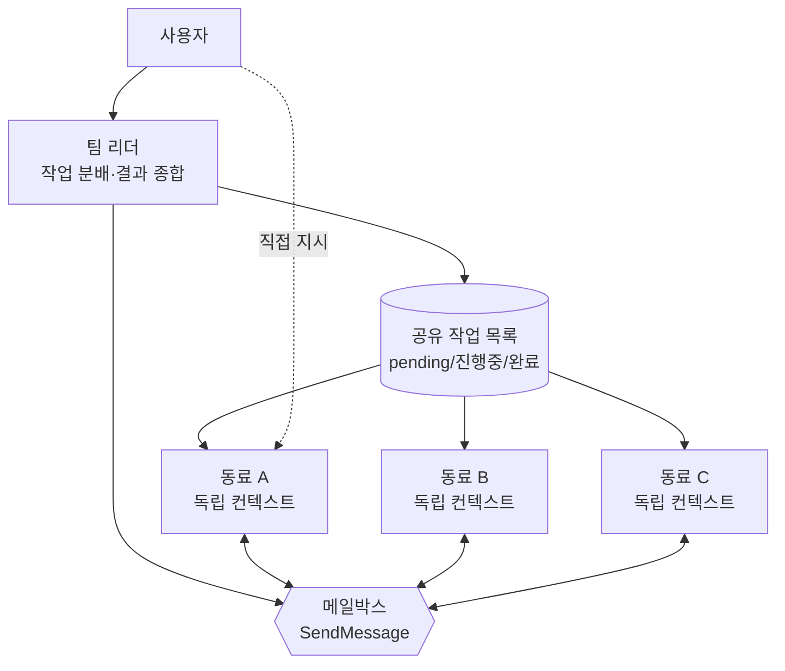

# 에이전트 팀


에이전트 팀(Agent Teams)은 한 세션이 혼자 감당하기 어려운 큰 작업을, 서로 대화할 수 있는 동료 에이전트들에게 나눠 맡기는 Claude Code의 협업 구조입니다. 서브에이전트가 "결과만 보고하는 일꾼"이라면, 팀의 동료들은 칸반 보드에서 스스로 일감을 집고 서로 의견을 주고받으며 함께 결과를 만들어 갑니다.


**한 줄 요약**: 한 세션이 팀 리더(team lead)가 되어 작업을 분배하고 결과를 종합하며, 나머지 동료(teammate)는 저마다 독립된 컨텍스트 윈도우에서 일하면서 공유 작업 목록과 직접 메시징으로 서로 조율합니다.



**"에이전트 팀" 두 가지를 구분하세요.** 이 페이지가 다루는 것은 **Claude Code 네이티브 에이전트 팀 런타임**(tmux/iTerm2 페인, 공유 작업 목록, 환경 변수 `CLAUDE_CODE_EXPERIMENTAL_AGENT_TEAMS`)으로, 살아 있으며 `moai cg` 하이브리드 모드가 그대로 활용합니다. 반면 MoAI의 **정적 agent-team 오케스트레이션 계층**(옛 `workflow.team.*` 설정, `--team` 강제 플래그)은 **은퇴**했습니다. `--team`을 강제하면 `MODE_TEAM_UNAVAILABLE`과 함께 서브에이전트 모드로 폴백합니다. 즉 네이티브 런타임은 살아 있고, MoAI 자체 오케스트레이션의 정적 팀 계층만 사라진 것입니다.


## 에이전트 팀이란

에이전트 팀은 여러 Claude Code 인스턴스가 함께 일하도록 조율하는 구조입니다. 한 세션이 **팀 리더**(team lead)가 되어 작업을 분배하고 결과를 종합하고, 나머지 **동료**(teammate)는 각자 독립된 컨텍스트 윈도우에서 일하면서 서로 직접 통신합니다.

서브에이전트와의 결정적 차이는 통신 방향에 있습니다. 서브에이전트는 메인 에이전트에게만 결과를 보고하고 서로 대화할 수 없습니다. 그런데 에이전트 팀의 동료는 공유 작업 목록을 들여다보며 일감을 스스로 가져가고, 동료끼리 직접 메시지를 주고받습니다. 리더를 거치지 않고 사용자가 특정 동료에게 바로 지시할 수도 있습니다. 그래서 에이전트 팀은 "일방향 위임"이 아니라 **"서로 검증하고 조율하는 협업"**에 가깝습니다.


에이전트 팀은 **각자 자기 자리를 가진 팀원들이 칸반 보드를 공유하는 사무실**에 비유할 수 있습니다. 서브에이전트가 "내 옆자리에서 내가 시킨 일만 하고 요약만 건네는 보조"라면, 팀 동료는 "저마다 독립된 자리에서 일하지만 칸반 보드(공유 작업 목록)에서 풀리는 일감을 집어가고 메신저(`SendMessage`)로 서로 직접 소통하는 진짜 팀원"입니다.


에이전트 팀이 가장 큰 힘을 발휘하는 영역은 **병렬 탐색**(parallel exploration)입니다. 여러 동료가 서로 다른 측면을 동시에 조사하고 발견을 교차 검증할 수 있기 때문입니다.

| 잘 맞는 작업 | 이유 |
| --- | --- |
| 리서치 / 리뷰 | 여러 동료가 서로 다른 측면을 동시에 조사하고 발견을 교차 검증 |
| 경쟁 가설 디버깅 | 서로 다른 이론을 병렬로 검증하고 더 빨리 수렴 |
| 영역이 깔끔하게 나뉘는 신규 모듈 | 동료마다 별도 파일 집합을 소유해 충돌 없이 병렬 작업 |
| 레이어 횡단 작업 | 프런트엔드 / 백엔드 / 테스트를 동료별로 분담 |

반대로 순차적 작업, 같은 파일을 함께 고쳐야 하는 작업, 의존성이 많이 엮인 작업은 단일 세션이나 서브에이전트가 더 효율적입니다. 에이전트 팀은 조율 비용과 토큰 사용량이 단일 세션보다 크게 늘어난다는 점도 감안해야 합니다.

## 서브에이전트와 무엇이 다른가

핵심은 "결과만 보고하면 되는가, 아니면 동료와 검증을 주고받아야 하는가"입니다.

|  | 서브에이전트 | 에이전트 팀 |
| --- | --- | --- |
| **컨텍스트** | 자체 컨텍스트 윈도우, 결과는 호출자에게 반환 | 자체 컨텍스트 윈도우, 완전히 독립 |
| **통신** | 메인 에이전트에게만 결과 보고 | 동료끼리 직접 메시지 교환 |
| **조율** | 메인 에이전트가 모든 작업 관리 | 공유 작업 목록 기반 자율 조율 |
| **적합한 용도** | 결과만 필요한 집중 작업 | 토론과 협업이 필요한 복합 작업 |
| **토큰 비용** | 낮음 (결과를 메인 컨텍스트로 요약) | 높음 (동료마다 별도 Claude 인스턴스) |

빠르고 집중된 일꾼이 보고만 하면 되면 서브에이전트를, 동료가 발견을 공유하고 서로를 검증하며 자율적으로 조율해야 하면 에이전트 팀을 선택합니다.

## 팀은 어떻게 만들어지나

에이전트 팀은 **동적**(dynamic)으로 형성됩니다. 정적 설정 파일로 팀 구조를 미리 짜두는 것이 아니라, 리더가 **Agent 도구의 `name` 파라미터로 동료를 스폰하는 순간 팀이 암시적으로 만들어집니다**. 첫 동료가 스폰되면 그 세션에 팀이 생기고, **세션당 한 팀**을 유지하며, 별도의 생성/삭제 단계는 없습니다.

이 "암시적 팀"(Implicit Teams) 모델은 Claude Code v2.1.178에 도입되었습니다. 그 이전에는 `TeamCreate` / `TeamDelete` 명령으로 팀을 직접 만들고 지워야 했지만, v2.1.178부터 이 명령들이 사라지고 첫 스폰으로 팀이 자동 형성되며 세션 종료 시 자동 정리됩니다(Hook payload의 `team_name` 필드는 레거시 호환용으로 남아 있지만 무시됩니다).

다만 에이전트 팀은 아직 **실험적 기능이며 기본적으로 꺼져 있습니다**. Claude Code v2.1.178 이상에서 환경 변수 `CLAUDE_CODE_EXPERIMENTAL_AGENT_TEAMS`를 `1`로 설정해야 켤 수 있습니다. 셸 환경에 직접 지정하거나 `settings.json`에 등록합니다.

```json
{
  "env": {
    "CLAUDE_CODE_EXPERIMENTAL_AGENT_TEAMS": "1"
  }
}
```

활성화한 뒤에는 자연어로 팀 생성을 요청하면 됩니다. Claude가 알아서 동료를 스폰하고(그 순간 팀이 형성됩니다) 작업을 조율합니다.

```text
TODO 주석을 코드베이스 전반에서 추적하는 CLI 도구를 설계 중입니다.
서로 다른 관점에서 탐색할 에이전트 팀을 만들어 주세요.
한 명은 UX, 한 명은 기술 아키텍처, 한 명은 비판자 역할로요.
```

## 권장 규모: 3-5명

팀원 수에 강제 상한은 없지만 현실적 제약이 분명합니다.

- **토큰 비용은 선형으로 늘어납니다.** 동료마다 독립된 컨텍스트 윈도우에서 토큰을 따로 소비합니다.
- 동료가 많아질수록 **통신과 조율 부담**이 커지고 충돌 가능성도 커집니다.
- 일정 수를 넘으면 **수확 체감**이 찾아옵니다. 추가 동료가 작업 속도를 비례해서 끌어올려 주지 않습니다.

공식 가이드는 대부분의 워크플로우에서 **3-5명**으로 시작하라고 권장합니다("Start with 3-5 teammates for most workflows"). 동료 한 명당 작업(task)을 5-6개씩 배정하면 컨텍스트 전환을 과하게 일으키지 않으면서 모두를 바쁘게 굴릴 수 있습니다. 예를 들어 독립적인 작업이 15개라면 3명이 좋은 출발점입니다. 흩어진 5명보다 집중된 3명이 더 나은 결과를 내는 경우가 많습니다.


**코딩 작업은 리서치만큼 병렬화하기 어렵습니다.** 공식 문서도 "대부분의 코딩 작업은 리서치보다 진짜로 병렬화 가능한 부분이 적다"(most coding tasks involve fewer truly parallelizable tasks than research)고 지적합니다. 코드베이스 전수 탐색·교차 검증 리서치처럼 본질적으로 병렬인 작업에는 팀이 강력하지만, 같은 파일을 만지거나 의존성이 엮인 구현 작업은 직렬 처리가 더 빠르고 안전할 때가 많습니다. 에이전트 팀을 처음 쓴다면 코드를 쓰지 않는 작업(리서치·리뷰·버그 조사)부터 시작하는 것을 권합니다.


## 협업 메커니즘

에이전트 팀은 네 가지 구성 요소로 돌아갑니다.

| 구성 요소 | 역할 |
| --- | --- |
| **팀 리더**(team lead) | 팀을 형성하고 동료를 스폰하며 작업을 조율하는 메인 세션 |
| **동료**(teammate) | 배정된 작업을 수행하는 독립 Claude Code 인스턴스 |
| **작업 목록**(Task list) | 동료가 가져가고 완료하는 공유 작업 목록 |
| **메일박스**(Mailbox) | 에이전트 간 통신을 담당하는 메시징 시스템 |

### 공유 작업 목록과 SendMessage

작업은 `pending`, `in progress`, `completed` 세 상태 중 하나이며, 작업 간 의존성도 설정할 수 있습니다. 의존성이 풀리지 않은 `pending` 작업은 선행 작업이 끝나기 전까지 가져갈 수 없고, 선행 작업이 완료되면 매달려 있던 작업이 자동으로 잠금 해제됩니다.

작업 분배는 두 방식으로 이뤄집니다.

- **리더 배정**: 리더가 특정 작업을 특정 동료에게 명시적으로 할당합니다.
- **자율 클레임**(self-claim): 동료가 작업을 마치면 할당되지 않고 막혀 있지 않은 다음 작업을 스스로 가져갑니다.

여러 동료가 동시에 같은 작업을 집으려 할 때의 경쟁 조건은 **파일 잠금**(file locking)으로 막습니다. 동료 간 통신은 `SendMessage`로 이뤄지며, 보낸 메시지는 수신자에게 자동으로 전달됩니다. 리더가 폴링할 필요 없이 메시지가 도착하고, 동료가 작업을 마치고 멈추면 리더에게 자동으로 알립니다.

### 파일 소유권

두 동료가 같은 파일을 편집하면 덮어쓰기가 발생합니다. 그래서 각 동료가 **서로 다른 파일 집합을 소유**하도록 작업을 나누는 것이 핵심입니다. 신규 모듈이나 레이어 횡단 작업처럼 영역이 자연스럽게 나뉠 때 에이전트 팀이 특히 잘 맞는 이유이기도 합니다.

### 협업 구조


```mermaid
flowchart TD
    User[사용자] --> Lead[팀 리더<br/>작업 분배·결과 종합]
    Lead --> TaskList[(공유 작업 목록<br/>pending/진행중/완료)]
    Lead --> Mailbox{{메일박스<br/>SendMessage}}
    TaskList --> T1[동료 A<br/>독립 컨텍스트]
    TaskList --> T2[동료 B<br/>독립 컨텍스트]
    TaskList --> T3[동료 C<br/>독립 컨텍스트]
    T1 <--> Mailbox
    T2 <--> Mailbox
    T3 <--> Mailbox
    User -.직접 지시.-> T1
```

리더는 작업 목록으로 일감을 나눠 주고, 동료는 메일박스로 서로 직접 대화하며, 사용자는 리더를 거치지 않고 개별 동료에게도 지시할 수 있습니다.

## 표시 모드와 동료 모델

에이전트 팀은 두 가지 표시 모드를 지원합니다.

| 모드 | 특징 | 필요 조건 |
|------|------|---------|
| **인프로세스**(in-process) | 모든 동료가 메인 터미널 안에서 동작 | 추가 설정 없음(기본값) |
| **스플릿 페인**(split panes) | 동료마다 별도 창을 띄움 | tmux 또는 iTerm2(`it2` CLI) 필요 |

기본값은 `in-process`입니다(v2.1.179부터, 이전에는 `auto`였습니다). 어디서든 추가 설정 없이 쓸 수 있으며, split-pane 모드로 바꾸려면 `teammateMode` 설정 값을 변경합니다. `teammateMode`에 넣을 수 있는 값은 네 가지입니다.

| 값 | 동작 | 비고 |
|------|------|------|
| `in-process` | 모든 동료가 메인 터미널에서 동작 | 기본값(v2.1.179+) |
| `auto` | tmux 세션 안이거나 `it2` CLI가 설치된 iTerm2면 split pane, 그 외에는 in-process로 폴백 | v2.1.179 이전 기본값 |
| `tmux` | split-pane 강제 — 터미널 환경에 따라 tmux 또는 iTerm2를 자동 감지 | tmux 설치 필요 |
| `iterm2` | iTerm2 네이티브 split pane 강제 | v2.1.186+, `it2` CLI 필요 |

`~/.claude/settings.json`에서 지정합니다.

```json
{
  "teammateMode": "auto"
}
```

단일 세션 한정으로 `--teammate-mode auto` 플래그로 덮어쓸 수도 있습니다.

split-pane 모드에는 외부 도구가 필요합니다. tmux는 시스템 패키지 매니저로 설치하고, iTerm2는 [`it2` CLI](https://github.com/mkusaka/it2)를 설치한 뒤 iTerm2 설정(Settings → General → Magic → Enable Python API)에서 Python API를 켜야 합니다.

동료는 기본적으로 리더의 `/model` 선택을 물려받지 않습니다. 프롬프트에서 모델을 따로 지정하지 않았을 때 쓸 모델은 `/config`의 **Default teammate model**에서 정합니다. 단, v2.1.186부터 동료는 리더의 effort level을 상속합니다(split-pane 모드에서도 v2.1.186부터 적용되며, 그 이전 버전은 리더의 effort를 전달하지 않았습니다).

## 품질 게이트 hook

[hook](/ko/claude-code/extensibility/hooks)을 쓰면 동료가 작업을 마치거나 작업이 생성·완료될 때 규칙을 강제할 수 있습니다.

| hook 이벤트 | 발동 시점 | 종료 코드 2의 의미 |
| --- | --- | --- |
| `TeammateIdle` | 동료가 유휴 상태로 전환되기 직전 | 피드백을 보내고 계속 작업하게 유지 |
| `TaskCreated` | 작업이 생성되려 할 때 | 생성을 막고 피드백 전송 |
| `TaskCompleted` | 작업이 완료 처리되려 할 때 | 완료를 막고 피드백 전송 |

## 팀메이트 생명주기와 한계

에이전트 팀은 실험적 기능이라 몇 가지 한계를 알아두고 써야 합니다.

- **세션 재개 미지원**: `/resume`과 `/rewind`는 인프로세스 동료를 복원하지 못합니다. 재개한 뒤에는 리더에게 새 동료를 스폰하도록 지시합니다.
- **작업 상태 지연**: 동료가 작업 완료 표시를 빠뜨려 의존 작업이 막힐 수 있습니다.
- **한 번에 한 팀**: 리더는 하나의 팀만 관리합니다. 새 팀을 만들려면 먼저 현재 팀을 정리해야 합니다.
- **중첩 팀 불가**: 동료는 자기 팀이나 동료를 스폰할 수 없습니다. 팀 관리는 리더만 합니다.
- **리더 고정**: 팀을 만든 세션이 수명 동안 리더이며, 리더십을 다른 세션으로 넘길 수 없습니다.

팀 정리는 언제나 리더가 맡습니다. 작업이 끝나면 리더에게 정리를 요청하되, 실행 중인 동료가 남아 있으면 정리가 실패하므로 먼저 종료시켜야 합니다.

## MoAI CG 모드와 어떻게 맞물리는가

MoAI-ADK는 이 네이티브 팀 런타임 위에 **CG 모드**(`moai cg`, Claude + GLM 하이브리드)를 얹어 비용을 최적화합니다. 리더는 Claude로 전략·계획·감사를 조율하고, 동료는 tmux 세션 단위로 환경을 격리해 GLM 환경을 상속받으며 대량 구현 작업을 맡습니다. "누가 무엇을 하는가"라는 팀 구조 질문에 "어떤 모델이 얼마짜리 일을 하는가"라는 토크노믹스(tokenomics) 답을 결합한 것으로, 구현 중심 SPEC·코드 생성·테스트 작성처럼 토큰 소비가 큰 작업에서 **60-70% 비용을 줄입니다**.

한 가지 구분해 둘 것이 있습니다. MoAI-ADK는 자체 워크플로우 오케스트레이션에서는 정적 에이전트 팀 계층을 은퇴시키고 순차 서브에이전트와 동적 워크플로우를 기본으로 삼지만, 이 페이지에서 다룬 Claude Code의 네이티브 팀 런타임(tmux 페인, 공유 작업 목록)은 CG 모드가 그대로 씁니다. 즉 "팀"이라는 실행 형태는 살아 있고, 그 용도가 협업 조율에서 비용 라우팅으로 옮겨간 셈입니다.

CG 모드의 설정과 운영 방법은 별도 문서에서 자세히 다룹니다.

## 관련 문서

- [서브에이전트](/ko/claude-code/agentic/sub-agents)
- [다이내믹 워크플로우](/ko/claude-code/agentic/workflows)
- [CG 모드 (Claude + GLM)](/ko/multi-llm/cg-mode)

## 참고 자료

- [Claude Code Docs — Orchestrate teams of Claude Code sessions](https://code.claude.com/docs/en/agent-teams)


에이전트 팀이 처음이라면 코드를 작성하지 않는 작업부터 시작하세요. PR 리뷰, 라이브러리 리서치, 버그 조사처럼 경계가 명확한 작업은 병렬 구현의 조율 부담 없이 병렬 탐색의 가치를 바로 체감하게 해 줍니다.

