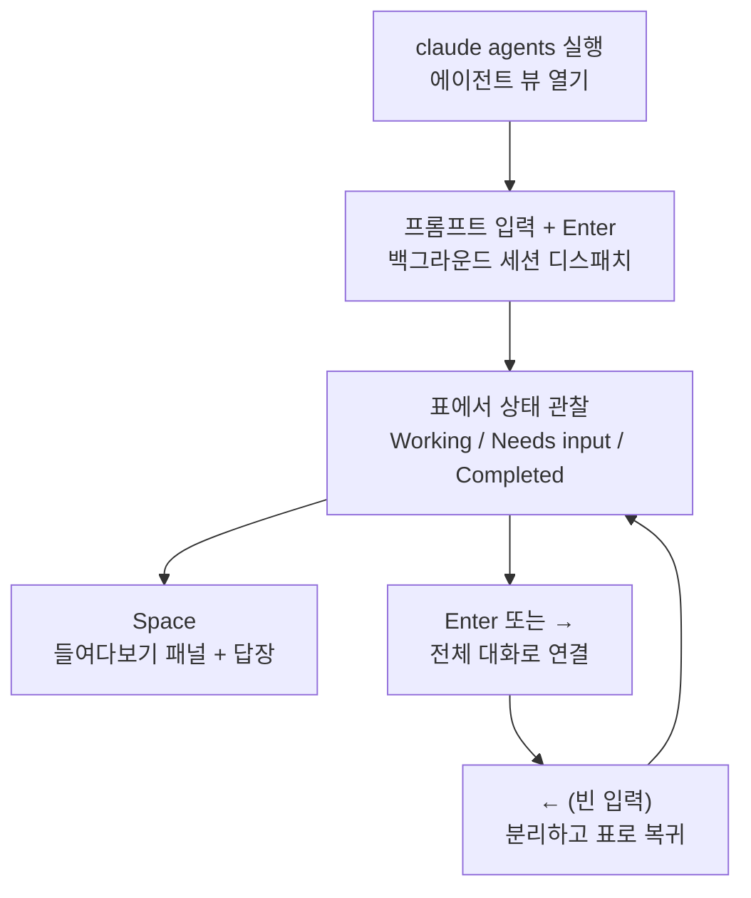

`claude agents` 명령으로 열리는 에이전트 뷰 (agent view)는 여러 Claude Code 세션을 한 화면에서 디스패치하고 관찰하며, 손이 필요한 세션에만 개입하게 해 주는 단일 관제 화면입니다.


**한 줄 요약**: 트랜스크립트를 일일이 스크롤하는 대신, 실행 중·대기 중·완료된 모든 백그라운드 세션을 하나의 표로 보고 필요한 순간에만 끼어듭니다.


## 에이전트 뷰란

에이전트 뷰는 터미널에 묶이지 않고 계속 돌아가는 **백그라운드 세션 (background session)** 들을 한 화면에서 관리하는 인터페이스입니다. 각 백그라운드 세션은 그 자체로 완전한 Claude Code 대화이며, 터미널을 닫아도 별도의 감독 프로세스가 계속 실행해 줍니다. 따라서 버그 수정, PR 리뷰, 플래키 테스트 조사를 각각 한 줄(row)로 던져 놓고 다른 작업을 하다가, 어떤 줄이 입력을 기다리거나 결과를 내놓았을 때 돌아오면 됩니다.

> 에이전트 뷰는 리서치 프리뷰 (research preview) 단계이며 Claude Code v2.1.139 이상에서 동작합니다. `claude --version` 으로 버전을 확인하세요. 인터페이스와 단축키는 기능이 발전하면서 바뀔 수 있습니다.

병렬 실행 수단들과의 위치를 정리하면 다음과 같습니다.

| 수단 | 특징 | 적합한 상황 |
| :--- | :--- | :--- |
| 에이전트 뷰 | 독립적인 여러 풀 세션을 한 표에서 디스패치·관찰 | 서로 무관한 작업 여러 개를 병렬로 돌리고 결과만 회수 |
| 서브에이전트 | 한 세션 안에서 호출되는 보조 작업자 | 단일 작업을 하위 단계로 분해 |
| 에이전트 팀 | 서로 메시지를 주고받는 다중 세션 협업 | 조율이 필요한 협업 작업 |
| 워크트리 | 파일 편집을 격리하는 git 작업 공간 | 같은 체크아웃에서 충돌 없이 병렬 편집 |

## 무엇을 보여주나

에이전트 뷰를 열면 터미널 전체를 차지하면서 모든 세션을 상태별 그룹으로 나열합니다. 입력을 기다리는 세션과 고정(pin)한 세션이 맨 위에 올라오고, 각 줄은 세션 이름, 현재 활동, 마지막 변경 경과 시간을 보여줍니다.

```text
Needs input
  ✻ power-up design     needs input: double jump or wall climb?     1m

Working
  ✽ collision detection Edit src/physics/CollisionSystem.ts          2m
  ✢ playtest level 3    run 12 · all checkpoints cleared          in 4m

Completed
  ✻ title screen        result: menu, options, and credits done      9m
  ∙ sound effects       result: 14 SFX exported to assets/audio       4h
```

### 진행 상황과 세션 상태

각 줄의 맨 앞 아이콘은 색과 애니메이션으로 세션 상태를 나타냅니다.

| 상태 | 아이콘 표시 | 의미 |
| :--- | :--- | :--- |
| Working | 애니메이션 | Claude가 도구를 실행하거나 응답을 생성하는 중 |
| Needs input | 노란색 | 특정 질문이나 권한 결정을 사용자에게 기다리는 중 |
| Idle | 흐림 | 할 일이 없어 다음 프롬프트를 기다리는 중 |
| Completed | 초록색 | 작업이 성공적으로 끝남 |
| Failed | 빨간색 | 작업이 오류로 종료됨 |
| Stopped | 회색 | `Ctrl+X` 또는 `claude stop` 으로 중지됨 |

별도로 아이콘 **모양** 은 내부 프로세스가 살아 있는지를 나타냅니다. `✻`(또는 애니메이션 `✽`)는 프로세스가 살아 있어 즉시 응답하고, `∙`은 프로세스가 종료된 상태(여전히 들여다보거나 답장·연결 가능하며 Claude가 중단 지점부터 재개), `✢`은 `/loop` 세션이 반복 사이에 대기 중임을 뜻합니다.

각 줄의 한 줄 요약은 Haiku 계열 모델이 생성하므로, 트랜스크립트를 열지 않고도 세션이 무엇을 하는지·무엇을 원하는지·무엇을 만들었는지 알 수 있습니다. 작업 중인 세션은 최대 15초에 한 번, 그리고 턴이 끝날 때마다 요약을 갱신합니다.

### 백그라운드 작업과 PR 상태

세션이 PR을 열면 줄 오른쪽 끝에 `PR #1234` 같은 라벨이 붙고, 하이퍼링크를 지원하는 터미널에서는 링크가 됩니다. PR 번호는 상태에 따라 색이 다릅니다.

| 색 | PR 상태 |
| :--- | :--- |
| 노란색 | 체크/리뷰 대기 중이거나 체크 실패 |
| 초록색 | 체크 통과 + 차단하는 리뷰 없음 |
| 보라색 | 머지됨 |
| 회색 | 초안 또는 닫힘 |

대부분의 작업에서는 이 열이 결과를 회수하는 지점이 됩니다. PR 번호가 초록색으로 바뀌면 리뷰 후 머지하면 됩니다. 또한 `! pytest -x` 처럼 입력 앞에 `!` 를 붙여 셸 명령을 백그라운드 작업으로 디스패치할 수도 있으며, 이 경우 모델을 호출하지 않고 명령만 한 줄로 실행되어 최근 출력 라인이 상태로 표시됩니다.

### 서브에이전트 출력

세션이 띄운 **서브에이전트** 나 **에이전트 팀** 팀원은 별도의 줄로 나열되지 않습니다. 그 산출물과 진행은 부모 세션 줄의 요약과 출력에 합쳐져 보입니다. 세부 내용을 보려면 해당 세션을 들여다보거나 연결해서 전체 대화로 확인합니다.

## 사용 시나리오

에이전트 뷰는 사용자가 매 단계를 지켜보지 않아도 Claude가 진행할 수 있는, 서로 독립적인 작업이 여러 개일 때 유용합니다.

- **장시간 작업 모니터링**: 플래키 테스트 조사처럼 오래 걸리는 작업을 던져 놓고 다른 창에서 일하다가, 줄이 입력 필요나 결과 상태로 바뀌면 돌아옵니다. 백그라운드 세션은 터미널이나 셸을 닫아도 감독 프로세스 덕분에 계속 돌아갑니다.
- **병렬 작업 추적**: 버그 수정·PR 리뷰·테스트 조사를 세 줄로 동시에 디스패치하고 한눈에 상태를 비교합니다. 파일 편집은 세션마다 `.claude/worktrees/` 아래 격리된 **워크트리** 로 분리되어 같은 체크아웃을 읽되 각자 따로 씁니다.
- **여러 프로젝트 한 화면 관리**: 기본적으로 모든 프로젝트의 백그라운드 세션이 한 표에 나타납니다. 한 프로젝트로 좁히려면 `claude agents --cwd ~/projects/my-app` 처럼 디렉터리를 지정합니다.

각 세션은 구독 사용량을 독립적으로 소모합니다. 즉 에이전트 10개를 병렬로 돌리면 할당량이 약 10배 빠르게 줄어드니, 한꺼번에 많이 디스패치하기 전에 사용량 한도를 염두에 두세요.

## 접근 및 조작 방법

기본 흐름은 디스패치 → 관찰 → 들여다보고 답장 → 연결의 순환입니다.



### 디스패치하는 방법

새 백그라운드 세션은 세 가지 경로로 시작합니다.

```bash
# 1) 에이전트 뷰를 열고 하단 입력창에 프롬프트를 입력한 뒤 Enter
claude agents

# 2) 셸에서 곧장 백그라운드로 시작
claude --bg "investigate the flaky SettingsChangeDetector test"

# 3) 특정 서브에이전트를 메인 에이전트로 지정
claude --agent code-reviewer --bg "address review comments on PR 1234"
```

에이전트 뷰 입력창에 넣는 프롬프트는 매번 새 세션을 시작합니다(기존 세션에 이어 보내는 것이 아닙니다). 진행 중인 대화를 백그라운드로 보내려면 세션 안에서 `/background` 또는 별칭 `/bg` 를 실행하거나, 빈 입력에서 `←` 를 누릅니다.

### 들여다보기와 연결

| 동작 | 키 | 효과 |
| :--- | :--- | :--- |
| 들여다보기 | `Space` | 선택한 줄의 최근 출력이나 대기 중인 질문을 패널로 표시. 패널에서 답장 입력 후 `Enter` 로 전송 |
| 연결 | `Enter` 또는 `→` | 전체 대화로 진입. `claude` 를 직접 실행한 것과 동일하게 동작 |
| 분리 | `←` (빈 입력) | 세션은 계속 둔 채 표로 복귀. 다이얼로그가 막으면 `Ctrl+Z` |

연결은 절대 세션을 멈추지 않습니다. 세션을 안에서 완전히 끝내려면 `/stop` 을 실행합니다.

### 주요 단축키

`?` 를 누르면 전체 단축키를 화면에서 볼 수 있습니다. 자주 쓰는 항목만 정리하면 다음과 같습니다.

| 단축키 | 동작 |
| :--- | :--- |
| `↑` / `↓` | 줄 이동 |
| `Enter` | 선택 세션 연결(입력에 텍스트가 있으면 디스패치) |
| `Space` | 들여다보기 패널 열기/닫기 |
| `Shift+Enter` | 디스패치하고 즉시 연결 |
| `Ctrl+S` | 그룹 기준을 상태/디렉터리 사이에서 전환 |
| `Ctrl+T` | 선택 세션 고정/해제(유휴 시에도 프로세스 유지) |
| `Ctrl+R` | 세션 이름 변경 |
| `Ctrl+X` | 세션 중지. 2초 내 다시 누르면 삭제 |
| `Esc` | 패널 닫기, 입력 비우기, 또는 종료 |

> Claude가 세션을 위해 만든 워크트리는 `Ctrl+X` 두 번으로 삭제할 때 함께 제거되며, 커밋하지 않은 변경도 사라집니다. 보존하려면 먼저 푸시하거나 커밋하세요.

### 셸에서 관리

에이전트 뷰를 열지 않고 짧은 ID로 직접 다룰 수도 있습니다.

```bash
claude agents --json        # 라이브 세션을 JSON 배열로 출력
claude attach <id>          # 이 터미널에서 세션에 연결
claude logs <id>            # 세션의 최근 출력 표시
claude stop <id>            # 세션 중지
claude respawn <id>         # 대화를 유지한 채 세션 재시작
```

### 끄는 방법

에이전트 뷰와 백그라운드 에이전트를 완전히 비활성화하려면 `disableAgentView` 설정을 `true` 로 두거나 `CLAUDE_CODE_DISABLE_AGENT_VIEW` 환경 변수를 설정합니다. `settings.json` 에 설정을 넣을 수 있습니다.

```json
{
  "worktree": {
    "bgIsolation": "none"
  }
}
```

위 `worktree.bgIsolation` 을 `"none"` 으로 두면 백그라운드 세션이 워크트리로 이동하지 않고 작업 사본을 직접 편집합니다(v2.1.143 이상).

## 관련 문서

- [서브에이전트](/claude-code/agentic/sub-agents)
- [에이전트 팀](/claude-code/agentic/agent-teams)

## 참고 자료

- [Manage multiple agents with agent view (Claude Code Docs)](https://code.claude.com/docs/en/agent-view)


오래 걸리는 세션을 응답성 있게 유지하려면 `Ctrl+T` 로 고정하세요. 고정하지 않은 세션은 끝나고 약 1시간 동안 손대지 않으면 감독 프로세스가 자원 확보를 위해 프로세스를 중지하며, 다시 연결할 때 한 박자 늦게 깨어납니다.

