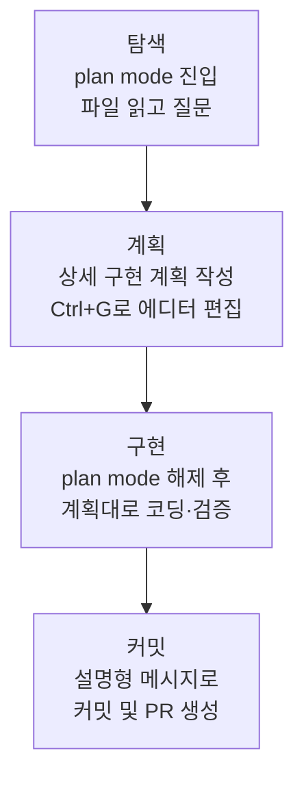

Claude Code는 직접 코드를 읽고, 명령을 실행하고, 변경을 가하며 문제를 자율적으로 풀어가는 에이전트형 도구이므로, 어떻게 지시하고 어떻게 검증하게 하느냐가 결과 품질을 좌우합니다.


**한 줄 요약**: 명확하게 지시하고, 계획을 먼저 세우고, 검증 수단을 손에 쥐여주면 Claude Code는 지켜보는 도구가 아니라 맡겨두는 동료가 됩니다.


## 왜 모범 사례가 필요한가

Anthropic의 공식 가이드가 강조하는 거의 모든 권장 사항은 하나의 제약에서 출발합니다. **컨텍스트 윈도우 는 빠르게 차오르고, 차오를수록 성능이 떨어진다** (context window fills up fast)는 점입니다. 대화의 모든 메시지, Claude가 읽은 모든 파일, 모든 명령 출력이 컨텍스트 윈도우 에 누적되며, 가득 차면 Claude가 앞선 지시를 "잊거나" 실수가 늘어납니다. 따라서 모범 사례의 본질은 **컨텍스트를 아끼며 정확한 신호를 주는 것**입니다.

## 명확하고 직접적인 지시 + 맥락 제공

Claude는 의도를 추론할 수 있지만 마음을 읽지는 못합니다. 구체적인 파일을 가리키고, 제약을 명시하고, 따라야 할 기존 패턴을 짚어줄수록 수정 횟수가 줄어듭니다.

| 전략 | 모호한 지시 | 권장 지시 |
|------|------------|----------|
| **작업 범위 한정** | "`foo.py`에 테스트 추가해줘" | "로그아웃 상태 엣지 케이스를 다루는 `foo.py` 테스트를 작성하되 목(mock)은 피해줘" |
| **출처 지목** | "이 API는 왜 이렇게 이상해?" | "`ExecutionFactory`의 git 이력을 살펴보고 API가 어떻게 만들어졌는지 요약해줘" |
| **기존 패턴 참조** | "캘린더 위젯 추가" | "홈 화면의 기존 위젯 구현을 보고 패턴을 익혀줘. `HotDogWidget.php`가 좋은 예시야. 그 패턴을 따라 새 캘린더 위젯을 만들어줘" |
| **증상 묘사** | "로그인 버그 고쳐줘" | "세션 만료 후 로그인이 실패한다는 제보가 있어. `src/auth/`의 토큰 갱신 흐름을 확인하고, 먼저 버그를 재현하는 실패 테스트를 작성한 뒤 고쳐줘" |

### 풍부한 컨텍스트를 주는 방법

- `@` 참조: 코드 위치를 설명하는 대신 `@경로/파일`로 직접 참조하면 Claude가 응답 전에 파일을 읽습니다.
- 이미지 붙여넣기: 스크린샷이나 디자인 시안을 프롬프트에 직접 붙여넣습니다.
- URL 제공: 문서나 API 레퍼런스 URL을 주고, `/permissions`로 자주 쓰는 도메인을 허용 목록에 추가합니다.
- 파이프 입력: `cat error.log | claude`처럼 파일 내용을 직접 전달합니다.


**한 줄 요약**: 같은 작업이라도 "무엇을, 어느 파일에서, 어떤 기준으로"를 명시하면 교정 루프가 절반으로 줄어듭니다.


## 탐색 먼저, 계획 다음, 코드는 마지막

곧장 코딩에 뛰어들면 **엉뚱한 문제를 푸는 코드** (the wrong problem)가 나올 수 있습니다. plan mode를 활용해 탐색과 실행을 분리하는 4단계 흐름이 권장됩니다.

| 단계 | 모드 | 핵심 행동 |
|------|------|----------|
| 탐색 (Explore) | plan mode | 변경 없이 파일을 읽고 코드 구조를 파악 |
| 계획 (Plan) | plan mode | 변경할 파일과 흐름을 담은 계획 작성, `Ctrl+G`로 직접 편집 |
| 구현 (Implement) | 기본 모드 | 계획에 맞춰 코드 작성, 테스트 실행·수정 |
| 커밋 (Commit) | 기본 모드 | 설명형 커밋 메시지 작성 후 PR 생성 |

plan mode는 유용하지만 오버헤드도 있습니다. **오타 수정, 로그 한 줄 추가, 변수 이름 변경처럼 범위가 명확하고 작은 작업은 계획 없이** 바로 지시하는 편이 낫습니다. 접근 방식이 불확실하거나, 여러 파일이 바뀌거나, 익숙하지 않은 코드를 건드릴 때 계획이 가장 큰 가치를 냅니다. 한 문장으로 변경 내용을 설명할 수 있다면 계획은 건너뜁니다.

## 검증 수단을 손에 쥐여주기

Claude는 작업이 "다 된 것처럼 보이면" 멈춥니다. 검증 수단이 없으면 사람이 직접 검증 루프가 되어 모든 실수를 일일이 발견해야 합니다. **합격/불합격을 내놓는 검사** (a pass or fail)를 주면 Claude가 스스로 실행하고 결과를 읽으며 통과할 때까지 반복합니다.

검사는 대화에서 읽을 수 있는 신호를 내는 무엇이든 됩니다. 테스트 스위트, 빌드 종료 코드, 린터, 픽스처와 출력을 비교하는 스크립트, 디자인과 대조하는 브라우저 스크린샷 등이 해당합니다.

검사를 얼마나 강하게 거느냐에 따라 단계가 나뉩니다.

| 방식 | 동작 | 적합한 상황 |
|------|------|------------|
| 한 프롬프트 안에서 | 같은 메시지에서 검사 실행과 반복을 요청 | 즉시 처리 가능한 일반 작업 |
| `/goal` 조건 | 별도 평가자가 매 턴 조건을 재확인, 충족까지 진행 | 세션 전반에 걸친 자동 검증 |
| Stop hook | 검사를 스크립트로 실행, 통과 전까지 턴 종료 차단 | 결정론적 게이트가 필요한 경우 |
| 검증 서브에이전트 | 신선한 컨텍스트의 모델이 결과를 반박 시도 | 작성자와 채점자를 분리하고 싶을 때 |

핵심은 **성공을 주장하지 말고 증거를 보이게** 하는 것입니다. 테스트 출력, 실행한 명령과 반환값, 결과 스크린샷을 함께 받으면 직접 재검증하는 것보다 빠르고, 지켜보지 않은 세션에서도 작동합니다.


**한 줄 요약**: 검사 하나가 곧 자율성입니다 -- "지켜보는 세션"과 "맡겨두는 세션"의 차이는 Claude가 스스로 돌릴 수 있는 검사가 있느냐에 달려 있습니다.


## 권한과 안전

기본적으로 Claude Code는 시스템을 바꿀 수 있는 동작(파일 쓰기, Bash 명령, MCP 도구 등)에 권한을 요청합니다. 안전하지만 번거롭기에, 다음 세 가지로 방해를 줄이되 통제권은 유지합니다.

- **auto mode**: 별도 분류기 모델이 명령을 검토하여 권한 상승, 미지의 인프라, 적대적 콘텐츠 기반 동작 같은 위험만 차단합니다. `claude --permission-mode auto -p "fix all lint errors"`처럼 사용합니다.
- **권한 허용 목록**: `/permissions`로 `npm run lint`, `git commit`처럼 안전하다고 아는 도구만 허용합니다.
- **샌드박싱**: `/sandbox`로 파일시스템과 네트워크 접근을 제한하는 OS 수준 격리를 적용합니다.

### 되돌릴 수 있는 행동과 그렇지 않은 행동

안전의 핵심 원칙은 **가역성으로 행동을 나누는 것**입니다.

- 파일 편집, 테스트 실행처럼 **국소적이고 되돌릴 수 있는 행동은 자유롭게** 수행합니다. 잘못되면 `Esc`로 멈추거나 `/rewind`(또는 `Esc` 두 번)로 이전 상태를 복원할 수 있습니다.
- **되돌리기 어렵거나 공유 시스템에 영향을 주는 행동**(강제 푸시, `rm -rf`, 테이블 삭제, 외부 게시 등)은 실행 전에 반드시 사용자 확인을 받습니다.
- **파괴적 단축은 금지합니다.** 장애물을 우회하려고 `--no-verify` 같은 검증 생략 플래그를 사용해서는 안 됩니다. 검사를 건너뛰는 것은 문제를 숨길 뿐 해결하지 않습니다.

## 안티패턴: 흔한 실패 패턴

공식 가이드와 일반적인 에이전트 사용 경험에서 반복되는 실패 패턴들입니다. 일찍 알아두면 시간을 아낍니다.

| 안티패턴 | 증상 | 처방 |
|----------|------|------|
| 잡탕 세션 (kitchen sink) | 한 작업 → 무관한 질문 → 다시 첫 작업으로, 컨텍스트가 잡음으로 가득 | 무관한 작업 사이에 `/clear` |
| 반복 교정 (correcting over and over) | 같은 문제를 두 번 넘게 교정, 실패한 접근이 컨텍스트를 오염 | 두 번 실패하면 `/clear` 후 배운 점을 담아 더 구체적인 프롬프트로 재시작 |
| 과설계 (over-engineering) | 요청하지 않은 추상화 계층, 방어 코드, 일어날 수 없는 케이스의 테스트 | 검토 서브에이전트에는 "정확성·요구사항에 영향을 주는 결함만 보고"하도록 지시 |
| 신뢰-검증 공백 (trust-then-verify gap) | 그럴듯하지만 엣지 케이스를 놓친 구현 | 항상 검증 수단(테스트·스크립트·스크린샷)을 제공, 검증 못 하면 배포 금지 |
| 무한 탐색 (infinite exploration) | 범위 없는 "조사" 지시로 수백 개 파일을 읽어 컨텍스트 소진 | 조사 범위를 좁히거나 서브에이전트에 위임 |

세 가지 핵심 안티패턴을 별도로 짚으면 이렇습니다.

- **과설계**: 검토자가 결함을 찾아내라고 요청받으면 작업이 멀쩡해도 무언가는 보고합니다. 모든 지적을 쫓으면 불필요한 복잡성이 쌓입니다. 필요한 최소한의 복잡성만 유지합니다.
- **추측 대신 명료화**: 모호하면 추측하지 말고 물어봐야 합니다. 큰 기능은 `AskUserQuestion` 도구로 Claude가 먼저 인터뷰하게 한 뒤 명세를 작성하는 방식이 권장됩니다.
- **증거 없는 주장 금지**: "고쳤습니다"가 아니라 통과한 테스트 출력과 실행 명령을 보여줘야 합니다.

## MoAI-ADK 워크플로우와의 정합

MoAI-ADK는 위 모범 사례를 워크플로우 차원에서 제도화합니다. Claude Code의 권장 사항이 일회성 프롬프트 기법이라면, MoAI-ADK는 그것을 **SPEC 기반 Plan-Run-Sync 파이프라인**으로 고정합니다.

| Claude Code 모범 사례 | MoAI-ADK 대응 |
|----------------------|---------------|
| 탐색 먼저, 계획 다음 (plan mode) | `/moai plan`이 SPEC 문서(요구사항·계획·수용 기준)를 먼저 작성 |
| 검증 수단 제공 (테스트·자가 점검) | TRUST 5 품질 게이트와 SPEC 수용 기준이 합격/불합격을 강제 |
| 서브에이전트로 격리 작업 위임 | manager-spec / manager-develop / manager-docs 등 단계별 전담 서브에이전트 |
| 신선한 컨텍스트의 적대적 검토 | plan-auditor(계획 감사) + evaluator-active(4차원 품질 평가) |
| 되돌리기 어려운 작업은 확인 | 구현 착수 승인(계획→구현 사용자 승인 게이트)와 Tier 기반 PR 라우팅 |

자세한 내용은 아래 링크 문서를 참고하면 됩니다. MoAI-ADK 고유의 SPEC 작성 규칙과 품질 기준은 해당 문서에 정의되어 있으므로 여기서는 정합 지점만 요약합니다.

## 관련 문서

- [작동 원리](/claude-code/foundations/how-claude-code-works)
- [빠른 시작](/getting-started/quickstart)
- [TRUST 5 품질 프레임워크](/core-concepts/trust-5)

## 참고 자료

- [Best practices for Claude Code (공식 문서)](https://code.claude.com/docs/en/best-practices)


같은 문제를 두 번 넘게 교정했다면 컨텍스트가 이미 실패한 접근으로 오염된 상태입니다. 미련 없이 `/clear`로 초기화하고, 그동안 배운 점을 담아 더 구체적인 프롬프트로 새로 시작하는 편이 거의 항상 더 빠릅니다.

