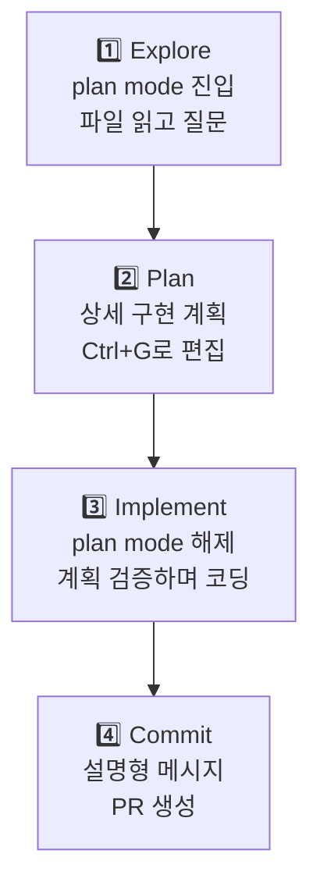

Claude Code는 자율적으로 파일을 읽고, 명령을 실행하고, 변경을 가하는 에이전트형 도구입니다. 단순히 코드를 리뷰 받는 것과 달리, **어떻게 지시하고 어떻게 검증하도록 하느냐**가 결과 품질을 크게 좌우합니다.


**핵심**: 대부분의 문제의 근원은 하나입니다. **컨텍스트 윈도우는 빠르게 차고, 차오를수록 응답 품질이 떨어집니다.** 이 제약을 중심으로 모든 모범 사례가 설계되었습니다.


## 1. Claude에게 검증 방법을 건네주기

Claude는 "작업이 완료된 것 같다"는 신호만 받으면 멈춥니다. 검증할 수 있는 도구가 없으면, **당신이 모든 실수를 발견하는 검증 루프**가 되어버립니다.

누군가 Claude에게 실행할 수 있는 검증을 제공하세요. 테스트 스위트, 빌드 명령, 린터, 또는 스크린샷과의 차이점을 비교하는 스크립트 — Claude가 읽고 반응할 수 있는 신호면 됩니다.

| 전략 | 약한 지시 | 권장하는 지시 |
|------|---------|-----------|
| **검증 기준 제공** | `validateEmail 함수 구현` | `validateEmail 함수 작성. 테스트 케이스: user@example.com은 true, invalid는 false, user@.com은 false. 구현 후 테스트 실행하고 통과 확인해줄 것` |
| **UI 변경 시각적 검증** | `대시보드 더 좋아 보이게` | `[스크린샷 붙임] 이 디자인처럼 구현. 결과 스크린샷을 찍고 원본과 비교해서 차이점을 나열해줄 것` |
| **근본 원인 해결** | `빌드가 실패해` | `빌드 실패: [에러 텍스트]. 근본 원인을 찾아 고쳐줄 것. 에러를 감추지 말고 해결하기` |

검증을 제공하고 나면, Claude는:
1. 작업을 실행
2. 검증을 실행
3. 결과를 읽고
4. 통과할 때까지 반복

당신이 보지 않은 세션도 올바르게 완료할 수 있습니다. 증거를 보여달라고 하세요 — 테스트 출력, 명령어와 결과, 스크린샷. 직접 재실행하는 것보다 빠릅니다.

## 2. 탐색 → 계획 → 구현의 4단계

곧장 코딩에 뛰어들면 **엉뚱한 문제를 푸는 코드**가 나올 수 있습니다. 탐색과 계획을 먼저 수행하세요.



**각 단계별 세부**:

1. **탐색** (plan mode): 파일을 읽고 질문하기. 변경 금지.
   ```
   /moai plan mode에서:
   read /src/auth를 읽고 세션·로그인 흐름 이해하기.
   환경변수로 시크릿을 어떻게 관리하는지도 살펴보기.
   ```

2. **계획**: 상세한 구현 계획 작성. `Ctrl+G`로 에디터에서 직접 수정.

3. **구현**: plan mode 해제 후 코딩. 테스트 실행하면서 계획과 맞는지 검증.

4. **커밋**: 설명형 메시지로 PR 생성.

**팁**: 범위가 명확하고 간단한 작업(타이포 수정, 한 줄 추가, 변수명 변경)이면 계획 단계를 건너뛰어도 됩니다. 계획은 **범위가 불확실하거나 여러 파일을 수정할 때** 가장 효과적입니다.

## 3. 구체적인 컨텍스트 제공하기

Claude는 의도를 추론할 수 있지만 마음을 읽지 못합니다. **구체적일수록 수정 횟수가 줄어듭니다.**

| 전략 | 모호한 지시 | 권장하는 지시 |
|------|---------|-----------|
| **범위 한정** | `foo.py에 테스트 추가` | `로그아웃 상태 엣지 케이스를 다루는 foo.py 테스트 작성. mock은 사용 금지` |
| **출처 지목** | `ExecutionFactory API가 왜 이상해?` | `ExecutionFactory의 git 이력 살펴보고 API가 어떻게 진화했는지 요약해줄 것` |
| **패턴 참조** | `캘린더 위젯 추가` | `홈 화면 기존 위젯 구현 패턴 학습. HotDogWidget.php가 좋은 예. 그 패턴으로 캘린더 위젯 구현` |
| **증상 묘사** | `로그인 버그 고쳐줄 것` | `세션 만료 후 로그인 실패. src/auth의 토큰 갱신 흐름 확인. 버그를 재현하는 실패 테스트 먼저 작성한 후 고칠 것` |

### 풍부한 컨텍스트 제공 방법

- **@로 파일 참조**: 설명 대신 `@경로/파일`로 직접 가리키면 Claude가 먼저 읽음
- **이미지 붙여넣기**: 스크린샷이나 디자인 시안 직접 붙임
- **URL 제공**: 문서/API 레퍼런스 URL + `/permissions`로 도메인 허용 목록화
- **파이프 입력**: `cat error.log | claude`로 직접 전달

## 4. 환경 설정하기

작은 설정 변경이 모든 세션을 더 효율적으로 만듭니다.

### CLAUDE.md 작성 — 핵심 가이드

매 세션 시작 시 Claude가 읽는 특수 파일입니다. 코드 스타일, 워크플로우, 프로젝트 설정을 적으세요.

시작: `/init` 명령으로 자동 생성한 뒤 정제하기.

**포함할 것**:
- Bash 명령어 (Claude가 추측하지 못하는 것)
- 코드 스타일 규칙 (기본값과 다른 것)
- 테스트 프레임워크와 실행 방법
- 저장소 에티켓 (브랜치명, PR 규칙)
- 아키텍처 결정 (프로젝트만의 특수성)

**제외할 것**:
- 코드로 읽을 수 있는 것 (API 문서는 링크로)
- 자주 바뀌는 정보

### 권한 모드 설정

기본값: Claude가 매 작업마다 권한 승인을 요청. 이는 안전하지만 번거롭습니다.

**Auto mode** (`Shift+Tab`): 분류 모델이 위험도를 판단해 자동 승인.
**권한 허용 목록**: `npm run lint`, `git commit` 같은 안전한 명령어를 미리 허용.
**샌드박스**: OS 수준 격리로 더 자유롭게 작업하되 경계 유지.

### `/init`로 CLAUDE.md 생성

프로젝트를 자동으로 분석해서:
- 빌드 시스템 감지
- 테스트 프레임워크 발견
- 코드 패턴 학습
- 초안 생성

이후 수정해서 완성하세요.

## 5. CLI 도구 사용

`gh` (GitHub CLI), `aws`, `gcloud` 같은 CLI는 맥락 효율이 매우 좋습니다.

설치된 CLI가 있으면 Claude는 자동으로 활용합니다. 없으면 API를 사용하는데, API는 속도가 느리고 제한이 많을 수 있습니다.

## 6. MCP 서버 연결


MCP (Model Context Protocol) — 외부 도구를 Claude와 직접 연결.


```bash
claude mcp add --transport http <server-name>
```

이슈 트래커, 데이터베이스, 모니터링 대시보드를 Claude에 연결할 수 있습니다.

## 7. Skills와 Subagents로 확장

### Skills — 도메인 지식

`.claude/skills/`에 `SKILL.md` 파일을 작성해 도메인 특화 가이드를 자동 로드.

```markdown
---
name: api-conventions
description: 우리 서비스의 REST API 설계 규칙
---

- URL 경로: kebab-case
- JSON 프로퍼티: camelCase
- 버전: URL 경로에 포함 (/v1/, /v2/)
```

필요할 때만 로드되므로 매 세션의 컨텍스트를 오염시키지 않습니다.

### Subagents — 격리된 전문가

대량의 파일을 읽거나 깊은 분석이 필요하면 subagent에 위임. 독립적인 컨텍스트에서 작업한 후 요약을 돌려받습니다.

## 8. 세션 관리

### /clear로 맥락 분리

큰 프로젝트에서 다양한 작업을 할 때, `/clear`로 이전 맥락을 정리하고 새 작업을 시작하면 성능이 유지됩니다.

- 단계별 작업 완료 후
- 컨텍스트 사용량이 150K를 넘을 때
- 무관한 작업으로 전환할 때

### Rewind로 실험하기

`Esc` 키나 `/rewind` 명령으로 이전 상태로 돌아갈 수 있습니다. 맥락 유지하며 다른 접근을 시도할 수 있습니다.

### Subagents로 조사 위임

대규모 탐색이 필요하면 subagent를 보내세요. 읽은 파일들이 메인 세션 컨텍스트를 오염시키지 않습니다.

## 9. 많은 에이전트 병렬 실행

Read-only 분석이나 리뷰는 여러 세션에서 병렬로 진행할 수 있습니다.

**Writer/Reviewer 패턴**:
- A 세션 (Writer): 코드 구현
- B 세션 (Reviewer): 코드 리뷰 (독립적인 관점)
- A 세션: 피드백 반영

또는 **Test/Code 분리**:
- A 세션: 테스트 작성 (TDD)
- B 세션: 테스트를 통과하는 코드 구현

## 10. 자동화와 스케일

### 비대화형 모드

```bash
claude -p "프롬프트" --output-format json
```

CI 파이프라인, pre-commit 훅, 스크립트에 Claude를 통합합니다.

### 다중 세션 병렬 실행

여러 SPECs를 동시에 진행하거나, 대량의 파일을 병렬로 변환합니다.

### /goal로 자율 완료

```
/goal "테스트가 모두 통과하고 coverage가 85% 이상일 때"
```

Claude가 자동으로 반복하고, 목표 달성 시 멈춥니다.

## 11. 흔한 실패 패턴 피하기

| 패턴 | 문제 | 해결 |
|------|------|------|
| **주방 싱크 세션** | 관련 없는 작업들이 섞여서 컨텍스트 오염 | 무관한 작업 사이에 `/clear` |
| **반복된 교정** | 같은 문제를 2번 이상 고쳤는데도 반복 | `/clear` 후 더 나은 지시문으로 새로 시작 |
| **과장된 CLAUDE.md** | 지시문이 너무 길어서 Claude가 반 이상을 무시 | 가차 없이 정리. "이 규칙 없으면 실수할까?" 질문 |
| **신뢰-검증 갭** | 그럴듯해 보이는 구현이 엣지 케이스 놓침 | 항상 검증 제공 (테스트, 스크린샷, 린터) |
| **무한 탐색** | 범위 없는 "조사해줄 것" → 수백 개 파일 읽음 | 범위 명시하거나 subagent 위임 |

## 참고

이 가이드는 Anthropic의 공식 [Best practices for Claude Code](https://code.claude.com/docs/en/best-practices) 문서를 바탕으로 작성되었습니다.
