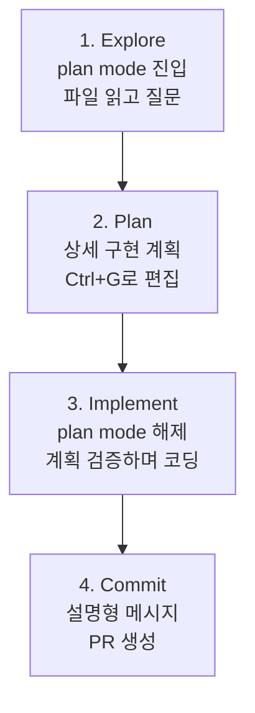

# 모범 사례

Claude Code는 파일을 읽고, 명령을 실행하고, 코드를 직접 고치는 일을 스스로 하는 에이전트입니다. 그래서 결과 품질은 모델이 얼마나 똑똑하느냐가 아니라, **어떻게 지시하고 어떻게 검증하게 만드느냐**에 달려 있습니다.

이 페이지의 패턴들은 결국 한 곳으로 모입니다. 매 턴 손으로 조종하는 대신, 에이전트가 스스로 잘 도는 루프와 환경을 설계하는 것입니다.


**한 줄 요약**: 대부분의 문제는 근원이 하나입니다. **컨텍스트 윈도우는 빠르게 차고, 차오를수록 응답 품질은 떨어지며 비용은 올라갑니다.** 이 페이지의 모범 사례는 이 제약을 중심에 두고 설계되어 있습니다.


## 검증 방법을 건네주기

Claude는 "작업이 완료된 것 같다"는 신호만 받으면 멈춥니다. 검증할 수 있는 도구가 없으면, **사용자가 모든 실수를 발견하는 검증 루프**가 되어 버립니다.

그래서 Claude가 스스로 실행할 수 있는 검증을 함께 건네주세요. 테스트 스위트, 빌드 명령, 린터, 스크린샷 비교 스크립트 — Claude가 읽고 반응할 수 있는 신호라면 무엇이든 좋습니다.

| 전략 | 약한 지시 | 권장하는 지시 |
|------|---------|-----------|
| **검증 기준 제공** | `validateEmail 함수 구현` | `validateEmail 함수 작성. 테스트 케이스: user@example.com은 true, invalid는 false, user@.com은 false. 구현 후 테스트를 실행하고 통과를 확인할 것` |
| **UI 변경 시각적 검증** | `대시보드 더 좋아 보이게` | `[스크린샷 첨부] 이 디자인처럼 구현. 결과 스크린샷을 찍고 원본과 비교해 차이점을 나열할 것` |
| **근본 원인 해결** | `빌드가 실패해` | `빌드 실패: [에러 텍스트]. 근본 원인을 찾아 고칠 것. 에러를 감추지 말고 해결하기` |

검증을 제공하고 나면 Claude는 다음 사이클을 스스로 돕니다.

1. 작업을 실행하고
2. 검증을 실행하고
3. 결과를 읽고
4. 통과할 때까지 반복합니다

지켜보지 않은 세션도 올바르게 끝까지 갈 수 있는 이유가 이것입니다. 완료 보고에는 증거를 요구하세요. 테스트 출력, 실행한 명령과 결과, 스크린샷이 그 증거이고, 직접 재실행하는 것보다 빠릅니다. **"완료했다"는 주장(claim)이 아니라 관찰된 결과(evidence)로 판정하는 것** — 이 원칙은 MoAI-ADK가 SPEC의 수용 기준(AC)과 TRUST 5 게이트로 체계화한 기준이기도 합니다.

### 검증은 한 턴에 묶어 돌리기

검증 명령이 여러 개라면 — 테스트, 린트, 빌드, 타입 검사 — 이것들을 한 턴에 한꺼번에 넘기세요. 하나 돌리고, 결과 보고, 다음 하나 돌리는 식의 직렬 왕복은 매번 대기 시간과 권한 확인을 반복합니다. 한 번의 응답에 여러 읽기 전용 검증을 묶어 넘기면 그 왕복 N번이 한 번으로 줄어듭니다.

이 패턴은 Claude 자신이 검증할 때도 그대로 적용됩니다. Claude Code 최신 버전은 독립된 읽기 전용 명령들을 한 응답 안에서 병렬로 묶어 실행하므로, 검증을 "하나씩 차례로"가 아니라 "한 묶음으로" 설계할수록 wall-time이 짧아집니다. 더 큰 교훈은 검증을 순서가 아니라 **묶음(batch)**으로 설계하라는 것입니다.

## 탐색 → 계획 → 구현 → 커밋의 4단계

곧장 코딩에 뛰어들면 **엉뚱한 문제를 푸는 코드**가 나올 수 있습니다. 탐색과 계획을 먼저 하세요. 읽기 전용 턴은 싸고 구현 턴은 비싸므로, 이 순서는 품질만이 아니라 토큰 경제의 문제이기도 합니다.


```mermaid
flowchart TD
    A["1. Explore<br/>plan mode 진입<br/>파일 읽고 질문"] --> B["2. Plan<br/>상세 구현 계획<br/>Ctrl+G로 편집"]
    B --> C["3. Implement<br/>plan mode 해제<br/>계획 검증하며 코딩"]
    C --> D["4. Commit<br/>설명형 메시지<br/>PR 생성"]
```

단계별로 보면 다음과 같습니다.

1. **탐색** (plan mode): 파일을 읽고 질문합니다. 변경은 금지.
   ```text
   plan mode에서:
   /src/auth를 읽고 세션·로그인 흐름 이해하기.
   환경변수로 시크릿을 어떻게 관리하는지도 살펴보기.
   ```
2. **계획**: 상세한 구현 계획을 작성합니다. `Ctrl+G`로 에디터에서 직접 수정할 수 있습니다.
3. **구현**: plan mode를 해제하고 코딩합니다. 테스트를 돌리며 계획과 맞는지 검증합니다.
4. **커밋**: 설명형 메시지로 커밋하고 PR을 만듭니다.

범위가 명확하고 간단한 작업(타이포 수정, 한 줄 추가, 변수명 변경)이면 계획 단계를 건너뛰어도 됩니다. 계획은 **범위가 불확실하거나 여러 파일을 수정할 때** 가장 효과적입니다. MoAI-ADK의 plan→run→sync 라이프사이클과 구현 착수 승인 게이트는 이 4단계를 SPEC 워크플로우로 제도화한 것입니다.

## 구체적인 컨텍스트 제공하기

Claude는 의도를 추론할 수 있지만 마음을 읽지는 못합니다. **구체적일수록 수정 횟수가 줄어들고**, 수정 횟수가 줄어드는 만큼 토큰도 아낍니다.

| 전략 | 모호한 지시 | 권장하는 지시 |
|------|---------|-----------|
| **범위 한정** | `foo.py에 테스트 추가` | `로그아웃 상태 엣지 케이스를 다루는 foo.py 테스트 작성. mock은 사용 금지` |
| **출처 지목** | `ExecutionFactory API가 왜 이상해?` | `ExecutionFactory의 git 이력을 살펴보고 API가 어떻게 진화했는지 요약할 것` |
| **패턴 참조** | `캘린더 위젯 추가` | `홈 화면 기존 위젯 구현 패턴 학습. HotDogWidget.php가 좋은 예. 그 패턴으로 캘린더 위젯 구현` |
| **증상 묘사** | `로그인 버그 고칠 것` | `세션 만료 후 로그인 실패. src/auth의 토큰 갱신 흐름 확인. 버그를 재현하는 실패 테스트를 먼저 작성한 후 고칠 것` |

### 한 턴에 다 담아 넘기기

최신 Opus급 모델(Opus 4.7+, 4.8, 5)은 **한 턴에 fully-loaded**로 일하는 것을 선호합니다. 의도와 제약, 완료 기준, 관련 파일 위치를 한 프롬프트에 다 담아 넘기세요. 한 조각씩 여러 턴에 걸쳐 던지는 핑퐁은 토큰을 낭비할 뿐 아니라 결과 품질까지 떨어뜨립니다 — 모델이 매 턴 불완전한 그림에서 이해를 다시 세워야 하기 때문입니다. 관련이 있는 것은 처음부터 전부 말하고, 그 다음엔 일하게 두세요.

같은 맥락에서, **완료가 무엇인지도 과제를 설명하는 같은 턴에** 밝히세요. 모델이 물어보길 기다리지 말고 완료 조건을 미리 건네는 것이 곧 "한 턴에 fully-loaded"의 실천입니다.

### 풍부한 컨텍스트를 싣는 방법

- **@로 파일 참조**: 설명 대신 `@경로/파일`로 직접 가리키면 Claude가 먼저 읽습니다
- **이미지 붙여넣기**: 스크린샷이나 디자인 시안을 직접 붙입니다
- **URL 제공**: 문서/API 레퍼런스 URL을 주고 `/permissions`로 도메인을 허용 목록에 등록합니다
- **파이프 입력**: `cat error.log | claude`로 데이터를 직접 전달합니다

## 환경 설정하기

작은 설정 변경이 모든 세션을 더 효율적으로 만듭니다. 세션마다 반복되는 교정을 환경으로 옮기는 것, 이것이 하네스 엔지니어링의 시작입니다.

### CLAUDE.md — 불변 규칙의 집

`CLAUDE.md`는 매 세션 시작 시 Claude가 읽는 특수 파일입니다. 여기에 적는 것은 **"말해주지 않으면 틀리게 할 불변 규칙"**이어야 합니다. 코드에서 읽을 수 있는 사실이 아니라, 프로젝트만의 약속과 선호를 적는 자리입니다. `/init` 명령으로 초안을 자동 생성한 뒤 정제하면 빠릅니다. `/init`는 프로젝트를 분석해 빌드 시스템을 감지하고, 테스트 프레임워크를 찾고, 코드 패턴을 학습해 초안을 만들어 줍니다.

**포함할 것**:

- Bash 명령어 (Claude가 추측하지 못하는 것)
- 코드 스타일 규칙 (기본값과 다른 것)
- 테스트 프레임워크와 실행 방법
- 저장소 에티켓 (브랜치명, PR 규칙)
- 아키텍처 결정 (프로젝트만의 특수성)

**제외할 것**:

- 코드로 읽을 수 있는 것 (API 문서는 링크로)
- 자주 바뀌는 정보

`CLAUDE.md`는 매 세션 전체가 로드되어 토큰을 소비하므로, 늘어날수록 다이어트가 필요합니다. "이 규칙이 없으면 실수할까?"를 기준으로 가차 없이 정리하세요.

### 권한 모드 설정

기본값은 Claude가 매 작업마다 승인을 요청하는 것입니다. 안전하지만 번거롭습니다.

- **Auto mode** (`Shift+Tab`): 분류 모델이 위험도를 판단해 자동 승인합니다.
- **권한 허용 목록**: `npm run lint`, `git commit` 같은 안전한 명령어를 미리 허용합니다.
- **샌드박스**: OS 수준 격리로 더 자유롭게 작업하되 경계를 유지합니다.

서브에이전트는 v2.1.198부터 백그라운드가 기본이고, 권한이 필요한 도구를 만나면 그 프롬프트가 메인 세션에 표시됩니다(v2.1.186부터는 어느 서브에이전트가 물었는지 이름까지 나옵니다). 그래서 긴 작업을 시작하기 전에 필요한 도구를 `settings.json` 허용 목록에 미리 추가하면 프롬프트 빈도를 크게 줄일 수 있습니다.

### CLI 도구와 MCP 서버

`gh`(GitHub CLI), `aws`, `gcloud` 같은 CLI는 컨텍스트 효율이 매우 좋습니다. 설치되어 있으면 Claude가 자동으로 활용하고, 없으면 API를 쓰는데 API 경로는 더 느리고 제약이 많을 수 있습니다.

이슈 트래커, 데이터베이스, 모니터링 대시보드는 MCP(Model Context Protocol)로 Claude에 직접 연결할 수 있습니다.

```bash
claude mcp add --transport http <server-name>
```

## 스킬과 서브에이전트로 확장

### 스킬 — 도메인 지식

`.claude/skills/`에 `SKILL.md` 파일을 작성해 도메인 특화 가이드를 자동 로드합니다.

```markdown
---
name: api-conventions
description: 우리 서비스의 REST API 설계 규칙
---

- URL 경로: kebab-case
- JSON 프로퍼티: camelCase
- 버전: URL 경로에 포함 (/v1/, /v2/)
```

필요할 때만 로드되므로 매 세션의 컨텍스트를 오염시키지 않습니다.

### 서브에이전트 — 격리된 전문가

대량의 파일을 읽거나 깊은 분석이 필요하면 서브에이전트에 위임하세요. 독립적인 컨텍스트에서 작업한 뒤 요약만 돌려받으므로, 조사 과정의 파일 읽기가 메인 세션 컨텍스트를 차지하지 않습니다. 서브에이전트 정의는 갈수록 살을 빼야 합니다 — 정의 전문이 매 spawn마다 컨텍스트에 들어가므로 군더더기는 매 호출 비용이 됩니다.

서브에이전트 중첩은 v2.1.219부터 기본 활성화(깊이 3)되었지만, 계층을 평평하게 유지하고 싶다면 서브에이전트 정의에서 `Agent` 도구를 빼는 것으로 확실히 보장할 수 있습니다. 자세한 구조와 설정은 [서브에이전트](/ko/claude-code/agentic/sub-agents) 문서를 참고하세요.

## 세션 관리

### /clear로 맥락 분리

큰 프로젝트에서 여러 작업을 오갈 때, `/clear`로 이전 맥락을 정리하고 새 작업을 시작하면 성능이 유지됩니다.

- 단계별 작업을 완료한 후
- 컨텍스트 사용량이 높아질 때
- 무관한 작업으로 전환할 때

### 되감기로 실험하기

`Esc` 키나 `/rewind` 명령으로 이전 상태로 돌아갈 수 있습니다. 맥락을 유지하면서 다른 접근을 시도할 수 있어, 실패를 두려워하지 않는 실험이 가능해집니다.

### 조사는 서브에이전트에 위임

대규모 탐색이 필요하면 서브에이전트를 보내세요. 읽은 파일들이 메인 세션 컨텍스트를 오염시키지 않습니다.

## 에이전트 팀과 병렬 실행

여러 에이전트를 동시에 돌리는 기능은 강력하지만, **무엇을 병렬로 돌릴지 분별하는 것**이 핵심입니다.

### 병렬은 리서치에, 순차는 코딩에

공식 가이드의 관찰을 새겨둘 점이 있습니다: **대부분의 코딩 작업은 리서치보다 진짜로 병렬화 가능한 부분이 적습니다.** 코드는 서로 의존하고, 한 파일의 변경이 다른 파일에 엮입니다. 그래서 코딩 중심 작업의 기본값은 순차 서브에이전트입니다.

반대로 리서치와 리뷰는 병렬화가 아주 잘 됩니다. 여러 에이전트가 각자 다른 각도에서 조사하고 발견을 교차 검증하는 구조가 자연스럽습니다.

- **병렬이 빛나는 작업**: PR 리뷰, 라이브러리 리서치, 버그 원인 가설 검증, 코드베이스 전수 스캔
- **순차가 안전한 작업**: 같은 파일을 고쳐야 하는 구현, 단계마다 의존성이 있는 변경, 단일 파일 일상 편집

### 3-5명으로 시작하라

에이전트 팀을 쓸 때, 공식 가이드는 **3-5명**으로 시작하라고 권합니다. 그 이상 쉽게 늘리지 말라는 뜻입니다. 이유는 단순합니다.

- 토큰 비용은 팀원 수에 비례해 선형으로 늘어납니다. 팀원마다 독립 컨텍스트에서 따로 소비합니다.
- 팀원이 많아질수록 통신과 조율 부담이 커지고, 같은 파일을 건드릴 충돌 가능성도 올라갑니다.
- 일정 수를 넘으면 수확 체감이 옵니다. 추가 팀원이 작업 속도를 비례해서 끌어올리지 않습니다.

팀원당 작업을 5-6개씩 배정하면 컨텍스트 전환을 과하게 일으키지 않으면서 모두를 바쁘게 굴릴 수 있습니다. 집중된 3명이 흩어진 5명보다 나은 경우가 많습니다.

### 팀, 서브에이전트, 워크플로우 — 무엇을 언제

세 가지 오케스트레이션 원시가 있고, "계획을 누가 쥐고 있는가"로 구분합니다.

| 원시 | 언제 | 자세한 문서 |
|------|------|------------|
| **서브에이전트** | 결과만 필요한 집중 작업, 코딩의 기본값 | [서브에이전트](/ko/claude-code/agentic/sub-agents) |
| **에이전트 팀** | 발견을 공유하고 서로를 검증해야 하는 병렬 리서치·리뷰 | [에이전트 팀](/ko/claude-code/agentic/agent-teams) |
| **다이내믹 워크플로우** | 한 대화로는 조율하기 힘든 수십~수백 에이전트 규모의 팬아웃 | [다이내믹 워크플로우](/ko/claude-code/agentic/workflows) |

### 평평한 계층이 안전하다

서브에이전트 중첩은 v2.1.219부터 기본 활성화되어 깊이 3까지 spawn할 수 있습니다(`CLAUDE_CODE_MAX_SUBAGENT_SPAWN_DEPTH=1`로 끌 수 있습니다). 하지만 중첩이 가능하다고 해서 중첩이 좋은 것은 아닙니다. 계층이 깊어질수록 무엇이 어디서 일어나는지 추적하기 어렵습니다. 평평한 계층을 유지하고 싶다면, 서브에이전트 정의의 `tools:` 목록에서 `Agent` 도구를 빼면 됩니다 — 그것이 오늘날 유일한 평평한-계층 보장입니다. MoAI-ADK가 평평한 오케스트레이션을 기본 원칙으로 삼는 것도 같은 맥락입니다.

### 백그라운드가 기본, 권한 프롬프트는 메인 세션으로

서브에이전트는 v2.1.198부터 백그라운드가 기본입니다. Claude가 결과를 즉시 필요로 할 때만 포어그라운드로 돌립니다. 백그라운드 서브에이전트가 권한이 필요한 도구를 만나면 프롬프트가 메인 세션에 표시되고(v2.1.186+는 어느 서브에이전트가 물었는지 이름까지 표시), `Esc`로 해당 호출만 거부할 수 있습니다. 그래서 긴 작업 전에 안전한 명령어를 허용 목록에 미리 추가하는 것이 권장됩니다.

한 가지 더: spawn-time `mode` 파라미터는 v2.1.213부터 **무시**됩니다. 서브에이전트는 부모 세션의 권한 모드를 상속하므로, 읽기 전용 스코핑을 보장하려면 권한 모드가 아니라 **도구 제한** (`tools:` 목록에서 쓰기 도구를 빼는 것)으로 잡아야 합니다.

### 모델은 스폰마다 명시

서브에이전트를 spawn할 때는 `model`을 명시적으로 넘기는 것이 권장됩니다. 서브에이전트 정의의 `model:` 기본값이 `inherit`(메인 세션 모델 상속)이라, 명시하지 않으면 의도와 다른 모델에서 조용히 돌아갈 수 있기 때문입니다. 각 spawn마다 어느 모델이 어느 effort로 돌아야 하는지를 밝히는 것이 토크노믹스의 "계획은 깊게, 구현은 싸게, 검증은 독립적으로" 원칙의 실천이기도 합니다.


최신 Opus급 모델(Opus 4.7+, 4.8, 5)은 **서브에이전트를 자동으로 spawn하지 않습니다**. 도구 호출보다 추론을 선호하는 경향이 있어, 팬아웃이 도움이 될 때는 "이 파일들을 병렬로 조사하라"처럼 명시적으로 지시해야 합니다. 한 응답으로 끝낼 수 있는 일에는 서브에이전트를 spawn하지 않는 것이 기본입니다.


## 자동화와 스케일

### 비대화형 모드

```bash
claude -p "프롬프트" --output-format json
```

CI 파이프라인, pre-commit 훅, 스크립트에 Claude를 통합합니다.

### 다중 세션 병렬 실행

여러 작업을 동시에 진행하거나, 대량의 파일을 병렬로 변환합니다. 파일 편집이 겹치지 않도록 [워크트리](/ko/claude-code/agentic/worktrees)로 격리하는 것이 안전합니다. 다이내믹 워크플로우를 끄려면 환경 변수 `CLAUDE_CODE_DISABLE_WORKFLOWS=1`을 설정합니다.

### /goal로 자율 완료

```text
/goal "테스트가 모두 통과하고 coverage가 85% 이상일 때"
```

완료 조건을 선언하면 Claude가 자동으로 반복하고, 목표 달성 시 멈춥니다. 여기까지 오면 "매 턴 지시"에서 "루프 설계"로 역할이 옮겨간 것입니다. MoAI-ADK의 `/moai goal`과 `/moai loop`는 이 루프를 프로젝트의 품질 도구·SPEC 라이프사이클과 결합한 확장입니다.

## 흔한 실패 패턴 피하기

| 패턴 | 문제 | 해결 |
|------|------|------|
| **잡동사니 세션** | 관련 없는 작업들이 섞여 컨텍스트 오염 | 무관한 작업 사이에 `/clear` |
| **반복된 교정** | 같은 문제를 두 번 이상 고쳤는데도 반복 | `/clear` 후 더 나은 지시문으로 새로 시작 |
| **비대해진 CLAUDE.md** | 지시문이 너무 길어 Claude가 절반 이상을 무시 | 가차 없이 정리. "이 규칙이 없으면 실수할까?"를 기준으로 |
| **주장만 있는 보고** | 그럴듯해 보이는 구현이 엣지 케이스를 놓침 | 항상 검증 제공. 완료 보고에는 증거 요구 |
| **무한 탐색** | 범위 없는 "조사해 줘"가 수백 개 파일을 읽음 | 범위를 명시하거나 서브에이전트에 위임 |
| **코딩 남용 병렬** | 진짜로 병렬화되지 않는 코딩을 팀으로 돌려 충돌 | 코딩은 순차 서브에이전트가 기본. 팀·워크플로우는 리서치·스캔에 |

## 관련 문서

- [컨텍스트 윈도우](/ko/claude-code/context-memory/context-window)
- [서브에이전트](/ko/claude-code/agentic/sub-agents)
- [에이전트 팀](/ko/claude-code/agentic/agent-teams)
- [다이내믹 워크플로우](/ko/claude-code/agentic/workflows)
- [목표 지향 실행 (/goal)](/ko/claude-code/agentic/goal)
- [대규모 코드베이스](/ko/claude-code/agentic/large-codebases)

## 참고 자료

- [Best practices for Claude Code (공식 문서)](https://code.claude.com/docs/en/best-practices)


이 페이지에서 하나만 가져간다면 "검증 방법을 건네주기"입니다. 검증 가능한 완료 조건이 있어야 루프가 스스로 돌고, 루프가 스스로 돌아야 나머지 모범 사례 전부가 힘을 발휘합니다.

