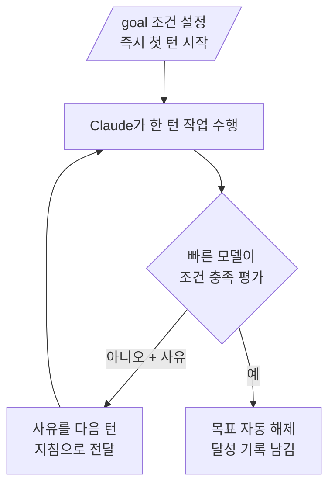

# 목표 지향 실행 (/goal)

`/goal` 명령은 검증 가능한 완료 조건을 한 번 정해두면 그 조건이 충족될 때까지 Claude Code가 매 턴마다 스스로 작업을 이어가도록 만드는 자율 연속 실행 장치입니다.


**한 줄 요약**: 매 턴 끝에 빠른 모델이 "조건 충족됐나?"를 판정하고, 아니면 다음 턴을 알아서 시작하므로 사용자는 끝나는 순간까지 다시 프롬프트를 입력할 필요가 없습니다.


## /goal이란

`/goal`은 **완료 조건** (completion condition)을 설정하고, 그 조건이 충족될 때까지 Claude Code가 사용자의 추가 입력 없이 작업을 계속 진행하게 합니다. 각 턴이 끝나면 작은 빠른 모델이 조건이 성립하는지 확인하고, 아직이라면 제어를 사용자에게 돌려주는 대신 다음 턴을 자동으로 시작합니다. 조건이 충족되면 목표는 자동으로 해제됩니다.

검증 가능한 종료 상태가 있는 큰 작업에 적합합니다.

- 모듈을 새 API로 마이그레이션해 모든 호출부가 컴파일되고 테스트가 통과할 때까지
- 설계 문서를 구현해 모든 수용 기준이 성립할 때까지
- 큰 파일을 분할해 각 파일이 크기 예산 아래로 내려갈 때까지
- 라벨이 붙은 이슈 백로그를 큐가 빌 때까지 처리

한 세션에는 하나의 목표만 활성화할 수 있습니다. 동일한 `/goal` 명령이 인자에 따라 설정, 상태 확인, 해제를 모두 담당합니다.

## 동작 방식

`/goal`은 세션 범위의 **프롬프트 기반 Stop hook** (prompt-based Stop hook)을 감싼 것입니다. Claude가 한 턴을 마칠 때마다 조건과 지금까지의 대화 내용이 설정된 작은 빠른 모델(기본값 **Haiku**)에게 전달됩니다. 모델은 조건이 충족되었는지 대화에 드러난 내용만으로 판정하고 예/아니오와 짧은 사유를 반환합니다. 평가자는 도구를 호출하거나 파일을 직접 읽지 않으므로, Claude가 이미 대화에 드러낸 내용만을 근거로 판단합니다.



평가자는 세션이 사용하는 동일한 공급자에서 실행되며, 평가에 드는 토큰은 작은 빠른 모델에 청구되어 본 턴 비용에 비하면 보통 무시할 만한 수준입니다.

## 효과적인 조건 작성법

평가자가 대화에 드러난 내용만으로 판정하므로, Claude의 출력이 **증명할 수 있는** 형태로 조건을 써야 합니다. 오래 이어지는 목표에서 잘 버티는 조건은 보통 세 가지 요소를 갖춥니다.

| 요소 | 설명 | 예시 |
| --- | --- | --- |
| 측정 가능한 종료 상태 | 테스트 결과, 빌드 종료 코드, 파일 개수, 빈 큐 등 | "모든 인증 테스트 통과" |
| 명시된 검증 방법 | Claude가 어떻게 증명할지 | "`npm test` exits 0" 또는 "`git status` is clean" |
| 지켜야 할 제약 | 가는 길에 바뀌면 안 되는 것 | "no other test file is modified" |

조건은 최대 **4,000자** (characters)까지 작성할 수 있습니다.

목표가 무한히 도는 것을 막으려면 조건에 턴 또는 시간 한도 절을 포함하세요. 예를 들어 `or stop after 20 turns`처럼 쓰면 Claude가 매 턴 그 한도에 대한 진행 상황을 보고하고, 평가자가 대화 기록을 보고 함께 판정합니다.

```text
/goal test/auth의 모든 테스트가 통과하고 lint 단계가 깨끗하다, or stop after 20 turns
```

목표를 설정하면 별도의 프롬프트를 보낼 필요 없이 조건 자체를 지침으로 삼아 곧바로 첫 턴이 시작됩니다. 목표가 활성화된 동안에는 `◎ /goal active` 표시가 나타나 목표가 얼마나 오래 실행됐는지 보여줍니다.

## 상태 확인과 해제

### 상태 확인

인자 없이 `/goal`을 실행하면 현재 상태를 볼 수 있습니다.

```text
/goal
```

목표가 활성화되어 있으면 조건, 실행 시간, 평가된 턴 수, 현재 토큰 사용량, 평가자의 가장 최근 사유가 표시됩니다. 활성 목표가 없더라도 이번 세션에서 앞서 달성한 목표가 있으면 그 조건과 소요 시간, 턴 수, 토큰 사용량을 보여줍니다.

### 목표 해제

조건이 충족되기 전에 활성 목표를 제거하려면 `/goal clear`를 실행합니다.

```text
/goal clear
```

`stop`, `off`, `reset`, `none`, `cancel`이 `clear`의 별칭으로 허용됩니다. 새 대화를 시작하는 `/clear`를 실행해도 활성 목표가 함께 제거됩니다.

### 세션 재개 동작

세션이 끝났을 때 여전히 활성 상태였던 목표는 `--resume` 또는 `--continue`로 그 세션을 재개하면 복원됩니다. 조건은 그대로 이어지지만 턴 수, 타이머, 토큰 사용량 기준선은 재개 시 모두 초기화됩니다. 이미 달성됐거나 해제된 목표는 복원되지 않습니다.

### 비대화형 실행

`/goal`은 **비대화형 모드** (headless mode), 데스크톱 앱, 원격 제어에서도 동작합니다. `-p` 플래그로 목표를 설정하면 한 번의 호출로 루프를 완료까지 실행합니다.

```bash
claude -p "/goal CHANGELOG.md has an entry for every PR merged this week"
```

비대화형 목표를 조건 충족 전에 중단하려면 프로세스를 `Ctrl+C`로 종료하세요.

## /moai loop와 비교

`/goal`과 `/moai loop`는 경쟁 관계가 아니라 보완 관계입니다. **다음 턴을 무엇이 시작시키는가** 로 구분하면 명확합니다.

| 구분 | 다음 턴 시작 시점 | 종료 시점 |
| --- | --- | --- |
| `/goal` | 직전 턴이 끝나면 | 빠른 모델이 조건 충족을 확인할 때 |
| `/moai loop` (Ralph Engine) | 진단 사이클(LSP·AST-grep·테스트·커버리지)이 남은 작업을 발견하면 | 모든 이슈 해결 또는 최대 반복 도달 |
| Stop hook | 직전 턴이 끝나면 | 사용자의 스크립트나 프롬프트가 결정 |

핵심 차이는 다음과 같습니다.

- **`/moai loop`** 는 결정론적이고 진단 도구가 주도하는 수정 루프입니다. 프로젝트의 품질 도구와 SPEC 생명주기를 이미 알고 있어, "도구가 지적하는 모든 것을 고쳐라"에 적합합니다.
- **`/goal`** 은 대화 기록을 대상으로 한 모델 평가 루프입니다. 명령을 실행하거나 파일을 읽지 않고 Claude가 이미 드러낸 내용을 판정하므로, "이 상태가 대화에서 명백히 참이 될 때까지 계속하라"에 적합합니다.

## MoAI-ADK 운영 시 주의

- `/goal`은 매 턴의 STOP 프롬프트만 제거할 뿐, 사용자에게 향하는 실제 결정을 `AskUserQuestion`으로 묻는 오케스트레이터 의무를 면제하지 않습니다.
- 활성 목표가 있어도 plan 단계에서 run 단계로 넘어가는 구현 착수 승인(사용자 승인 게이트)를 자동 우회하지 못합니다. run 단계 진입에 사용자 승인이 필요하면 여전히 먼저 물어야 합니다.
- 목표는 연속 진행 여부만 결정할 뿐, 강제 푸시나 테이블 삭제 같은 되돌리기 어려운 작업을 사전 승인하지 않습니다.

## 요구 사항

- Claude Code **v2.1.139** 이상이 필요합니다.
- 신뢰 대화상자를 수락한 워크스페이스에서만 동작합니다. 평가자가 hooks 시스템의 일부이기 때문입니다.
- 어떤 설정 레벨에서든 `disableAllHooks`가 켜져 있으면 사용할 수 없습니다.
- 조직 수준의 관리 설정에 `allowManagedHooksOnly`가 켜져 있어도 사용할 수 없습니다.
- 위 조건이 충족되지 않으면 명령이 조용히 무시되지 않고 사용 불가 사유를 알려줍니다.

## 관련 문서

- [다이내믹 워크플로우](/claude-code/agentic/workflows)
- [/moai loop](/utility-commands/moai-loop)

## 참고 자료

- [Goal directive (`/goal`) — Claude Code 공식 문서](https://code.claude.com/docs/en/goal)


조건은 Claude의 출력이 증명할 수 있는 형태로 쓰고, `or stop after N turns` 같은 한도 절을 항상 함께 넣으세요. 평가자는 파일을 직접 읽지 않으므로 "테스트가 통과한다"보다 "`go test ./...`가 0으로 종료한다"처럼 대화 기록에 결과가 남는 검증 방법을 명시하는 편이 훨씬 안정적입니다.

