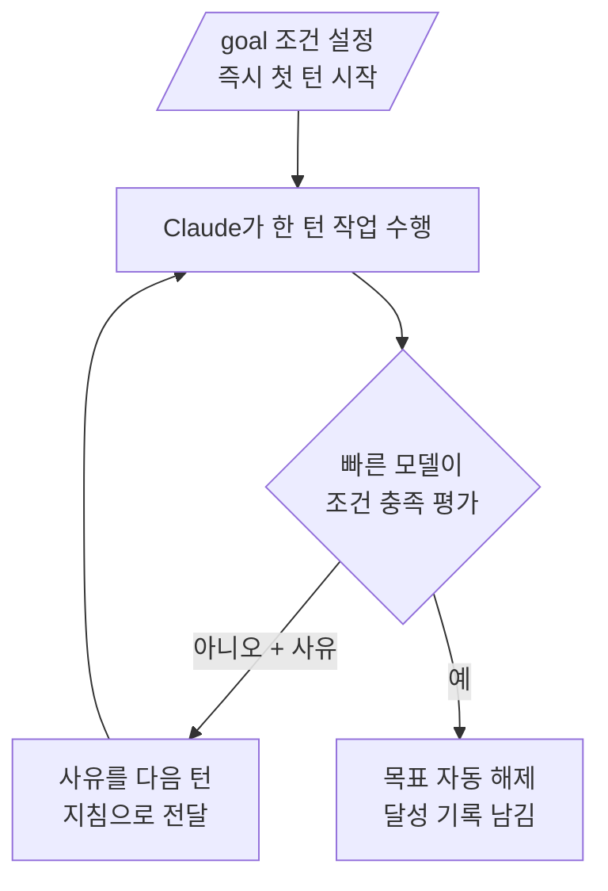

# 목표 지향 실행 (/goal)

큰 작업을 Claude에게 맡겼는데 한 턴으로 끝나지 않으면, 보통은 끝날 때까지 "계속해"라고 입력해야 합니다. `/goal`은 그 반복 입력을 없애는 명령입니다 — 끝나야 하는 조건을 한 번 정해두면 그 조건이 충족될 때까지 Claude가 매 턴을 스스로 이어갑니다. 마치 "이 서류 더미가 다 정리될 때까지 알아서 책상 앞에 앉아 있어"라고 부탁한 뒤 자리를 비우는 것과 같습니다.


**한 줄 요약**: 매 턴이 끝날 때마다 빠른 모델이 "조건이 충족됐나?"를 판정하고, 아니면 다음 턴을 알아서 시작합니다. 그래서 사용자는 끝나는 순간까지 다시 프롬프트를 입력할 필요가 없습니다.


## /goal이 필요한 순간

`/goal`은 검증 가능한 종료 상태가 있는 큰 작업에 맞습니다.

- 모듈을 새 API로 마이그레이션해 모든 호출부가 컴파일되고 테스트가 통과할 때까지
- 설계 문서를 구현해 모든 수용 기준이 성립할 때까지
- 큰 파일을 분할해 각 파일이 크기 예산 아래로 내려갈 때까지
- 라벨이 붙은 이슈 백로그를 큐가 빌 때까지 처리

반대로 한두 턴으로 끝나는 가벼운 작업이나, 종료 상태를 명확히 정하기 어려운 탐색적 작업에는 어울리지 않습니다. 목표 없이 그냥 대화하는 편이 낫습니다.

한 세션에는 활성 목표를 하나만 둘 수 있습니다. 같은 `/goal` 명령이 인자에 따라 설정, 상태 확인, 해제를 모두 담당합니다.

## 어떻게 동작하나

`/goal`은 Claude Code의 **Stop hook** 시스템 위에 올려진 조건 평가 루프입니다. 한 턴이 끝날 때마다 다음 절차가 돌아갑니다.

1. Claude가 한 턴의 작업을 마칩니다.
2. 설정된 **작고 빠른 모델** (기본값 Haiku) 이 조건과 지금까지의 대화 내용을 받아 "충족됐는가"를 판정합니다.
3. 충족됐으면 목표를 자동으로 해제하고 달성 기록을 남깁니다.
4. 아직이면 평가 사유를 다음 턴의 지침으로 넘기고, 곧바로 다음 턴을 시작합니다.


```mermaid
flowchart TD
    A[/goal 조건 설정<br>즉시 첫 턴 시작/] --> B[Claude가 한 턴 작업 수행]
    B --> C{빠른 모델이<br>조건 충족 평가}
    C -->|아니오 + 사유| D[사유를 다음 턴<br>지침으로 전달]
    D --> B
    C -->|예| E[목표 자동 해제<br>달성 기록 남김]
```

이 평가자는 **도구를 호출하거나 파일을 직접 읽지 않습니다**. 오직 대화 기록에 드러난 내용만으로 판정합니다. 이 점이 조건 작성법을 좌우하는 가장 중요한 사실입니다 (아래 '효과적인 조건 작성법' 참조). 평가자는 세션이 쓰는 것과 같은 공급자에서 실행되며, 평가에 드는 토큰은 작은 빠른 모델에 청구되어 턴 본문 비용에 비하면 보통 무시할 만한 수준입니다.

## 효과적인 조건 작성법

평가자가 대화 기록만 읽고 판정하므로, 조건은 Claude의 출력이 **증명할 수 있는** 형태여야 합니다. 오래 이어지는 목표에서 잘 버티는 조건은 보통 세 가지 요소를 갖춥니다.

| 요소 | 설명 | 예시 |
| --- | --- | --- |
| 측정 가능한 종료 상태 | 테스트 결과, 빌드 종료 코드, 파일 개수, 빈 큐 등 | "모든 인증 테스트 통과" |
| 명시된 검증 방법 | Claude가 어떻게 증명할지 | "`npm test` exits 0" 또는 "`git status` is clean" |
| 지켜야 할 제약 | 가는 길에 바뀌면 안 되는 것 | "no other test file is modified" |

조건은 최대 **4,000자** (characters) 까지 쓸 수 있습니다.

목표가 무한히 도는 것을 막으려면 조건에 턴 한도 절을 포함하세요. `or stop after 20 turns`처럼 쓰면 Claude가 매 턴 그 한도에 대한 진행 상황을 보고하고, 평가자가 대화 기록을 보고 함께 판정합니다.

```text
/goal test/auth의 모든 테스트가 통과하고 lint 단계가 깨끗하다, or stop after 20 turns
```

목표를 설정하면 별도 프롬프트 없이 조건 자체를 지침으로 삼아 곧바로 첫 턴이 시작됩니다. 활성 목표가 있는 동안에는 `◎ /goal active` 표시가 나타나 얼마나 오래 돌았는지 보여줍니다.


루프 안에서 Claude가 검증을 한 턴씩 직렬로 돌리면 왕복 지연이 누적되어 루프 전체가 느려집니다. 독립적인 읽기 전용 검증은 한 응답 안에서 여러 Bash 호출로 묶어 (병렬 배치) 실행하도록 지침이나 조건에서 유도하세요. 한 턴에 검증을 모아 끝내는 것이 곧 루프 한 바퀴를 짧게 만드는 가장 효과적인 수단입니다.


## 상태 확인과 해제

### 상태 확인

인자 없이 `/goal`을 실행하면 현재 상태를 봅니다.

```text
/goal
```

활성 목표가 있으면 조건, 실행 시간, 평가된 턴 수, 현재 토큰 사용량, 평가자의 가장 최근 사유가 표시됩니다. 활성 목표가 없더라도 이번 세션에서 앞서 달성한 목표가 있으면 그 조건과 소요 시간, 턴 수, 토큰 사용량을 보여줍니다.

### 목표 해제

조건 충족 전에 활성 목표를 제거하려면 `/goal clear`를 실행합니다.

```text
/goal clear
```

`stop`, `off`, `reset`, `none`, `cancel`이 `clear`의 별칭으로 허용됩니다. 새 대화를 시작하는 `/clear`를 실행해도 활성 목표가 함께 제거됩니다.

### 세션 재개 동작

세션이 끝났을 때 여전히 활성 상태였던 목표는 `--resume` 또는 `--continue`로 그 세션을 재개하면 복원됩니다. 조건은 그대로 이어지지만 턴 수, 타이머, 토큰 사용량 기준선은 재개 시 모두 초기화됩니다. 이미 달성됐거나 해제된 목표는 복원되지 않습니다.

### 비대화형 실행

`/goal`은 **비대화형 모드** (headless mode), 데스크톱 앱, 원격 제어에서도 동작합니다. `-p` 플래그로 목표를 설정하면 한 번의 호출로 루프를 완료까지 실행합니다.

```bash
claude -p "/goal CHANGELOG.md has an entry for every PR merged this week"
```

비대화형 목표를 조건 충족 전에 중단하려면 프로세스를 `Ctrl+C`로 종료하세요.

## 평가자는 모델이다 — 그 의미

네이티브 `/goal`의 평가자는 **모델** (model) 입니다. Stop hook이 매 턴 끝에서 빠른 모델에게 "이 조건이 대화 기록에서 참인가"를 물어보는 구조이기 때문에, 판정은 언어 모델의 읽기에 의존합니다. 평가자가 명령을 직접 실행하지 않으므로, "테스트가 통과했다"는 사실이 **대화 기록에 텍스트로 드러나야만** 판정됩니다.

그래서 조건에는 검증 명령과 그 결과가 대화에 남는 방식을 명시하는 것이 훨씬 안정적입니다. "`go test ./...`가 0으로 종료한다"처럼 쓰면 Claude가 명령을 실행하고 그 결과를 기록에 남기므로, 평가자가 읽을 증거가 생깁니다. 반면 "테스트가 통과한다"처럼 모호하면, 평가자가 Claude의 선언을 언어로 추측해야 합니다.

이 방식은 유연하지만 명령의 종료 코드를 직접 보는 **기계적 판정** (mechanical) 만큼 단단하지는 않습니다. 종료 코드라는 확정 신호에 의존하는 기계 판별이 필요한 경우, MoAI의 `/moai goal`이 그 간극을 메웁니다.

## /moai goal — 프로그래매틱 대응물

네이티브 `/goal`은 사용자만 입력할 수 있는 TUI 명령이라, 모델이나 워크플로우가 사용자를 대신해 목표를 걸 수 없습니다. MoAI-ADK는 이 간극을 `/moai goal`로 메웁니다. 같은 "조건 선언 → 매 턴 끝 Stop-hook 평가 → 충족 시 해제" 의미론을 MoAI가 소유한 goal 엔진으로 재구현한 것입니다. 핵심 차이는 조건을 **기계** (mechanical) 와 **모델** (model) 두 종류로 파싱해 섞어 쓴다는 점입니다.

| 조건 종류 | 판정 방식 | 예시 |
| --- | --- | --- |
| 기계 (mechanical) | 셸 명령의 종료 코드로 참/거짓 판정 | `go test ./...` exits 0 |
| 모델 (model) | 대화 기록에 명백히 드러난 주장인지 모델이 판정 | "모든 수용 기준이 대화에서 성립한다" |

기계 조건은 종료 코드라는 확정 신호에 의존하므로 모델의 언어 판독보다 단단합니다. 모델 조건은 네이티브 `/goal`과 같은 유연함을 제공합니다. 조건을 선언하면 조건이 충족되거나 **턴 한계** (기본 30) 에 닿을 때까지 세션이 스스로 일하며, `/moai goal status`와 `/moai goal clear`로 상태 확인과 해제를 처리합니다.

루프에는 두 겹의 안전장치가 더 있습니다. 런타임의 연속 차단 상한 (consecutive-block cap, 환경 변수 `CLAUDE_CODE_STOP_HOOK_BLOCK_CAP`, 기본 8) 이 무인 실행에서는 턴 한계보다 먼저 루프를 끊어 내릴 수 있어, 효과적인 상한은 `min(턴 한계, 연속 차단 상한)` 입니다. 그리고 N번 연속 진전 없음을 잡는 **정체 가드** (stagnation guard) 가 같은 자리만 맴도는 루프를 멈춥니다.

`/moai loop`는 이 goal 엔진 위의 프리셋, "진단 도구가 찾은 이슈 큐가 빌 때까지"라는 조건을 미리 채워 둔 형태입니다. 이 조건 선언형 루프가 MoAI-ADK **에이전틱 루프 엔지니어링**의 실행 단위이며, 루프가 돈 기록 (몇 턴, 어떤 판정, 어떤 실패) 이 관찰로 축적되고 하네스가 그 관찰에서 학습합니다.

## /goal vs /moai loop

`/goal`과 `/moai loop`는 경쟁 관계가 아니라 보완 관계입니다. **다음 턴을 무엇이 시작시키는가**로 구분하면 명확합니다.

| 구분 | 다음 턴 시작 시점 | 종료 시점 |
| --- | --- | --- |
| `/goal` | 직전 턴이 끝나면 | 빠른 모델이 조건 충족을 확인할 때 |
| `/moai loop` (Ralph Engine) | 진단 사이클 (LSP·AST-grep·테스트·커버리지) 이 남은 작업을 발견하면 | 모든 이슈 해결 또는 최대 반복 도달 |
| Stop hook | 직전 턴이 끝나면 | 사용자의 스크립트나 프롬프트가 결정 |

- `/moai loop`는 결정론적이고 진단 도구가 주도하는 수정 루프입니다. 프로젝트의 품질 도구와 SPEC 생명주기를 이미 알고 있어, "도구가 지적하는 모든 것을 고쳐라"에 적합합니다.
- `/goal`은 대화 기록을 대상으로 한 모델 평가 루프입니다. 명령을 실행하거나 파일을 읽지 않고 Claude가 이미 드러낸 내용을 판정하므로, "이 상태가 대화에서 명백히 참이 될 때까지 계속하라"에 적합합니다.

## 운영 시 주의

- `/goal`은 매 턴의 STOP 프롬프트를 없앨 뿐입니다. 사용자에게 물어야 할 실제 결정을 `AskUserQuestion`으로 묻는 오케스트레이터의 의무까지 면제해 주지는 않습니다.
- 활성 목표가 있어도 plan 단계에서 run 단계로 넘어가는 구현 착수 승인 (사용자 승인 게이트) 을 자동 우회하지 못합니다. run 단계 진입에 사용자 승인이 필요하면 여전히 먼저 물어야 합니다.
- 목표는 연속 진행 여부만 결정할 뿐, 강제 푸시나 테이블 삭제 같은 되돌리기 어려운 작업을 사전 승인하지 않습니다.

## 요구 사항

- Claude Code **v2.1.139** 이상이 필요합니다.
- 신뢰 대화상자를 수락한 워크스페이스에서만 동작합니다. 평가자가 hooks 시스템의 일부이기 때문입니다.
- 어떤 설정 레벨에서든 `disableAllHooks`가 켜져 있으면 사용할 수 없습니다.
- 조직 수준의 관리 설정에 `allowManagedHooksOnly`가 켜져 있어도 사용할 수 없습니다.
- 위 조건이 충족되지 않으면 명령이 조용히 무시되지 않고 사용 불가 사유를 알려줍니다.

## 관련 문서

- [다이내믹 워크플로우](/ko/claude-code/agentic/workflows)
- [/moai loop](/ko/utility-commands/moai-loop)

## 참고 자료

- [Goal directive (`/goal`) — Claude Code 공식 문서](https://code.claude.com/docs/en/goal)


조건은 Claude의 출력이 증명할 수 있는 형태로 쓰고, `or stop after N turns` 같은 한도 절을 항상 함께 넣으세요. 평가자는 파일을 직접 읽지 않으므로 "테스트가 통과한다"보다 "`go test ./...`가 0으로 종료한다"처럼 대화 기록에 결과가 남는 검증 방법을 명시하는 편이 훨씬 안정적입니다.

