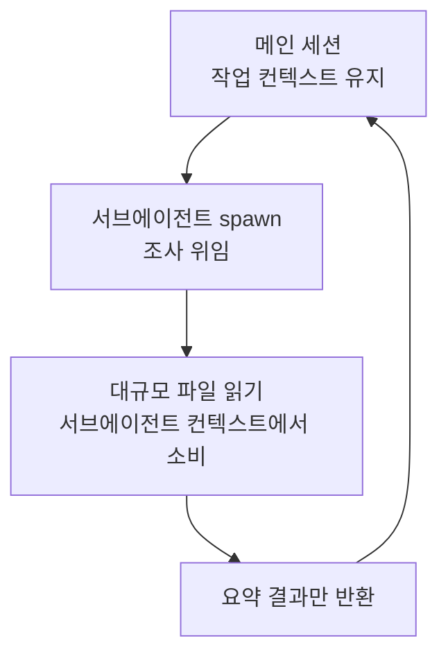

수백만 줄 규모의 단일 저장소나 여러 패키지로 나뉜 모노레포에서 Claude Code를 효율적으로 다루는 방법을 정리합니다.


**한 줄 요약**: 대규모 코드베이스 (large codebase) 의 핵심은 "전부 읽히는 것"이 아니라 "지금 작업이 닿는 부분만 컨텍스트에 올리는 것"입니다.


## 왜 별도 전략이 필요한가

Claude Code는 규모에 관계없이 동작하지만, 코드베이스가 커질수록 작은 프로젝트에 맞춰진 기본 동작이 문제를 일으킵니다. 작업과 무관한 지시문과 파일 읽기가 컨텍스트 윈도우 (context window) 를 가득 채워 토큰을 낭비하고, 결과적으로 응답 품질을 떨어뜨립니다.

따라서 대규모 코드베이스에서의 모범 사례 (best practice) 는 한 가지로 수렴합니다. **작업이 실제로 건드리는 영역으로 Claude의 시야를 좁히는 것**입니다.

| 문제 | 좁히는 수단 |
| --- | --- |
| 루트 `CLAUDE.md` 하나가 모든 서브시스템 규칙을 떠안음 | 디렉터리별 `CLAUDE.md` 분리 |
| 작업하지 않는 패키지의 `CLAUDE.md`까지 로드됨 | `claudeMdExcludes` 설정 |
| 생성 코드·벤더 코드가 검색 결과에 끼어듦 | `permissions.deny`의 `Read` 거부 규칙 |
| 심볼 정의·호출처를 찾으려고 파일을 다수 읽음 | 코드 인텔리전스 플러그인 (LSP) |
| 워크트리가 전체 트리를 체크아웃함 | `worktree.sparsePaths` 희소 체크아웃 |

## 어디서 Claude를 시작할지 정하기

`claude`를 실행하는 위치는 곧 파일 접근 범위와 시작 시 로드되는 `CLAUDE.md` 범위를 결정합니다. 가장 먼저 결정해야 하는 항목입니다.

| 시작 위치 | 파일 접근 | 시작 시 로드되는 CLAUDE.md | 적합한 경우 |
| --- | --- | --- | --- |
| 저장소 루트 | 모든 파일 | 루트만 (하위는 읽을 때 온디맨드) | 작업이 여러 패키지·서브시스템에 걸침 |
| 하위 디렉터리 | 해당 서브트리만 | 그 디렉터리 + 모든 상위 디렉터리 | 작업이 한 패키지·서브시스템에 한정됨 |

한 패키지에만 집중한다면 그 패키지 디렉터리에서 `claude`를 실행하는 것만으로 다른 패키지의 지시문이 컨텍스트에서 빠집니다. 참고로 `.claude/settings.json`의 프로젝트 설정은 `CLAUDE.md`와 달리 상위 디렉터리에서 상속되지 않고, 시작 디렉터리에서만 로드됩니다.

## 컨텍스트 관리: 필요한 부분만 읽기

대규모 코드베이스에서 컨텍스트를 차지하는 비용은 크게 두 가지입니다. 항상 로드되는 지시문, 그리고 작업 중 발생하는 파일 읽기입니다. 둘 다 줄여야 합니다.

### 디렉터리별 CLAUDE.md로 지시문 분할

루트 `CLAUDE.md` 하나로 모든 규칙을 담으면, 모든 서브시스템 규칙을 떠안아 비대해지거나 너무 일반적이어서 쓸모가 없어집니다. 지시문을 디렉터리별로 나누면 Claude는 저장소 전역 규칙에 더해 **지금 작업하는 코드의 규칙만** 로드합니다.

```markdown
# packages/api/CLAUDE.md
This package is the REST API server.

- Run tests: `npm test` (uses Vitest)
- Run dev server: `npm run dev` (port 3001)

API routes are in src/routes/. Database queries use Knex in src/db/.
```

`packages/api/`에서 시작하면 루트 `CLAUDE.md`와 `packages/api/CLAUDE.md`가 함께 로드되고, `packages/web/`의 지시문은 컨텍스트에 들어오지 않습니다. 이 파일들은 저장소에 커밋해 팀원이 공유하도록 합니다.

### 무관한 CLAUDE.md 제외하기

루트에서 시작하면 하위 디렉터리의 `CLAUDE.md`가 그곳 파일을 읽는 순간 로드됩니다. 다른 팀의 패키지나 레거시 코드처럼 절대 작업하지 않는 영역은 `claudeMdExcludes`로 아예 차단할 수 있습니다.

```json
{
  "claudeMdExcludes": [
    "**/packages/admin-dashboard/**",
    "**/packages/legacy-*/**"
  ]
}
```

패턴은 절대 경로에 대한 글로브 (glob) 로 매칭되므로, 트리 어디서나 매칭하려면 `**/`로 시작합니다. 개인용이라면 `.claude/settings.local.json`에 두면 됩니다. 단, 이 목록은 정적이므로 "오늘은 이 패키지, 내일은 저 패키지"처럼 매번 바꿔야 한다면 제외 목록을 고치기보다 해당 패키지 디렉터리에서 Claude를 시작하는 편이 낫습니다.

### 생성 코드·벤더 코드 읽기 차단

Claude의 콘텐츠 검색은 기본적으로 `.gitignore`를 존중하므로 `node_modules/`, `dist/`, `build/`는 별도 설정 없이 검색 결과에서 빠집니다. 반면 저장소에 커밋된 벤더 SDK나 생성 코드는 `permissions.deny`의 `Read` 거부 규칙으로 막습니다.

```json
{
  "permissions": {
    "deny": [
      "Read(./**/dist/**)",
      "Read(./**/*.generated.*)",
      "Read(./vendor/**)"
    ]
  }
}
```

거부 규칙은 Claude의 내장 파일 도구와 `cat`·`head`·`grep`·`find` 같은 인식 가능한 Bash 파일 명령을 모두 덮습니다. 다만 재귀 검색 출력에서 경로를 필터링하지는 않고, 파일을 직접 여는 임의의 서브프로세스까지 막지는 못합니다.

## 병렬 탐색: 서브에이전트와 Explore

작업과 무관한 파일을 컨텍스트에 쌓지 않는 또 다른 방법은, 탐색 자체를 별도 컨텍스트에서 수행하게 하는 것입니다. 서브에이전트 (sub-agent) 안에서 조사를 돌리면 그 과정에서 발생한 수많은 파일 읽기가 메인 대화에 남지 않고, 요약된 결과만 돌아옵니다.



Explore 에이전트는 읽기 전용 코드베이스 탐색에 특화된 Anthropic 내장 서브에이전트입니다. 구조를 파악하거나 어떤 기능이 어디 있는지 찾을 때, 메인 세션이 직접 수십 개의 파일을 읽는 대신 Explore에 위임하면 메인 컨텍스트가 깨끗하게 유지됩니다.

> MoAI-ADK는 이 패턴을 한 단계 더 구조화해, 읽기 전용 조사는 Explore나 서브에이전트로 병렬 분산하고 종합만 메인이 맡도록 오케스트레이션합니다. 자세한 위임 정책은 [서브에이전트](/claude-code/agentic/sub-agents) 문서를 참고하세요.

## 효율적 검색 패턴: Glob → Grep → Read

대규모 코드베이스에서는 검색 순서 자체가 토큰 효율을 좌우합니다. 넓게 시작해 점점 좁히는 점진적 좁히기 (progressive narrowing) 가 기본입니다.

| 단계 | 도구 | 목적 |
| --- | --- | --- |
| 1 | Glob | 이름·패턴으로 후보 파일 추리기 |
| 2 | Grep | 내용으로 매칭 파일 좁히기 (`files_with_matches`) |
| 3 | Grep | 컨텍스트 라인과 함께 정밀 검사 |
| 4 | Read | `offset`/`limit`으로 필요한 구간만 읽기 |

전체 파일을 통째로 읽기 전에 항상 검색으로 위치를 먼저 찾고, 그 다음 해당 구간만 부분 읽기하는 것이 핵심입니다.

### 코드 인텔리전스로 파일 읽기 줄이기

심볼의 정의나 호출처를 찾는 일은 수많은 파일 읽기와 grep 호출로 번질 수 있습니다. 코드 인텔리전스 플러그인 (LSP 기반) 을 붙이면 Claude가 트리를 스캔하는 대신 언어 서버에 정의 이동·참조 찾기·타입 오류 확인을 직접 질의합니다.

```bash
/plugin install typescript-lsp@claude-plugins-official
```

공식 마켓플레이스는 TypeScript, Python, Go, Rust 등 주요 언어 플러그인을 제공합니다. 각 개발자 머신에 해당 언어의 언어 서버 바이너리가 설치되어 있어야 합니다. 이 기능은 `claudeMdExcludes`·`Read` 거부 규칙과 잘 맞습니다. 앞의 두 가지가 무관한 콘텐츠를 컨텍스트 밖으로 밀어내고, 코드 인텔리전스는 남은 영역에서 정의를 찾으려 파일을 읽지 않게 합니다.

## 워크트리 범위 좁히기

`--worktree` 플래그는 변경을 메인 체크아웃과 격리하기 위해 새 워크트리 (worktree) 에서 세션을 시작합니다. 기본값은 전체 저장소 체크아웃이지만, 대규모 저장소에서는 `worktree.sparsePaths`로 git 희소 체크아웃을 적용해 필요한 디렉터리만 디스크에 씁니다.

```json
{
  "worktree": {
    "sparsePaths": [".claude", "packages/api", "packages/shared"],
    "symlinkDirectories": ["node_modules"]
  }
}
```

경로는 시작 디렉터리와 무관하게 저장소 루트 기준입니다. 디렉터리 단위로 나열하며, `package.json` 같은 루트 레벨 파일은 항상 함께 체크아웃됩니다. 서브에이전트별 워크트리 격리에 특히 유용한데, 병렬 서브에이전트마다 전체 트리 대신 가벼운 체크아웃을 받습니다. `symlinkDirectories`를 곁들이면 `node_modules` 같은 큰 디렉터리를 복제하지 않고 심볼릭 링크로 공유합니다.

## 점진적 이해와 메모리로 프로젝트 지식 고정

대규모 코드베이스는 한 번에 이해할 수 없습니다. 탐색으로 알아낸 구조와 규칙을 `CLAUDE.md`에 적어 두면, 그 지식이 매 세션 재발견 없이 컨텍스트에 고정됩니다.

- **루트 `CLAUDE.md`**: 코딩 표준, 커밋 규칙, 저장소 레이아웃 등 어디서나 적용되는 규칙
- **디렉터리별 `CLAUDE.md`**: 그 영역의 스택에 특화된 규칙 (모노레포라면 패키지마다, 단일 트리라면 `src/db/`·`src/api/` 같은 서브시스템마다)

`CLAUDE.md`를 최신으로 유지하는 실천 방법도 있습니다. 풀 리퀘스트에서 다른 문서 변경처럼 함께 리뷰하고, 주요 모델 릴리스 뒤에는 옛 모델의 한계를 우회하려고 넣었던 규칙을 다시 점검합니다. `Stop` hook을 두어 세션이 끝날 때 `CLAUDE.md` 갱신안을 제안하게 만들 수도 있습니다.

### 패키지를 가로지르는 변경 다루기

공유 타입과 그 모든 호출처를 함께 고치는 것처럼 변경이 여러 패키지에 걸칠 때는 두 가지가 도움이 됩니다.

1. **한 세션에 전체 변경을 넘기기**: 공유 편집과 호출처를 함께 다루면 각 편집의 결정 근거가 패키지마다 재유도되지 않고 일관되게 유지됩니다.
2. **편집 전 계획을 파일로 저장하기**: 먼저 계획을 세우고 그 계획을 마크다운 파일로 저장합니다. 긴 세션은 도중에 컨텍스트를 압축 (compaction) 하므로, 저장된 계획은 대화 기록이 사라져도 살아남습니다.

## 관련 문서

- [서브에이전트](/claude-code/agentic/sub-agents)
- [컨텍스트 윈도우](/claude-code/context-memory/context-window)

## 참고 자료

- [Set up Claude Code in a monorepo or large codebase](https://code.claude.com/docs/en/large-codebases)


실전 팁: 새 작업을 시작할 때 "이 작업이 닿는 디렉터리가 어디인가"를 먼저 정하고, 가능하면 그 디렉터리에서 `claude`를 실행하세요. 시작 위치 하나만 잘 잡아도 무관한 `CLAUDE.md`와 파일 읽기가 자동으로 컨텍스트에서 빠집니다.

