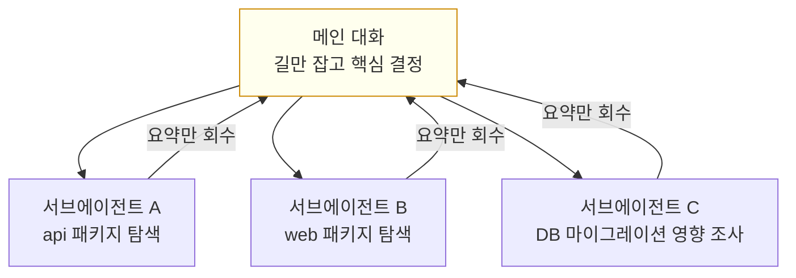

# 대규모 코드베이스

코드베이스가 커진다고 Claude가 못 알아듣는 건 아닙니다. 진짜 문제는 파일 수 자체가 아니라, 지금 하는 일과 상관없는 지시문과 파일이 컨텍스트를 채우면서 정작 중요한 단서가 밀려난다는 데 있습니다.


**한 줄 요약**: 대규모 코드베이스에서 핵심은 **컨텍스트 다이어트**, 곧 "지금 작업과 관련된 슬라이스만 남기고 나머지는 끌어오지 않는 것"입니다. 무관한 토큰은 답 품질을 떨어뜨리는 동시에 비용을 올리므로, 컨텍스트를 가볍게 유지하는 일이 곧 토크노믹스입니다.



이 문서는 MoAI-ADK가 올라타 있는 플랫폼인 **Claude Code 자체**를 다루는 배경 자료입니다. MoAI-ADK를 쓰는 방법은 [토크노믹스 개요](/ko/advanced/tokenomics-overview)에서 다룹니다.


## 컨텍스트 다이어트가 핵심이다

작은 프로젝트에서는 CLAUDE.md 하나, 디렉터리 하나, 파일 몇 개면 충분합니다. 모든 걸 한꺼번에 올려도 컨텍스트에 여유가 있으니까요. 하지만 저장소가 커지면 상황이 달라집니다. 수십 개 패키지의 지시문, 자동 생성된 파일, 벤더 SDK, 다른 팀의 레거시 코드까지 한 세션에 올라오면, Claude의 주의가 흩어지고 정작 수정하려는 함수 하나에 집중하지 못합니다.

그래서 대규모 코드베이스 전략은 한마디로 **"어떻게 하면 지금 작업과 무관한 것들을 올리지 않을 수 있을까"**로 귀결됩니다. 이 문서의 모든 설정과 습관이 같은 질문의 다른 답입니다.

-  시작 위치를 좁히면 — 무관한 패키지 지시문이 애초에 로드되지 않습니다.
-  CLAUDE.md를 분할하고 `@`로 끌어오면 — 전역 규칙만 매 세션 들어오고, 영역 규칙은 필요할 때만 올라옵니다.
-  탐색을 서브에이전트에 맡기면 — 수백 개 파일을 뒤진 더러운 일이 메인 대화가 아닌 다른 컨텍스트에서 일어납니다.
-  `/compact`로 중간에 정리하면 — 초반 탐색이 컨텍스트를 채운 뒤에도 핵심 결론만 남깁니다.

## 시작 위치 정하기

`claude`를 어디서 실행하는지가 그 뒤의 모든 것을 결정합니다.

| 시작 위치 | 파일 접근 범위 | 로드되는 CLAUDE.md | 적합한 경우 |
|---------|-----------|---------------|---------|
| **저장소 루트** | 전체 | 루트만 (하위는 온디맨드) | 여러 패키지·서브시스템에 걸친 작업 |
| **하위 디렉터리** | 그 서브트리만 | 그 디렉터리 + 모든 상위 디렉터리 | 한 패키지·서브시스템에 한정된 작업 |

한 패키지(예: `packages/api/`)에만 집중하는 작업이라면 그 디렉터리에서 `claude`를 실행하세요. `packages/web/`의 지시문은 애초에 로드되지 않으므로, 규칙을 지우는 노력 없이도 컨텍스트가 저절로 가벼워집니다. 이것이 대규모 코드베이스에서 비용 대비 효과가 가장 큰 첫 수입니다.

## CLAUDE.md를 디렉터리별로 분할

루트 CLAUDE.md 하나에 모든 규칙을 넣으면 세 가지 문제가 생깁니다.

- 너무 길어져 가독성이 떨어지고
- 모든 패키지에 통하려다 너무 일반적이어서 쓸모가 없어지며
- 작업과 무관한 지시문까지 매 세션 로드됩니다

해결책은 계층화입니다. 루트에는 저장소 전역 규칙만 두고, 각 하위 디렉터리에 그 영역의 규칙을 둡니다.

```markdown
# ./CLAUDE.md (루트, 모든 세션에서 로드)
This is a monorepo with three packages:
- packages/api: Node.js REST API with Express, TypeScript, PostgreSQL
- packages/web: React frontend with Vite, TypeScript, TailwindCSS
- packages/shared: shared TypeScript utilities

Run commands from the package directory.
```

```markdown
# ./packages/api/CLAUDE.md (이 디렉터리 작업할 때만 로드)
This package is the REST API server.

- Run tests: `npm test` (uses Vitest)
- Run dev server: `npm run dev` (port 3001)
- Database migrations: `npm run migrate`

API routes are in src/routes/. Never write raw SQL in handlers.
```

Claude가 `packages/api/`에서 시작하면 루트와 `packages/api/`의 CLAUDE.md는 모두 로드되지만, `packages/web/`의 지시문은 **로드되지 않습니다**.

## CLAUDE.md 안에서 `@`로 다른 파일 끌어오기

CLAUDE.md는 `@경로` 문법으로 다른 마크다운 파일을 끌어와(inport) 안에 펼쳐 넣을 수 있습니다. 이 기능이 있으면 루트 지시문을 짧게 유지하면서, 무거운 규칙(코딩 표준 전문, API 규약, 아키텍처 결정 기록 등)은 별도 파일로 빼두고 필요한 곳에서만 참조할 수 있습니다.

```markdown
# ./CLAUDE.md (루트)
This repo follows the conventions in @./docs/coding-standards.md
and the API contract in @./docs/api-contract.md.
```

디렉터리 계층화(시작 위치에 따라 자동 로드)와 `@` 가져오기(파일 안에서 명시적 포함)는 역할이 다릅니다. 계층화는 "어디서 실행했느냐"에 따라 묶음 단위로 켜고 끄는 스위치이고, `@` 가져오기는 "이 규칙이 필요한 모든 자리에서" 수동으로 끌어오는 인라인 참조입니다. 둘을 섞어 쓰면 전역 CLAUDE.md는 가볍게, 영역 지식은 풍부하게 가져갈 수 있습니다.

## 프롬프트에서 `@`로 파일 그때그때 끌어오기

대화 도중에도 `@`를 쓰면 특정 파일의 내용을 그 순간에만 컨텍스트로 올릴 수 있습니다. 프롬프트에 `@packages/api/src/routes/users.ts`처럼 적으면 해당 파일 내용이 그 턴에 끌려옵니다. "이 파일을 좀 봐줘"라고 말하며 전체를 붙여넣는 대신, `@`로 가리키면 경로만으로 충분합니다.

이 방식은 대규모 코드베이스에서 특히 유용합니다. 탐색 단계에서 수십 개 파일을 미리 올려두는 대신, 필요한 순간에 해당 파일만 정확히 끌어오면 되니까요. 무엇을 올릴지 미리 고르는 수고가 사라지고, 컨텍스트는 그 턴에 실제로 필요한 만큼만 자랍니다.

## 관련 없는 CLAUDE.md 제외하기

다른 팀의 패키지나 레거시 코드의 지시문은 `claudeMdExcludes` 설정으로 건너뜁니다.

```json
{
  "claudeMdExcludes": [
    "**/packages/admin-dashboard/**",
    "**/packages/legacy-*/**"
  ]
}
```

루트 CLAUDE.md는 여전히 로드되고, 제외한 패키지의 지시문만 컨텍스트에서 빠집니다.

## 생성 코드와 벤더 코드 차단

`.gitignore`에 이미 있는 경로(node_modules, dist, build)는 자동으로 검색 결과에서 제외됩니다.

커밋된 생성 코드나 벤더 SDK는 권한 규칙으로 읽기 자체를 차단합니다. 생성 파일은 길고 반복적이라 컨텍스트 낭비가 특히 큽니다.

```json
{
  "permissions": {
    "deny": [
      "Read(./**/dist/**)",
      "Read(./**/build/**)",
      "Read(./**/*.generated.*)",
      "Read(./vendor/**)"
    ]
  }
}
```

## 탐색은 서브에이전트에게 맡기기

대규모 코드베이스에서 가장 비싼 행동 중 하나가 "심볼 정의를 찾겠다고 파일을 줄줄이 읽는 것"입니다. 이 더러운 일을 메인 대화가 직접 하면 컨텍스트가 검색 결과로 넘쳐납니다. Claude Code v2.1.219부터는 **서브에이전트(subagent)**에게 탐색을 맡기는 패턴이 기본적으로 열려 있어, 이 문제를 우아하게 피할 수 있습니다.


```mermaid
flowchart TD
    M["메인 대화<br/>길만 잡고 핵심 결정"] --> A["서브에이전트 A<br/>api 패키지 탐색"]
    M --> B["서브에이전트 B<br/>web 패키지 탐색"]
    M --> C["서브에이전트 C<br/>DB 마이그레이션 영향 조사"]
    A -->|"요약만 회수"| M
    B -->|"요약만 회수"| M
    C -->|"요약만 회수"| M
    style M fill:#ffe,stroke:#c80
```

핵심은 **메인 대화는 길만 잡고, 파일을 뒤지는 일은 서브에이전트의 분리된 컨텍스트에서 일어난다**는 것입니다. 서브에이전트는 결과 요약만 돌려주므로, 메인 대화는 수백 줄의 파일 내용 대신 결론 몇 줄만 받아 유지됩니다.

실전에서 자주 쓰는 세 가지 패턴입니다.

| 패턴 | 언제 | 어떻게 |
|------|------|--------|
| 내장 `Explore` | 읽기 전용 탐색 | 본질적으로 읽기 전용인 내장 서브에이전트. `thoroughness`로 깊이 조절 |
| 병렬 팬아웃 | 독립된 여러 영역을 동시 조사 | "같은 턴에서 서브에이전트 여럿을 스폰하라"고 명시적으로 지시 |
| 중첩 위임 | 한 서브에이전트가 더 깊이 파야 할 때 | v2.1.219부터 중첩이 기본 활성화(깊이 3) |

### v2.1.219가 바꾼 점

이 패턴들이 특히 자연스러워진 배경은 최근 런타임 변화에 있습니다.

- **중첩 스폰이 기본 활성화** (v2.1.219): 서브에이전트가 자기 안에서 다시 서브에이전트를 띄울 수 있게 되어, 깊이 있는 탐색을 위해 설정을 만질 필요가 없어졌습니다. 중첩을 끄려면 `CLAUDE_CODE_MAX_SUBAGENT_SPAWN_DEPTH=1`로 지정합니다.
- **백그라운드가 기본값** (v2.1.198): 탐색 서브에이전트가 뒤에서 돌아가는 동안 메인 세션은 다른 독립 작업을 이어갈 수 있습니다. 권한이 필요한 도구를 만나면 프롬프트가 메인 세션에 표시됩니다(v2.1.186+부터 이름도 함께).
- **읽기 전용 스코핑은 도구 제한으로**: 스폰 시점의 `mode` 파라미터는 v2.1.213부터 무시됩니다. "이 탐색은 읽기 전용으로"를 보장하려면 서브에이전트의 `tools:`에서 쓰기 도구를 빼거나, 본질적으로 읽기 전용인 `Explore`를 쓰세요.

세부 사항(동시 실행 한계 `CLAUDE_CODE_MAX_CONCURRENT_SUBAGENTS=20`, 세션당 총 스폰 한계가 v2.1.224에 제거된 점 등)은 [서브에이전트 문서](/ko/claude-code/agentic/sub-agents)에서 다룹니다.


최신 Opus 계열(Opus 4.7+ / 4.8 / 5)은 서브에이전트를 **자동으로 스폰하지 않고** 추론을 우선합니다. 탐색 분할이 도움이 될 때는 "같은 턴에서 여러 서브에이전트를 스폰해 독립 영역을 조사하라"고 **명시적으로** 지시하는 것이 중요합니다.


## `/compact`로 중간에 정리하기

탐색을 거치면 컨텍스트에 파일 내용과 검색 결과가 쌓입니다. 작업을 계속 이어 가야 하지만 초반 로딩까지 다 안고 가고 싶지 않을 때, `/compact`가 그 사이를 메워줍니다.

`/compact`는 현재 대화를 그 자리에서 요약해 앞부분을 줄이면서 같은 작업을 이어 갑니다. 인자로 지시를 덧붙이면 **무엇을 남길지 직접 조종**할 수 있습니다.

```text
/compact 지금까지 찾은 호출처 목록과 수정 계획은 그대로 두고, 탐색 과정의 중간 파일 내용은 버려.
```

`/compact`와 `/clear`의 차이를 헷갈리지 않는 것이 중요합니다.

| 명령 | 효과 | 언제 |
|------|------|------|
| `/compact <지시>` | 그 자리에서 요약, **같은 작업 계속** | 컨텍스트가 무거워졌지만 맥락은 살려 둘 때 |
| `/clear` | 대화를 완전히 비움, **새 시작** | 완전히 다른 작업으로 넘어갈 때 |

대규모 변경에서 자주 쓰는 리듬은 "탐색 → `/compact`로 핵심 정리 → 구현"입니다. 탐색 단계의 더러운 디테일은 요약 속으로 밀어 넣고, 구현 단계는 결론 위에서 출발하는 식입니다.

## 코드 인텔리전스(LSP) 플러그인

심볼 정의를 찾겠다고 파일을 한 줄씩 읽는 것은 토큰 관점에서 가장 비싼 탐색입니다. 언어 서버 플러그인을 설치하면 정의로 이동, 참조 찾기, 타입 오류 직접 조회가 가능해져 파일 읽기 자체를 크게 줄일 수 있습니다.

```bash
/plugin install typescript-lsp@claude-plugins-official
```

- TypeScript, Python, Go, Rust 등 주요 언어를 지원합니다
- 해당 언어의 LSP 바이너리가 시스템에 깔려 있어야 합니다([플러그인 문서](/ko/claude-code/extensibility/plugins) 참고)

LSP가 있으면 "이 함수의 호출처를 전부 찾아줘"라는 질문을 파일 읽기가 아니라 구조화된 질의로 처리할 수 있어, 대규모 코드베이스에서 서브에이전트 탐색과 함께 가장 효과가 큰 투자입니다.

## 워크트리로 필요한 디렉터리만 체크아웃

`--worktree`로 생성하는 워크트리(worktree)는 `worktree.sparsePaths` 설정으로 전체가 아니라 **나열한 디렉터리만** 체크아웃할 수 있습니다.

```json
{
  "worktree": {
    "sparsePaths": [
      ".claude",
      "packages/api",
      "packages/shared"
    ]
  }
}
```

- 생성이 빨라지고(전체 복제 대신 필요한 부분만)
- 디스크 공간을 아끼며
- `symlinkDirectories`로 여러 워크트리의 node_modules 중복도 제거할 수 있습니다.

```json
{
  "worktree": {
    "sparsePaths": ["packages/api", "packages/shared"],
    "symlinkDirectories": ["node_modules"]
  }
}
```

`symlinkDirectories`에 나열한 디렉터리는 메인 체크아웃의 것을 심볼릭 링크로 공유합니다.

## 다른 패키지·저장소에 접근 권한 주기

한 패키지에서 시작했는데 형제 패키지 수정이 필요해지면 `additionalDirectories`로 접근 범위를 넓힙니다.

```json
{
  "permissions": {
    "additionalDirectories": [
      "../shared",
      "../web"
    ]
  }
}
```

설정 대신 런타임 플래그로도 가능합니다.

```bash
claude --add-dir ../shared --add-dir ../web
```

## 패키지별 스킬 추가

각 패키지는 그 영역만의 스킬을 가질 수 있습니다. 스킬은 필요할 때만 로드되므로, 패키지 전용 지식을 컨텍스트 부담 없이 보관하는 좋은 그릇입니다.

```bash
mkdir -p packages/api/.claude/skills/api-testing
```

```markdown
# packages/api/.claude/skills/api-testing/SKILL.md
---
name: api-testing
description: API 패키지의 테스트 패턴
---

## Test structure
Tests are in `src/__tests__/` mirroring `src/`.

## Running tests
- All: `npm test`
- Single file: `npm test -- src/__tests__/routes/users.test.ts`

## Test utilities
- `src/__tests__/helpers/db.ts`: setupTestDb(), teardownTestDb()
- `src/__tests__/helpers/auth.ts`: createTestUser(), getAuthToken()
```

`packages/api`에서 작업하면 api-testing 스킬이 자동으로 로드되고, `packages/web`에서는 로드되지 않습니다.

## 패키지 간 작업 조율

같은 변경이 여러 패키지를 건드릴 때(예: 공유 타입 업데이트와 모든 호출처 수정)는 두 가지 원칙이 유효합니다.

- **한 세션에서 전체 변경 처리**: 관련 파일을 한 번에 로드해 결정의 일관성을 유지합니다.
- **먼저 계획을 파일로 저장**: 계획을 마크다운 파일에 남겨 두세요. 세션이 길어지면 컨텍스트가 압축되지만, 디스크에 저장된 계획은 사라지지 않습니다. "중요한 상태는 파일에 남긴다"는 에이전틱 루프 운영의 기본기이기도 합니다.

## 대규모 스윕과 다이내믹 워크플로우

코드베이스 전체를 훑는 일(deprecated API 전수 조사, 대규모 마이그레이션, 일관성 점검)은 서브에이전트 몇 개로는 부족할 수 있습니다. Claude Code의 **다이내믹 워크플로우(dynamic workflow)**(v2.1.154+)는 자바스크립트 스크립트가 수십에서 수백 개 에이전트를 조율하며, 중간 결과는 스크립트 변수에 머무르고 메인 컨텍스트를 채우지 않습니다. 진입 방법과 상한(동시 16개 / 총 1000개)은 [다이내믹 워크플로우 문서](/ko/claude-code/agentic/workflows)에서 다룹니다.

작은 규모라면 검증을 **병렬 배치**로 묶는 것만으로도 충분합니다. 독립적인 읽기 전용 검증은 한 번의 응답 안에서 여러 Bash 호출로 묶어 함께 실행하면 턴마다 왕복하며 컨텍스트를 늘리는 일을 피할 수 있습니다. 의존성이 있을 때만 순차로 돌립니다.

## 구체적인 설정 예: 모노레포

다음은 완전한 설정 예입니다. 루트에는 저장소 전역 차단 규칙을, 패키지에는 그 패키지의 워크트리·접근 설정을 둡니다(MoAI-ADK 프로젝트라면 `.moai/config/sections/workflow.yaml` 같은 워크플로우 설정도 루트에 위치합니다).

**루트** (`.claude/settings.json`):

```json
{
  "permissions": {
    "deny": [
      "Read(./**/dist/**)",
      "Read(./**/build/**)"
    ]
  }
}
```

**packages/api** (`.claude/settings.json`):

```json
{
  "worktree": {
    "sparsePaths": [
      ".claude",
      "packages/api",
      "packages/shared"
    ],
    "symlinkDirectories": ["node_modules"]
  },
  "permissions": {
    "additionalDirectories": ["../shared"],
    "deny": [
      "Read(./**/dist/**)",
      "Read(./**/build/**)"
    ]
  }
}
```

이 설정의 효과는 다음과 같습니다.

- 워크트리는 `.claude/`, `packages/api/`, `packages/shared/`만 체크아웃
- shared 패키지 접근 가능
- 생성·벤더 파일 접근 차단

## 팁과 트릭

### 범위를 지정한 검색

큰 변경을 하기 전에 영향 범위를 먼저 파악하세요. 검색 범위를 좁히는 습관이 읽어야 할 파일 수를 줄입니다.

```bash
grep -r "FunctionName" packages/api/  # api만 검색
grep -r "FunctionName" packages/      # 모든 패키지
```

### 레이어별 분석

DB·API·UI처럼 여러 레이어를 건드리는 변경이면 각 레이어를 따로 이해하고, 한 세션에서는 하나의 변경에만 집중합니다.

### 검증은 병렬 배치로

독립된 읽기 전용 검증을 한 턴에 하나씩 직렬로 돌리면 왕복 지연이 누적됩니다. 한 번의 응답 안에서 여러 Bash 호출로 묶어 함께 실행하세요.

### 문서화 지시

대규모 변경 후에도 문서가 낡지 않도록, 변경 계획에 "docs 수정" 항목을 포함하세요.

## 관련 문서

- [서브에이전트](/ko/claude-code/agentic/sub-agents) — 탐색 분할의 기본 단위이자 CC 2.1.219 중첩·백그라운드·권한 상속의 자세한 내용
- [컨텍스트 윈도우](/ko/claude-code/context-memory/context-window)
- [워크트리](/ko/claude-code/agentic/worktrees)
- [모범 사례](/ko/claude-code/agentic/best-practices)

## 참고 자료

- [Set up Claude Code in a monorepo or large codebase (공식 문서)](https://code.claude.com/docs/en/large-codebases)
- [Best practices for Claude Code (공식 문서)](https://code.claude.com/docs/en/best-practices)
- [Memory management (공식 문서)](https://code.claude.com/docs/en/memory)


모노레포에서 가장 손쉬운 첫 수는 "한 패키지 작업은 그 패키지 디렉터리에서 `claude` 실행"입니다. 설정 파일을 하나도 만지지 않고도 무관한 지시문 로드를 끊어내는, 비용 대비 효과가 가장 큰 습관입니다. 그 다음 단계로 탐색을 서브에이전트에 맡기고, 중간에 `/compact`로 갈무리하는 리듬을 더하면 대규모 코드베이스도 충분히 다룰 수 있습니다.

