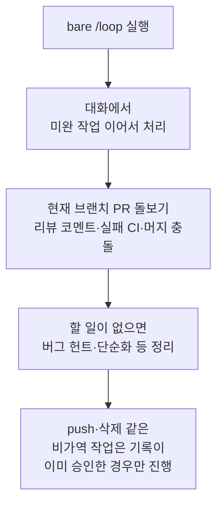

Claude Code의 예약 작업 (scheduled tasks)은 같은 세션이 열려 있는 동안 프롬프트를 정해진 주기로 다시 실행하게 해 주는 기능입니다.


**한 줄 요약**: 배포 폴링, PR 돌보기, 정기 점검을 사람이 매번 입력하지 않고 `/loop`과 cron 도구에 맡기는, 세션에 묶인 가벼운 자동화입니다.


예약 작업은 Claude Code **v2.1.72** 이상에서 사용할 수 있습니다. `claude --version`으로 버전을 확인합니다.

## 예약 작업이란

예약 작업은 한 프롬프트를 일정 주기로 자동으로 다시 실행하는 장치입니다. 배포가 끝났는지 폴링하거나, PR을 돌보거나, 오래 걸리는 빌드를 다시 들여다보거나, 나중에 할 일을 알려 주는 용도로 씁니다.

가장 중요한 성질은 **세션 범위 (session-scoped)** 라는 점입니다. 작업은 현재 대화 안에서만 살아 있고, 새 대화를 시작하면 모두 사라집니다. `--resume`이나 `--continue`로 세션을 이어 열면 아직 만료되지 않은 작업은 복원됩니다.

| 성질 | 동작 |
| --- | --- |
| 실행 위치 | 내 머신 (열린 세션 안) |
| 동작 시점 | Claude의 턴과 턴 사이, 유휴 상태일 때 |
| 생명 주기 | 현재 대화에 묶임, 새 대화 시작 시 소멸 |
| 복원 | `--resume` / `--continue` 시 미만료 작업만 |
| 최소 간격 | **1분** (cron 1분 단위) |
| 최대 작업 수 | 세션당 50개 |

이 기능은 세션 범위 경량 폴링을 대신하는 도구입니다. 다른 스케줄링 옵션과 비교하면:

| 옵션 | 실행 위치 | 최소 간격 | 세션 필요 | 머신 켜짐 필수 |
| --- | --- | --- | --- | --- |
| `/loop` | 내 머신 | **1분** | 필요 | 필요 |
| Cloud Routines | Anthropic 클라우드 | 1시간 | 불필요 | 불필요 |
| Desktop 예약 작업 | 내 머신 | 1분 | 불필요 | 필요 |

이벤트가 발생하는 즉시 반응해야 한다면 폴링 대신 Channels로 CI가 실패를 세션에 직접 밀어 넣게 하고, 조건이 충족될 때까지 턴마다 계속 작업하게 하려면 주기 실행 대신 `/goal`을 사용합니다.

## 사용 사례

예약 작업은 세션이 열려 있는 동안 짧게 반복하는 작업에 가장 잘 맞습니다.

| 사례 | 예시 프롬프트 | 효과 |
| --- | --- | --- |
| 정기 점검 | `/loop 5m check if the deployment finished` | 배포 완료 여부를 5분마다 확인 |
| 릴리스 추적 | `/loop check whether CI passed and address any review comments` | CI와 리뷰 코멘트를 적응형 간격으로 추적 |
| 리포트 생성 | `/loop 1h summarize new commits on main` | 일정 주기로 요약 리포트 작성 |
| 일회성 알림 | `remind me at 3pm to push the release branch` | 지정 시각에 한 번만 알림 후 자동 삭제 |

패키징된 워크플로를 매 반복마다 다시 실행할 수도 있습니다. 예를 들어 `/loop 20m /review-pr 1234`처럼 프롬프트 자리에 다른 명령을 넘기면 됩니다.

## 생성·관리 개요

### /loop으로 반복 실행하기

`/loop`은 세션을 열어 둔 채 프롬프트를 반복 실행하는 가장 빠른 방법인 번들 **스킬 (bundled skill)** 입니다. 간격과 프롬프트는 둘 다 선택이며, 무엇을 주느냐에 따라 동작이 달라집니다.

| 주는 값 | 예시 | 동작 |
| --- | --- | --- |
| 간격 + 프롬프트 | `/loop 5m check the deploy` | 고정 주기로 실행 |
| 프롬프트만 | `/loop check the deploy` | Claude가 매 반복마다 간격을 직접 고름 |
| 간격만 또는 아무것도 안 줌 | `/loop` | 내장 유지보수 프롬프트 또는 `loop.md` 실행 |

간격을 주면 Claude가 그 값을 cron 표현식으로 변환해 작업을 등록하고 주기와 작업 ID를 확인해 줍니다. 간격은 `30m`처럼 앞에 두거나 `every 2 hours`처럼 뒤에 둘 수 있습니다. 지원 단위는 `s`(초), `m`(분), `h`(시간), `d`(일)입니다. cron은 1분 단위이므로 초 단위는 올림 처리되고, `7m`이나 `90m`처럼 깔끔하게 떨어지지 않는 간격은 가장 가까운 단위로 반올림한 뒤 무엇으로 정했는지 알려 줍니다.

간격을 생략하면 Claude가 고정 cron 대신 매 반복마다 1분에서 1시간 사이의 지연을 동적으로 고릅니다. 빌드가 끝나가거나 PR이 활발하면 짧게, 아무것도 대기 중이 아니면 길게 기다립니다.

```text
/loop check whether CI passed and address any review comments
```

### 내장 유지보수 프롬프트

프롬프트를 생략하면 Claude는 내장 유지보수 프롬프트를 씁니다. 매 반복마다 다음 순서로 일을 처리합니다.



`bare /loop`은 이 프롬프트를 동적 간격으로 실행하고, `/loop 15m`처럼 간격을 더하면 고정 주기로 실행합니다.

### loop.md로 기본 프롬프트 바꾸기

`loop.md` 파일을 두면 내장 유지보수 프롬프트를 내 지시문으로 대체합니다. 이 파일은 `bare /loop`을 위한 단일 기본 프롬프트를 정의하며, 명령줄에 프롬프트를 직접 주면 무시됩니다.

| 경로 | 범위 |
| --- | --- |
| `.claude/loop.md` | 프로젝트 수준. 두 파일이 모두 있으면 우선 |
| `~/.claude/loop.md` | 사용자 수준. 프로젝트 파일이 없을 때 적용 |

파일은 정해진 구조 없는 일반 Markdown입니다. `/loop` 프롬프트를 직접 입력하듯 작성합니다.

```markdown
Check the `release/next` PR. If CI is red, pull the failing job log,
diagnose, and push a minimal fix. If new review comments have arrived,
address each one and resolve the thread. If everything is green and
quiet, say so in one line.
```

`loop.md` 수정은 다음 반복부터 반영되므로 루프가 도는 중에도 지시문을 다듬을 수 있습니다. 25,000바이트를 넘는 내용은 잘립니다.

### 일회성 알림

한 번만 실행할 알림은 `/loop` 대신 자연어로 설명합니다. Claude는 한 번 실행 후 자기 자신을 삭제하는 단발 작업을 등록하고, 실행 시각을 특정 분·시로 고정해 알려 줍니다.

```text
in 45 minutes, check whether the integration tests passed
```

### 작업 목록 보기·취소

작업 조회와 취소도 자연어로 요청하면 됩니다. 내부적으로 Claude는 다음 cron 도구를 사용합니다.

| 도구 | 용도 |
| --- | --- |
| `CronCreate` | 새 작업 등록. 5필드 cron 표현식, 실행 프롬프트, 반복/단발 여부를 받음 |
| `CronList` | 모든 예약 작업을 ID·일정·프롬프트와 함께 나열 |
| `CronDelete` | ID로 작업 취소 |

각 작업에는 `CronDelete`에 넘길 수 있는 8자 ID가 있고, 한 세션은 최대 50개의 작업을 보유할 수 있습니다. 대기 중인 `/loop`을 멈추려면 `Esc`를 누릅니다. 자연어로 예약한 작업은 `Esc`의 영향을 받지 않으며 삭제할 때까지 남아 있습니다.

### 동작 방식과 제약

스케줄러는 매초 만기 작업을 확인해 낮은 우선순위로 큐에 넣고, 예약된 프롬프트는 응답 도중이 아니라 턴과 턴 사이에 실행됩니다. 모든 시각은 로컬 타임존으로 해석되므로 `0 9 * * *`은 UTC가 아니라 Claude Code를 실행 중인 곳의 오전 9시를 뜻합니다.

- **지터 (jitter)**: 여러 세션이 같은 순간 API를 치지 않도록 작업 ID에서 파생한 결정적 오프셋을 더합니다. 반복 작업은 예약 시각 이후 최대 **30분** 늦게 발동할 수 있고, 일회성 작업은 최대 **90초** 일찍 발동할 수 있습니다. 정확한 타이밍이 필요하면 `:00`이나 `:30`이 아닌 분을 고릅니다.
- **7일 만료**: 반복 작업은 생성 7일 뒤 마지막으로 한 번 발동한 뒤 **자동으로 삭제**됩니다.
- **누락 따라잡기 없음**: Claude가 긴 요청으로 바쁜 동안 예약 시각이 지나면, 유휴 상태가 될 때 한 번만 발동하지 무산된 횟수만큼 따라잡지 않습니다.

스케줄러 전체를 끄려면 환경 변수 `CLAUDE_CODE_DISABLE_CRON=1`을 설정합니다. 그러면 cron 도구와 `/loop`을 사용할 수 없게 되고 이미 예약된 작업도 발동을 멈춥니다.

## 비대화(headless) 실행과의 연계

예약 작업은 세션이 열려 있고 유휴 상태일 때만 발동합니다. 따라서 머신이 꺼져 있거나 세션 없이도 동작해야 하는 무인 자동화에는 적합하지 않습니다. 이런 경우에는 별도의 영속 스케줄링 옵션을 사용합니다.

| 옵션 | 실행 위치 | 머신 켜짐 필요 | 열린 세션 필요 |
| --- | --- | --- | --- |
| `/loop` | 내 머신 | 필요 | 필요 |
| Desktop 예약 작업 | 내 머신 | 필요 | 불필요 |
| Routines (cloud) | Anthropic 클라우드 | 불필요 | 불필요 |
| GitHub Actions | CI | 불필요 | 불필요 |

CI 파이프라인이나 GitHub Actions의 `schedule` 트리거로 `claude -p`를 비대화로 호출하면 세션에 묶이지 않는 cron 자동화를 구성할 수 있습니다. 정리하면, 세션 안의 빠른 폴링은 `/loop`, 로컬 파일·도구 접근이 필요한 무인 작업은 Desktop 예약 작업, 머신과 무관하게 확실히 돌려야 하는 작업은 Routines를 씁니다.

MoAI-ADK 관점에서는 `/loop`을 SPEC 구현 중인 PR 점검이나 CI 상태 추적에 가볍게 활용하고, 정기 릴리스 추적 같은 무인 작업은 GitHub Actions 측 스케줄링으로 분리하는 것이 모범 사례입니다.

## 관련 문서

- [훅 (Hooks)](/claude-code/extensibility/hooks)
- [목표 지향 실행 (/goal)](/claude-code/agentic/goal)

## 참고 자료

- [Scheduled tasks — Claude Code 공식 문서](https://code.claude.com/docs/en/scheduled-tasks)


고정 주기 `/loop`은 7일 뒤 자동 만료되므로, 더 오래 돌려야 한다면 만료 전에 다시 등록하거나 처음부터 Routines·Desktop 예약 작업 같은 영속 스케줄링을 선택하는 편이 안전합니다.

