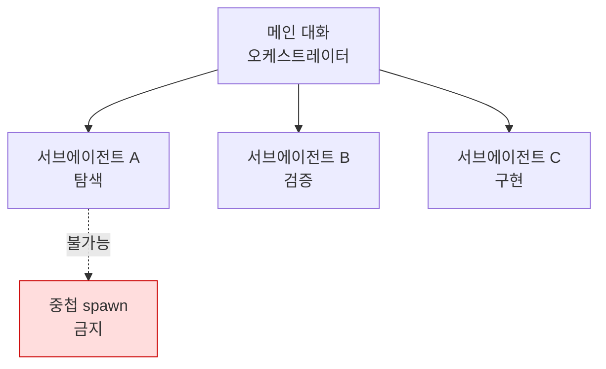

Claude Code의 서브에이전트는 곁가지 작업을 별도의 컨텍스트 윈도우에서 처리하고 결과 요약만 메인 대화로 돌려주는 위임 작업자입니다.


**한 줄 요약**: 서브에이전트는 탐색·검증 같은 곁가지 일을 자기만의 컨텍스트에서 처리하고 요약만 돌려주어, 메인 대화를 깨끗하게 유지하는 위임 일꾼입니다.



이 페이지는 Claude Code 차원의 개념 개요입니다. MoAI-ADK가 8개 에이전트 카탈로그를 어떻게 구성하고 위임하는지, 직접 에이전트를 만드는 실전 방법은 [에이전트 가이드](/advanced/agent-guide)와 [빌더 에이전트 가이드](/advanced/builder-agents)에서 깊이 다룹니다.


## 서브에이전트란

서브에이전트는 특정 종류의 작업을 전담하는 특화된 AI 작업자입니다. 메인 대화가 검색 결과, 로그, 파일 내용으로 넘쳐날 만한 곁가지 작업이 생기면, 그 일을 서브에이전트가 **자기만의 컨텍스트 윈도우** (own context window)에서 처리하고 결과 요약만 돌려줍니다.

각 서브에이전트는 다음을 독립적으로 가집니다.

| 구성 요소 | 설명 |
|-----------|------|
| 시스템 프롬프트 | 서브에이전트 파일 본문이 그대로 역할 지시문이 됩니다 |
| 도구 접근 권한 | 사용 가능한 도구를 허용/차단 목록으로 제한할 수 있습니다 |
| 독립 권한 | 메인 대화 권한을 상속하되 추가 제한을 둘 수 있습니다 |
| 모델 선택 | `haiku` 같은 빠르고 저렴한 모델로 비용을 낮출 수 있습니다 |

Claude는 각 서브에이전트의 `description`을 보고 언제 위임할지 판단합니다. 그래서 설명을 명확하게 쓰는 것이 곧 좋은 위임의 출발점입니다.

Claude Code에는 `Explore` (읽기 전용 코드베이스 탐색), `Plan` (플랜 모드 리서치), `general-purpose` (탐색+수정 복합 작업) 같은 내장 서브에이전트가 포함되어 있습니다.

## 핵심 제약: 서브에이전트는 서브에이전트를 spawn 할 수 없음

가장 중요한 구조적 제약입니다. **서브에이전트는 다른 서브에이전트를 spawn 할 수 없습니다** (subagents cannot spawn other subagents). 즉 위임은 메인 대화에서 한 단계만 내려가며, 무한 중첩이 발생하지 않습니다.

이 제약은 MoAI-ADK 오케스트레이션 설계의 근간이기도 합니다. 오케스트레이터(메인 세션)만 서브에이전트를 호출할 수 있고, 호출된 에이전트는 다시 누군가에게 위임하지 못합니다. 따라서 계층형 에이전트 체인 대신 **오케스트레이터가 직접 각 단계를 호출**하는 평평한 구조를 따릅니다.



내장 `Plan` 서브에이전트가 별도로 존재하는 이유도 여기에 있습니다. 플랜 모드에서 컨텍스트가 필요할 때 이 제약을 우회하지 않으면서 리서치를 수행하기 위함입니다.

## 언제 쓰나

서브에이전트는 다음과 같은 상황에서 효과가 큽니다.

| 상황 | 효과 |
|------|------|
| 병렬 탐색 | 여러 파일·디렉터리를 동시에 조사하고 요약만 모읍니다 |
| 독립 검증 | 메인 대화의 편향 없이 별도 컨텍스트에서 결과를 점검합니다 |
| 컨텍스트 분리 | 대량 로그·검색 결과를 메인 대화에서 격리합니다 |
| 비용 제어 | 단순 작업을 `haiku` 같은 빠른 모델로 라우팅합니다 |

반대로 한 번의 응답으로 끝나는 작업이거나, 여러 단계에 걸쳐 **공유 컨텍스트가 필요한 작업**이라면 위임 없이 메인 대화에서 직접 처리하는 편이 낫습니다.

## 정의 방법 개요

서브에이전트는 YAML 프론트매터를 가진 마크다운 파일로 정의합니다. `/agents` 명령으로 대화형 생성할 수도 있고, 파일을 직접 작성할 수도 있습니다.

```markdown
---
name: code-reviewer
description: 코드 품질과 모범 사례를 검토합니다
tools: Read, Glob, Grep
model: sonnet
---

당신은 코드 리뷰어입니다. 호출되면 코드를 분석하고
품질·보안·모범 사례에 대해 구체적이고 실행 가능한 피드백을 제공합니다.
```

필수 필드는 `name`과 `description` 둘뿐이며, 본문이 곧 시스템 프롬프트가 됩니다. 저장 위치에 따라 적용 범위가 달라집니다.

| 위치 | 범위 |
|------|------|
| `.claude/agents/` | 현재 프로젝트 (버전 관리에 포함해 팀과 공유) |
| `~/.claude/agents/` | 내 모든 프로젝트 |
| 플러그인의 `agents/` | 플러그인이 활성화된 곳 |

`tools` (허용 목록) 또는 `disallowedTools` (차단 목록)로 도구 접근을 제한하고, `model`로 사용할 모델을, `isolation: worktree`로 격리된 저장소 사본에서 작업하도록 지정할 수 있습니다. 단 `AskUserQuestion` 같은 사용자 상호작용 도구는 서브에이전트에서 사용할 수 없습니다. 이것이 MoAI-ADK에서 서브에이전트가 사용자에게 직접 질문하지 못하고 오케스트레이터에게 블로커 리포트를 돌려주는 이유입니다.

## 깊이는 MoAI 에이전트 가이드로

여기까지가 Claude Code 차원의 서브에이전트 개념입니다. MoAI-ADK가 이 메커니즘 위에서 어떤 에이전트 카탈로그를 운영하고, Plan-Run-Sync 워크플로우의 각 단계를 어떻게 위임하며, 프로젝트별 도메인 전문가 에이전트를 어떻게 생성하는지는 아래 심화 가이드에서 다룹니다.

## 관련 문서

- [에이전트 가이드](/advanced/agent-guide)
- [빌더 에이전트 가이드](/advanced/builder-agents)

## 참고 자료

- [Create custom subagents (Claude Code 공식 문서)](https://code.claude.com/docs/en/sub-agents)


서브에이전트를 만들 때는 `description`을 "언제 위임해야 하는지"의 관점에서 구체적으로 쓰세요. Claude는 이 설명만 보고 위임 여부를 판단하므로, 설명이 모호하면 좋은 도구가 있어도 호출되지 않습니다.

