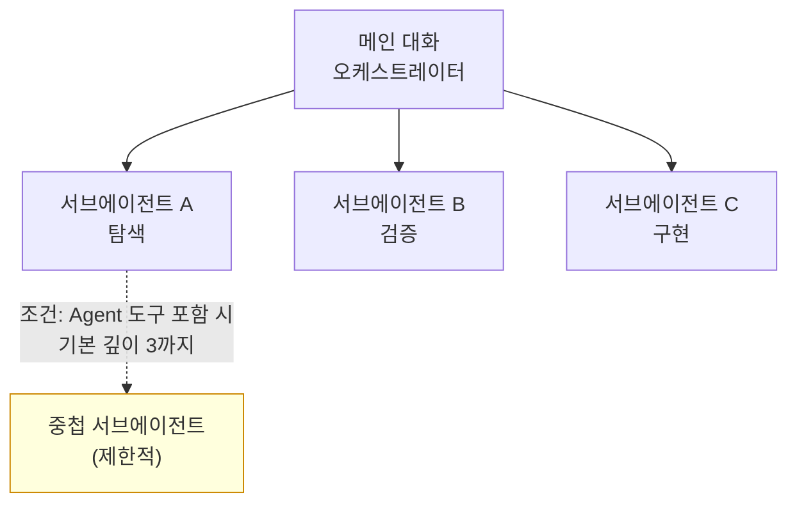

# 서브에이전트

서브에이전트 (subagent) 는 Claude가 곁가지 작업을 **자기만의 컨텍스트 윈도우** (own context window) 에서 처리하고, 결과 요약만 메인 대화로 돌려주는 위임 일꾼입니다. 마치 자기 책상을 따로 쓰는 동료에게 조사나 검증을 맡기면, 그 동료는 자기 책상 위에서 일을 끝내고 내 책상을 어지르지 않은 채 결과 한 장만 건네주는 것과 같습니다.


**한 줄 요약**: 서브에이전트는 탐색·검증 같은 곁가지 일을 자기만의 컨텍스트에서 처리하고 요약만 돌려주어, 메인 대화를 깨끗하게 유지하는 위임 일꾼입니다.



이 문서는 MoAI-ADK가 올라타 있는 플랫폼인 **Claude Code 자체**를 다루는 배경 자료입니다. MoAI-ADK를 쓰는 방법은 [에이전트 가이드](/ko/advanced/agent-guide)에서 다루고, 에이전트를 직접 만드는 실전 절차는 [빌더 에이전트 가이드](/ko/advanced/builder-agents)에서 이어집니다.


## 서브에이전트란

서브에이전트는 특정 종류의 작업을 전담하는 특화된 AI 작업자입니다. 메인 대화가 검색 결과, 로그, 파일 내용으로 넘쳐날 만한 곁가지 작업이 생기면, 그 일을 서브에이전트가 자기만의 컨텍스트 윈도우에서 처리하고 결과 요약만 돌려줍니다. 컨텍스트가 분리되기 때문에 메인 대화는 핵심 흐름에 집중할 수 있고, 동시에 여러 서브에이전트를 띄워 독립적인 작업을 병렬로 진행할 수도 있습니다.

각 서브에이전트는 다음 요소를 독립적으로 가집니다.

| 구성 요소 | 설명 |
|-----------|------|
| 시스템 프롬프트 | 서브에이전트 파일의 본문이 그대로 역할 지시문이 됩니다 |
| 도구 접근 권한 | 사용 가능한 도구를 허용/차단 목록으로 제한할 수 있습니다 |
| 권한 모드 | 부모 세션의 권한 모드를 상속합니다 (아래 '권한 상속' 참조) |
| 모델 | `haiku` 같은 빠르고 저렴한 모델로 비용을 낮출 수 있습니다 |

Claude는 각 서브에이전트의 `description`을 보고 언제 위임할지 판단합니다. 그래서 설명을 명확하게 쓰는 것이 곧 좋은 위임의 출발점입니다.

### 내장 서브에이전트

Claude Code에는 다음 내장 서브에이전트가 포함되어 있습니다.

| 에이전트 | 특징 |
|---------|------|
| **Explore** | 읽기 전용 코드베이스 탐색. v2.1.198부터 메인 세션 모델을 상속합니다 (Claude API에서는 Opus까지만, 이전 버전은 Haiku 고정). `thoroughness` 옵션으로 quick/medium/very-thorough 선택 |
| **Plan** | 플랜 모드 리서치 (읽기 전용) |
| **general-purpose** | 모든 도구 접근 가능, 탐색과 수정 모두 가능 |

Explore와 Plan은 메인 세션의 CLAUDE.md와 git status를 건너뛰어 더 빠르고 가볍게 동작합니다.

## 중첩 스폰과 실행 한계

과거에는 "서브에이전트는 다른 서브에이전트를 스폰할 수 없다"는 구조적 제약이 있었습니다. 위임은 메인 대화에서 한 단계만 내려갔습니다. 하지만 v2.1.219부터 상황이 바뀌어, 이 제약은 더 이상 런타임 보장이 아니라 **구성 선택**입니다.

### 중첩은 이제 기본 활성화 (v2.1.219, 깊이 3)

서브에이전트 중첩은 v2.1.172에 도입되었다가 v2.1.217–2.1.218에서 잠시 기본 비활성 상태를 거쳤고, v2.1.219부터 **기본 활성화**되었습니다. 체인지로그에 따르면 서브에이전트는 기본적으로 깊이 3까지 중첩 스폰할 수 있습니다. 중첩을 끄려면 환경 변수 `CLAUDE_CODE_MAX_SUBAGENT_SPAWN_DEPTH=1`을 설정합니다.

| 설정 | 동작 | 사용 |
|------|------|------|
| 서브에이전트 정의에 `Agent` 도구 포함 (frontmatter `tools:` 목록) | 중첩 허용 | 기본 깊이 3까지; `CLAUDE_CODE_MAX_SUBAGENT_SPAWN_DEPTH`로 조정, `=1`이면 비활성 |
| `Agent` 도구 생략 | 중첩 금지 | 평평한 오케스트레이션 — 유일하게 평평한 계층을 보장하는 방법 |

중첩이 가능해졌다고 해서 계층형 에이전트 체인이 항상 좋은 설계는 아닙니다. 중첩이 깊어질수록 각 단계의 결과가 요약되어 올라오므로 정보가 손실되고, 조율 비용도 커집니다. 그래서 메인 대화가 각 작업자를 직접 호출하는 **평평한 구조**를 기본으로 삼고, 꼭 필요할 때만 한 단계 더 내려가는 것이 일반적으로 더 견고합니다.


```mermaid
flowchart TD
    M[메인 대화<br/>오케스트레이터] --> A[서브에이전트 A<br/>탐색]
    M --> B[서브에이전트 B<br/>검증]
    M --> C[서브에이전트 C<br/>구현]
    A -.->|"조건: Agent 도구 포함 시<br/>기본 깊이 3까지"| X["중첩 서브에이전트<br/>(제한적)"]
    style X fill:#ffd,stroke:#c80
```

### 동시 실행과 세션 한계

한 번에 얼마나 많은 서브에이전트를 띄울 수 있는지는 두 가지 환경 변수로 결정됩니다.

| 환경 변수 | 기본값 | 의미 |
|-----------|--------|------|
| `CLAUDE_CODE_MAX_CONCURRENT_SUBAGENTS` | 20 | 동시에 실행되는 서브에이전트 수 상한 (`ultracode` 세션은 예외) |
| `CLAUDE_CODE_MAX_SUBAGENT_SPAWN_DEPTH` | 3 (v2.1.219+) | 중첩 깊이 상한; `=1`이면 중첩 비활성 |

세션당 총 스폰 수를 제한하던 `CLAUDE_CODE_MAX_SUBAGENTS_PER_SESSION` (기본 200) 은 v2.1.224에서 **제거**되었습니다. 덕분에 오래 돌아가는 세션이 새 에이전트를 거부하는 일은 더 이상 발생하지 않으며, 동시성과 깊이 제한은 그대로 적용됩니다. 즉 "한 번에 20개, 깊이 3까지"는 여전히 유효하지만 "세션 평생 200개까지만"이라는 인위적 상한은 사라진 셈입니다.

## 백그라운드 실행과 권한 상속

### 백그라운드가 기본값 (v2.1.198)

서브에이전트는 백그라운드에서 실행할 수 있으며, v2.1.198부터는 **백그라운드가 기본값**입니다. Claude가 결과를 즉시 필요로 할 때만 포어그라운드에서 실행하고, 그 외에는 백그라운드에서 돌립니다. 백그라운드에서 읽기 전용 작업이 진행되는 동안 메인 세션은 다른 독립 작업을 이어갈 수 있습니다.

백그라운드 서브에이전트가 권한이 필요한 도구를 만나면 (예: Bash, WebFetch):

- **v2.1.186 이전**: 자동 거부 (권한 프롬프트 없음)
- **v2.1.186 이후**: **메인 세션에 권한 프롬프트가 표시**됩니다. `Esc`로 해당 호출만 거부할 수 있고, v2.1.186부터 프롬프트에 스폰한 서브에이전트의 이름이 함께 표시됩니다.

긴 백그라운드 작업을 시작하기 전에 필요한 도구를 `settings.json`의 허용 목록에 미리 추가하면 프롬프트 빈도를 줄일 수 있습니다.

### 권한 모드는 부모 세션을 상속한다

서브에이전트는 부모 세션의 권한 모드를 그대로 상속합니다. 한때 서브에이전트를 스폰할 때 `mode` 파라미터로 권한 모드를 따로 지정할 수 있었지만, 이 스폰 타임 `mode` 파라미터는 **v2.1.213부터 deprecated 되어 무시**됩니다.

실용적 함의가 하나 있습니다. "이 서브에이전트는 읽기 전용으로 제한하고 싶다"는 의도를 `mode` 파라미터로는 더 이상 보장할 수 없습니다. 읽기 전용 스코핑이 필요하면 서브에이전트의 `tools:` 목록에서 쓰기 도구를 아예 빼는 방법으로만 보장합니다 — 본질적으로 읽기 전용인 `Explore`를 쓰거나, `tools:`에 Write/Edit을 빼두는 식입니다.

## 언제 쓰나, 언제 쓰지 않나

서브에이전트는 다음 상황에서 효과가 큽니다.

| 상황 | 효과 |
|------|------|
| 병렬 탐색 | 여러 파일·디렉터리를 동시에 조사하고 요약만 모읍니다 |
| 독립 검증 | 메인 대화의 편향 없이 별도 컨텍스트에서 결과를 점검합니다 |
| 컨텍스트 분리 | 대량 로그·검색 결과를 메인 대화에서 격리합니다 |
| 비용 제어 | 단순 작업을 `haiku` 같은 빠른 모델로 라우팅합니다 |

반대로 다음 경우에는 위임하지 않고 메인 대화에서 직접 처리하는 편이 낫습니다.

- 한 번의 응답으로 끝나는 작업
- 여러 단계에 걸쳐 **공유 컨텍스트가 필요한 작업** (위임하면 맥락이 끊깁니다)
- 결과를 요약하면 안 되는 작업 (전체 출력이 메인 대화에 남아야 할 때)

## 정의 방법

서브에이전트는 YAML 프론트매터를 가진 마크다운 파일로 정의합니다. Claude에게 생성을 요청하거나 파일을 직접 작성할 수 있습니다. v2.1.198부터 `/agents` 명령은 더 이상 대화형 생성 위저드를 열지 않고, Claude에게 요청하거나 `.claude/agents/` 디렉터리를 직접 편집하라는 안내만 띄웁니다 (파일 형식과 저장 위치는 그대로입니다).

```markdown
---
name: code-reviewer
description: 코드 품질과 모범 사례를 검토합니다
tools: Read, Glob, Grep
model: sonnet
---

당신은 코드 리뷰어입니다. 호출되면 코드를 분석하고
품질·보안·모범 사례에 대해 구체적이고 실행 가능한 피드백을 제공합니다.
```

### 필수 필드

- `name` — 서브에이전트 이름 (위임할 때 참조)
- `description` — 언제 위임해야 하는지 설명 (Claude가 이것만 보고 판단)

### 옵션 필드

| 필드 | 기능 |
|------|------|
| `tools` | 허용할 도구 (쉼표 구분 목록) |
| `disallowedTools` | 차단할 도구 (허용 목록 대신 사용 가능) |
| `model` | 모델 선택: `sonnet`, `opus`, `haiku`, `fable`, 또는 특정 모델 ID; 기본값 `inherit` (메인 세션 모델) |
| `permissionMode` | 도구 권한 기본값 (`default`, `acceptEdits`, `plan`, `bypassPermissions`, `auto`, `dontAsk`); 플러그인 서브에이전트는 무시됨 |
| `maxTurns` | 최대 턴 수 제한 |
| `skills` | 로드할 기본 스킬들 |
| `mcpServers` | 연결할 MCP 서버 |
| `hooks` | 호출할 Hook 이벤트 |
| `memory` | 메모리 범위 (user, project, local) |
| `background` | `true`면 항상 백그라운드 실행 (결과를 즉시 필요로 해도); 미지정 시 Claude가 선택하며 v2.1.198부터 기본 백그라운드 |
| `effort` | 추론 강도 (low, medium, high, xhigh, max) |
| `isolation: worktree` | 격리된 저장소 사본에서 작업 |
| `color` | 에이전트 뷰에 표시할 색상 |
| `initialPrompt` | 서브에이전트를 처음 스폰할 때 건네는 프롬프트 |

저장 위치에 따라 적용 범위가 달라집니다.

| 위치 | 범위 |
|------|------|
| `.claude/agents/` | 현재 프로젝트 (버전 관리에 포함해 팀과 공유) |
| `~/.claude/agents/` | 내 모든 프로젝트 |
| 플러그인의 `agents/` | 플러그인이 활성화된 곳 |

### 서브에이전트는 사용자에게 질문할 수 없다

`AskUserQuestion` 같은 사용자 상호작용 도구는 서브에이전트에서 사용할 수 없습니다 (비대칭 경계). 서브에이전트는 메인 대화(오케스트레이터)에게만 결과를 돌려주고, 필요한 입력이 없으면 blocker report를 반환합니다. 이것이 MoAI-ADK에서 서브에이전트가 사용자에게 직접 질문하지 못하는 이유입니다.

## 모델·본문·병렬 실행 (CC 2.1.219)

### 스폰할 때 모델을 명시하라

대부분의 에이전트 정의는 `model: inherit`을 기본으로 갖습니다. 그래서 서브에이전트를 스폰할 때 모델을 따로 지정하지 않으면, 부모 세션의 모델에서 조용히 실행됩니다. 의도한 모델과 다르게 돌아가는 일을 막으려면 스폰 시점에 `model` 인자를 명시적으로 넘겨주는 것이 권장됩니다. `effort` (추론 강도) 는 에이전트 파일의 프론트매터로만 전달되므로 스폰 인자로는 주입할 수 없습니다.

### 본문은 간결하게

에이전트 정의의 본문이 길어지면 스폰될 때마다 고정 비용이 들고 프롬프트 캐시 효율도 떨어집니다. 핵심 역할과 위임 조건만 남기고 반복적인 지침은 줄입니다 (본문 다이어트). 공통 지침은 공유 파일로 빼두고, 각 에이전트는 그 파일을 참조하게 만드는 식이 효율적입니다.

### Opus 4.7+ / 4.8 / 5 는 자동 스폰하지 않는다

최신 Opus 계열 모델은 서브에이전트를 **자동으로 스폰하지 않고**, 도구 호출보다 추론을 우선합니다. 그래서 위임이 도움이 될 때는 "같은 턴에서 여러 서브에이전트를 스폰하라"고 명시적으로 지시해야 하고, 한 번의 응답으로 끝낼 수 있는 일은 굳이 서브에이전트를 띄우지 않고 직접 처리하는 것이 권장됩니다.

### 검증은 병렬 배치로

여러 검증을 한 턴씩 직렬로 돌리면 왕복 지연이 누적됩니다. 독립적인 읽기 전용 검증은 한 번의 응답 안에서 여러 Bash 호출로 묶어 (병렬 배치) 함께 실행하고, 의존성이 있을 때만 순차로 돌립니다. 이 패턴은 서브에이전트 위임과 같은 맥락입니다 — 독립 작업은 모아서 동시에, 의존 작업은 순서대로.

## 세션 포크 (`/fork`)

`/fork <directive>` 명령으로 현재 세션을 포크할 수 있습니다. 포크된 서브에이전트는 현재 대화 내용을 상속하고, 부모의 프롬프트 캐시를 활용하며, 새로운 방향으로 탐색을 이어갑니다. 기존 맥락을 버리지 않으면서 다른 접근을 시도해 보고 싶을 때 유용합니다.

## 더 깊은 내용은 MoAI 에이전트 가이드에서

여기까지가 Claude Code 차원의 서브에이전트 개념입니다. MoAI-ADK는 이 메커니즘 위에 **11개 에이전트 카탈로그**를 운영합니다. Manager 계열 (manager-spec / manager-develop / manager-docs / manager-git / manager-design) 이 plan→run→sync 라이프사이클을, Evaluator 계열 (plan-auditor / sync-auditor) 이 독립 감사를, builder-harness가 하네스 스캐폴드 생성을, super-advisor가 고추론 자문을, e2e-tester가 웹/모바일/데스크탑 E2E 테스트 실행을, 그리고 Anthropic 내장 `Explore`가 읽기 전용 탐색을 담당합니다. 계획과 감사가 분리되어 있다는 점, 즉 만든 에이전트가 스스로 검사하지 않는다는 것이 이 카탈로그의 핵심 설계입니다. 각 에이전트에 작업 성격에 맞는 모델과 추론 깊이 (effort) 를 선언적으로 배정하는 것이 토크노믹스의 "계획은 깊게, 구현은 싸게, 검증은 독립적으로" 원칙입니다. 자세한 내용은 아래 심화 가이드에서 다룹니다.

## 관련 문서

- [에이전트 팀](/ko/claude-code/agentic/agent-teams) — 서브에이전트가 보고만 하는 일꾼이라면, 팀은 서로 대화하는 동료 집단입니다
- [다이내믹 워크플로우](/ko/claude-code/agentic/workflows) — 스크립트가 수십~수백 에이전트를 조율하는 대규모 오케스트레이션
- [워크트리](/ko/claude-code/agentic/worktrees) — `isolation: worktree` 격리가 만드는 별도 작업 트리
- [에이전트 가이드](/ko/advanced/agent-guide)
- [빌더 에이전트 가이드](/ko/advanced/builder-agents)

## 참고 자료

- [Create custom subagents (Claude Code 공식 문서)](https://code.claude.com/docs/en/sub-agents)


서브에이전트를 만들 때는 `description`을 "언제 위임해야 하는지"의 관점에서 구체적으로 쓰세요. Claude는 이 설명만 보고 위임 여부를 판단하므로, 설명이 모호하면 좋은 도구가 있어도 호출되지 않습니다. 읽기 전용을 보장하고 싶다면 `mode`가 아니라 `tools:` 목록에서 쓰기 도구를 빼는 것으로 접근하세요.

