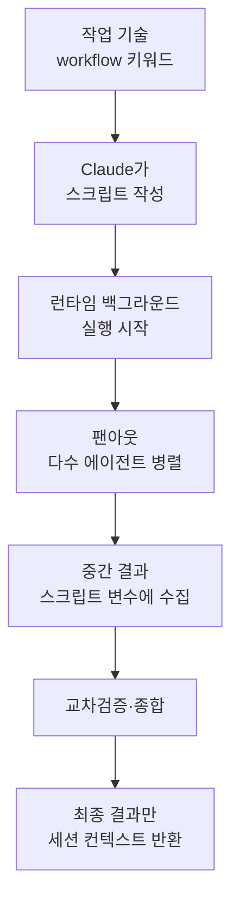

다이내믹 워크플로우 (dynamic workflow)는 Claude가 직접 작성한 JavaScript 스크립트가 한 번의 대화로는 조율하기 힘든 수십~수백 개의 서브에이전트를 백그라운드에서 오케스트레이션하는 Claude Code의 실행 원시(primitive)입니다.


**한 줄 요약**: 서브에이전트와 에이전트 팀이 "계획을 Claude의 머릿속에" 둔다면, 다이내믹 워크플로우는 "계획을 스크립트 코드 안에" 옮겨 대규모 팬아웃을 한 번에 돌립니다.


## 다이내믹 워크플로우란

다이내믹 워크플로우는 **작업을 기술하면 Claude가 직접 작성하는** (JavaScript 스크립트)이며, 런타임이 이 스크립트를 대화와 분리된 백그라운드에서 실행합니다. 스크립트가 루프, 분기, 중간 결과를 모두 들고 있기 때문에 세션의 컨텍스트 윈도우에는 최종 답변만 돌아옵니다.

핵심은 단순히 "에이전트를 더 많이 돌리는 것"이 아니라 **계획을 코드로 옮기는 것** (moving the plan into code)입니다. 그 결과 다음이 가능해집니다.

- 독립적인 에이전트들이 서로의 결과를 적대적으로 (adversarial) 교차검증한 뒤 보고
- 하나의 계획을 여러 각도에서 동시에 초안 작성한 뒤 비교 평가
- 한 번의 단일 패스보다 신뢰할 수 있는 결과 산출

> 다이내믹 워크플로우는 리서치 프리뷰 (research preview) 단계이며 Claude Code v2.1.154 이상이 필요합니다. 모든 유료 플랜에서 사용할 수 있고, Pro 플랜에서는 `/config`의 Dynamic workflows 항목에서 켜야 합니다.

## 3가지 오케스트레이션 원시 비교

서브에이전트, 스킬, 워크플로우는 모두 여러 단계 작업을 수행할 수 있습니다. 차이는 **계획을 누가 쥐고 있는가**입니다.

| 구분 | 서브에이전트 | 에이전트 팀 / 스킬 | 워크플로우 |
|------|-------------|-------------------|-----------|
| 정체 | Claude가 생성하는 워커 | Claude가 따르는 지시 | 런타임이 실행하는 스크립트 |
| 다음 단계 결정자 | Claude, 턴 단위 | Claude, 프롬프트 따라 | 스크립트 |
| 중간 결과 위치 | Claude 컨텍스트 윈도우 | Claude 컨텍스트 윈도우 | 스크립트 변수 |
| 반복 가능한 단위 | 워커 정의 | 지시 내용 | 오케스트레이션 자체 |
| 규모 | 턴당 소수 위임 | 서브에이전트와 동일 | 실행당 수십~수백 에이전트 |
| 중단 시 | 턴 재시작 | 턴 재시작 | 같은 세션 내 재개 가능 |

서브에이전트와 스킬에서는 Claude가 오케스트레이터로서 매 턴 무엇을 생성할지 결정하고, 모든 결과가 Claude의 컨텍스트로 들어옵니다. 반면 워크플로우 스크립트는 그 로직을 스스로 보유하므로 Claude의 컨텍스트는 최종 답변만 받습니다.

## 언제 쓰나

하나의 대화가 조율할 수 있는 양보다 **더 많은 에이전트가 필요하거나**, 오케스트레이션 자체를 읽고 다시 돌릴 수 있는 스크립트로 **코드화하고 싶을 때** 워크플로우를 선택합니다.

| 용도 | 설명 |
|------|------|
| 대규모 코드베이스 전수 스캔 | 예: `src/routes/` 아래 모든 API 엔드포인트의 인증 누락 점검 |
| 대규모 마이그레이션 | 예: 500개 파일을 독립적으로 변환하는 마이그레이션 |
| 교차검증 리서치 | 여러 출처를 서로 대조해야 하는 리서치 질문 |
| 다각도 계획 초안 | 커밋 전에 여러 독립 관점에서 하나의 어려운 계획을 초안 작성 |

반대로 **쓰지 않는 경우**도 분명합니다.

- 한 대화로 조율 가능한 소수 작업 → 서브에이전트를 직접 사용
- 단계마다 사용자 승인이 필요한 상호작용 작업 → 워크플로우는 실행 중 입력을 받지 못함
- 단일 파일 일상 편집 → 직접 실행

## 동작 방식

워크플로우 런타임은 스크립트를 대화와 **분리된 격리 환경** (isolated environment)에서 실행합니다. 중간 결과는 Claude의 컨텍스트가 아니라 스크립트 변수에 머뭅니다. 런타임이 각 에이전트의 결과를 추적하므로 같은 세션 안에서 재개가 가능합니다.



`/deep-research` 같은 번들 워크플로우를 실행하거나, 프롬프트 어디든 `workflow` 단어를 넣으면 Claude가 해당 작업용 스크립트를 작성합니다. 마음에 드는 실행 결과는 `/workflows` 화면에서 `s` 키로 `/<이름>` 명령으로 저장해 재사용할 수 있습니다.

```text
# 한 작업을 워크플로우로 실행
Run a workflow to audit every API endpoint under src/routes/ for missing auth checks
```

## 제약과 한계

런타임은 다음 제약을 적용합니다.

| 제약 | 이유 |
|------|------|
| 실행 중 사용자 입력 불가 | 에이전트 권한 프롬프트만 실행을 멈출 수 있음. 단계별 승인이 필요하면 각 단계를 별도 워크플로우로 |
| 워크플로우 자체의 파일시스템·셸 직접 접근 불가 | 읽기·쓰기·명령 실행은 에이전트가 수행하고, 스크립트는 조율만 담당 |
| 동시 실행 에이전트 최대 16개 (CPU 코어가 적으면 더 적음) | 로컬 자원 사용 제한 |
| 실행당 총 1,000개 에이전트 | 무한 루프 방지 |

추가로 알아둘 동작입니다.

- **권한 모드** (permission mode): 워크플로우가 생성하는 서브에이전트는 세션 모드와 무관하게 항상 `acceptEdits`로 실행되며, 파일 편집은 자동 승인됩니다. 다만 허용 목록에 없는 셸 명령·웹 페치·MCP 도구는 실행 중에 프롬프트가 뜰 수 있으므로, 긴 작업 전에 필요한 명령을 `settings.json` 허용 목록에 추가하는 것이 좋습니다.
- **재개** (resume): 실행을 멈췄다가 재개하면 이미 끝난 에이전트는 캐시된 결과를 반환하고 나머지만 라이브로 돕니다. 단, 같은 Claude Code 세션 안에서만 유효하며 세션을 종료하면 다음 세션에서는 처음부터 다시 시작합니다.
- **비용** (cost): 한 번의 실행이 같은 작업을 대화로 처리할 때보다 훨씬 많은 토큰을 쓸 수 있으므로, 큰 실행 전에 `/model`을 확인하는 것이 안전합니다.

### /deep-research 와 ultracode

| 항목 | 설명 |
|------|------|
| `/deep-research <질문>` | 번들 워크플로우. 여러 각도로 웹 검색을 팬아웃하고 출처를 교차검증·투표한 뒤, 검증에서 탈락한 주장을 걸러낸 인용 보고서를 반환. WebSearch 도구 필요 |
| `/effort ultracode` | `xhigh` 추론 강도 + 자동 워크플로우 오케스트레이션 조합. 켜두면 Claude가 모든 실질 작업에 대해 워크플로우를 계획. 현재 세션에만 적용되며 새 세션에서 초기화. `/effort high`로 일상 작업 복귀 |

### 끄는 방법

워크플로우는 다음 중 하나로 비활성화할 수 있으며, 끄면 번들 워크플로우 명령·`workflow` 키워드·`/effort` 메뉴의 `ultracode`가 모두 사라집니다.

```json
{
  "disableWorkflows": true
}
```

- `/config`의 Dynamic workflows 토글을 끄기 (세션 간 유지)
- `~/.claude/settings.json`에 `"disableWorkflows": true` 설정
- 환경 변수 `CLAUDE_CODE_DISABLE_WORKFLOWS=1` 설정
- 조직 전체는 관리 설정 (managed settings)의 `"disableWorkflows": true`로 일괄 적용

## MoAI-ADK 와의 관계

MoAI-ADK는 다이내믹 워크플로우를 SPEC 기반 plan/run/sync 라이프사이클과 구분되는 **세 번째 오케스트레이션 원시**로 인식합니다. 워크플로우 에이전트도 사용자에게 직접 질문하지 못하는 동일한 비대칭 경계를 따르므로, MoAI 오케스트레이터는 워크플로우를 띄우기 **전에** 모든 선호를 먼저 수집합니다. 모범 사례와 원시 선택 가이드는 아래 관련 문서를 참고하세요.

## 관련 문서

- [서브에이전트](/claude-code/agentic/sub-agents)
- [에이전트 팀](/claude-code/agentic/agent-teams)

## 참고 자료

- [Orchestrate subagents at scale with dynamic workflows (Claude Code 공식 문서)](https://code.claude.com/docs/en/workflows)


대부분의 코딩 작업은 리서치보다 진짜로 병렬화 가능한 부분이 적습니다. 코딩 중심 작업의 기본값은 순차 서브에이전트로 두고, 다이내믹 워크플로우는 코드베이스 전수 스캔·대규모 마이그레이션처럼 실제로 대량 병렬이 필요한 작업에만 아껴 쓰는 것이 좋습니다.

