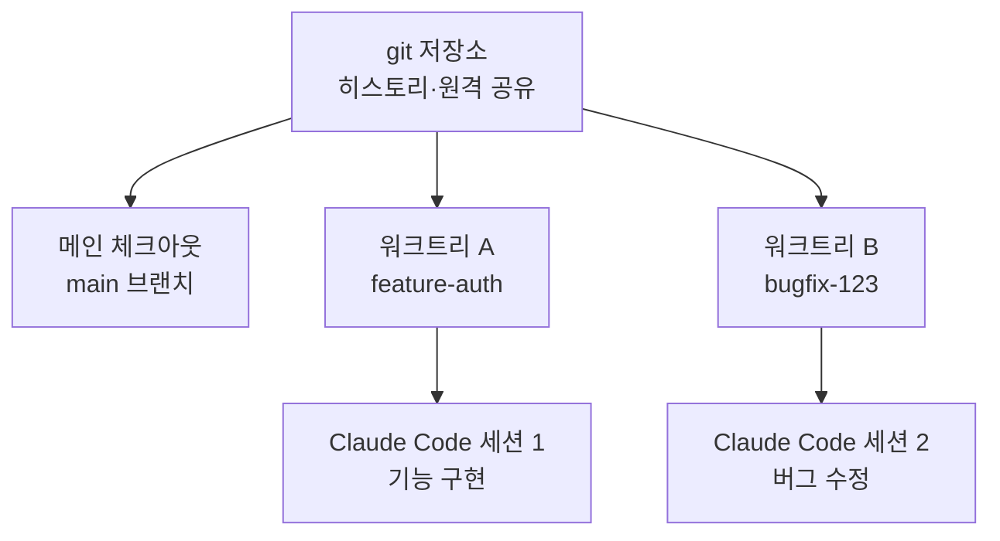

워크트리 (worktree)는 하나의 git 저장소에서 여러 작업 트리를 분리해, Claude Code 세션들이 서로의 파일을 건드리지 않고 병렬로 일하게 해 주는 기능입니다.


**한 줄 요약**: 워크트리는 같은 저장소를 공유하면서도 작업 디렉터리와 브랜치를 분리해, 한 터미널에서 기능을 만들고 다른 터미널에서 버그를 고치는 동시 작업을 충돌 없이 가능하게 합니다.



이 페이지는 Claude Code의 워크트리 개념을 개관하는 다리 역할만 합니다. MoAI-ADK에서 SPEC 단위 병렬 개발에 워크트리를 실제로 적용하는 자세한 방법은 [Git Worktree 개요](/worktree), [Git Worktree 완벽 가이드](/worktree/guide), [Git Worktree 실제 사용 예시](/worktree/examples)를 참고하시기 바랍니다.


## 워크트리란

git 워크트리는 **별도의 작업 디렉터리** (separate working directory)로, 자체 파일과 브랜치를 가지면서도 메인 체크아웃과 동일한 저장소 히스토리 및 원격을 공유합니다. 즉 저장소를 통째로 복제하지 않고도 독립된 작업 공간을 하나 더 얻는 셈입니다.

| 구분 | 메인 체크아웃 | 추가 워크트리 |
|------|--------------|--------------|
| 작업 디렉터리 | 1개 | 별도 디렉터리 |
| 브랜치 | 현재 브랜치 | 독립 브랜치 |
| 저장소 히스토리 | 공유 | 공유 |
| 원격 (remote) | 공유 | 공유 |
| 파일 편집 격리 | 기준 | 완전 격리 |

핵심은 **공유와 격리의 분리**입니다. 히스토리와 원격은 한 곳에서 함께 관리하면서, 파일 편집만 트리별로 완전히 갈라 놓습니다.

## 병렬 작업과 격리

각 Claude Code 세션을 자신만의 워크트리에서 실행하면, 한 세션의 편집이 다른 세션의 파일에 절대 닿지 않습니다. 그래서 다음과 같은 동시 작업이 안전해집니다.

- 터미널 A에서 인증 기능을 구현하고, 터미널 B에서 별도 버그를 수정
- 서로 다른 브랜치를 동시에 진행하며 빌드/테스트가 섞이지 않음
- 한쪽 실험이 실패해도 다른 쪽 작업 트리는 영향을 받지 않음



워크트리는 Claude Code에서 병렬로 일하는 여러 방법 중 하나입니다. 워크트리가 **파일 편집을 격리** (isolate file edits)한다면, 서브에이전트와 에이전트 팀은 **작업 자체를 조율** (coordinate the work)합니다. 둘은 함께 쓸 수 있어서, 서브에이전트가 각자 워크트리에서 병렬 편집을 수행하도록 구성할 수도 있습니다.

## Claude Code에서의 통합 개요

Claude Code는 워크트리 생성과 정리를 직접 다룹니다. 개념 수준에서 핵심 흐름만 짚으면 다음과 같습니다.

### 워크트리에서 시작하기

`--worktree` (또는 `-w`) 플래그를 주면 격리된 워크트리를 만들고 그 안에서 Claude를 시작합니다. 기본적으로 저장소 루트의 `.claude/worktrees/<이름>/` 아래에 생성되고, `worktree-<이름>` 형태의 새 브랜치가 만들어집니다.

```bash
# 이름을 지정해 워크트리 생성
claude --worktree feature-auth

# 다른 터미널에서 두 번째 격리 세션
claude --worktree bugfix-123
```

이름을 생략하면 `bright-running-fox` 같은 이름을 Claude가 자동 생성합니다. 세션 도중 "워크트리에서 작업해"라고 요청하면 `EnterWorktree` tool로 워크트리를 만들 수도 있습니다.

> 디렉터리에서 `--worktree`를 처음 쓰기 전에는 먼저 그 디렉터리에서 `claude`를 한 번 실행해 워크스페이스 신뢰 (workspace trust) 대화창을 수락해야 합니다.

### 기준 브랜치와 무시 파일 복사

| 항목 | 동작 | 비고 |
|------|------|------|
| 기준 브랜치 | 기본은 `origin/HEAD`에서 분기 | 원격이 없으면 로컬 `HEAD`로 폴백 |
| `worktree.baseRef` | `"fresh"` 또는 `"head"`만 허용 | `"head"`는 미푸시 커밋까지 가져옴 |
| PR 기준 분기 | `claude --worktree "#1234"` | `.claude/worktrees/pr-1234`에 생성 |
| `.worktreeinclude` | gitignore 문법으로 무시 파일 복사 | `.env` 등 추적되지 않는 파일을 새 트리에 자동 복사 |

`.gitignore`에 `.claude/worktrees/`를 추가하면 워크트리 내용이 메인 체크아웃에 추적되지 않은 파일로 나타나지 않습니다.

### 서브에이전트 격리

서브에이전트도 각자 워크트리에서 실행해 병렬 편집 충돌을 막을 수 있습니다. 커스텀 서브에이전트 frontmatter에 `isolation: worktree`를 추가하면 항상 격리됩니다. 변경 없이 끝난 서브에이전트의 임시 워크트리는 자동으로 제거됩니다.

### 정리

종료 시 변경 여부에 따라 정리 방식이 달라집니다.

- 커밋·변경·미추적 파일이 없으면 워크트리와 브랜치가 자동 제거됩니다.
- 변경 사항이 있으면 보존할지 제거할지 Claude가 묻습니다.
- 비대화형 (`-p`) 실행은 자동 정리되지 않으므로 `git worktree remove`로 직접 제거합니다.

git이 아닌 SVN·Perforce·Mercurial 등은 `WorktreeCreate` / `WorktreeRemove` hook으로 생성·정리 로직을 직접 정의할 수 있습니다.

## MoAI-ADK에서의 깊은 활용

MoAI-ADK는 이 워크트리 메커니즘을 SPEC 단위 병렬 개발과 다중 세션 격리에 폭넓게 활용합니다. 어떤 상황에서 워크트리를 켜야 하는지, 세션 핸드오프와 어떻게 맞물리는지 같은 실전 내용은 아래 MoAI-ADK 전용 가이드에 정리되어 있으므로, 이 페이지에서는 개념 소개에 그치고 깊은 내용은 링크로 안내합니다.

## 관련 문서

- [Git Worktree 개요](/worktree)
- [Git Worktree 완벽 가이드](/worktree/guide)
- [Git Worktree 실제 사용 예시](/worktree/examples)

## 참고 자료

- [Run parallel sessions with worktrees (Claude Code 공식 문서)](https://code.claude.com/docs/en/worktrees)


처음 워크트리를 도입한다면 `.claude/worktrees/`를 `.gitignore`에 먼저 추가하세요. 메인 체크아웃이 깨끗하게 유지되어 어떤 변경이 어느 트리에 속하는지 한눈에 파악할 수 있습니다.

