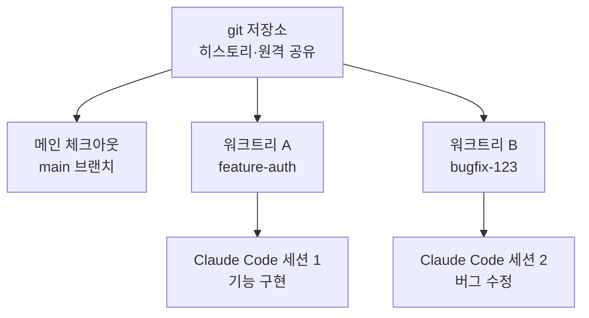

워크트리(worktree)는 하나의 git 저장소에서 작업 트리를 여럿으로 갈라, 각 Claude Code 세션이나 서브에이전트(subagent)가 서로의 파일을 건드리지 않고 나란히 일하게 해 주는 격리 수단입니다. 저장소를 통째로 복제하지 않고도 독립된 작업 공간을 하나 더 얻는 셈이어서, 병렬 작업이 자연스러워집니다.


이 문서는 MoAI-ADK가 올라타 있는 플랫폼인 **Claude Code 자체**를 다루는 배경 자료입니다. MoAI-ADK에서 SPEC 단위 병렬 개발에 워크트리를 실제로 적용하는 방법은 [Git Worktree 개요](/ko/worktree)에서 다룹니다.



**한 줄 요약**: 워크트리는 같은 저장소 히스토리와 원격을 공유하면서 작업 디렉터리와 브랜치만 분리해, 한 터미널에서 기능을 만들고 다른 터미널에서 버그를 고치는 동시 작업을 충돌 없이 가능하게 합니다.


## 왜 격리가 필요한가

워크트리가 없으면 한 저장소에서 열린 모든 세션이 **같은 작업 디렉터리**를 공유합니다. 그래서 한 세션이 파일을 고치는 동일한 순간 다른 세션도 같은 파일을 편집하려 들면 충돌이 생깁니다. 두 세션이 같은 줄을 덮어쓰거나, 한쪽 실험이 지저분하게 남아 다른 쪽 빌드를 망가뜨리는 식입니다.

워크트리는 이 문제를 **파일 편집을 트리별로 완전히 갈라 놓는** 방식으로 풉니다. 각 세션이 자기만의 작업 디렉터리에서 편집하므로, 한쪽의 변경이 다른 쪽 파일에 닿지 않습니다.

- 터미널 A에서는 인증 기능을 구현하고, 터미널 B에서는 별도 버그를 수정
- 서로 다른 브랜치를 동시에 진행하며 빌드와 테스트가 섞이지 않음
- 한쪽 실험이 실패해도 다른 쪽 작업 트리는 영향을 받지 않음


```mermaid
flowchart TD
    Repo[git 저장소<br/>히스토리·원격 공유]
    Repo --> Main[메인 체크아웃<br/>main 브랜치]
    Repo --> WT1[워크트리 A<br/>feature-auth]
    Repo --> WT2[워크트리 B<br/>bugfix-123]
    WT1 --> S1[Claude Code 세션 1<br/>기능 구현]
    WT2 --> S2[Claude Code 세션 2<br/>버그 수정]
```

핵심은 **공유와 격리의 분리**입니다. 저장소 히스토리와 원격(remote)은 한 곳에서 함께 관리하면서, 파일 편집만 트리별로 완전히 갈라 놓습니다.

워크트리는 Claude Code에서 병렬로 일하는 여러 방법 중 **파일 편집을 격리**(isolate file edits)하는 축입니다. 서브에이전트와 에이전트 팀은 **작업 자체를 조율**(coordinate the work)하는 다른 축이고, 둘은 함께 쓸 수 있어서 서브에이전트가 각자 워크트리에서 병렬 편집을 수행하도록 구성할 수도 있습니다.

## 세 가지 격리 계층

'워크트리'라는 말은 문맥에 따라 세 가지를 가리킵니다. 함께 쓰이지만 역할과 수명이 다르므로 구분해 두면 헷갈리지 않습니다.

| 계층 | 이름 | 경로 | 수명 | 만드는 주체 |
|------|------|------|------|-------------|
| **git worktree** | git의 근본 격리 원시 | 임의 경로 | `git worktree remove`로 직접 정리 | git 자체 (`git worktree add`) |
| **L1** | Claude Code 자치 워크트리 | `.claude/worktrees/<이름>/` | 세션 단위 임시 — 세션 종료 시 자동 정리 | Claude Code 런타임 (자치) |
| **L2** | MoAI 옵트인 워크트리 | `~/.moai/worktrees/<프로젝트>/<SPEC>/` | 지속 — `moai worktree done`으로만 폐기 | MoAI (사용자가 옵트인) |

### git worktree — 근본 원시

맨 아래에 git 자체의 `git worktree` 기능이 있습니다. 저장소의 `.git` 디렉터리 하나를 여러 작업 트리가 공유하도록 만들어, 트리마다 별도 브랜치를 체크아웃합니다. L1과 L2 모두 이 git 원시 위에 올라탄 격리 계층입니다.

### L1 — Claude Code 자치 워크트리

Claude Code 런타임이 **스스로** 만들고 정리하는 임시 워크트리입니다. 사용자가 직접 `claude --worktree`로 시작하거나, 서브에이전트 정의에 `isolation: worktree`를 적어 런타임이 자치적으로 만들어 낼 때 생깁니다. 기본 위치는 저장소 루트의 `.claude/worktrees/<이름>/`이고, 세션이 끝나면 깨끗한 상태의 트리는 자동으로 제거됩니다. 이름을 생략하면 `bright-running-fox`처럼 자동으로 만들어집니다.

### L2 — MoAI 옵트인 워크트리

MoAI-ADK가 SPEC 단위 병렬 개발을 위해 **사용자가 옵트인해** 쓰는 지속형 워크트리입니다. 홈 디렉터리 아래 `~/.moai/worktrees/<프로젝트>/<SPEC>/`에 만들어지고, run과 sync 단계를 거치는 동안 같은 트리를 재사용합니다. 폐기는 사용자가 `moai worktree done <SPEC>`으로 명시적으로 수행합니다. 자세한 운영은 [Git Worktree 개요](/ko/worktree)에서 다룹니다.

이 페이지는 Claude Code 플랫폼 차원의 격리 원리, 즉 **git worktree와 L1**에 집중합니다. L2에 대한 실전 내용은 MoAI 전용 가이드로 넘겨 둡니다.

## Agent(isolation: "worktree")

서브에이전트 정의 파일의 frontmatter에 `isolation: worktree`를 적으면, 그 서브에이전트는 호출될 때마다 자기만의 격리된 워크트리에서 실행됩니다(v2.1.49+). 파일을 쓰는 구현 역할 서브에이전트를 병렬로 돌릴 때 편집 충돌을 막아 주는 핵심 장치입니다.

```yaml
---
name: my-implementer
isolation: worktree   # 자기만의 격리 워크트리에서 실행
background: true      # 메인 대화를 막지 않고 백그라운드 실행
---
```

### 동작 방식

`isolation: "worktree"`가 켜 있으면 Claude Code는 다음을 수행합니다.

1. 현재 브랜치에서 임시 워크트리를 만듭니다.
2. 서브에이전트의 작업 디렉터리(CWD)를 그 워크트리 루트로 설정합니다.
3. 서브에이전트는 자기 CWD에서 상대 경로를 조합해 파일에 접근합니다.

```
메인 저장소:  $HOME/project/src/auth/handler.go
워크트리:     $HOME/project/.claude/worktrees/abc123/src/auth/handler.go
```

두 트리는 같은 프로젝트 구조를 공유하므로, `src/auth/handler.go` 같은 상대 경로는 어느 쪽에서든 올바르게 해석됩니다. 편집은 워크트리 쪽에만 남고 메인 저장소 파일은 그대로입니다.

### 언제 쓰고 언제 쓰지 않나

| 상황 | 권장 | 이유 |
|------|------|------|
| 파일을 쓰는 구현 역할 (implementer / tester / designer) | `isolation: worktree` | 병렬 서브에이전트 간 파일 덮어쓰기 충돌을 원천 차단 |
| 읽기 전용 역할 (researcher / analyst / reviewer) | 생략 | `permissionMode: plan`이 이미 쓰기를 막아 격리 오버헤드만 남음 |

`Agent(isolation: "worktree")`는 **새 L1 임시 워크트리**를 만드는 동작이지, 이미 존재하는 L2 지속형 워크트리에 재진입하는 수단이 아닙니다. 기존 워크트리에 다시 들어가려면 같은 세션 안에서는 `EnterWorktree(<경로>)` 도구를, 새 세션이라면 `moai cc -w <이름>` 런처 플래그를 씁니다. 두 개념을 섞으면 베이스가 어긋나 병렬 세션 조율이 조용히 망가지는 함정에 빠집니다.

## CLAUDE_PROJECT_DIR와 경로 해석

격리된 서브에이전트에게 일을 시킬 때 프롬프트의 경로 표기가 격리를 결정합니다. 경로를 잘못 적으면 워크트리 격리가 무력화됩니다.

`$CLAUDE_PROJECT_DIR`는 Claude Code가 노출하는 환경변수로, 세션의 프로젝트 루트를 가리킵니다. 훅과 스크립트는 이 값을 기준으로 프로젝트 상대 경로(설정·메모리·로그 등)를 찾습니다. Claude Code가 이 값을 에이전트의 문맥에 맞는 올바른 디렉터리로 알아서 해석해 주므로, 훅 명령 안에서 `$CLAUDE_PROJECT_DIR`를 쓰는 것은 안전합니다.

하지만 **에이전트 프롬프트 안의 쓰기 대상 파일 경로**는 다릅니다. 서브에이전트의 CWD는 이미 워크트리 루트이므로, 쓰기 대상은 프로젝트 루트 상대 경로(예: `src/auth/handler.go`)로 적어야 합니다. 메인 저장소의 절대 경로를 프롬프트에 적거나 `cd /절대경로 &&`를 붙이면, 서브에이전트가 워크트리가 아니라 메인 저장소 파일을 직접 건드리게 되어 격리가 깨집니다.

| 경로 종류 | 예 | 절대 경로 허용? | 이유 |
|-----------|----|-----------------|------|
| 쓰기 대상 파일 | 소스 코드, 테스트 | 아니오 — 상대 경로 사용 | 서브에이전트 CWD가 워크트리 루트; 상대 경로가 올바르게 해석됨 |
| 읽기 전용 참조 | 스킬, `${CLAUDE_SKILL_DIR}` 경로의 설정 | 예 | 메인 저장소와 내용이 같음; 읽기 전용 접근은 안전 |
| SPEC 문서 | `.moai/specs/SPEC-XXX/spec.md` | 상대 경로 권장 | 체크아웃 시 워크트리로 복사됨 |
| Bash 명령 | `go test ./...` | `cd` 접두사 금지 | CWD가 이미 워크트리 루트 |

읽기 전용 참조만 절대 경로를 써도 무방하고, 쓰기가 일어나는 모든 경로는 상대 경로로 둡니다. 이 원칙을 지키면 격리가 의도대로 작동합니다.

## 워크트리에서 시작하기

사용자가 직접 격리 세션을 시작할 때는 `--worktree`(또는 `-w`) 플래그를 씁니다(v2.1.50+). 기본적으로 `.claude/worktrees/<이름>/` 아래에 워크트리가 만들어지고 `worktree-<이름>` 형태의 새 브랜치가 생성됩니다.

```bash
# 이름을 지정해 워크트리 생성
claude --worktree feature-auth

# 다른 터미널에서 두 번째 격리 세션
claude --worktree bugfix-123

# 기준 브랜치를 origin/HEAD 대신 로컬 HEAD에서 분기
# (설정에서 worktree.baseRef: "head" 필요)
claude --worktree experimental
```

이름을 생략하면 `bright-running-fox` 같은 이름을 Claude가 자동 생성합니다. 세션 도중 "워크트리에서 작업해"라고 요청하면 `EnterWorktree` 도구로 워크트리를 만들 수도 있습니다.

### 기준 브랜치와 무시 파일 복사

| 항목 | 동작 | 비고 |
|------|------|------|
| 기준 브랜치 | 기본은 `origin/HEAD`에서 분기 | `worktree.baseRef: "head"` 설정으로 로컬 `HEAD`에서 분기 가능 |
| PR 기준 분기 | `claude --worktree "#1234"` | `.claude/worktrees/pr-1234` 디렉터리에 생성 |
| `.worktreeinclude` | gitignore 문법으로 무시 파일 복사 | `.env` 등 추적되지 않는 파일을 새 트리에 자동 복사 |
| 워크스페이스 신뢰 | 첫 사용 시 신뢰 대화상자 | `-p` 플래그로 대화상자 건너뛰기 가능 |

기준 브랜치는 기본적으로 `origin/HEAD`에서 분기합니다. 아직 푸시하지 않은 커밋까지 포함하고 싶으면 `worktree.baseRef: "head"` 설정으로 로컬 `HEAD`에서 분기하도록 바꿀 수 있습니다.

어떤 디렉터리에서 `--worktree`를 처음 쓰려면, 먼저 그 디렉터리에서 `claude`를 한 번 실행해 워크스페이스 신뢰(workspace trust) 대화상자를 수락해야 합니다. `-p` 플래그를 사용하면 비대화형 모드에서 신뢰 대화상자를 건너뛸 수 있습니다.

## 워크트리 생명주기

워크트리는 만들어지고 쓰이고 정리되는 명확한 생명주기를 가집니다. L1 임시 트리는 Claude Code가 자동으로 관리하고, L2 지속 트리는 사용자가 직접 폐기합니다.

### L1 임시 트리의 자동 정리

서브에이전트용 L1 임시 워크트리는 다음 기준으로 정리됩니다.

- **클린 상태** (커밋·변경·미추적 파일 없음): 워크트리와 브랜치가 자동 제거됩니다.
- **변경 사항 있음**: Claude가 보존할지 제거할지 묻습니다.
- **프롬프트 변경**: 이전에 생성한 임시 워크트리는 자동 제거됩니다.
- **비대화형 실행** (`-p`): 자동 정리되지 않으므로 `git worktree remove`로 직접 제거합니다.
- **`--worktree` 플래그로 생성한 워크트리**: `git worktree prune` 같은 도구로 자동 스윕되지 않습니다.

### L2 지속 트리의 폐기

L2 워크트리는 세션이 끝나도 사라지지 않습니다. run과 sync 단계의 PR이 모두 머지된 뒤 사용자가 `moai worktree done <SPEC>`으로 명시적으로 폐기합니다. 이 과정은 [Git Worktree 개요](/ko/worktree)에 자세히 나와 있습니다.

### 메인 체크아웃 깨끗하게 유지하기

`.gitignore`에 `.claude/worktrees/`를 추가하면 워크트리 디렉터리가 메인 체크아웃에서 추적되지 않은 파일로 나타나지 않습니다. 어떤 변경이 어느 트리에 속하는지 한눈에 파악할 수 있어, 병렬 작업 중 헷갈림이 줄어듭니다.

## MoAI-ADK는 워크트리를 어떻게 쓰나

MoAI-ADK는 이 워크트리 메커니즘을 SPEC 단위 병렬 개발과 다중 세션 격리에 폭넓게 씁니다(진입은 `moai cc -w <이름>`, 유지 관리는 `moai worktree` CLI). 에이전틱 루프를 여러 개 동시에 돌리려면 각 루프의 파일 편집이 서로를 오염시키지 않아야 하는데, 그 격리를 워크트리가 맡습니다. 루프 병렬화의 물리적 전제 조건인 셈입니다. 어떤 상황에서 워크트리를 켜야 하는지, 세션 핸드오프와 어떻게 맞물리는지 같은 실전 내용은 아래 MoAI-ADK 전용 가이드에 정리해 두었습니다.

## 관련 문서

- [서브에이전트](/ko/claude-code/agentic/sub-agents)
- [Git Worktree 개요](/ko/worktree)
- [Git Worktree 완벽 가이드](/ko/worktree/guide)
- [Git Worktree 실제 사용 예시](/ko/worktree/examples)

## 참고 자료

- [Worktrees — Claude Code 공식 문서](https://code.claude.com/docs/en/worktrees)


처음 워크트리를 도입한다면 `.claude/worktrees/`를 `.gitignore`에 먼저 추가하세요. 메인 체크아웃이 깨끗하게 유지되어 어떤 변경이 어느 트리에 속하는지 한눈에 파악할 수 있습니다.

