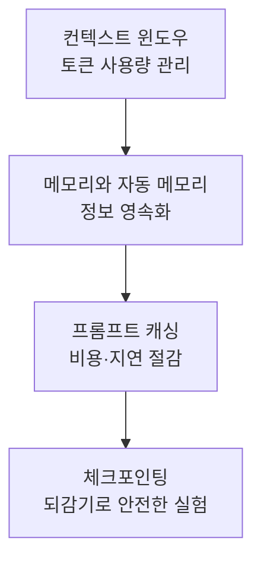

이 그룹은 Claude Code가 긴 세션을 안정적으로 이어가기 위해 사용하는 컨텍스트 윈도우, 메모리, 프롬프트 캐싱, 체크포인팅을 다룹니다. 대규모 작업이나 여러 세션에 걸친 개발에서 컨텍스트 손실과 비용 증가를 줄이려는 개발자를 위한 내용입니다.


**한 줄 요약**: 토큰 사용량을 관리하고 (컨텍스트 윈도우), 정보를 영속화하며 (메모리), 비용을 절감하고 (프롬프트 캐싱), 안전하게 되감는 (체크포인팅) 네 가지 축으로 긴 작업의 안정성을 확보합니다.


## 학습 흐름

먼저 컨텍스트 윈도우의 한계와 자동 압축을 이해한 뒤, 메모리로 정보를 영속화하고, 프롬프트 캐싱으로 반복 비용을 줄이며, 마지막으로 체크포인팅으로 실패를 두려워하지 않는 실험 환경을 갖추는 순서로 읽으시길 권장합니다.

## 목차

| 문서 | 설명 |
|------|------|
| [컨텍스트 윈도우](/claude-code/context-memory/context-window) | 토큰·자동 압축·사용량 관리 |
| [메모리와 자동 메모리](/claude-code/context-memory/memory) | CLAUDE.md 계층과 자동 메모리 |
| [프롬프트 캐싱](/claude-code/context-memory/prompt-caching) | 캐싱으로 비용·지연 절감 |
| [체크포인팅](/claude-code/context-memory/checkpointing) | 되감기로 안전하게 실험 |

이 그룹을 마치면 다음 그룹에서 워크플로우와 자동화를 통해 이러한 기반을 실제 개발 과정에 결합하는 방법을 살펴봅니다.
