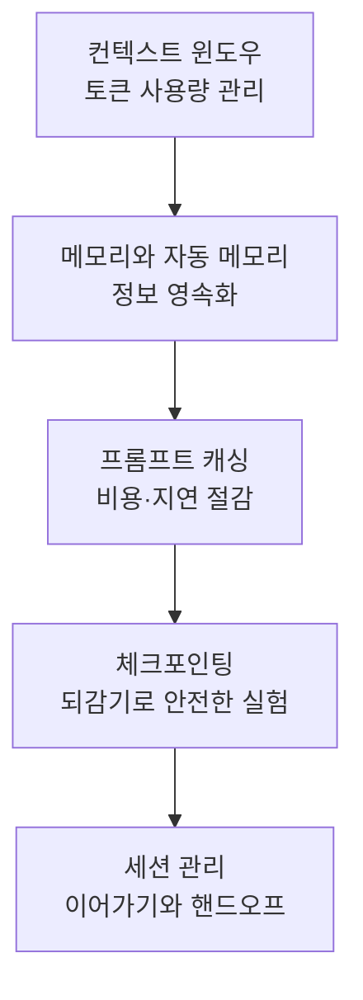

친구에게 컨텍스트와 메모리를 한 줄로 설명하자면, Claude가 한 번에 떠올릴 수 있는 양(컨텍스트)을 아끼고, 세션을 넘어 기억해 둘 것(메모리)을 파일로 남기는 일입니다. 여기에 매번 바뀌지 않는 앞부분을 재사용하는 캐싱과 언제든 되돌릴 수 있는 체크포인트, 그리고 작업을 이어가는 세션 관리까지 더하면 비용을 터뜨리지 않고 긴 작업을 끝까지 밀고 나갈 수 있습니다.

이 그룹이 다루는 다섯 가지 주제는 모두 **토크노믹스** (Token Economics)의 부품입니다. 에이전틱 개발에서 진짜 비용을 결정하는 것은 모델 가격표가 아니라 토큰을 어떻게 운용하느냐입니다 — 컨텍스트에 무엇을 얼마나 담는지, 변하지 않는 앞부분을 캐시로 재사용하는지, 세션을 넘어 알아야 할 지식을 파일로 영속화하는지. 컨텍스트 윈도우(context window)의 크기는 모델마다 200K부터 1M 토큰까지 다르고, 세션이 길어지면 Claude Code는 다섯 단계의 단계적 압축(graduated compaction)으로 공간을 비웁니다. 그렇기에 "윈도우가 크니까 관리 안 해도 된다"는 생각보다, **들어가는 내용을 가볍게 유지하는 쪽이** 어느 모델에서든 더 안정적입니다.


이 문서는 MoAI-ADK가 올라타 있는 플랫폼인 **Claude Code 자체**를 다루는 배경 자료입니다. MoAI-ADK 자체 기능은 사이드바 위쪽 섹션에서 다룹니다.



**한 줄 요약**: 사용량 관리(컨텍스트 윈도우), 정보 영속화(메모리), 비용 절감(프롬프트 캐싱), 안전한 되감기(체크포인팅), 그리고 이어가기(세션 관리) — 이 다섯 가지로 긴 작업의 안정성과 경제성을 함께 잡습니다.



**토크노믹스와 서브에이전트**: 파일을 많이 뒤져야 하는 탐사 작업은 서브에이전트(sub-agent)에게 맡겨 보세요. 서브에이전트는 자기만의 컨텍스트 윈도우를 쓰고 기본적으로 백그라운드에서 돌아가므로, 무거운 읽기가 본 세션을 채우지 않고 결과 요약만 돌아옵니다. Claude Code 2.1.219부터 서브에이전트는 깊이 3까지 중첩해 spawn할 수 있어 이 "컨텍스트 분산" 전략이 더 자연스럽게 쓰입니다. 구조와 운용은 [에이전트와 자동화](/ko/claude-code/agentic)에서 다룹니다.


## 학습 흐름

```mermaid
flowchart TD
    A[컨텍스트 윈도우<br>토큰 사용량 관리] --> B[메모리와 자동 메모리<br>정보 영속화]
    B --> C[프롬프트 캐싱<br>비용·지연 절감]
    C --> D[체크포인팅<br>되감기로 안전한 실험]
    D --> E[세션 관리<br>이어가기와 핸드오프]
```

먼저 [컨텍스트 윈도우](/ko/claude-code/context-memory/context-window)에서 토큰과 자동 압축, 사용량 모니터링의 기본기를 다집니다. 이어서 [메모리와 자동 메모리](/ko/claude-code/context-memory/memory)로 CLAUDE.md 계층과 세션을 넘는 기억을 익히고, [프롬프트 캐싱](/ko/claude-code/context-memory/prompt-caching)에서 반복되는 앞부분을 재사용해 비용과 지연을 줄이는 법을 봅니다. 그 위에 [체크포인팅](/ko/claude-code/context-memory/checkpointing)으로 언제든 되돌릴 수 있는 안전망을 깔고, 마지막 [세션 관리](/ko/claude-code/context-memory/sessions)에서 이 모든 것을 여러 날에 걸쳐 이어가는 흐름으로 묶습니다.

## 목차

| 문서 | 설명 |
|------|------|
| [컨텍스트 윈도우](/ko/claude-code/context-memory/context-window) | 토큰 · 자동 압축 · 단계적 압축 · 사용량 관리 |
| [메모리와 자동 메모리](/ko/claude-code/context-memory/memory) | CLAUDE.md 계층과 자동 메모리 |
| [프롬프트 캐싱](/ko/claude-code/context-memory/prompt-caching) | 캐싱으로 비용·지연 절감 |
| [체크포인팅](/ko/claude-code/context-memory/checkpointing) | 되감기로 안전하게 실험 |
| [세션 관리](/ko/claude-code/context-memory/sessions) | 세션 이어가기 · 정리 · 핸드오프 |

이 그룹을 마치면 컨텍스트를 경제적으로 다루는 기본기가 갖춰집니다. 다음 그룹인 [확장](/ko/claude-code/extensibility)에서는 스킬·훅·MCP·플러그인으로 하네스를 짓는 재료를 살펴보고, 그 재료가 토크노믹스 위에서 어떻게 자율 실행 루프로 이어지는지를 [에이전트와 자동화](/ko/claude-code/agentic)에서 다룹니다.
