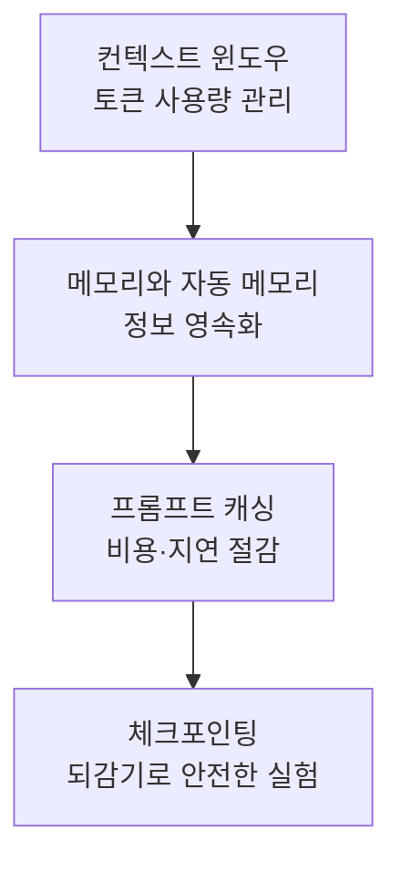

이 그룹은 Claude Code가 긴 세션을 안정적으로 이어가기 위해 사용하는 컨텍스트 윈도우, 메모리, 프롬프트 캐싱, 체크포인팅을 다룹니다. 대규모 작업이나 여러 세션에 걸친 개발에서 컨텍스트 손실과 비용 증가를 줄이려는 개발자를 위한 내용입니다.

에이전틱 개발에서 비용을 결정하는 것은 모델 가격표가 아니라 **토큰을 운용하는 방식**입니다. 컨텍스트에 무엇을 얼마나 담는지, 변하지 않는 부분을 캐시로 재사용하는지, 세션을 넘어 지식을 파일로 영속화하는지 — 이 네 가지 메커니즘이 MoAI-ADK가 말하는 **토크노믹스** (Token Economics)의 기술적 토대입니다.


**한 줄 요약**: 토큰 사용량을 관리하고 (컨텍스트 윈도우), 정보를 영속화하며 (메모리), 비용을 절감하고 (프롬프트 캐싱), 안전하게 되감는 (체크포인팅) 네 가지 축으로 긴 작업의 안정성과 경제성을 함께 확보합니다.


## 학습 흐름

```mermaid
flowchart TD
    A[컨텍스트 윈도우<br>토큰 사용량 관리] --> B[메모리와 자동 메모리<br>정보 영속화]
    B --> C[프롬프트 캐싱<br>비용·지연 절감]
    C --> D[체크포인팅<br>되감기로 안전한 실험]
```

먼저 컨텍스트 윈도우의 한계와 자동 압축을 이해한 뒤, 메모리로 정보를 영속화하고, 프롬프트 캐싱으로 반복 비용을 줄이며, 마지막으로 체크포인팅으로 실패를 두려워하지 않는 실험 환경을 갖추는 순서로 읽으시길 권장합니다.

## 목차

| 문서 | 설명 |
|------|------|
| [컨텍스트 윈도우](/ko/claude-code/context-memory/context-window) | 토큰·자동 압축·사용량 관리 |
| [메모리와 자동 메모리](/ko/claude-code/context-memory/memory) | CLAUDE.md 계층과 자동 메모리 |
| [프롬프트 캐싱](/ko/claude-code/context-memory/prompt-caching) | 캐싱으로 비용·지연 절감 |
| [체크포인팅](/ko/claude-code/context-memory/checkpointing) | 되감기로 안전하게 실험 |
| [세션 관리](/ko/claude-code/context-memory/sessions) | 세션 이어가기·정리와 핸드오프 |

이 그룹을 마치면 다음 그룹인 [확장](/ko/claude-code/extensibility)에서 하네스를 짓는 재료(스킬·훅·MCP·플러그인)로 나아갑니다.
